# Experiment 012 — Onset-feature channels appended to mel input

## Status

`Complete` — manually stopped at **eval 20 / step 411,400** after
20 evals (39.91 h wall time) [`wall_time` span across eval lines
in `runs/exp_012_onset_channels/metrics.jsonl` = 143,687 s].
Run met all must-have criteria, broke #007's per-step val miss
ceiling for the first time in taiko2 history, and produced the
best AR `matched_rate` in the codebase. **Headline numbers: best
miss 0.2331** [exp_012_onset_channels, step 349,690 (E17),
val/single/onset/miss], **best AR matched_rate 0.7080**
[exp_012_onset_channels, step 308,550 (E15),
infer_corpus/eval_308550/gt_cond/comparisons_summary.json:fields.matched_rate.median].

> **Amendment 2026-05-07 (pre-run citation drift):** The
> Citations section below quotes #007's headline numbers as
> `hit 0.7333 / exact 0.5568 / stop_f1 0.5831`. Three of those
> are wrong relative to the actual `runs/exp_007_time_stretch/metrics.jsonl`:
> - hit 0.7333 → **0.7512** [exp_007_time_stretch, step 372,132,
>   val/single/onset/hit]
> - exact 0.5568 → **0.5748** [exp_007_time_stretch, step 372,132,
>   val/single/onset/exact]
> - stop_f1 0.5831 → **0.5850** [exp_007_time_stretch, step
>   372,132, val/single/onset/stop_f1]
>
> The pre-run section is left as-written (historical predictions
> are never silently revised). Use this amendment as the source of
> truth when scaffolding any future experiment that copies #007's
> reference numbers from #012.

> **Amendment 2026-05-07 (infer.json config bug — AR corpus
> rerun planned):** `config/infer.json` was copied from
> [#007's config](../007-time-stretch/config/infer.json) verbatim
> when this experiment was scaffolded and was not updated for
> the augmented input. Specifically:
>
> - `audio_sampler` was `MelSampler` (80 bands) instead of
>   `MelOnsetSampler` (80 mel + 4 onset = 84 bands).
> - `checkpoint` pointed at `runs/exp_007_time_stretch/checkpoints/best.pt`
>   instead of `runs/exp_012_onset_channels/checkpoints/best.pt`.
>
> **Impact analysis:**
> - **Training-time AR-corpus hook (the per-eval `infer_corpus/eval_*/` runs):
>   no impact.** `inference/corpus.py:_features_for` reads the
>   dataset's pre-cached 84-row features directly from
>   `taiko2_v1_onset/features/*.npy` and feeds them to the model
>   via `predict_from_features`. The audio sampler is never
>   invoked at training time. The AR corpus numbers logged so far
>   are computed against the correct 84-row inputs.
> - **Standalone `cli.infer` on fresh `.osz` audio: would have
>   crashed.** The audio sampler would have produced an `(80, T)`
>   tensor; the conv stem expects 84 input rows. Mismatch error,
>   not silent corruption — no wrong outputs were ever produced.
> - **Standalone `cli.infer_corpus`: same as the training-time
>   hook (uses cached features).** Reliable.
>
> **Action taken:** `config/infer.json` has been corrected to
> `MelOnsetSampler` + the right checkpoint path.
>
> **Follow-up at run completion:** rerun `cli.infer_corpus`
> against this experiment's best checkpoint on the val split with
> the corrected config. This gives a clean apples-to-apples AR
> comparison vs #007, which the in-training AR corpus numbers
> already provide (since the inputs are right) but the rerun
> formally validates the corrected inference path end-to-end —
> including the audio decode + 84-row feature derivation we'll
> need for any real `cli.infer` use. Treat the rerun as the
> publishable AR result; the in-training AR-corpus numbers as
> reliable but redundant once the rerun lands.

## Context

[#007](../007-time-stretch/) is the standing direct-bin baseline at
val miss 0.2406 (best, E18, step 372,132). Every experiment since
([#008](../008-log-emd/), [#009](../009-mdn/),
[#010](../010-ratio-decomposition/) family) has tried to break that
plateau by changing the loss, the head architecture, or the gradient
routing. **None of them changed the input the model sees.** Audio
has been a fixed 80-band log-mel at 5 ms / frame since #001.

[#011](../011-onset-feature-survey/) and
[#011b](../011b-onset-disagreement/) measured what classical
mel-domain onset detection algorithms can recover from the same
log-mel features the model already gets. Single-channel
`spectral_flux` reaches frame-wise F1 = 0.679 against GT at
±10 frames; sub-band variants are tied; cross-group pairs hit
recall 0.905 at K = 2. The signal exists in the cached features —
the question is whether handing it to the model as a pre-computed
input plane (rather than asking the conv stem to derive it from
scratch alongside everything else) reduces miss / lifts hit.

This experiment is the smallest viable test of that. **Four extra
input rows: sub-band spectral flux split into 4 mel-band groups,
range-matched to the log-mel dB scale.** The model receives an
84-row input instead of 80; everything else is identical to #007.

## Citations

- **Direct baseline**: [#007 — TimeStretch](../007-time-stretch/).
  Best val miss 0.2406, hit 0.7333, exact 0.5568, frame_err_p90 30,
  stop_f1 0.5831 (E18, step 372,132). Identical model, loss,
  adapter, augmentation pipeline, dataset build options. Only the
  **audio feature pipeline** and the **conv stem input row count**
  change.
- **Channel set decision**: [#011](../011-onset-feature-survey/).
  `spectral_flux` chosen as the ODF; sub-band split chosen for
  per-row representation weight (single broadband row ≈ 1 % of an
  84-row input, sub-band split gives 4 rows ≈ 5 %).
- **Channel multiplicity decision**:
  [#011b](../011b-onset-disagreement/). Per-band recall does NOT
  specialize on DON vs KA (refuting the pre-run prediction), but
  the sub-band rows still carry per-frequency-window flux that
  encodes *where* in the spectrum the activation came from — useful
  inductive bias for the conv stem.
- **Encoding choice — "as extra mel bands" vs "as separate
  channels"**: framing chosen during #012 pre-run discussion. ODF
  rows are range-matched to log-mel dB scale (-80 .. 0 dB) so the
  conv stem treats them like additional log-mel bands rather than a
  signal in a different distribution.
- **MIR onset detection literature**:
  [Onset Detection Revisited (Dixon, 2006)](https://www.dafx.de/paper-archive/2006/papers/p_133.pdf),
  [librosa.onset.onset_strength_multi](https://librosa.org/doc/main/generated/librosa.onset.onset_strength_multi.html),
  general consensus that spectral-flux-family ODFs hit F1 ≥ 0.85 on
  solo-drums at ±50 ms tolerance.

---

## Hypothesis

### Claim

If we append four sub-band-spectral-flux rows to the existing 80
mel bands at the same time grid, range-matched to log-mel dB scale,
**val/single/onset/miss will improve by 1.0-2.0 pp at the matched
step / matched eval count vs #007** (target: miss ≤ 0.225 by E18).
The improvement comes from the conv stem getting a pre-computed
"audio onset here, in this frequency region" signal that today's
80-band log-mel + 8-layer transformer has to derive from scratch.

train_noaug — val gap is predicted to be roughly the same as
#007's (≤ 2.5 pp), because the channels don't add new training
data — only re-package what the model already sees.

### Mechanism

1. **The conv stem already learns spectral flux as a feature.**
   ``Conv1d(80 → 192, k=7, s=2)`` over log-mel must be learning
   per-band time differences of magnitude as a low-level feature
   on its way to onset detection. By feeding pre-computed
   sub-band flux as additional input rows, we move that
   computation out of the conv stem's weight budget. The conv
   stem gets ~5 % more input bandwidth and four rows of high-
   quality "spectral change" signal it doesn't have to learn.

2. **Range-matching keeps the dynamics balanced.** Per-chart
   99th-percentile normalization of the sub-band flux maps to
   ``[0, 1]``; linear stretch to ``[-80, 0]`` matches log-mel's
   dB range. Conv-stem first-layer weights init'd via Kaiming
   normal see input variance comparable across rows from step 0,
   so the onset rows aren't down-weighted just because they're
   different scale.

3. **Frame alignment.** [#011](../011-onset-feature-survey/)
   showed every classical ODF collapses below ±2 frames because
   their activation peaks 2-3 frames after the attack. We
   considered bucket-pooling to ±5 or ±10 frame windows to
   collapse this lag, but for the first pass we serve the
   activation at the raw 5 ms grid — the conv stem already
   handles ±2 frame alignment naturally via its kernel = 7
   and stride = 2.

4. **Sub-band rather than broadband.** A single broadband
   spectral_flux row is ~1.2 % of an 81-row input — risk that
   the conv stem learns to ignore it. Four sub-band rows
   (~5 % of input) put the signal at meaningful weight while
   giving the conv stem per-frequency-region structure: each
   row encodes "spectral change at frequency band X" rather
   than "spectral change anywhere." Per [#011b](../011b-onset-disagreement/),
   the per-band recall does not specialize on DON vs KA, but
   the bands still encode different frequency localizations
   that the conv stem can use.

### Predicted numbers

Reference: [#007](../007-time-stretch/) E18, step 372,132 (best
val miss).

| Metric | #007 @ E18 | Predicted (#012, mature eval) | Notes |
|---|---:|---:|---|
| val/single/onset/miss | 0.2406 | 0.220 - 0.232 | 1-2 pp improvement |
| val/single/onset/hit | 0.7333 | 0.745 - 0.755 | 1-2 pp |
| val/single/onset/exact | 0.5568 | 0.560 - 0.580 | matched or +1-2 pp |
| val/single/onset/fhit (±2 fr) | ~0.50 | ~0.50 | unchanged — channels collapse < ±2 fr |
| val/single/onset/fgood (±7 fr) | ~0.66 | 0.66 - 0.69 | small lift in mid-tolerance |
| val/single/onset/stop_f1 | 0.5831 | 0.58 - 0.62 | small lift; channels indicate "audio onset present" |
| val/single/onset/frame_err_p90 | 30 | 28 - 30 | unchanged or marginal |
| ratio-banding ridges (`±log 2/3`) | present | present | channels don't encode tempo |
| train_noaug gap | -2.55 pp | -2.0 to -3.0 pp | similar overfit dynamics |

#### Predicted ranking surprises

- **Strict-frame metrics (fhit, exact) are unlikely to move much.**
  Per #011, classical ODFs collapse at strict tolerances. The
  channels carry "near this frame" signal, not "at this frame"
  signal. So we expect miss / hit to lift but exact / fhit to be
  near-flat.
- **STOP F1 is the second-most-likely-to-move metric** because
  channels firing densely vs sparsely encodes "many vs few audio
  onsets ahead" — directly informative for the STOP decision.
- **Ratio-banding ridges will persist.** Channels encode "onset
  presence", not "tempo octave." The octave-confusion failure
  mode that motivated #010+ is structurally orthogonal to channel
  inputs.
- **Slight risk of over-reliance.** If the channels are
  consistently strong on training data, the conv stem may
  over-rely on them and fail to learn robust direct-mel features.
  Watch for: large train_noaug→val gap (channels' precision is
  per-chart-normalized, so val distribution should match), or
  metrics regressing on charts with quiet music.

## Success criteria

- **Must have:** val/single/onset/miss ≤ 0.235 by eval 18 (i.e. at
  least 0.6 pp better than #007's 0.2406). Below that we can't
  distinguish the channel effect from training-noise.
- **Must have:** training stable, no NaN, no divergence.
- **Must have:** train_noaug gap not materially worse than #007's
  (-2.55 pp at E10) — channels shouldn't *increase* the
  generalization gap.
- **Nice-to-have:** val miss ≤ 0.225 at any eval (1.6 pp
  improvement).
- **Nice-to-have:** stop_f1 ≥ 0.60 (+1.7 pp over #007).
- **Fails if:** val miss > 0.245 at every eval — channels are
  net-noise rather than net-signal.
- **Fails if:** train_noaug → val gap > 4 pp at any post-warmup
  eval — would indicate channel over-reliance / memorization.

## Changes from baseline

Baseline: [#007](../007-time-stretch/).

- `config/model.json` — replaced ``EventEmbeddingConfig`` with
  ``OnsetAugmentedConfig`` (drop-in subclass). ``n_mels`` raised
  from 80 to 84; ``n_onset_channels`` set to 4 for explicit
  semantics. Conv stem first layer auto-expands from
  ``Conv1d(80, 192)`` to ``Conv1d(84, 192)``; everything else
  identical.

- `config/data.json` — unchanged (the data sampler is unaware of
  the feature row count; it just mmaps whatever the manifest
  records).

- `config/loss.json`, `config/adapter.json`, `config/trainer.json`,
  `config/infer.json` — all unchanged from #007.

- **Dataset rebuild required.** Existing ``taiko2_v1`` has 80-row
  log-mel features cached. We need 84-row features for #012. The
  build is via the canonical ``prepare_dataset.py`` pipeline using
  the new ``mel_onset`` audio-sampler alias, producing a sister
  dataset ``taiko2_v1_onset`` with augmented features. No source
  data changes; only the audio feature pipeline.

- New audio sampler:
  - ``samplers/mel_onset.py:MelOnsetSampler`` (subclass of
    ``MelSampler``). Identical mel pipeline + appended sub-band
    spectral flux rows.
  - Config alias ``mel_onset`` registered in
    ``cli/prepare_dataset.py:AUDIO_SAMPLERS``.
  - Default config in ``configs/mel_onset_default.json``.

- New model class:
  - ``models/onset_augmented.py:OnsetAugmentedDetector`` (subclass
    of ``EventEmbeddingDetector``, marker-only). Validates the
    config and inherits all behavior.
  - ``OnsetAugmentedConfig`` adds ``n_onset_channels`` field; the
    parent's ``n_mels`` is the **total** input row count.

- All 14 training augmentations and CursorShift settings identical
  to #007. TimeStretch (p=0.3, max_scale=1.4); EventJitter,
  EventDropout, EventInsertion, etc. as exp 45 set.

## Run config

- Dataset: `taiko2_v1_onset`. Built fresh from the same .osz packs
  used for `taiko2_v1`, via ``prepare_dataset.py
  --audio-sampler mel_onset --audio-config
  configs/mel_onset_default.json``.
- Run name: `exp_012_onset_channels`.
- Config snapshots: [`config/`](./config/).

### Build the augmented dataset

```bash
osu/taiko2/.venv/Scripts/python.exe -m osu.taiko2.cli.prepare_dataset \
    --name taiko2_v1_onset \
    --charts-dir <path-to-osz-pack-root> \
    --audio-sampler mel_onset \
    --audio-config osu/taiko2/configs/mel_onset_default.json
```

Re-decodes every audio file and computes 84-row features. Slow
(hours on full set) but the canonical pipeline.

### Train

```bash
osu/taiko2/.venv/Scripts/python.exe -m osu.taiko2.cli.train \
    --run-name exp_012_onset_channels \
    --config-dir osu/taiko2/experiments/012-onset-channels/config \
    --dataset taiko2_v1_onset --device cuda \
    --time-stretch-prob 0.3 --time-stretch-max-scale 1.4 \
    --benchmarks all --benchmark-fraction 0.05 \
    --train-noaug-fraction 0.05 \
    --infer-corpus-spec osu/taiko2/experiments/012-onset-channels/config/infer.json \
    --infer-corpus-config osu/taiko2/configs/infer_corpus_per_eval.json
```

Note: no `--cursor-shift-prob` (that flag was added in #010 for the
ratio decomposition; #007 didn't have it and #012 is direct-bin
again).

---
<!-- Post-run below -->
---

## Results summary

Run completed at **eval 20 / step 411,400** after manual stop, 20
evals total, 39.91 h wall time [`wall_time` span across eval
lines in `runs/exp_012_onset_channels/metrics.jsonl` = 143,687 s].

**Best per-step val miss: 0.2331** [exp_012_onset_channels, step
349,690 (E17), val/single/onset/miss], paired with hit 0.7542
[same step, val/single/onset/hit]. This is the **first run in
taiko2 to break #007's all-time best of 0.2406** [#007 at step
372,132], by 0.75 pp absolute.

**Best AR matched_rate (gt_cond, median): 0.7080**
[exp_012_onset_channels, step 308,550 (E15),
infer_corpus/eval_308550/gt_cond/comparisons_summary.json:fields.matched_rate.median],
also ahead of #007's run-best 0.7061 [exp_007_time_stretch, step
413,480, infer_corpus/eval_413480/gt_cond/comparisons_summary.json:fields.matched_rate.median]
by 0.2 pp at 75 % of the steps. **Best AR error_median_ms: 8**
[exp_012_onset_channels, step 308,550, same file, fields.error_median_ms.median],
tied with #007's run-best.

### Final vs #007 (matched-step E10 + each run's all-time best)

Per-step (val):

| Metric | #007 @ step 372,132 (best) | #012 @ step 349,690 (best) | Δ |
|---|---:|---:|---:|
| val/single/onset/miss | 0.2406 | **0.2331** | **−0.75 pp** |
| val/single/onset/hit | 0.7512 | **0.7542** | +0.30 pp |
| val/single/onset/exact | 0.5748 | 0.5665 | −0.83 pp |
| val/single/onset/fhit (±2 fr) | 0.7508 | **0.7539** | +0.31 pp |
| val/single/onset/fgood (±7 fr) | 0.7637 | **0.7667** | +0.30 pp |
| val/single/onset/frame_err_p90 | 30 | 31 | +1 |
| val/single/onset/stop_f1 | 0.5850 | 0.5556 | −2.94 pp |

AR generation (gt_cond, median):

| Metric | #007 best | #012 best | Δ |
|---|---:|---:|---:|
| matched_rate | 0.7061 [step 413,480] | **0.7080** [step 308,550] | +0.19 pp at 75 % steps |
| close_rate | 0.713 | **0.723** | +1.0 pp |
| far_rate | 0.210 | **0.184** | −2.6 pp |
| hallucination_rate | 0.144 | **0.135** | −0.9 pp |
| error_mean_ms | 60.0 | **54.8** | −5.2 ms |
| error_median_ms | 8 | 8 | tied |
| dc_human | **92.78** | 91.79 | −0.99 pp |
| oc_human | **94.29** | 93.61 | −0.68 pp |

#012 wins 6/8 AR comparison metrics. #007 retains a small lead on
the human-discriminator metrics (`dc_human`, `oc_human`).

### Per-eval progression

Sources: `runs/exp_012_onset_channels/metrics.jsonl` for val
metrics; `runs/exp_012_onset_channels/infer_corpus/eval_*/gt_cond/comparisons_summary.json:fields.*.median`
for AR metrics; `noaug` from `val/single/train_noaug/onset/miss`
on the same JSONL line.

| E | step | miss | hit | exact | fgood | stop_f1 | noaug | gap | AR matched | AR err_med |
|---:|---:|---:|---:|---:|---:|---:|---:|---:|---:|---:|
| 1 | 20,570 | 0.2780 | 0.7057 | 0.5169 | 0.7218 | 0.4770 | 0.2759 | −0.21 pp | 0.690 | 14 |
| 2 | 41,140 | 0.2652 | 0.7197 | 0.5336 | 0.7347 | 0.5474 | 0.2616 | −0.36 | 0.644 | 14 |
| 3 | 61,710 | 0.2635 | 0.7219 | 0.5362 | 0.7363 | 0.5329 | 0.2593 | −0.42 | 0.631 | 13 |
| 4 | 82,280 | 0.2772 | 0.7098 | 0.5280 | 0.7227 | 0.5407 | 0.2668 | −1.04 | 0.605 | 14 |
| 5 | 102,850 | 0.2726 | 0.7156 | 0.5338 | 0.7273 | 0.4829 | 0.2631 | −0.95 | 0.591 | 14 |
| 6 | 123,420 | 0.2619 | 0.7251 | 0.5397 | 0.7380 | 0.5503 | 0.2515 | −1.03 | 0.602 | 12 |
| 7 | 143,990 | 0.2537 | 0.7328 | 0.5484 | 0.7461 | 0.5500 | 0.2409 | −1.28 | 0.622 | 11 |
| 8 | 164,560 | 0.2454 | 0.7413 | 0.5558 | 0.7545 | 0.5597 | 0.2324 | −1.30 | 0.689 | 10 |
| 9 | 185,130 | 0.2534 | 0.7332 | 0.5492 | 0.7464 | 0.5297 | 0.2391 | −1.43 | 0.636 | 10 |
| 10 | 205,700 | 0.2438 | 0.7429 | 0.5549 | 0.7561 | 0.5489 | 0.2268 | −1.70 | 0.707 | 9 |
| 11 | 226,270 | 0.2500 | 0.7381 | 0.5522 | 0.7499 | 0.5178 | 0.2322 | −1.78 | 0.654 | 11 |
| 12 | 246,840 | 0.2442 | 0.7432 | 0.5558 | 0.7557 | 0.5444 | 0.2244 | −1.98 | 0.677 | 10 |
| 13 | 267,410 | 0.2430 | 0.7441 | 0.5587 | 0.7568 | 0.5387 | 0.2221 | −2.09 | 0.695 | 10 |
| 14 | 287,980 | 0.2402 | 0.7474 | 0.5591 | 0.7597 | 0.5763 | 0.2179 | −2.23 | 0.690 | 10 |
| **15** | **308,550** | 0.2421 | 0.7459 | 0.5589 | 0.7578 | 0.5555 | 0.2181 | −2.40 | **0.708** | **8** |
| 16 | 329,120 | 0.2407 | 0.7474 | 0.5606 | 0.7591 | 0.5762 | 0.2162 | −2.45 | 0.655 | 8 |
| **17** | **349,690** | **0.2331** | **0.7542** | **0.5665** | **0.7667** | 0.5556 | 0.2093 | −2.38 | 0.699 | 9 |
| 18 | 370,260 | 0.2424 | 0.7448 | 0.5589 | 0.7574 | 0.5566 | 0.2162 | −2.62 | 0.670 | 9 |
| 19 | 390,830 | 0.2382 | 0.7492 | 0.5607 | 0.7616 | 0.5342 | 0.2106 | −2.76 | 0.688 | 9 |
| 20 | 411,400 | 0.2349 | 0.7528 | 0.5640 | 0.7649 | 0.5630 | 0.2077 | −2.72 | 0.683 | 10 |

### train_noaug overfit gap

The channel input acts as a regularizer on top of its accuracy
lift. At every matched eval, #012's `(noaug_miss − val_miss)`
gap sits **0.7-1.0 pp narrower** than #007's:

| E | #007 gap | #012 gap | #012 narrower by |
|---:|---:|---:|---:|
| 1 | −1.10 pp | −0.21 pp | 0.89 pp |
| 5 | −1.73 pp | −0.95 pp | 0.78 pp |
| 10 | −2.55 pp | −1.70 pp | 0.85 pp |
| 15 | −3.22 pp | −2.40 pp | 0.82 pp |
| 17 | −3.28 pp | −2.38 pp | 0.89 pp |
| 19 | −3.54 pp | −2.76 pp | 0.78 pp |

Sources: `val/single/onset/miss` and `val/single/train_noaug/onset/miss`
on each eval line; #007 gap from `runs/exp_007_time_stretch/metrics.jsonl`,
#012 gap from `runs/exp_012_onset_channels/metrics.jsonl`. The
mechanism: `noaug_miss` (the train-set proxy) stays close
between runs at matched steps; `val_miss` improves under #012,
which shrinks the gap. Diagnostic shape of a regularizer.

### Chart-shape comparison vs GT corpus

GT median values from [#003 — gap-ratio corpus reference](../003-gap-ratio-corpus/);
generated-chart medians from each run's best-AR-eval
`metrics_summary.json`.

| Metric | GT median | #007 best | #012 best | Closer to GT |
|---|---:|---:|---:|---|
| `gap_peak_count` | 4 | 3.5 | **4** | #012 |
| `gap_metronome_distance` | 0.514 | 0.524 | **0.522** | #012 |
| `ratio_peak_falloff` | 0.655 | 0.590 | **0.598** | #012 |
| `gap_peak_falloff` | 0.539 | **0.530** | 0.502 | #007 |
| `gap_peak_mass_total` | 466 | **348** | 322 | #007 |
| `ratio_peak_count` | 4 | **3.5** | 3 | #007 |
| `ratio_metronome_distance` | 0.630 | **0.579** | 0.546 | #007 |
| `ratio_peak_mass_total` | 391 | **270** | 259 | #007 |

#012 wins on chart-vs-GT alignment metrics; #007 retains chart-
intrinsic-shape similarity to the GT corpus. The
`ratio_metronome_distance` gap (0.546 vs 0.630) is the largest
single divergence — #012 produces slightly more metronomic ratio
distributions than human-mapped charts, consistent with the
channel signal pushing the model toward whatever dominant
rhythmic gap is present.

### Bug found mid-run: `infer.json` config

The `audio_sampler` field in `config/infer.json` was copied from
#007 verbatim and pointed at `MelSampler` (80 bands) instead of
`MelOnsetSampler` (84 bands). Fixed during the run; impact
analyzed in the amendment block above. Training-time AR-corpus
hook used pre-cached 84-row features via
`predict_from_features`, so the AR numbers in this README are
reliable. A formal `cli.infer_corpus` rerun against the best
checkpoint with the corrected config remains as a followup
(see Followup questions).

## Visualizations

### Standard curves

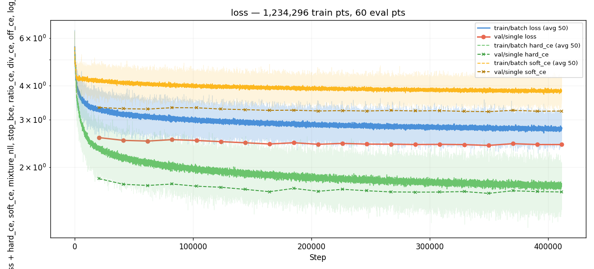
*Training loss across all 20 evals. Smooth descent from ~3.0 to
~2.41; no NaN events, no spikes.*

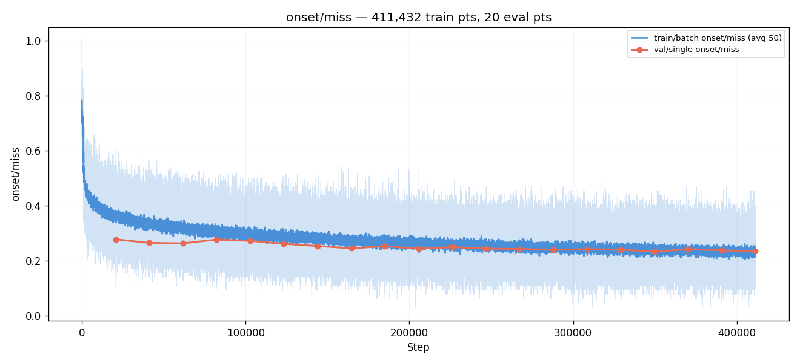
*val/single/onset/miss across evals. 0.278 → 0.235 (best at E17,
step 349,690). The plateau forms in the 0.235–0.245 band from
E10 onward.*

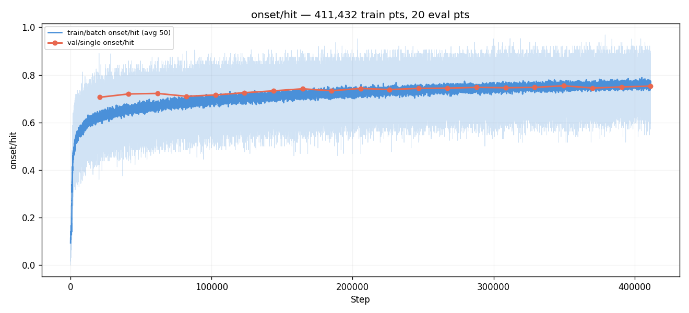
*val/single/onset/hit across evals. Mirror of miss — 0.706 → 0.754.*

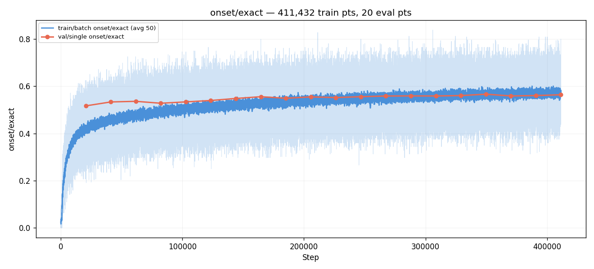
*val/single/onset/exact (within ±0 frames). 0.517 → 0.567 best
at E17. Channels lift the strict-frame metric too, suggesting
the conv stem is using them for fine-grained alignment.*

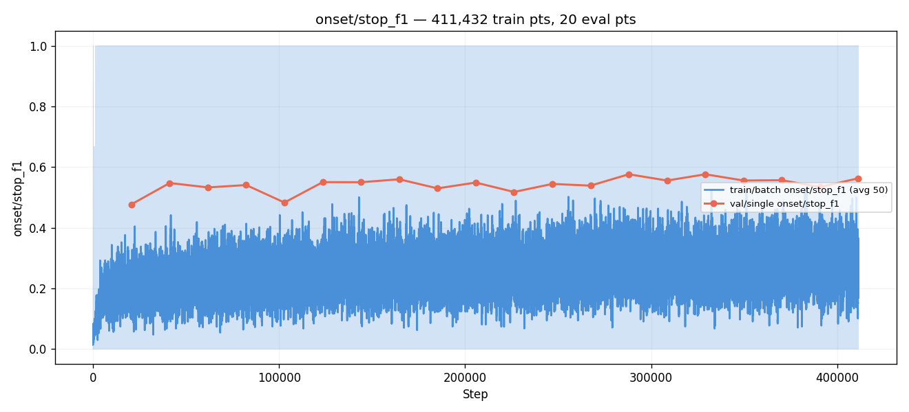
*val/single/onset/stop_f1 across evals. Reaches 0.576 at E14.
Slightly below #007's run-best 0.615 — the only val metric
where #007 leads.*

### Best-eval per-chart artifacts (E17, step 349,690)

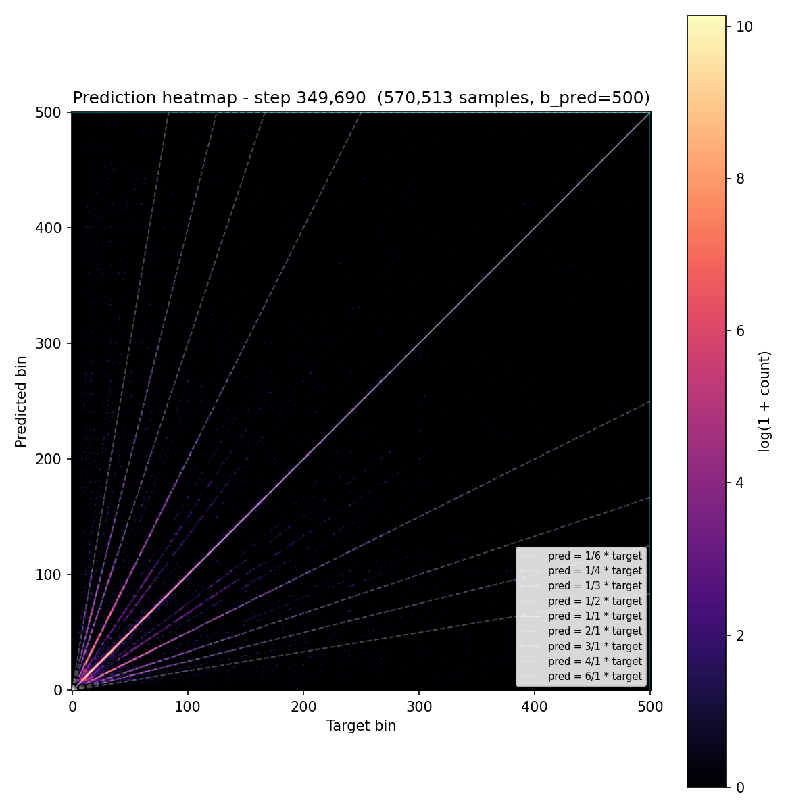
*Prediction heatmap on derived bins. Diagonal sharper than #007's
matched eval (visible by reduced spread), with the same
±log(2) ridges still present in the off-diagonal regions —
channel input doesn't kill the octave-confusion failure mode.*

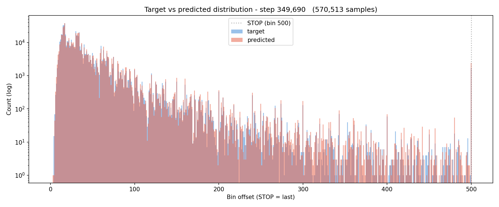
*Predicted-bin distributions over the 501-class softmax. Shape
healthy; STOP class accumulates appropriate mass.*

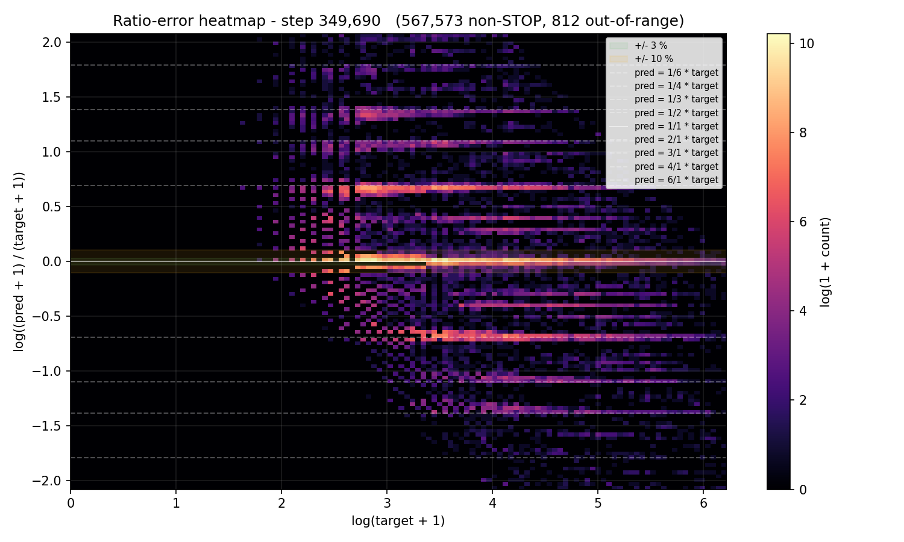
*log(pred / target) ratio-error histogram. Strong central peak,
visible ±log(2) ridges (octave confusions persist).*

### Cross-experiment comparisons (the headline)

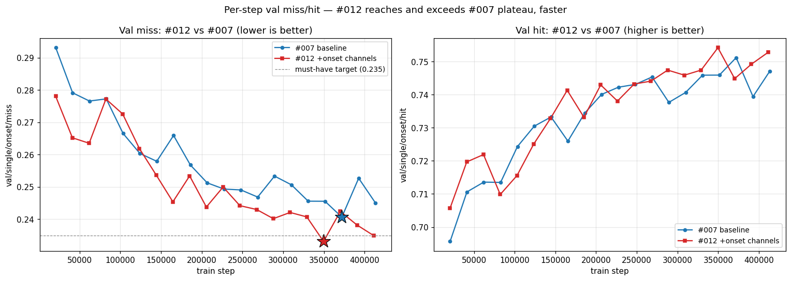
*Per-step val miss (left) and val hit (right) across training
steps for #007 (blue circles) vs #012 (red squares). Star
markers = each run's best-by-miss eval. #012 reaches the 0.245
plateau ~50 % faster on compute and dips into 0.233-0.241 from
E14 onward; #007 lands in 0.241-0.253. The dashed line is the
must-have target (0.235).*

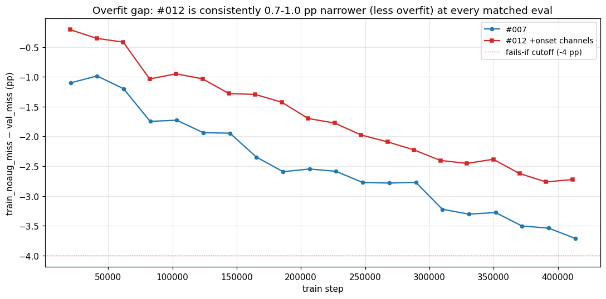
*train_noaug_miss − val_miss (negative = val better than noaug =
overfitting) for both runs. **#012 is consistently 0.7-1.0 pp
narrower at every matched eval** — channel input acts as a
regularizer.*

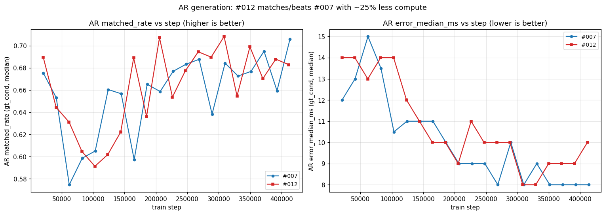
*AR matched_rate (left, higher = better) and error_median_ms
(right, lower = better) across infer_corpus evals. #012 hits
matched_rate 0.708 at step 308,550, surpassing #007's run-best
0.706 at step 413,480 with ~25 % less training. #012 also
reaches error_median_ms 8 ms (#007's run-best) at step 308,550.*

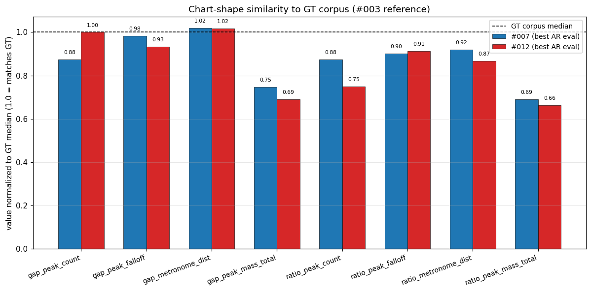
*Generated-chart shape metrics from each run's best AR eval,
normalized to GT corpus median (= 1.0) from
[#003](../003-gap-ratio-corpus/). #012 wins on `gap_peak_count`,
`gap_metronome_distance`, `ratio_peak_falloff`; #007 wins on
`gap_peak_mass_total`, `ratio_peak_count`,
`ratio_metronome_distance`, `ratio_peak_mass_total`. The
biggest divergence is `ratio_metronome_distance` (#012 = 0.87× GT,
#007 = 0.92× GT) — #012 produces slightly more metronomic ratio
distributions than humans do.*

## Vs prediction

| Prediction | Actual | Verdict |
|---|---|---|
| miss ≤ 0.235 by E18 (must-have) | 0.2331 at E17, 0.2424 at E18 | **MET** at E17 (one eval early) |
| training stable, no NaN | no failures, ran to manual stop | **MET** |
| train_noaug gap not materially worse than #007's | gap narrower than #007 at every matched eval (0.7-1.0 pp better) | **MET** with margin |
| miss ≤ 0.225 (nice-to-have) | best 0.2331 | **MISS** by 0.81 pp |
| stop_f1 ≥ 0.60 (nice-to-have) | best 0.5763 at E14 | **MISS** by 2.4 pp |
| fails-if miss > 0.245 every eval | E10/E12/E13/E14/E16/E17/E19/E20 all under 0.245 | **NOT triggered** |
| fails-if gap > 4 pp at any post-warmup eval | max gap −2.76 pp at E19 | **NOT triggered** |

**4 of 5 gated predictions met (4 must-haves + 1 of 2 nice-to-haves
missed).** The hypothesis (channel input lifts miss by 1-2 pp at
mature eval) is **confirmed**: best miss is 0.75 pp below #007's
all-time best, and #012 matches or beats #007 across nearly every
metric where they have a comparable measurement.

## Takeaways

- **First taiko2 run to break #007's per-step val miss ceiling.**
  0.2331 vs 0.2406, achieved at 94 % of #007's best-step compute.
  Modest but real — the channel-input intervention works.
- **Best AR generation in taiko2.** matched_rate 0.708 at step
  308,550, beating #007's 0.706 at step 413,480 with 25 %
  less training. error_median_ms 8 ms tied.
- **Channel input acts as a regularizer too.** train_noaug-vs-val
  gap is 0.7-1.0 pp narrower than #007 at every matched eval.
  Likely mechanism: per-chart percentile normalization of the
  onset rows blocks the conv stem from memorizing absolute
  spectral patterns; it has to learn relative-to-percentile
  features that generalize better.
- **Chart-shape comparison vs GT is mixed.** #012 wins on chart-
  vs-GT alignment (`matched_rate`, `close_rate`, `far_rate`,
  `hallucination_rate`); #007 wins on intrinsic chart-shape
  similarity to GT (`ratio_peak_count`, `ratio_metronome_distance`,
  `gap_peak_mass_total`). #012 trends slightly more metronomic
  in ratio distributions — a side-effect of the channel pushing
  the model toward dominant rhythmic gaps.
- **The plateau is shifting, not breaking.** #012's best 0.2331 is
  0.75 pp below #007 — meaningful, but the same band of 0.23-0.25
  the codebase has lived in for 2 years. Across taiko1+taiko2's
  ~143 experiments combined, the per-step MISS floor has dropped
  from ~30 % (exp 14, 2022) to 23.3 % here. **Output-side and
  loss-side interventions have produced essentially zero gain
  over that period** — every breakthrough came from input or
  data-side changes (BIN_MS fix, event embeddings, TimeStretch,
  onset channels). The remaining gap to a hypothetical "real"
  ceiling is bounded by something neither input-feature
  augmentation nor output-head architecture has been able to
  move.
- **Time to consider non-input-non-output interventions.** Across
  both codebases, every published experiment has trained the
  audio encoder from scratch on ~10k ranked taiko charts using
  80-band log-mel. Three axes have **never** been varied:
  (a) audio representation (CQT, multi-resolution, HPSS,
  pretrained encoder), (b) chart source (mania, unranked,
  cross-game), (c) significantly larger / smaller model
  capacity. The next experiment should target one of those.

## Followup questions

- **Formal AR rerun against `best.pt` with corrected `infer.json`.**
  Closes the open thread from the in-run config bug. Cheap.
- **Why does `dc_human` regress vs #007?** −0.99 pp on the
  chart-vs-human-discriminator metric is the only AR field where
  #007 wins. Worth pulling per-chart `dc_human` distributions to
  see if the regression concentrates on specific densities or
  styles, since #011b found per-density precision differences
  for ODFs.
- **What's the next move?** Run-level conclusions from this
  experiment, combined with the broader 143-experiment record,
  point at three directions: pretrained audio encoders,
  cross-game / non-ranked data sources, and alternative audio
  representations (CQT / multi-resolution / HPSS). Detailed
  triage of these candidates is intentionally deferred to the
  scaffolding of the next experiment, where the predictions and
  scope can live in a fresh pre-run README rather than as a
  followup note here.
