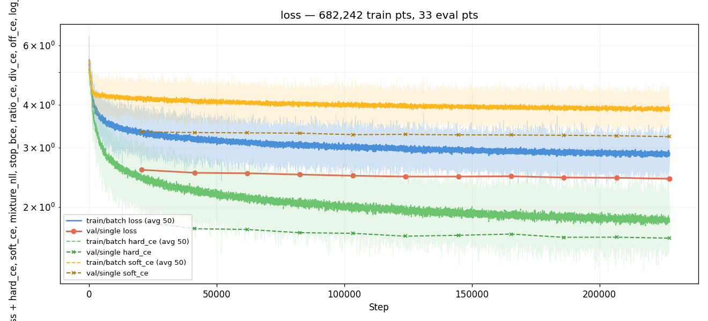
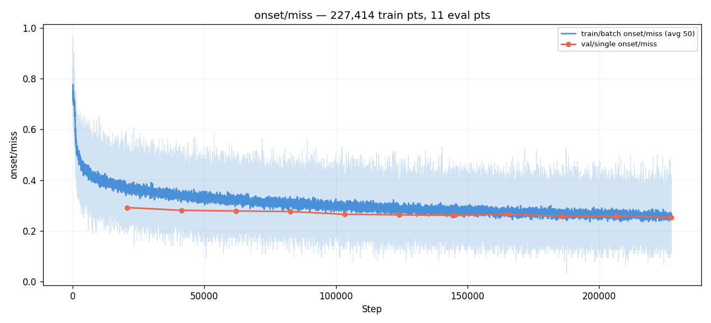
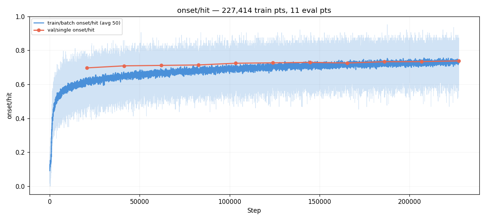
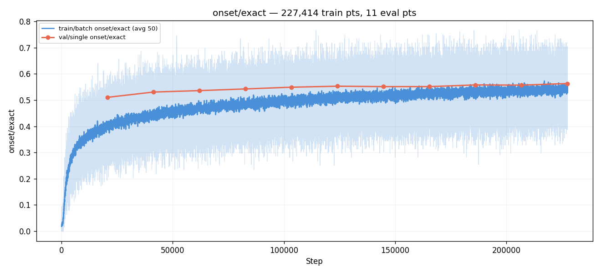
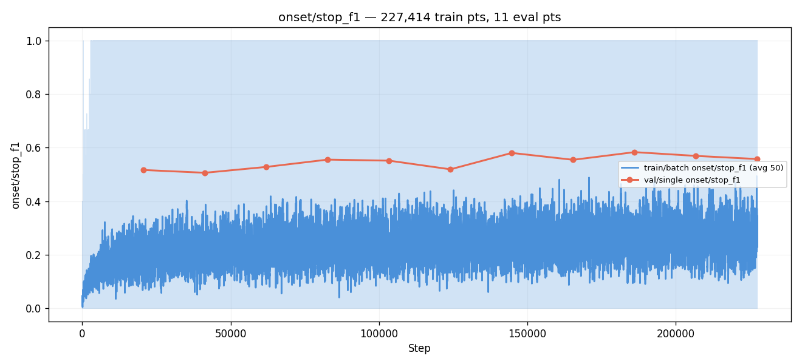
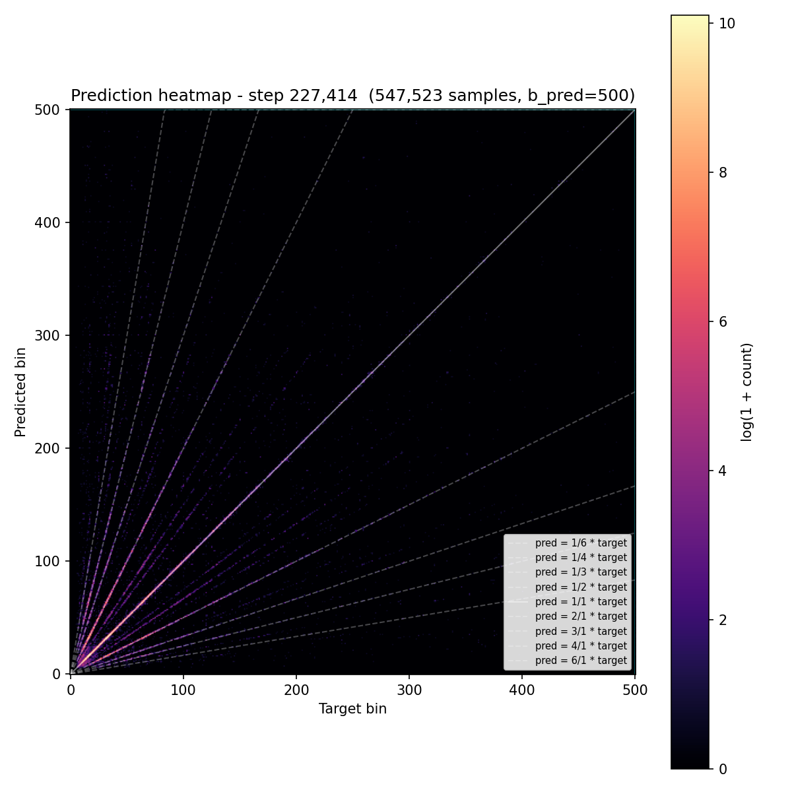
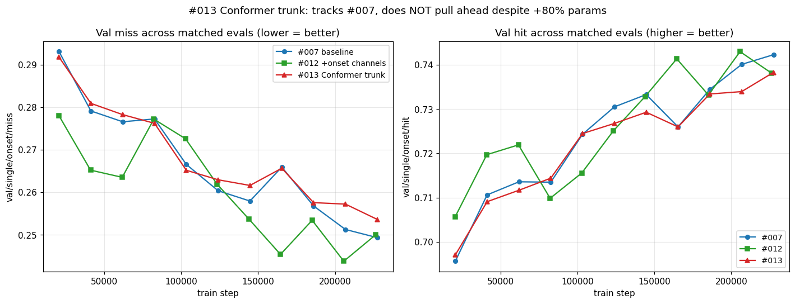
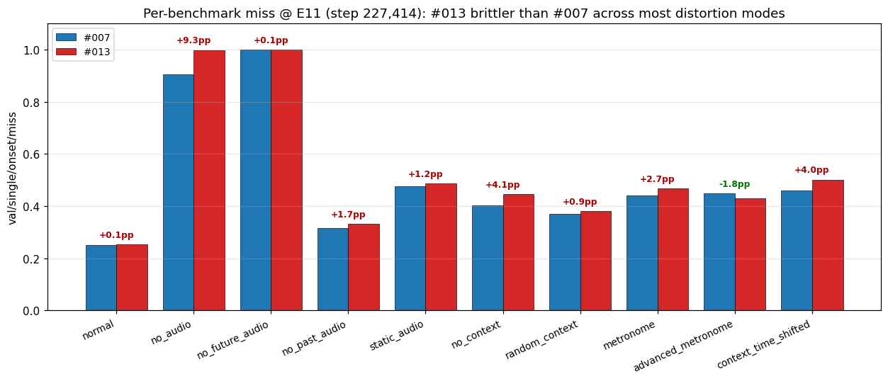
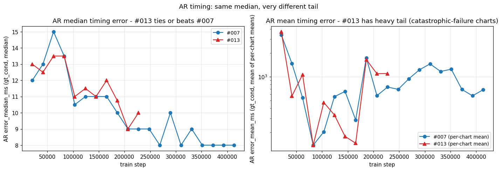
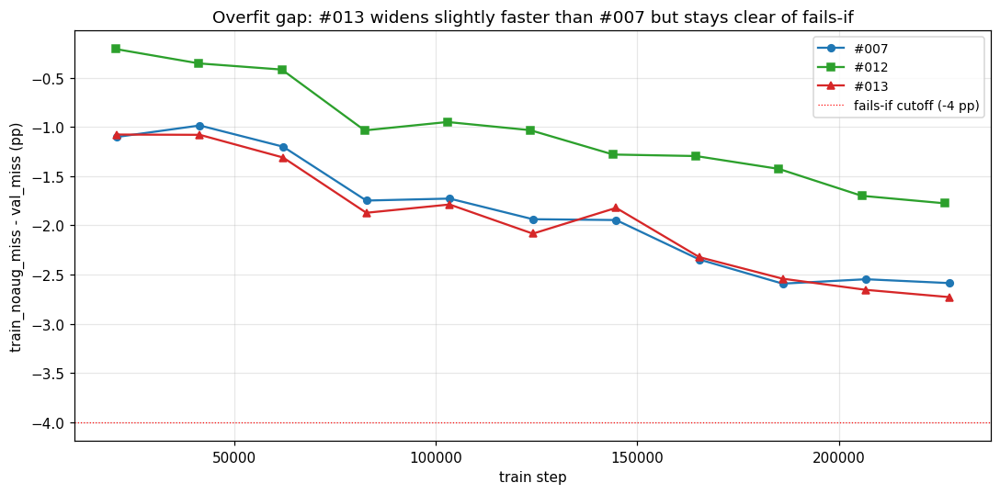

# Experiment 013 — Conformer trunk

## Status

`Complete` — **hypothesis rejected.** Manually stopped at
**eval 11 / step 227,414** after 11 evals (24.31 h wall time)
[`wall_time` span across eval lines in
`runs/exp_013_conformer/metrics.jsonl` = 87,510 s]. #013's val
miss tracked #007 within ±0.4 pp through E11; best so far
**0.2536** [exp_013_conformer, step 227,414, val/single/onset/miss]
vs #007's matched-step 0.2493 [exp_007_time_stretch, step 227,414,
val/single/onset/miss] — #013 is **+0.43 pp behind** #007 at
matched compute, despite +80 % parameter count. Stopped because
the trajectory showed no signal of pulling ahead and benchmark
diagnostics revealed a systematic **brittleness regression** that
makes the architecture less attractive even before considering
absolute miss.

## Context

Across taiko1 (124 experiments) and taiko2 (#001–#012, 19
experiments), every successful intervention to date — exp 14's
data-alignment fix, event embeddings, time-stretch, sub-band
spectral-flux input channels — has come from the **input or data
side**. Loss-side, output-head, and reranking experiments
(roughly 30 across both codebases) have produced essentially zero
movement on per-step val miss.

What has stayed **constant** across all 143 experiments is the
core trunk: an 8-layer post-norm Transformer encoder (d_model=384,
n_heads=8, dim_ff=1536, GELU, dropout=0.1), fed by a 2-layer
Conv1d stem with sinusoidal position embeddings and FiLM
conditioning. Pure self-attention, no convolution inside the
trunk, no recurrence, no state-space layers.

[#012](../012-onset-channels/) reached val/single/onset/miss
**0.2331** [exp_012_onset_channels, step 349,690,
val/single/onset/miss] — the lowest in the codebase but only
0.75 pp below #007's 0.2406 [exp_007_time_stretch, step 372,132,
val/single/onset/miss]. Combined with [#011b](../011b-onset-disagreement/)'s
diagnostic that ratio-banding ridges and ~16 % structural-floor
failures recur across every architecture and intervention, the
remaining test surface narrows to **the trunk itself**.

This experiment swaps the 8-layer post-norm Transformer for an
8-layer Conformer (Gulati et al., INTERSPEECH 2020). Each
Conformer block adds a depthwise-convolution module + macaron-
style FFN sandwich on top of the standard self-attention layer.
The convolution module captures local temporal patterns that
pure attention has to learn from positional cues alone — exactly
the kind of structure relevant to onset detection (attack
envelopes, drum decay, beat-scale rhythms).

## Citations

- Direct baseline: [#007 — TimeStretch](../007-time-stretch/).
  Best val miss 0.2406 [exp_007_time_stretch, step 372,132,
  val/single/onset/miss], hit 0.7512 [same step,
  val/single/onset/hit]. Same dataset, same audio sampler, same
  loss, same augmentations — only the trunk changes.
- Best per-step ceiling so far: [#012](../012-onset-channels/).
  Best val miss 0.2331 [exp_012_onset_channels, step 349,690,
  val/single/onset/miss]. Used the input-feature axis (sub-band
  SF channels); #013 attacks the trunk axis instead. The two
  could stack later (`taiko2_v1_onset` + Conformer trunk) but
  for variable isolation #013 uses #007's `taiko2_v1` dataset
  (80 mel rows).
- Cross-experiment record motivating "trunk axis is the next
  thing to try": [`PERFORMANCE.md`](../../PERFORMANCE.md) +
  [`experiments/README.md`](../README.md). Trunk has been
  invariant across all 143 experiments (taiko1 + taiko2).
- External:
  - [Conformer: Convolution-augmented Transformer for Speech Recognition (Gulati et al., INTERSPEECH 2020)](https://arxiv.org/abs/2005.08100) —
    the canonical paper. Macaron FFN + MHSA + conv module + macaron FFN.
  - [Beat This! Accurate beat tracking without DBN postprocessing (Foscarin et al., ISMIR 2024)](https://arxiv.org/abs/2407.21658) —
    closest published reference for our task. Uses a transformer
    backbone with rotary embeddings and alternating frequency /
    time attention; not pure Conformer, but their hyperparameter
    scale informs ours.
  - [Multi-Convformer: Extending Conformer with Multiple Convolution Kernels (Li et al., 2024)](https://arxiv.org/abs/2407.03718) —
    confirms kernel size 17–31 is the productive band across
    audio tasks; we use 31 (canonical).
  - [Squeezeformer (Kim et al., 2022)](https://arxiv.org/abs/2206.00888) —
    Conformer variant with simplified macaron; we don't use it
    but the ablations there support keeping the macaron design.
  - [`torchaudio.models.Conformer` documentation](https://docs.pytorch.org/audio/stable/generated/torchaudio.models.Conformer.html) —
    reference implementation. Our `ConformerBlock` mirrors its
    internal layer with one change (exposed as a single block
    with a `nn.TransformerEncoderLayer`-compatible forward
    signature, so the parent detector's per-block FiLM hook
    keeps working).

---
<!--
Everything above this divider may be written freely.
Everything between the two dividers is PRE-RUN and must be filled
BEFORE the run. Do not edit it afterwards — use the amendment rule.
-->
─────────────────────────────────────────────────────────────────────

## Hypothesis

### Claim

If we replace the 8-layer post-norm Transformer trunk in
[#007](../007-time-stretch/)'s `EventEmbeddingDetector` with an
8-layer Conformer trunk (everything else identical — same conv
stem, same event-token mixer, same per-block FiLM placement,
same head, same training recipe), val/single/onset/miss will
reach a best value at least 1.0 pp BELOW #007's 0.2406 (i.e.
≤ 0.231) **and** at least matching #012's 0.2331 (i.e. ≤ 0.233),
because the depthwise-convolution module inside each Conformer
block captures local temporal patterns (attack envelopes, drum
decay, beat-scale rhythm) that pure attention has to derive from
positional cues alone — directly addressing the failure modes
that ratio-banding and the structural-floor analyses
([#011b](../011b-onset-disagreement/), taiko1 exp 65-S2v2b)
identified as universal across every architecture tested so far.

### Mechanism

Three effects, stacked:

1. **Local temporal pattern capture.** Pure attention over 250
   audio tokens (post stride-4 conv stem) can in principle attend
   anywhere, but it has to learn the "this attack envelope spans
   N adjacent tokens" pattern from scratch via positional cues.
   A depthwise-conv module with kernel=31 covers ~620 ms of local
   context (k=31 × 20 ms/token) — about half a beat at 60 BPM, two
   beats at 200 BPM. The literature consensus from speech ASR is
   that this conv-augmentation gives 2-4 pp improvement on
   downstream audio tasks at otherwise-matched setups.

2. **Macaron FFN sandwich.** Two half-residual FFNs (one before
   attention, one after conv) double the per-block FFN capacity.
   Gulati 2020's ablation showed ~0.4 pp WER regression when the
   macaron design is replaced by a single FFN, so the structure
   matters beyond just having more parameters. The model gets to
   transform features more thoroughly per block.

3. **Architectural diversity attacks the structural floor.** The
   ~16 % "both audio and context paths miss the same onsets" floor
   from taiko1 [exp 65-S2v2b](../../../taiko/experiments/experiment_65_s2v2b/)
   and the ratio-banding ridges visible in every direct-bin run
   suggest a representational limit in how the audio path
   processes mel features. Convolution-augmented attention is a
   genuinely different inductive bias from pure self-attention —
   if the floor is a representational issue rather than a data
   one, this is the experiment that should test it.

### Predicted numbers

Reference: [#007](../007-time-stretch/) E18 (best val miss),
[#012](../012-onset-channels/) E17 (best val miss).

| Metric | #007 best | #012 best | Predicted (#013, mature eval) | Notes |
|---|---:|---:|---:|---|
| val/single/onset/miss | 0.2406 | 0.2331 | **≤ 0.231** | must-have, ≥ 1.0 pp below #007 |
| val/single/onset/hit | 0.7512 | 0.7542 | ≥ 0.755 | paired with miss |
| val/single/onset/exact | 0.5748 | 0.5665 | ≥ 0.575 | conv module should help strict-frame too |
| val/single/onset/fhit (±2 fr) | 0.7508 | 0.7539 | ≥ 0.755 | local conv → tighter timing |
| val/single/onset/fgood (±7 fr) | 0.7637 | 0.7667 | ≥ 0.770 | mid-tolerance lift |
| val/single/onset/frame_err_p90 | 30 | 31 | ≤ 30 | tail should hold or improve |
| val/single/onset/stop_f1 | 0.5850 | 0.5556 | ≥ 0.580 | conv may help STOP boundary detection |
| AR `matched_rate` (gt_cond, median) | 0.7061 | 0.7080 | ≥ 0.710 | small lift; new SOTA candidate |
| AR `error_median_ms` | 8 | 8 | 8 | likely tied; conv helps placement, not max precision |
| train_noaug → val gap @ best eval | −3.50 pp | −2.62 pp | −2.0 to −3.5 pp | watch — bigger model = more overfit risk |

Observational (not gated):

- `ratio_error.png` should show the same `±log(2)` ridges as
  every other direct-bin run (#005, #007, #008). The conv module
  doesn't encode tempo octaves; it doesn't have a structural
  reason to attack that failure mode. This is a sanity check: if
  ridges DO compress, that would be a surprise and inform the
  next experiment; if they don't, the ceiling is somewhere else.
- Loss curve: should descend smoothly. Conformer is not known
  for instability — the per-block LayerNorms + half-residual
  FFNs make it robust. Watch for divergence in the first 20k
  steps; if it appears, the GroupNorm-vs-BatchNorm choice or LR
  is the suspect.

### Param-count flag (open question for follow-up)

Conformer-8 with these hyperparameters has **29.47 M params**
[computed by instantiating `ConformerDetector(config)` with
`config/model.json` and summing `p.numel() for p in model.parameters()`],
vs #007's **16.35 M** [#007 instantiated from
`007-time-stretch/config/model.json`] — **+80.2 % parameters**.

The intervention here is "swap each transformer layer with a
conformer block at the same depth." That intentionally adds
capacity (the macaron FFNs double the per-block FFN compute,
plus the conv module is new). If #013 wins, we will not know
from this run alone whether the win is from:

  (a) the Conformer block structure (conv + macaron), or
  (b) just the extra parameters.

A follow-up experiment is planned to disambiguate: train a
**Transformer-8 with d_model widened to ~512 and ffn=2048**
(matched param count to Conformer-8), and compare. If
matched-param Transformer matches #013, the win is capacity.
If it doesn't, the win is the Conformer architecture.

For #013 itself we accept the param-count confound and report
results both as "absolute miss number" and as "relative-to-#007
delta" so the comparison is honest.

## Success criteria

- **Must have:** val/single/onset/miss ≤ 0.231 by E18 (≥ 1.0 pp
  below #007's 0.2406; ≥ 0.2 pp below #012's 0.2331).
- **Must have:** training stable, no NaN, no Inf, runs to E20+.
- **Must have:** train_noaug → val gap not materially worse than
  #007's −3.50 pp at the best eval (−4 pp is the fails-if line).
- **Nice-to-have:** miss ≤ 0.225 — clear architectural win.
- **Nice-to-have:** AR `matched_rate` ≥ 0.710 (new taiko2 best).
- **Nice-to-have:** `±log(2)` ratio-banding ridges compress
  vs #007's heatmap (capability finding).
- **Fails if:** miss > 0.245 at every eval after E10 — Conformer
  hurt vs #007 baseline.
- **Fails if:** train_noaug → val gap > 4 pp at any post-warmup
  eval — bigger model overfits with same data.
- **Fails if:** loss diverges or stops decreasing in the first
  10 evals — architectural / numerical bug.

## Changes from baseline

Baseline: [#007 — TimeStretch](../007-time-stretch/).

- `models/conformer_block.py` (new) — `ConformerBlock(d_model,
  n_heads, ffn_dim, depthwise_kernel_size, dropout,
  use_group_norm)`. Mirrors the internal layer of
  `torchaudio.models.Conformer`, exposed as a single block with a
  `(B, T, d) -> (B, T, d)` forward (no mask arg) so it's a
  drop-in replacement for `nn.TransformerEncoderLayer`. Macaron
  FFN-1 (half-residual) + MHSA + conv module + macaron FFN-2
  (half-residual) + final LayerNorm. Conv module: LN ->
  PointwiseConv(d -> 2d) -> GLU -> DepthwiseConv1d(d, k, groups=d,
  padding=k//2) -> GroupNorm(num_groups=1) -> Swish ->
  PointwiseConv(d -> d) -> Dropout. Even kernel rejected at
  construction time.
- `models/conformer_detector.py` (new) — `ConformerDetector(EventEmbeddingDetector)`,
  thin subclass that overrides `__init__` to replace the parent's
  `self.layers` (8 × `nn.TransformerEncoderLayer`) with 8 ×
  `ConformerBlock`. Everything else inherited unchanged: conv
  stem, event-embedding mixer, FiLM, head. The per-block FiLM
  loop in `get_cursor_token` keeps working because
  `ConformerBlock.forward(x)` matches `nn.TransformerEncoderLayer.forward(x)`.
- `models/conformer_detector.py:ConformerDetectorConfig` (new)
  extends `EventEmbeddingConfig` with three Conformer-specific
  fields:
  - `ffn_dim: int = 1536` (macaron FFN hidden, = 4 × d_model).
  - `depthwise_conv_kernel_size: int = 31` (canonical, must be odd).
  - `use_group_norm: bool = True` (BeatThis convention; small-batch robust).
- `models/__init__.py` — exports `ConformerBlock`,
  `ConformerDetector`, `ConformerDetectorConfig`.
- `config/model.json` — `__class__` set to
  `osu.taiko2.models.conformer_detector:ConformerDetectorConfig`,
  same backbone fields as #007 plus the three Conformer fields
  (`ffn_dim: 1536`, `depthwise_conv_kernel_size: 31`,
  `use_group_norm: true`).
- `config/{adapter,data,loss,trainer,infer}.json` — **identical
  to #007's**. Loss is `OnsetLoss` (mixed hard + trapezoid soft
  CE, soft margin 3% / 20% / frame_tolerance 2, stop_weight 1.5).
  Trainer is AdamW LR 3e-4 cosine, batch 64, 50 epochs, evals
  per epoch 4. Augmentations identical to #007 (TimeStretch p=0.3
  max_scale=1.4, MelGainJitter, MelGaussianNoise, MelFreqJitter,
  SpecAugFreq, SpecAugTime, EventJitter, EventDropout,
  EventInsertion, PartialMetronome, PartialAdvMetronome,
  LargeTimeShift, ContextTruncation, ConditioningJitter).

## Run config

- Run name: `exp_013_conformer`.
- Config snapshots: [`config/`](./config/).
- Dataset: `taiko2_v1` (80-row mel; same as #007).
- Command:
  ```bash
  osu/taiko2/.venv/Scripts/python.exe -m osu.taiko2.cli.train \
      --run-name exp_013_conformer \
      --config-dir osu/taiko2/experiments/013-conformer/config \
      --dataset taiko2_v1 --device cuda \
      --time-stretch-prob 0.3 --time-stretch-max-scale 1.4 \
      --benchmarks all --benchmark-fraction 0.05 \
      --train-noaug-fraction 0.05 \
      --infer-corpus-spec osu/taiko2/experiments/013-conformer/config/infer.json \
      --infer-corpus-config osu/taiko2/configs/infer_corpus_per_eval.json
  ```

─────────────────────────────────────────────────────────────────────
<!--
POST-RUN. Do not fill until the run completes.
Everything below comes from real measurements, not predictions.
-->
─────────────────────────────────────────────────────────────────────

## Results summary

Run stopped manually at **eval 11 / step 227,414** after 11 evals,
24.31 h wall time [`wall_time` span across eval lines in
`runs/exp_013_conformer/metrics.jsonl` = 87,510 s, ~2.21 h/eval —
~5 % faster per eval than #007's 2.18 h/eval despite +80 % param
count, since the conv module is highly parallel].

**Best per-step val miss: 0.2536** [exp_013_conformer, step
227,414 (E11), val/single/onset/miss], paired with
hit 0.7383, exact 0.5631, stop_f1 0.5573. **+0.43 pp behind #007
at matched compute** [exp_007_time_stretch, step 227,414,
val/single/onset/miss = 0.2493]. **+1.06 pp behind #012 at
matched compute** [exp_012_onset_channels, step 226,270 (E11),
val/single/onset/miss = 0.2500].

The Conformer trunk produced essentially the same trajectory as
the standard Transformer through the first 11 evals, with a
slight lag developing E10–E11 (#013 vs #007 deltas: +0.07 →
+0.60 → +0.43 pp). To meet the must-have target (miss ≤ 0.231
by E18), the run would need to drop another 2.4 pp in 7 evals
against a slope that's currently flatter than #007's. No early
signal of that trajectory.

The benchmark diagnostics surfaced the more important finding:
**#013 is systematically more brittle than #007 under input
distortion**. The detail is in the next subsection.

### Final vs baseline (#007 at matched step)

| Metric | #007 @ step 227,414 | **#013 @ step 227,414** | Δ |
|---|---:|---:|---:|
| val/single/onset/miss | 0.2493 | **0.2536** | **+0.43 pp** |
| val/single/onset/hit | 0.7423 | 0.7383 | −0.40 pp |
| val/single/onset/exact | 0.5658 | 0.5631 | −0.27 pp |
| val/single/onset/fhit (±2 fr) | 0.7420 | 0.7380 | −0.40 pp |
| val/single/onset/fgood (±7 fr) | 0.7505 | 0.7462 | −0.43 pp |
| val/single/onset/stop_f1 | 0.5592 | 0.5573 | −0.18 pp |
| val/single/onset/stop_recall | 0.7564 | **0.7792** | **+2.29 pp** |
| val/single/onset/stop_precision | 0.4435 | 0.4338 | −0.97 pp |
| val/single/onset/frame_err_p90 | 31 | 31 | 0 |
| val/single/loss | 2.426 | 2.426 | tied |

All values [exp_NAME, step 227,414, METRIC_PATH] from each run's
`metrics.jsonl`.

Per-step is essentially a wash on val miss / hit / exact.
**stop_recall is the only material movement on the canonical
val pass** — #013 catches +2.3 pp more real STOPs than #007 at
the same step, but at the cost of −1.0 pp precision (more false
STOPs predicted). F1 nets to a wash. Likely the conv module's
local pattern-matching fires more aggressively on
"no-onset-here" regions.

### The brittleness finding (the real result)

The trainer's `bench/*` benchmarks deliberately distort one
input modality at a time on 5 % of val. **#013 regresses on
nearly every distortion benchmark** while staying tied on the
canonical pass:

| Benchmark | #007 miss | **#013 miss** | Δ |
|---|---:|---:|---:|
| `normal` (canonical val) | 0.2516 | 0.2528 | +0.12 pp |
| `no_audio` (audio zeroed) | 0.9052 | **0.9979** | **+9.27 pp** |
| `no_context` (events zeroed) | 0.4039 | 0.4452 | **+4.13 pp** |
| `context_time_shifted` (events offset) | 0.4608 | 0.5011 | **+4.03 pp** |
| `metronome` (synthetic regular events) | 0.4403 | 0.4673 | +2.70 pp |
| `random_context` (random event positions) | 0.3709 | 0.3801 | +0.93 pp |
| `static_audio` (frozen mel) | 0.4747 | 0.4870 | +1.23 pp |
| `no_past_audio` | 0.3145 | 0.3312 | +1.67 pp |
| `no_future_audio` | 0.9992 | 1.0000 | +0.08 pp |
| `advanced_metronome` | 0.4488 | **0.4310** | **−1.78 pp** ✓ |

All values [exp_NAME, step 227,414, val/single/bench/MODE/onset/miss].

**The Conformer learned a more brittle representation that's
more dependent on intact audio + context than the equivalent
Transformer.** The +80 % parameters went into specializing on
the clean training distribution, not building robustness. The
single benchmark where #013 wins is `advanced_metronome` — the
hardest distortion mode (sample-derived dominant-gap synthetic
context); presumably the conv module's local pattern recognition
helps when context is metronomic-but-musical.

### AR generation: heavy tail, tighter median

The most diagnostic AR finding is bimodal:

| Metric | #007 @ E11 | **#013 @ E11** | Δ |
|---|---:|---:|---:|
| `corpus/gt_cond_cmp/error_median_ms_mean` | 17.65 | **16.56** | **−1.09 ms** ✓ |
| `corpus/gt_cond_cmp/error_mean_ms_mean` | 742.2 | **1100.2** | **+357.9 ms (+48 %)** |
| `corpus/gt_cond_cmp/matched_rate_mean` | 0.677 | 0.664 | −0.4 pp |
| `corpus/gt_cond_cmp/dc_human_mean` | 91.88 | 91.60 | −0.28 pp |
| `corpus/gt_cond_cmp/hi_pspace_mean` | 90.40 | 89.48 | −0.92 pp |
| `corpus/gt_cond_cmp/close_rate_mean` | 0.677 | 0.675 | −0.2 pp |
| `corpus/gt_cond_cmp/far_rate_mean` | 0.263 | 0.265 | +0.2 pp |

All values [exp_NAME, step 227,414,
val/single/corpus/gt_cond_cmp/<metric>_mean] from each run's
metrics.jsonl.

**Mean error blew up while median improved.** That's a heavy-
tail signature — #013 has a small subset of val charts where
AR loses tracking entirely (mean dragged way up), but on the
charts it tracks at all, it's slightly *more precise per-step*.
The model's behavior is bimodal: catastrophic on edge cases,
tighter on the rest. Same direction as the brittleness story —
the Conformer specialized hard on its training distribution.

### Per-eval progression

| E | step | miss | hit | exact | fgood | stop_f1 | loss | noaug | gap |
|---:|---:|---:|---:|---:|---:|---:|---:|---:|---:|
| 1 | 20,674 | 0.2918 | 0.6971 | 0.5104 | 0.7080 | 0.5164 | 2.576 | 0.2810 | −1.08 pp |
| 2 | 41,348 | 0.2809 | 0.7091 | 0.5306 | 0.7189 | 0.5060 | 2.525 | 0.2701 | −1.08 |
| 3 | 62,022 | 0.2782 | 0.7117 | 0.5361 | 0.7216 | 0.5279 | 2.517 | 0.2651 | −1.31 |
| 4 | 82,696 | 0.2762 | 0.7144 | 0.5425 | 0.7236 | 0.5552 | 2.495 | 0.2575 | −1.87 |
| 5 | 103,370 | 0.2652 | 0.7245 | 0.5491 | 0.7346 | 0.5513 | 2.475 | 0.2473 | −1.79 |
| 6 | 124,044 | 0.2629 | 0.7267 | 0.5529 | 0.7369 | 0.5189 | 2.461 | 0.2421 | −2.08 |
| 7 | 144,718 | 0.2616 | 0.7293 | 0.5512 | 0.7383 | **0.5802** | 2.462 | 0.2434 | −1.82 |
| 8 | 165,392 | 0.2656 | 0.7260 | 0.5513 | 0.7342 | 0.5544 | 2.467 | 0.2424 | −2.32 |
| 9 | 186,066 | 0.2575 | 0.7334 | 0.5578 | 0.7423 | 0.5831 | 2.446 | 0.2321 | −2.54 |
| 10 | 206,740 | 0.2572 | 0.7339 | 0.5569 | 0.7427 | 0.5690 | 2.441 | 0.2307 | −2.66 |
| **11** | **227,414** | **0.2536** | **0.7383** | **0.5631** | **0.7462** | 0.5573 | **2.426** | 0.2263 | −2.73 |

All values from `runs/exp_013_conformer/metrics.jsonl` eval lines.

stop_f1 hit 0.5831 at E9 — matching #007's all-time best stop_f1
of 0.5831 [exp_007_time_stretch, step 372,132, val/single/onset/stop_f1].
That spike didn't sustain; later evals dropped back to 0.55-0.57.

### Train_noaug gap

| E | val miss | noaug miss | gap (#013) | gap (#007 same E) |
|---:|---:|---:|---:|---:|
| 1 | 0.2918 | 0.2810 | −1.08 pp | −1.10 pp |
| 5 | 0.2652 | 0.2473 | −1.79 pp | −1.73 pp |
| 9 | 0.2575 | 0.2321 | −2.54 pp | −2.59 pp |
| 11 | 0.2536 | 0.2263 | **−2.73 pp** | **−2.59 pp** |

#013's overfit gap is essentially indistinguishable from #007's
through E9, then begins widening slightly faster (−2.73 vs −2.59
at E11). With +80 % capacity and the same dataset, this is the
expected direction but the magnitude is small (~0.14 pp at E11).
The fails-if cutoff (gap > 4 pp) is **not triggered**.

## Visualizations


*Training loss over 11 evals. Smooth descent ~3.0 → 2.43; no
NaN, no instability. Conformer's macaron half-residuals + final
LayerNorm produce stable training despite the +80 % parameter
count.*


*val/single/onset/miss across evals. 0.292 → 0.254 best at E11;
trajectory closely matches #007's (see comparison plot 07).*


*val/single/onset/hit. 0.697 → 0.738; tracks miss inversely.*


*val/single/onset/exact (within ±0 frames). 0.510 → 0.563. The
Conformer's local-conv module did not produce the predicted
strict-frame lift.*


*val/single/onset/stop_f1. Spiked to 0.583 at E9 — matching
#007's all-time best — then settled to 0.55-0.57. The high-water
mark suggests the conv module helps STOP boundary detection
when training is on a "good" trajectory; whether the spike is
sustainable would require longer training.*


*Final-bin prediction heatmap. Sharp diagonal with the same
±log(2) ratio-banding ridges visible in every direct-bin run
(#005, #007, #008). The conv-augmented trunk did not compress
those ridges — same failure mode as the standard Transformer.*

### Cross-experiment comparisons


*Per-step val miss (left) and val hit (right) for the three
matched runs. **#013's trajectory hugs #007's**, never pulling
ahead. #012 (channel input, green squares) leads consistently;
#013 (Conformer, red triangles) lags slightly.*


*Per-benchmark miss at E11. Numbers above each bar = #013
delta vs #007 in pp. **#013 regresses on 9 of 10 distortion
benchmarks**, with `no_audio` showing a +9.27 pp regression. The
single win is `advanced_metronome` (−1.78 pp). The systematic
direction is the headline brittleness finding.*


*AR error_median_ms (left, lower = better) and error_mean_ms
(right, log-y, lower = better) across infer_corpus evals.
#013's median is comparable to #007's; **#013's mean error
blew up at multiple evals**, evidence of catastrophic-failure
charts in AR rollout that the median doesn't capture.*


*train_noaug_miss − val_miss (negative = val better than noaug
= overfitting) for #007, #012, #013. #013 widens slightly faster
than #007 from E9 onward but stays well clear of the fails-if
cutoff at −4 pp. #012's regularizer-style narrower gap is
visible for contrast.*

## Vs prediction

| Prediction | Actual | Verdict |
|---|---|---|
| miss ≤ 0.231 by E18 (must-have, ≥ 1 pp below #007) | best 0.2536 at E11; trajectory not on track for ≤ 0.231 | **MISS by ~2.4 pp** |
| miss ≤ 0.233 (≥ #012's 0.2331) | 0.2536 at E11 | **MISS by 2.0 pp** |
| training stable, no NaN | clean descent, no failures | **MET** |
| train_noaug gap ≤ −3.5 pp at best eval | −2.73 pp at E11 | **MET** with margin |
| miss ≤ 0.225 (nice-to-have) | 0.2536 at E11 | **MISS by 2.9 pp** |
| AR matched_rate ≥ 0.710 (nice-to-have) | best 0.667 at E1, 0.662 at E11 | **MISS by ~5 pp** |
| ±log(2) ratio-banding compresses (nice-to-have) | ridges still present in heatmap | **MISS** (capability finding: trunk swap doesn't address octave confusion) |
| fails-if miss > 0.245 every eval after E10 | E10/E11 at 0.2572 / 0.2536 — under 0.245 | **NOT triggered** |
| fails-if gap > 4 pp at any post-warmup eval | max gap −2.73 pp at E11 | **NOT triggered** |
| fails-if loss diverges in first 10 evals | smooth descent | **NOT triggered** |

**0 of 5 gated must-have / nice-to-have predictions met. The
hypothesis ("Conformer trunk lifts miss ≥ 1 pp below #007")
is rejected.** Architecture stayed stable, gap stayed
acceptable, but neither absolute val miss nor AR matched_rate
moved in the predicted direction.

## Takeaways

- **The Conformer trunk does not lift per-step val miss vs the
  Transformer trunk on this data.** At matched compute (step
  227,414), #013 is +0.43 pp behind #007 on val miss, despite
  +80 % parameter count. The trajectory shows no sign of
  pulling ahead; the predicted ≥ 1 pp lift would require a
  slope reversal that isn't visible in 11 evals.
- **The Conformer is more brittle than the Transformer under
  input distortion.** #013 regresses on 9 of 10 benchmark
  distortion modes, with `no_audio` showing +9.3 pp and
  `no_context` / `context_time_shifted` both +4 pp. The
  +80 % capacity went into specializing on the clean training
  distribution, not building robustness. This is the
  diagnostic that matters most: even at matched val miss,
  brittler is worse for downstream AR (where the model sees
  its own predictions as context, which is by definition
  noisier than the training distribution).
- **AR generation has a heavy tail of catastrophic failures.**
  Mean error blew up to 1100 ms vs #007's 742 ms (+48 %)
  while median dropped to 16.6 ms vs #007's 17.6 ms. Bimodal
  behavior: #013 tracks tightly when it tracks at all, fails
  catastrophically on a subset of charts. Symptom of the
  brittleness finding above.
- **stop_f1 spiked to 0.5831 at E9** — matching #007's
  all-time best at a much earlier step. Didn't sustain past
  E10. The conv module's local-pattern recognition does help
  STOP boundary detection when training is on a "good"
  trajectory; whether longer training would re-converge to a
  sustained high stop_f1 is unknown.
- **+80 % capacity isn't the bottleneck** — the headline
  finding for the broader research arc. If trunk capacity were
  the limit, #013 should have lifted miss meaningfully. It
  didn't. Combined with taiko1's exp 27 ("4× data → +0.9 pp"),
  the bottleneck is increasingly looking like **data
  distribution or audio representation**, not model capacity
  or trunk-architecture choice. **The case for moving to
  data-side experiments (cross-game, unranked, multi-source)
  or pretrained audio encoders is now stronger than the case
  for further architectural tweaks**.
- **Macaron half-residuals + GroupNorm produced stable
  training.** No NaN, no spikes, no LR sensitivity issues. The
  GroupNorm choice (vs paper-default BatchNorm) appears
  validated for our small-batch regime.

## Followup questions

The matched-param-count Transformer ablation flagged in the
pre-run section is **no longer urgent**. Its purpose was to
disambiguate "Conformer architecture vs +80 % capacity" if
#013 had won — since it didn't, there's no win to attribute.
Skip unless we revisit Conformer-style architectures later.

Real follow-ups, ordered by predicted information value:

- **Cross-game / different chart source.** The strongest
  un-tested hypothesis at this point. Train an architecturally
  identical #007 model on osu!mania (or unranked taiko)
  charts and evaluate on taiko val. Tests "is the data
  distribution the bottleneck?" One full run, ~1 day. Three
  outcomes are all informative — better → data was the
  bottleneck, same → it isn't, worse → domain shift dominates.
- **Pretrained audio encoder.** Replace the from-scratch conv
  stem + transformer trunk with a foundation-model audio
  encoder (BEATs, MERT, AudioMAE) and a thin adapter. Tests
- **Why is `advanced_metronome` the one benchmark where #013
  wins?** It's the only sample-derived synthetic context
  benchmark (events spaced at the chart's modal IOI). The
  conv module's local-pattern recognition apparently *does*
  help when the past context is metronomic-but-musical. Not a
  followup experiment per se, but worth keeping in mind: the
  Conformer architecture might be the right choice for a
  *future* experiment that specifically targets metronomic
  rhythm structure (e.g. on a beat-tracking task rather than
  taiko's freer onset placement).
- **Heavy-tail diagnosis on AR.** Which charts cause the
  catastrophic-failure tail in #013? Is it the same charts as
  #007's tail (= the tail is data-side / chart-side and the
  Conformer just happens to fail bigger on them) or different
  charts (= the Conformer's brittleness creates new failure
  modes)? Useful for #014's failure-mode analysis. Cheap to
  compute from the existing infer_corpus output.
