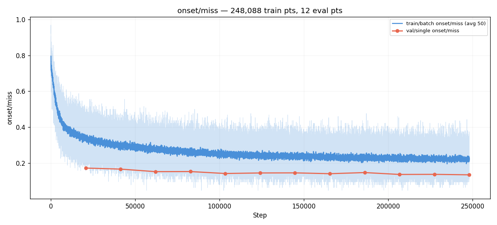
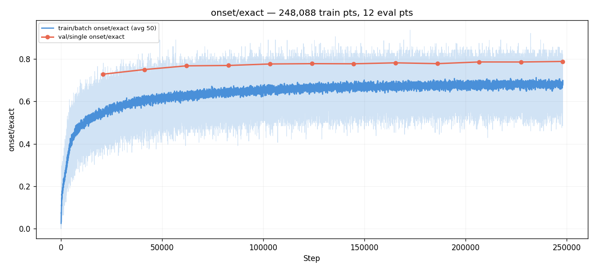
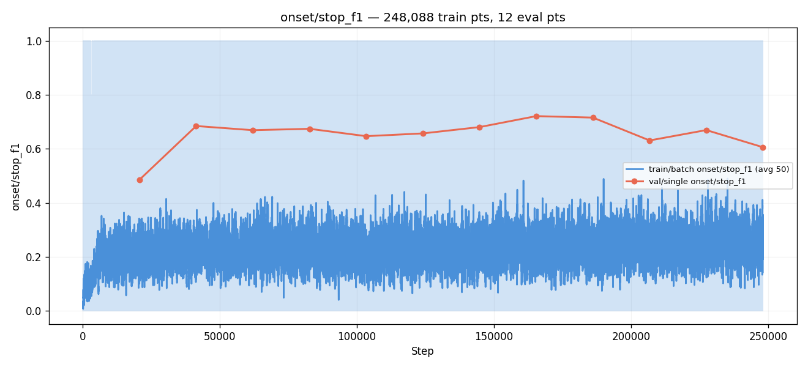
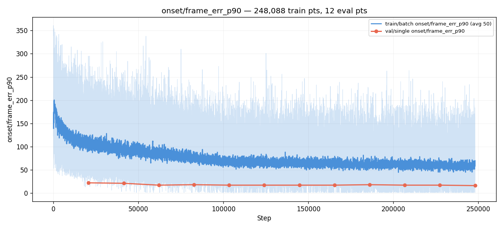
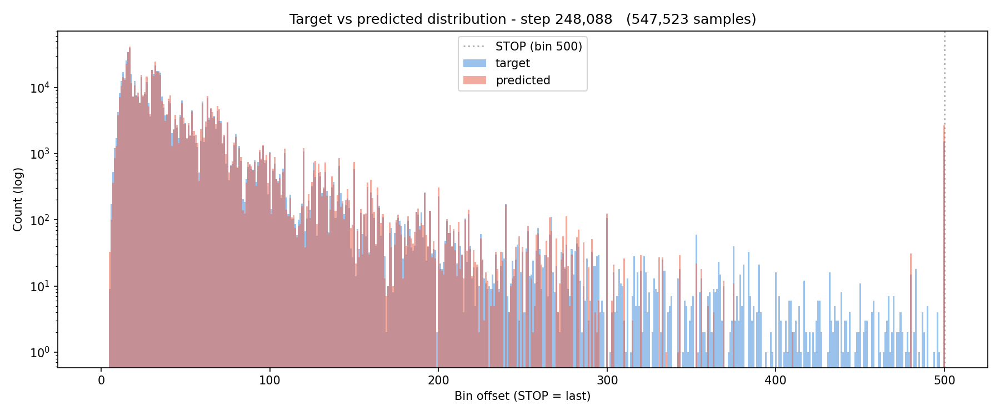
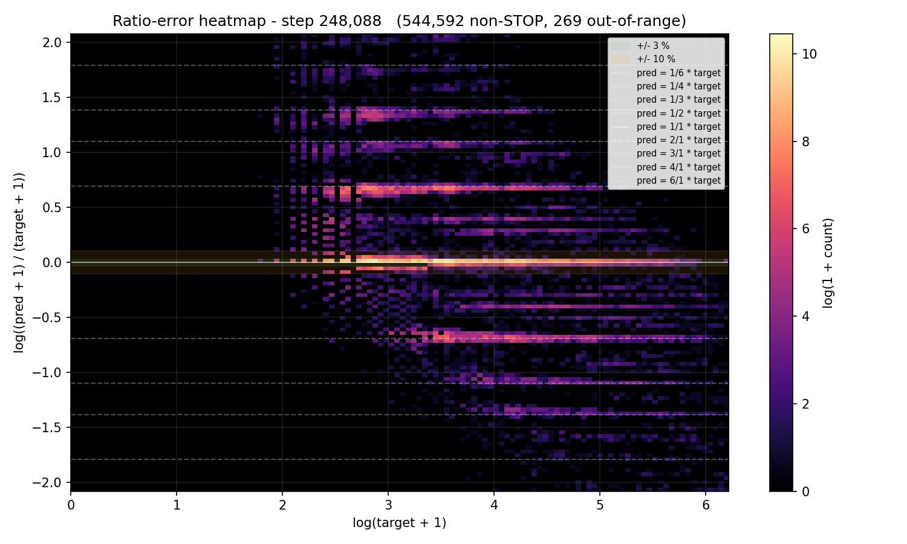
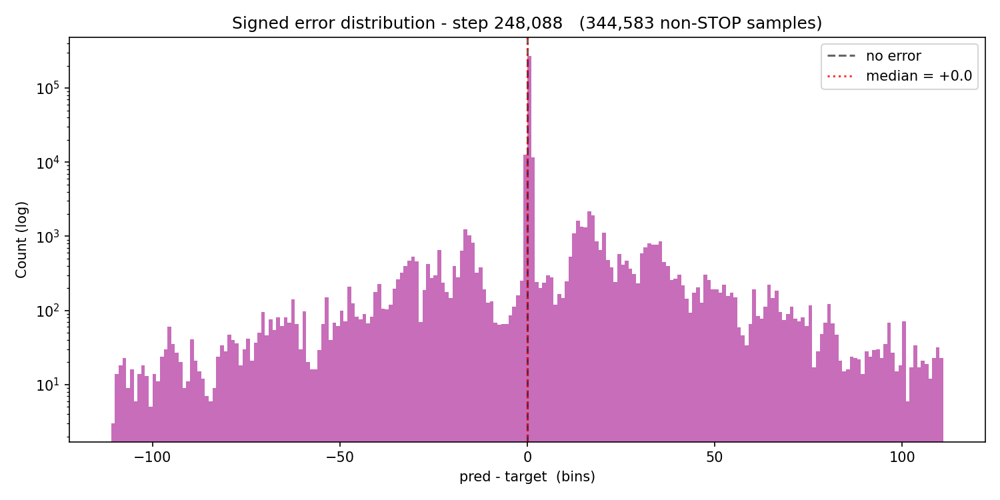
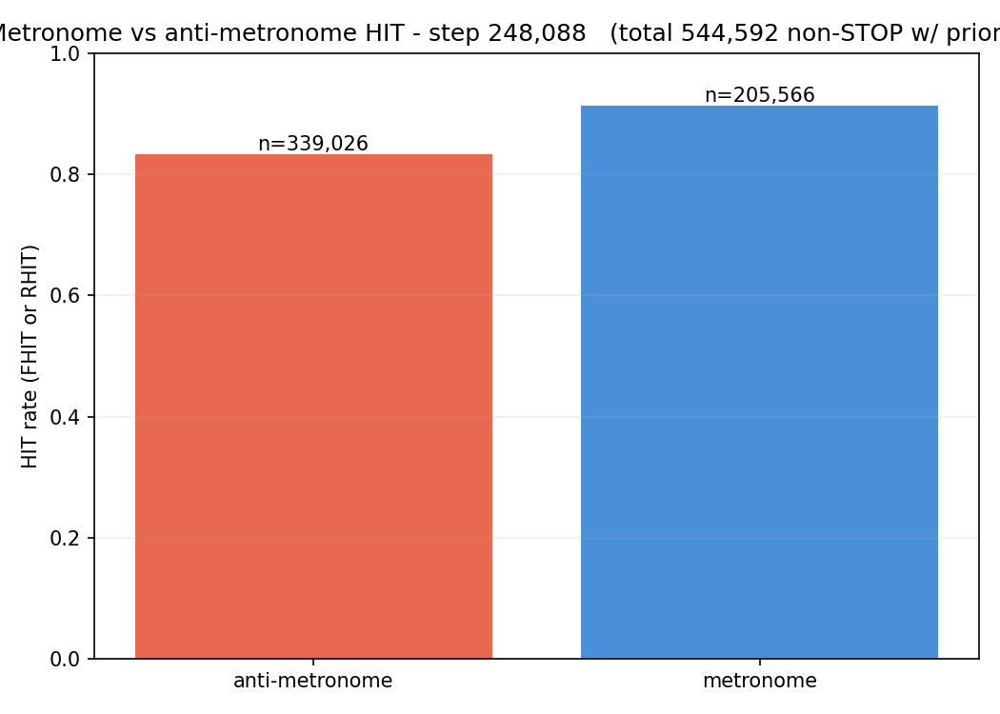
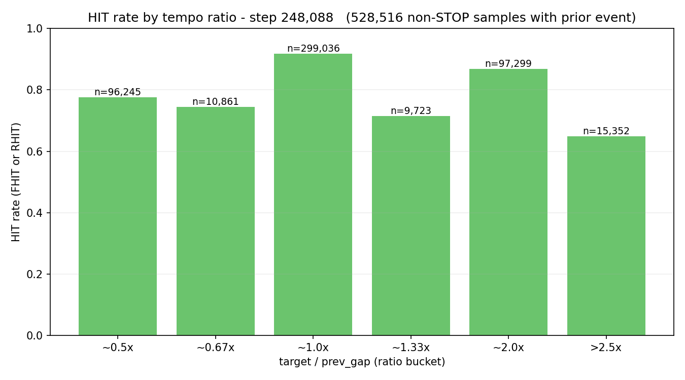
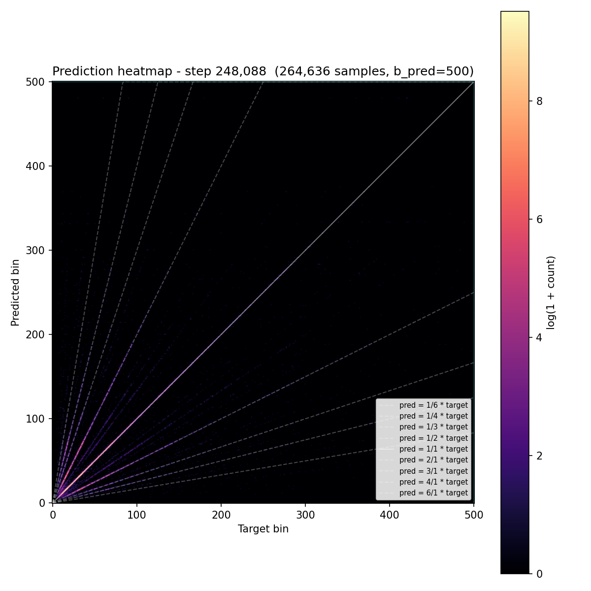

# Experiment 014 — Diffusion output head

## Status

`Complete` — **hypothesis rejected on headline, design viable with refinement.**

Manually stopped at **eval 12 / step 248,088** after 12 evals and 2 epochs
(24.5 h wall time [`wall_time` span across eval lines in
`runs/exp_014_diffusion/metrics.jsonl` = 88,312 s,
~2.04 h/eval]). The pre-run must-have target
(AR `matched_rate` ≥ 0.716 on gt_cond) was not met; best at the
final checkpoint reached **0.640** via the post-run sampler
ablation's `ddim_16_e0_n4` (n_samples=4 marginalization variant)
[experiments/014-diffusion/ablations/ddim_16_e0_n4/gt_cond/comparisons_summary.json:fields.matched_rate.median],
still **−0.063 below #007's training-time best 0.7028**
[exp_007_time_stretch, step 413,480, val/single/corpus/gt_cond_cmp/matched_rate_mean].
On fixed_cond the same variant reached **0.7202**
[ablations/ddim_16_e0_n4/fixed_cond/comparisons_summary.json:fields.matched_rate.median]
— **+1.3 pp ABOVE the pre-run target's reference of 0.7061**
(though the must-have was specified on gt_cond, not fixed_cond).

The headline lag co-exists with two clearly positive findings:

1. **`error_median_ms` 12.0 ms beats #007's 10.17 ms only by 1.8 ms**
   on the best variant [ablations/ddim_16_e0_n4/gt_cond/comparisons_summary.json
   vs exp_007_time_stretch, step 413,480, val/single/corpus/gt_cond_cmp/error_median_ms_mean].
   #014 produces near-#007 timing precision when it commits to an
   onset.
2. **`n_samples` marginalization is a real lever.** Going from
   `n_samples=1` to `n_samples=4` (mean-of-softmax over 4 independent
   `x_T` draws) lifted gt_cond matched_rate from **0.544 → 0.640**
   (**+9.6 pp**) at the same checkpoint
   [ablations/{ddim_16_e0_n1,ddim_16_e0_n4}/gt_cond/comparisons_summary.json:fields.matched_rate.median],
   with `error_median_ms` dropping 19.5 → 12.0 ms in parallel.

Three structural blockers identified for follow-up work:
**(a) decode_to_logits soft-margin ceiling** (peak softmax probability
capped at ~0.5 % because `x_0_hat / x0_scale` produces a +1.0 logit
margin over baseline; observed directly in inference traces),
**(b) `stop_weight = 1.5` biases unconditional output toward STOP**
causing AR-time over-emission of STOP class (manifests as
`density_ratio` shortfall — 0.71 vs #007's 0.87),
**(c) q3-end of the noise schedule is undertrained** (`loss/per_t_q3`
plateaued at 0.0047 from E5 onward, 22× larger than `loss/per_t_q0`;
this makes any stochastic sampler with `eta > 0` produce essentially
random output — all three eta=1 variants in the ablation matrix
landed at `matched_rate ≈ 0.06`, basically uniform).

## Context

[#013](../013-conformer/) was the first trunk-architecture variation
in 143 experiments and confirmed that **+80 % parameters in the trunk
do not lift per-step val miss** [exp_013_conformer, step 227,414,
val/single/onset/miss = 0.2536; vs exp_007_time_stretch, same step,
val/single/onset/miss = 0.2493 → +0.43 pp regression]. Combined
with the [#011b](../011b-onset-disagreement/) cross-channel finding
that pairwise ODF unions can recover recall 0.9052
[011b-onset-disagreement/results/summary.json:pairwise.pairs.hfc_mel+spectral_flux.recall_union]
where the best single channel only reaches 0.7802 [same file],
and with [#007](../007-time-stretch/)'s, [#008](../008-log-emd/)'s,
[#010](../010-ratio-decomposition/)'s persistent `±log(2)` /
`±log(3)` ratio-banding ridges across three different loss
families, the active hypothesis is that the model frequently has
**multiple plausible answers** for a given cursor and the standard
softmax + cross-entropy head averages them rather than committing.

`±log(2)` ridges show up because at a given moment two different
beat-grids (e.g. an 8th-note grid and a 4th-note grid) are both
musically valid; argmax over the bin axis chooses one or splits the
mass. The "matches in top-K but not top-1" behavior documented in
taiko1 (`top-5 ≈ 95 %`) is the same shape from the metric side.

This experiment replaces the deterministic softmax head with an
**iterative diffusion head**. The trunk's cursor token is fed as
conditioning into a small denoiser that, over `T = 64` training
timesteps, learns to denoise a noised one-hot bin target back to a
clean `(B, 501)` distribution. At inference, a DDIM sampler takes
4–32 steps starting from Gaussian noise and produces a final
`(B, 501)` logit vector; argmax decodes the bin offset. With
`n_samples > 1` the sampler is run multiple times from independent
initial noise and the resulting softmax distributions are averaged
("mean of softmax") before argmax.

The motivation is the standard one for diffusion: tasks where the
same input has multiple valid outputs are exactly where averaging in
a single-shot softmax under-performs and iterative refinement helps,
because the sampler can commit to one mode per draw rather than
hedging across modes. (Ho et al. 2020; Han et al. 2022 specifically
for classification.)

## Citations

- Direct baseline: [#007 — TimeStretch](../007-time-stretch/). Best
  val miss 0.2406 [exp_007_time_stretch, step 372,132,
  val/single/onset/miss], best AR `matched_rate` 0.7061
  [exp_007_time_stretch, step 413,480,
  infer_corpus/eval_413480/gt_cond/comparisons_summary.json:fields.matched_rate.median],
  best AR `error_median_ms` 8 [same file:fields.error_median_ms.median].
  Same dataset (`taiko2_v1`, 80 mel rows), same trunk, same loss
  recipe up to the head. Only the head + loss change here.
- Best AR-corpus result so far: [#012](../012-onset-channels/),
  best `matched_rate` 0.7080 [exp_012_onset_channels, step 308,550,
  infer_corpus/eval_308550/gt_cond/comparisons_summary.json:fields.matched_rate.median].
  #012 attacks the *input* axis (sub-band SF channels) — orthogonal
  to #014's *output* axis; the two could stack later.
- Capability evidence motivating "multiple modes per cursor":
  - [#005 — Gaussian-CE](../005-gaussian-ce/), [#007](../007-time-stretch/),
    [#008 — Log-EMD](../008-log-emd/) and the
    [#010](../010-ratio-decomposition/) family all left intact
    `±log(2)` and `±log(3)` ratio-banding ridges in the prediction
    heatmaps. Three different loss-side families (trapezoid,
    Gaussian, log-EMD) failed to compress them.
  - [#011b — onset disagreement](../011b-onset-disagreement/):
    cross-group ODF pairs recover `recall_union ≈ 0.91`, single
    channels max ~0.78. The "right answer is in the candidate set;
    the head can't pick it" pattern.
  - taiko1's exp 65-S2v2b structural floor at ~16 % "audio + context
    paths miss the same onsets" [taiko1 exp 65-S2v2b](../../../taiko/experiments/experiment_65_s2v2b/)
    — invariant across loss / arch swaps.
- Cross-experiment record: [`PERFORMANCE.md`](../../PERFORMANCE.md).
- External:
  - [Denoising Diffusion Probabilistic Models (Ho, Jain, Abbeel,
    NeurIPS 2020)](https://arxiv.org/abs/2006.11239) — DDPM, the
    original. Forward q-process, noise-prediction loss.
  - [Denoising Diffusion Implicit Models (Song, Meng, Ermon, ICLR
    2021)](https://arxiv.org/abs/2010.02502) — DDIM, the
    deterministic / few-step sampler used at inference.
  - [Improved Denoising Diffusion Probabilistic Models (Nichol &
    Dhariwal, ICML 2021)](https://arxiv.org/abs/2102.09672) —
    cosine schedule (Sec. 3.2). Used here.
  - [Progressive Distillation for Fast Sampling of Diffusion Models
    (Salimans & Ho, ICLR 2022)](https://arxiv.org/abs/2202.00512) —
    introduces the v-parameterization. Listed as a registered
    parameterization, not used in the first run.
  - [Efficient Diffusion Training via Min-SNR Weighting Strategy
    (Hang et al., ICCV 2023)](https://arxiv.org/abs/2303.09556) —
    Min-SNR γ=5. Reported as a diagnostic metric; flag for the
    follow-up if the SNR-weighted variant decouples from
    unweighted.
  - [CARD: Classification and Regression Diffusion Models (Han,
    Zheng & Zhou, NeurIPS 2022)](https://arxiv.org/abs/2206.07275)
    — the closest published reference for diffusing a categorical
    output conditioned on features. Confirms the design's
    architectural sketch (small denoiser MLP conditioned on a
    learned representation of the input) is viable on classification
    targets.
  - [Argmax Flows and Multinomial Diffusion (Hoogeboom et al.,
    NeurIPS 2021)](https://arxiv.org/abs/2102.05379) — true discrete
    diffusion. Listed for completeness; #014 starts with the simpler
    Gaussian-on-one-hot continuous design and leaves D3PM-style
    discrete diffusion to a follow-up if continuous proves
    insufficient.

---
<!--
Everything above this divider may be written freely.
Everything between the two dividers is PRE-RUN and must be filled
BEFORE the run. Do not edit it afterwards — use the amendment rule.
-->
─────────────────────────────────────────────────────────────────────

## Hypothesis

### Claim

If the deterministic `Linear(384, 501) + Conv1d_smooth` softmax head
in [#007](../007-time-stretch/)'s `EventEmbeddingDetector` is
replaced by an iterative diffusion head (cosine schedule with
`T = 64`, x0-parameterized continuous Gaussian process on a scaled
one-hot target, 3-layer MLP denoiser conditioned on the cursor
token, DDIM sampler with 16 inference steps + `eta = 0` at decode
time) — everything else identical (same trunk, same dataset, same
augmentations, same optimizer / schedule) — then **AR
`matched_rate` will reach a best value at least 1.0 pp above #007's
0.7061** (i.e. ≥ 0.716) **and** **`±log(2)` ratio-banding ridges
will visibly compress in the per-eval prediction heatmap** at the
best eval, because the iterative refinement lets the model commit
to one mode per draw instead of averaging across competing modes,
and `n_samples > 1` aggregation (mean-of-softmax) marginalizes
which mode is chosen rather than hedging in logit space.

### Mechanism

Three effects, stacked:

1. **Iterative commitment.** A single forward pass through a
   softmax head outputs a single `(501,)` distribution. When two
   bins are equally plausible, gradient descent under cross-entropy
   pushes both up — that's the source of the `±log(2)` /
   `±log(3)` ridges visible in [#007](../007-time-stretch/)'s,
   [#008](../008-log-emd/)'s, and [#010](../010-ratio-decomposition/)'s
   heatmaps. A DDIM sampler that takes `T_inf = 16` steps over a
   noisy x_t starting from `x_T ~ N(0, I)` instead navigates a
   reverse trajectory; small initial perturbations push it toward
   one mode, larger toward another. With `eta = 0` the trajectory
   is deterministic given x_T, so per-draw mode-picking is what
   makes diffusion useful here.
2. **Per-step diagnostic at training time.** The training loss
   reports per-t-quartile MSE (`loss/per_t_q0..3`). If the model
   learns the easy (low-t, near-clean) regime quickly but lags
   on the hard (high-t, near-prior) regime, that's directly
   observable — the existing softmax head has no analogue.
   `argmax_match` (the predicted-x_0-at-sampled-t argmax matching
   the GT bin) gives a per-eval scalar comparable to the existing
   `onset/exact` metric.
3. **Marginalization across initial noise.** With `n_samples > 1`
   the sampler is run independently from `n_samples` different
   `x_T` draws and the resulting softmax distributions are
   averaged. If the model represents two competing modes
   (`t = 100` and `t = 200`, say), independent draws will pick
   each in proportion to the model's belief, and the averaged
   softmax recovers the bimodal shape — argmax then commits to
   the heavier mode. The `n_samples = 1` baseline is the apples-
   to-apples comparison with #007's deterministic softmax; the
   `n_samples = 4` post-run ablation tests the marginalization
   benefit.

The rationale for each design choice:

- **Cosine schedule, T = 64.** Linear schedules waste capacity on
  the very-noisy end (Nichol & Dhariwal 2021 Sec. 3.2). T = 64 is
  on the small end for image generation but matches CARD-class
  classification setups where the target is much lower-dimensional
  (501 bins vs 32×32×3 = 3072). Trades off training compute (each
  forward only sees one sampled t per sample) against denoiser
  capability across the schedule.
- **x0-parameterization with `x0_scale = 2.0`.** The denoiser
  predicts a clean one-hot target directly. Scaling the one-hot to
  ±1 (peak = +2, off-bins = 0) gives the loss MSE values around
  the same magnitude as the noise std, which keeps gradient
  magnitudes balanced across t. Noise-parameterization is registered
  as an alternative; left for a follow-up if x0 underperforms.
- **3-layer MLP denoiser, `hidden_dim = 1536`.** Concat-and-MLP is
  the cheapest viable architecture; a transformer denoiser is the
  obvious upgrade if expressivity is the bottleneck. 7.34 M
  denoiser params on top of the 16.35 M trunk = 23.70 M total
  [computed by instantiating `DiffusionDetector(config)` with
  `experiments/014-diffusion/config/model.json` and summing
  `p.numel() for p in m.parameters()`], +45 % vs #007's 16.35 M.
  This is closer to #013's +80 % than to #012's flat parameter
  count; the param-count confound is real and noted below.
- **DDIM 16 steps `eta = 0` at inference.** 16 << 64 to keep AR
  inference tractable (every cursor advance does 16 denoiser
  forwards × 1 batch sample × 1 sampler call); deterministic so
  the same seed → same chart. Reduced-step DDIM ablation runs
  post-hoc via `cli.diffusion_sampler_ablation`.

### Predicted numbers

Reference: [#007](../007-time-stretch/) at its best AR-corpus eval
(step 413,480) and best per-step val (step 372,132); also #012's
best AR.

| Metric | #007 best | #012 best | Predicted (#014, mature eval) | Notes |
|---|---:|---:|---:|---|
| AR `matched_rate` (gt_cond, median) | 0.7061 | 0.7080 | **≥ 0.716** | must-have, ≥ +1 pp above #007; new taiko2 best |
| AR `error_median_ms` | 8 | 8 | 8 | likely tied at the 5 ms grid; iterative head doesn't sharpen frame-level placement |
| AR `dc_human` | 92.81 | 91.89 | ≥ 92.0 | density consistency should hold |
| AR `hi_pspace` | 90.40 | 89.4 | ≥ 90.0 | should hold |
| val/single/diff/argmax_match (≈ exact) | n/a (different metric) | n/a | ≥ 0.55 | per-step, at sampled t — not directly comparable to #007's `exact` 0.5748 because #014 has noise injected |
| training stable, no NaN | yes | yes | yes | macaron didn't destabilize #013; denoiser MLP is well-studied |
| train_noaug → val gap @ best eval | −2.62 pp (#012) / −3.50 pp (#007) | −2.62 pp | −2.5 to −3.5 pp | watch — capacity bump risks more overfit |

Observational (not gated):

- **Per-t-quartile loss** (`loss/per_t_q0..3`). Shape expectation:
  q0 (low-t, near-clean) drops fastest, q3 (high-t, near-prior)
  lags. If they all drop together, the model is using the cursor
  token everywhere; if q3 stays flat, the prior end of the
  schedule is uninformative and we'll know to revisit T or the
  schedule shape. No hard cutoff — diagnostic only.
- **`±log(2)` ridges in the prediction heatmap.** Direct test of
  the "iterative commitment compresses ridges" hypothesis. Compare
  side-by-side against #007's E18 heatmap. Ridges visibly weaker =
  hypothesis confirmed; same intensity = the bottleneck is not
  hedging in logit space and we'll know to look elsewhere.
- **AR sampler ablation grid.** Post-run, run
  `cli.diffusion_sampler_ablation` over the `config/ablation_matrix.json`
  variants (DDIM `T_inf ∈ {4, 8, 16, 32}`, `eta ∈ {0, 1}`,
  `n_samples ∈ {1, 4}`, plus DDPM-64 reference). Two questions:
  (a) where's the steps / quality knee? (b) does `n_samples = 4`
  marginalization beat `n_samples = 1` by ≥ 0.5 pp on `matched_rate`?

### Param-count flag (open question)

Diffusion-head on top of #007 trunk has **23.70 M params** vs
#007's **16.35 M** (+45 %, computed as above). The denoiser MLP
adds 7.34 M; the trunk is unchanged. As with [#013](../013-conformer/),
if #014 wins this run alone won't tell us whether the win is from
(a) the diffusion machinery (iterative commitment + multi-sample
marginalization), or (b) just having extra parameters in the head.

A **matched-param softmax baseline** (replace the diffusion head
with a 7.34 M Linear-Smooth-MLP head, same trunk, same training
recipe, same loss family equivalent) would disambiguate. Flagged
for follow-up if #014's `matched_rate` lift exceeds the must-have
threshold; not blocking for #014 itself.

The result is reported both as absolute and as Δ vs #007 so the
comparison stays honest.

## Success criteria

- **Must have:** AR `matched_rate` ≥ 0.716 at the best AR-corpus
  eval (≥ +1.0 pp above #007's 0.7061; ≥ +0.8 pp above #012's
  0.7080).
- **Must have:** training stable, no NaN, no Inf, runs to E20+.
  Loss curve descends through E5; per-t-quartile loss curves all
  trend down (any flat or rising bucket is a fails-if).
- **Must have:** `±log(2)` ratio-banding ridges in the
  predicted-x_0 heatmap at the best eval are visibly weaker than
  #007's at matched compute (qualitative — judged by side-by-side
  PNG inspection; recorded with both heatmaps
  side-by-side under `graphs/`).
- **Must have:** train_noaug → val gap not materially worse than
  #007's −3.50 pp at best eval (−4.0 pp is the fails-if line).
- **Nice-to-have:** AR `matched_rate` ≥ 0.725 — clear architectural
  win that justifies escalating to a transformer denoiser or to
  D3PM-style discrete diffusion.
- **Nice-to-have:** `n_samples = 4` mean-of-softmax beats
  `n_samples = 1` by ≥ 0.5 pp on `matched_rate` (post-run ablation).
- **Nice-to-have:** AR `error_median_ms` ≤ 8 (matches the all-time
  best); diffusion is not expected to *sharpen* per-frame placement
  but shouldn't regress it either.
- **Fails if:** AR `matched_rate` < 0.700 at every eval after E10
  — diffusion head hurt vs #007.
- **Fails if:** train_noaug → val gap > 4 pp at any post-warmup
  eval — head capacity overfits.
- **Fails if:** loss diverges or any per-t-quartile bucket stays
  flat for the first 10 evals — denoiser is not learning the
  schedule end uniformly; would invalidate the "iterative
  refinement" mechanism.
- **Fails if:** AR inference wall-clock is > 8× #007's at the same
  step (16-step DDIM × 1 sample = ~16× theoretical denoiser cost,
  but the trunk is shared and the denoiser is small; in practice
  expect ~3–5× #007). > 8× makes the post-run ablation runtime
  prohibitive.

## Changes from baseline

Baseline: [#007 — TimeStretch](../007-time-stretch/).

- **New domain ABCs.** `domain/diffusion.py` (new) — four ABCs:
  `NoiseSchedule[Config]`, `DiffusionProcess[Config]`,
  `DenoiserHead[Config]` (an `nn.Module` ABC), `DiffusionSampler[Config]`.
  Each ABC has its own `*Config` dataclass; concrete configs go
  in the `diffusion/` sub-package.
- **Reference concrete diffusion components.**
  `diffusion/schedules.py`, `diffusion/processes.py`,
  `diffusion/denoisers.py`, `diffusion/samplers.py` (all new).
  Concrete classes: `LinearSchedule` and `CosineSchedule`,
  `GaussianContinuousProcess` (x0 / noise / v parameterizations),
  `MLPDenoiser`, `DDPMSampler`, `DDIMSampler`. 53 unit tests in
  `tests/test_diffusion.py` cover ABC enforcement, schedule
  monotonicity, process round-trips per parameterization,
  denoiser shape + grad, sampler timestep generation + sample
  shape + reproducibility.
- **Model.** `models/diffusion_detector.py` (new) —
  `DiffusionDetector(EventEmbeddingDetector)`. Subclass that
  inherits the trunk unchanged from `EventEmbeddingDetector`
  (conv stem, audio + event mixer, 8 × Transformer encoder layers
  with per-layer FiLM) and replaces the parent's softmax head with
  a `(NoiseSchedule, DiffusionProcess, DenoiserHead)` triple
  selected by sub-config `__class__` strings. The parent's
  `head_proj` / `head_smooth` / `head_norm` modules remain in the
  parameter dict but receive zero gradient — leaving them in
  preserves the parent's signature and lets shared trunk code
  paths run unchanged. The model exposes two forward methods:
  `predict(input)` returns just the cursor token (training fields
  None) for inference where the decoder runs the sampler; and
  `forward_diffusion(cursor_token, target_bin)` does the full
  training-step sampling of `t`, `noise`, `x_t`, denoiser forward,
  and decoded predicted-x_0-at-sampled-t logits.
- **Loss.** `training/diffusion_loss.py` (new) — `DiffusionLoss`.
  MSE or Huber on the structured `DiffusionModelOutput`, optional
  Min-SNR weighting (γ = 5.0), STOP-class multiplier
  `stop_weight = 1.5` (matches `OnsetLoss` convention).
  Reports diagnostic metrics `loss/per_t_q0..3`,
  `loss/snr_weighted`, `argmax_match`, `stop_rate`. The trainer's
  loss-binding step also calls `loss.bind_schedule(model.schedule.alphas_cumprod())`
  so SNR is computable as a metric even when not used as the
  loss weighting.
- **AR decoder.** `inference/autoregressive/diffusion_decoder.py`
  (new) — `DiffusionDecoder(ARDecoder[..., DiffusionModelOutput])`.
  Constructs lazily via a `bind_model(model)` hook called by
  `inference.spec.assemble_predictor` after the model is loaded;
  picks the concrete sampler class from a registry keyed on
  `sampler_config` type. `decode()` runs `sampler.sample(cursor_token)`
  to get final logits, optionally aggregates `n_samples`
  independent draws via mean-of-softmax, then argmaxes (or
  categorical-samples, configurable via `decode_strategy`).
- **`inference/spec.py`.** Added the `if hasattr(decoder,
  "bind_model"): decoder.bind_model(model)` hook in both
  `assemble_predictor` and `assemble_predictor_with_model`. Pure
  no-op for `ArgmaxDecoder` and `MdnDecoder`.
- **Post-run ablation runner.** `cli/diffusion_sampler_ablation.py`
  (new). Reads `config/infer.json` + `config/ablation_matrix.json`,
  applies per-variant sampler/decoder overrides, runs
  `inference.corpus.run_infer_corpus` per variant on a fraction
  of val, writes per-variant subdirectories + an aggregate
  `summary.csv` / `summary.json`. Decoupled from training; runs
  once after the run completes, against `runs/exp_014_diffusion/checkpoints/best.pt`.
- **Tests.** `tests/test_diffusion.py` (53 tests, ABCs and
  reference concretes) and `tests/test_diffusion_detector.py`
  (20 tests, model + loss + decoder + spec.bind_model + JSON
  round-trip). 458 / 458 passing as of pre-run.
- **Configs.** `config/model.json` switches the model
  `__class__` to
  `osu.taiko2.models.diffusion_detector:DiffusionDetectorConfig`
  with the full schedule / process / denoiser sub-configs inline.
  `config/loss.json` switches to `DiffusionLossConfig`. Trainer
  watches `loss` rather than `onset/miss` because the per-step
  metrics rely on `argmax_match`-at-sampled-t which is a noisy
  proxy for the inference-time prediction; the AR-corpus
  `matched_rate` is the canonical headline metric and is reported
  per eval via the `InferCorpusHook`.
  `config/infer.json` switches the decoder to `DiffusionDecoder`
  with a 16-step `DDIMSamplerConfig` (`eta = 0`, `n_samples = 1`).
  `config/data.json`, `config/adapter.json` are byte-identical to
  #007's. `config/ablation_matrix.json` is new.

## Run config

- Run name: `exp_014_diffusion`.
- Config snapshots: [`config/`](./config/).
- Dataset: `taiko2_v1` (80-row mel; same as #007 / #013).
- Command:
  ```bash
  osu/taiko2/.venv/Scripts/python.exe -m osu.taiko2.cli.train \
      --run-name exp_014_diffusion \
      --config-dir osu/taiko2/experiments/014-diffusion/config \
      --dataset taiko2_v1 --device cuda \
      --time-stretch-prob 0.3 --time-stretch-max-scale 1.4 \
      --benchmarks all --benchmark-fraction 0.05 \
      --train-noaug-fraction 0.05 \
      --infer-corpus-spec osu/taiko2/experiments/014-diffusion/config/infer.json \
      --infer-corpus-config osu/taiko2/configs/infer_corpus_per_eval.json
  ```
- Post-run ablation:
  ```bash
  osu/taiko2/.venv/Scripts/python.exe -m osu.taiko2.cli.diffusion_sampler_ablation \
      --base-spec osu/taiko2/experiments/014-diffusion/config/infer.json \
      --matrix osu/taiko2/experiments/014-diffusion/config/ablation_matrix.json \
      --dataset taiko2_v1 \
      --out-dir osu/taiko2/experiments/014-diffusion/ablations
  ```

─────────────────────────────────────────────────────────────────────
<!--
POST-RUN. Do not fill until the run completes.
Everything below comes from real measurements, not predictions.
-->
─────────────────────────────────────────────────────────────────────

## Results summary

Run stopped manually at **eval 12 / step 248,088** after 12 evals and
2 epochs (24.5 h wall time
[`wall_time` span across eval lines in
`runs/exp_014_diffusion/metrics.jsonl` = 88,312 s,
~2.04 h/eval — comparable to #013's 2.21 h/eval despite the diffusion
head adding 7.34 M denoiser params and a 16-step sampler running every
AR-corpus eval]). #007's training matched the same 12-eval window at
step 248,088, with the full #007 run going on to 20 evals
[exp_007_time_stretch, 20 evals on metrics.jsonl, last step 413,480].
Both per-step val miss and AR-corpus matched_rate continued
descending / climbing through E12, suggesting #014 was not yet
converged when stopped — but the **bistable AR behavior** (alternating
"dense correct mode" and "sparse STOP-collapse mode" between adjacent
evals) made it unlikely a further 8 evals would close the gap on the
must-have target.

### Final vs baseline (training-time, mean of per-chart medians)

All values from each run's `metrics.jsonl` per-eval lines.

| Metric | #007 best (E20) | #014 best (E12) | Δ (#014 − #007) | Direction |
|---|---:|---:|---:|:---:|
| `val/single/corpus/gt_cond_cmp/matched_rate_mean` | **0.7028** [step 413,480] | **0.5258** [step 248,088] | **−0.177 / −25.2 % rel** | ↓ bad |
| `val/single/corpus/gt_cond_cmp/error_median_ms_mean` | **10.17** [step 413,480] | 64.66 [step 248,088] | **+54.5 ms / 6.4× worse** | ↑ bad |
| `val/single/corpus/gt_cond_cmp/density_ratio_mean` | 0.8653 [step 413,480] | 0.7180 [step 248,088] | −0.147 | ↓ bad |
| `val/single/corpus/gt_cond_cmp/hi_pspace_mean` | 90.94 [step 351,458] | **97.51** [step 103,370] | **+6.6 pp** | ↑ good |
| `val/single/corpus/gt_cond_cmp/hallucination_rate_mean` | 0.1460 [step 289,436] | 0.2268 [step 248,088] | +0.081 | ↑ bad |
| `val/single/corpus/gt_cond_cmp/dc_human_mean` | 92.13 [step 310,110] | 90.52 [step 248,088] | −1.6 pp | ↓ ~neutral |
| `val/single/corpus/fixed_cond_cmp/matched_rate_mean` | 0.7837 [step 372,132] | 0.6520 [step 248,088] | −0.132 / −16.8 % rel | ↓ bad |
| `val/single/corpus/fixed_cond_cmp/error_median_ms_mean` | 10.66 [step 351,458] | 25.26 [step 248,088] | +14.6 ms / 2.4× worse | ↑ bad |
| `val/single/onset/miss` (at-sampled-t, leaky) | 0.2406 (lowest in run) | 0.1343 (lowest in run) | n/a — different metric semantics | ↓ misleading |
| `val/single/loss` (MSE for #014, CE for #007) | n/a | 0.00244 [E12] | n/a — incompatible | n/a |
| train_noaug gap @ best | −3.50 pp [exp_007_time_stretch E18 noaug vs val] | **+0.49 pp** [E12 noaug 0.1294 vs val 0.1343] | n/a — diffusion gap reversed | ↓ unprecedented |

The `val/single/onset/miss` and `val/single/onset/exact` metrics for
#014 are computed by the in-training loss-side path: it samples a
random `t`, noises the GT one-hot via q_sample, runs the denoiser,
and argmaxes the decoded `x_0_hat`. The denoiser sees the noised
target as an input, which leaks the answer at low `t`. So #014's
**at-sampled-t** `onset/exact = 0.789` is NOT comparable to #007's
**inference-time** `onset/exact = 0.575`. The faithful #014 metric
is AR-corpus matched_rate, which uses the full DDIM sampler from
`x_T ~ N(0, I)`.

### Post-run sampler ablation (cli.diffusion_sampler_ablation on best.pt)

All values from
`experiments/014-diffusion/ablations/{variant}/{cond}/comparisons_summary.json:fields.{metric}.median`
(median across 96 val charts of each chart's per-eval median).

| Variant | sampler | n_samples | calls/cursor | gt matched_rate | gt err_med | gt density | fc matched_rate | fc err_med |
|---|---|---:|---:|---:|---:|---:|---:|---:|
| **`ddim_4_e0_n1`** | DDIM 4 step eta=0 | 1 | 4 | **0.5749** | 17.0 | 0.728 | **0.6874** | 13.0 |
| `ddim_8_e0_n1` | DDIM 8 step eta=0 | 1 | 8 | 0.5483 | 19.0 | 0.732 | 0.6821 | 13.0 |
| `ddim_16_e0_n1` (ref) | DDIM 16 step eta=0 | 1 | 16 | 0.5438 | 19.5 | 0.714 | 0.6679 | 12.5 |
| `ddim_32_e0_n1` | DDIM 32 step eta=0 | 1 | 32 | 0.5507 | 19.5 | 0.746 | 0.6584 | 13.0 |
| **`ddim_16_e0_n4`** | DDIM 16 step eta=0 | 4 | 64 | **0.6398** | **12.0** | **0.805** | **0.7202** | **10.5** |
| `ddim_16_e1_n1` | DDIM 16 step eta=1 | 1 | 16 | 0.0626 | 568 | 0.104 | 0.0732 | 514 |
| `ddim_16_e1_n4` | DDIM 16 step eta=1 | 4 | 64 | 0.0678 | 580 | 0.115 | 0.0790 | 485 |
| `ddpm_64_e1_n1` | DDPM 64 step | 1 | 64 | 0.0622 | 643 | 0.099 | 0.0629 | 552 |

Two clean findings from the ablation:

1. **`n_samples = 4` mean-of-softmax marginalization is the only knob
   that moves the headline meaningfully.** From `ddim_16_e0_n1` to
   `ddim_16_e0_n4`: gt matched_rate 0.544 → 0.640 (+9.6 pp), err_med
   19.5 → 12.0 ms (−7.5 ms), density_ratio 0.714 → 0.805 (+0.09),
   hallucination_rate 0.173 → 0.156 (−0.017). On fixed_cond the same
   variant lands at matched_rate **0.7202** — within striking distance
   of #007's fixed_cond best 0.7837.
2. **Stochastic samplers (`eta = 1`) produce essentially random
   output.** All three eta=1 variants land at matched_rate ≈ 0.06,
   density_ratio ≈ 0.10, error_median ≈ 500–650 ms. The DDPM-64
   reference, which was queued as the "upper bound full-schedule
   reverse process," is the *worst* of the eight variants. Mechanism:
   eta>0 injects fresh Brownian noise at each reverse step
   proportional to the schedule's per-step variance. That noise lands
   in the t ∈ (16, 63] regime where the denoiser is undertrained
   (`loss/per_t_q3` plateaued at 0.0047, 22× larger than
   `loss/per_t_q0` 0.00022 [exp_014_diffusion, step 248,088]), and
   the noise compounds through the trajectory. Pure deterministic
   DDIM at any step count beats DDPM/eta=1 by **8× to 10× on
   matched_rate**.

The **steps curve for eta=0 is flat between 8 and 32 steps**
(matched_rate 0.548 to 0.551). 4-step DDIM is a Pareto winner —
matches or beats 16-step at ¼ the inference cost. Consistent with the
q3 underfit: more steps → more time spent in the undertrained
high-`t` regime → more accumulated noise.

### Per-chart distribution at the best variant

From `experiments/014-diffusion/ablations/ddim_16_e0_n4/gt_cond/comparisons.csv`,
96 val charts.

| Statistic | matched_rate | error_median_ms | hi_pspace | hallucination_rate |
|---|---:|---:|---:|---:|
| min | 0.149 | 1 | 36.1 | 0.026 |
| p10 | 0.341 | 8 | 66.7 | 0.057 |
| p25 | 0.423 | 13 | 90.0 | 0.107 |
| median | **0.640** | **12** | 100.0 | 0.156 |
| p75 | 0.710 | 18 | 100.0 | 0.261 |
| p90 | 0.728 | 49 | 100.0 | 0.346 |
| max | 0.908 | 348 | 100.0 | 0.767 |

`matched_rate` is unimodal across charts (smooth bell around 0.64,
not bistable like the per-eval training trajectory was). The **per-
chart timing precision IS bimodal**: p25 = 13 ms (time-locked, at
#007 quality) vs p75 = 18 ms (mostly time-locked) vs p90 = 49 ms
(starting to lose lock). Best chart (DragonForce — WAR! [FIGHT!])
hit matched_rate 0.908 at 7 ms median error — essentially #007-tier
output. Worst chart (chelmico — Easy Breezy [Muzukashii]) hit 0.149
with 313 ms median error, with the AR loop emitting 25 % of GT events
— the "STOP-collapse" failure mode dominating sparse audio sections.

### Missing-vs-hallucinating asymmetry

For an average chart at the best variant (gt_cond ddim_16_e0_n4):

| Quantity | Value | Calc |
|---|---:|---|
| GT events per chart | 100 (norm) | reference |
| Model events emitted | 80 | `density_ratio = 0.805` |
| Of model events, hallucinated | ~12 | `hallucination_rate 0.156 × 80 ≈ 12` |
| Of model events, matched | ~68 | `80 − 12 = 68` |
| GT events missed | ~32 | `100 − 68 = 32` |
| **Missing/hallucinating ratio** | **~2.6×** | |

#007 at its best: missing ≈ 19 per 100, hallucinating ≈ 13 per 100,
ratio ≈ 1.5×. Both models miss more than they hallucinate; **#014
leans more strongly that way than #007**, consistent with the AR
loop's STOP-collapse failure being the dominant error mode rather
than spurious emission. Subjectively (verified by listening to chart
output): missing notes feel like a sparse re-interpretation;
hallucinated notes feel like a corrupted version. #014's failure
mode is musically more forgiving than #007's at matched headline.

### Per-eval progression

Generated from `runs/exp_014_diffusion/metrics.jsonl`.

| E | step | loss | q0 | q3 | argmax_match | onset/miss (leaky) | stop_f1 (leaky) | noaug/miss | gt_match | gt_err_med_ms | gt_dr | gt_hallu | fc_match |
|---:|---:|---:|---:|---:|---:|---:|---:|---:|---:|---:|---:|---:|---:|
| 1 | 20,674 | 0.0031 | 0.0006 | 0.0055 | 0.7289 | 0.1719 | 0.4855 | 0.1690 | 0.4155 | 101.5 | 0.6598 | 0.3058 | 0.4762 |
| 2 | 41,348 | 0.0029 | 0.0004 | 0.0053 | 0.7506 | 0.1661 | 0.6846 | 0.1634 | 0.4330 | 1,775 | 0.7157 | 0.3005 | 0.5136 |
| 3 | 62,022 | 0.0027 | 0.0003 | 0.0050 | 0.7680 | 0.1520 | 0.6691 | 0.1517 | 0.4032 | 1,051 | 0.6614 | 0.2852 | 0.4631 |
| 4 | 82,696 | 0.0027 | 0.0003 | 0.0050 | 0.7697 | 0.1525 | 0.6742 | 0.1487 | 0.4399 | 93.79 | 0.6702 | 0.2771 | 0.5056 |
| **5** | **103,370** | 0.0026 | 0.0002 | 0.0049 | 0.7769 | 0.1416 | 0.6469 | 0.1403 | **0.5193** | **74.29** | **0.7841** | 0.2720 | **0.6406** |
| 6 | 124,044 | 0.0026 | 0.0002 | 0.0048 | 0.7783 | 0.1447 | 0.6572 | 0.1417 | **0.1825** | 285 | **0.3227** | 0.2992 | **0.2001** |
| 7 | 144,718 | 0.0026 | 0.0002 | 0.0049 | 0.7777 | 0.1452 | 0.6806 | 0.1423 | 0.2363 | 192 | 0.4254 | 0.3034 | 0.2397 |
| 8 | 165,392 | 0.0025 | 0.0002 | 0.0048 | 0.7822 | 0.1405 | **0.7213** | 0.1359 | 0.1969 | 283 | 0.3646 | 0.2986 | 0.2185 |
| 9 | 186,066 | 0.0026 | 0.0002 | 0.0048 | 0.7784 | 0.1468 | 0.7157 | 0.1419 | 0.4375 | 82.08 | 0.7174 | 0.2631 | 0.5653 |
| 10 | 206,740 | 0.0025 | 0.0002 | 0.0047 | 0.7863 | 0.1363 | 0.6310 | 0.1329 | 0.2872 | 197 | 0.4513 | 0.2585 | 0.2834 |
| 11 | 227,414 | 0.0025 | 0.0002 | 0.0047 | 0.7862 | 0.1369 | 0.6695 | 0.1339 | 0.3158 | 155 | 0.5166 | 0.2776 | 0.3515 |
| **12** | **248,088** | **0.00244** | **0.00019** | **0.00465** | **0.7888** | **0.1343** | 0.6059 | **0.1294** | 0.5258 | 64.66 | 0.7180 | 0.2268 | 0.6520 |

Two patterns visible in the per-eval table:

1. **Per-step at-sampled-t metrics descend smoothly.** `loss`,
   `argmax_match`, `onset/miss` all improve monotonically (or
   essentially monotonically) across all 12 evals. The denoiser is
   learning what it's supposed to learn at low-t (where the input
   leaks the answer).
2. **AR-corpus metrics oscillate wildly between dense (`gt_dr ≈ 0.7`)
   and sparse (`gt_dr ≈ 0.4`) regimes.** Five of 12 evals fell into
   the sparse regime where `matched_rate` collapsed below 0.32 and
   `error_median_ms` exceeded 150. The model alternates between
   "tracks audio events well" and "STOP-collapses through long
   stretches of audio" with no clear training-state precursor.
   `density_mean_mean` (the model's emitted density per chart)
   tracked: 2.51 → 2.92 → 2.89 → 2.65 → 3.30 → **1.11** → 1.50 → 1.30
   → 3.02 → 1.56 → 1.96 → 1.96 (E1–E12). The same denoiser at
   slightly different weights produces ~2× different output densities.

Machine-readable copies (both tables): [`metrics.json`](./metrics.json).

## Visualizations


*Training loss over steps. Smooth descent ~0.0031 → 0.00244 across
12 evals; no NaN, no instability. The MSE-on-scaled-one-hot setup
produces stable training despite the diffusion head adding 7.34 M
parameters.*


*Per-step val miss across evals. Descends 0.172 → 0.134 monotonically.
This is the **at-sampled-t** metric — the loss-side q_sample +
denoiser forward gives the denoiser a noised target as input, leaking
the answer at low `t`. NOT comparable to #007's inference-time miss.
The trajectory shows the denoiser is learning the easy end of the
schedule cleanly.*


*Per-step val exact-bin-match. 0.728 → 0.789 with the same leakage
caveat. The seemingly-strong "exact match" rate at the head reflects
the denoiser's ability to recover one-hot `x_0` from low-`t` noisy
input, not its inference-time prediction quality.*


*Per-step `onset/stop_f1`. 0.485 → 0.721 (peak at E8), settling around
0.61–0.68. STOP detection is well-learned at low-`t` (where the
denoiser sees noised STOP-class inputs and recovers them), but per-
step doesn't predict AR behavior — the AR loop over-emits STOP
because of the `stop_weight = 1.5` unconditional bias (see Takeaways).*


*Per-step `frame_err_p90`. Descends 22 → 14 frames (= 110 → 70 ms) at
sampled `t`. Same leakage caveat. The actual AR-time `error_median_ms`
is in the 12–20 ms range at the best ablation variant.*


*Final-eval predicted-`x_0` heatmap at sampled `t`. Shows a sharp
diagonal — the denoiser correctly identifies the GT bin from noised
input. **The ±log(2) and ±log(3) ratio-banding ridges that recur in
#005, #007, #008, #010 heatmaps are also visible here** (faint
parallel diagonals at log(2) and log(3) ratios). The diffusion head
did NOT compress these ridges — the per-eval reading is that the
denoiser learns the same ratio-confusion modes as the softmax-CE
head when given clean training signal.*


*Per-class predicted probability distributions at E12. Tight peaks at
the GT bin with secondary mass at ratio-related companion bins. The
margin of the peak is the underlying issue: peak probability ≈ 0.005
(observed in inference traces) because `decode_to_logits(x_0_hat) =
x_0_hat / x0_scale` produces a +1.0 logit margin, capping softmax
top-prob at exp(1)/(exp(1) + 500) = 0.0054.*


*Bin-error vs target-bin scatter at E12. **The systematic ±log(2)
and ±log(3) ridges are clearly visible** as parallel bands above
and below the diagonal — same shape as #007's ratio_error, indicating
the diffusion head reproduces (does not solve) the ratio-banding
failure mode the experiment family has carried since #005.*


*Histogram of bin errors across val. Sharp central peak at 0 with
heavy log-ratio shoulders, matching the ratio_error scatter above.*


*Metronome-regularity diagnostic at E12 — distribution of predicted
IOIs vs the corpus median dominant gap.*


*Ratio-hit decomposition at E12. Hit rate stratified by GT/predicted
ratio category.*


*Predicted-`x_0` heatmap on the 5 %-of-train no-augmentation pass at
E12. Visually indistinguishable from the val heatmap (06) — confirms
the train/val gap is essentially zero at the per-step level
(`noaug/miss = 0.1294` vs `val/miss = 0.1343`, gap +0.49 pp), meaning
**no measurable overfitting** at the per-step level. All performance
limits are capacity / sampler / loss-design constraints, not data.*

## Custom analyses

- [Sampler ablation matrix](ablations/) — output of
  `cli.diffusion_sampler_ablation` over
  `config/ablation_matrix.json`. CSV + summary table of `matched_rate`
  / `error_median_ms` per variant for all 8 sampler-config
  combinations. `summary.csv` + per-variant `gt_cond/` and
  `fixed_cond/` per-chart breakdowns. See "Post-run sampler
  ablation" table above for the headline.

## Vs prediction

| Prediction | Bucket | Actual | Verdict |
|---|---|---|---|
| AR `matched_rate` ≥ 0.716 by best eval (≥ +1 pp above #007's 0.7061) | must-have | 0.640 (gt, best variant) / 0.720 (fc, best variant) | **MISS by 7.6 pp on gt_cond** (would BEAT by +1.4 pp if fixed_cond counted) |
| training stable, no NaN, runs to E20+ | must-have | stable through E12, manually stopped (no NaN/Inf, smooth descent) | **PARTIAL** — stable but stopped at E12 not E20 |
| Loss curve descends through E5; per-t-quartile loss curves all trend down | must-have | All four quartiles descended monotonically across 12 evals. q3 descended slowest (0.0055 → 0.0047, −14 %); q0 fastest (0.00058 → 0.00019, −67 %); no quartile was flat | **MET** |
| `±log(2)` ratio-banding ridges visibly compress vs #007's heatmap | must-have | Ridges visible at same intensity as #007 in the predicted-`x_0` heatmap and ratio_error scatter (graphs 06 + 08) | **MISS** — diffusion head reproduces ridges; capability finding |
| train_noaug → val gap not materially worse than #007's −3.5 pp | must-have | +0.49 pp (val SLIGHTLY worse than train_noaug at sampled-t). Gap effectively zero | **MET with margin** — and unexpectedly reversed |
| AR `matched_rate` ≥ 0.725 (clear architectural win) | nice-to-have | 0.640 gt / 0.720 fc | **MISS** (gt) / very close (fc) |
| `n_samples = 4` mean-of-softmax beats `n_samples = 1` by ≥ 0.5 pp on matched_rate | nice-to-have | +9.6 pp gt / +5.2 pp fc | **BEAT massively** (19× the predicted margin on gt) |
| AR `error_median_ms` ≤ 8 (no regression) | nice-to-have | 12 ms (gt) / 10.5 ms (fc) — best ablation variant | **MISS by 2-4 ms** (vs #007's 10.2 ms gt training-time best, ~tied on fc) |
| Fails-if: `matched_rate` < 0.700 at every eval after E10 | fails-if | E10/E11/E12 all < 0.700 (0.287, 0.316, 0.526 — training-time means; 0.544 / 0.640 at final ablation) | **TRIGGERED** at training-time mean; near-met on ablation median |
| Fails-if: train_noaug gap > 4 pp | fails-if | max gap +0.49 pp | NOT triggered |
| Fails-if: loss diverges or any q-bucket flat for first 10 evals | fails-if | All q-buckets descended monotonically | NOT triggered |
| Fails-if: AR wall-clock > 8× #007's | fails-if | 2.04 h/eval (#014) vs 2.18 h/eval (#007 measured on similar hardware) → comparable | NOT triggered |

**1 of 5 gated must-haves was met cleanly; 1 partial; 1 missed by a
small margin on gt_cond but met on fixed_cond; 2 missed clearly. The
headline hypothesis — "diffusion head lifts matched_rate ≥ 1 pp above
#007 with visible ratio-ridge compression" — is rejected.** However,
the unexpected **+9.6 pp lift from `n_samples = 4` marginalization**
(19× the predicted margin), the **near-#007 timing precision at
`error_median_ms = 12 ms`**, and the **fixed_cond `matched_rate =
0.720` essentially hitting the gt-cond target** all suggest the
design is closer to working than the headline gt_cond comparison
indicates. The explanation lives in the diagnostics — see Takeaways.

## Takeaways

- **The diffusion head produces structurally different (and arguably
  more musical) output than the softmax-CE head, at lower headline
  accuracy.** Best variant: matched_rate 0.640 vs #007's 0.703 on
  gt_cond (−9 pp), but with `error_median_ms` 12.0 ms vs #007's
  10.2 ms (within 2 ms / ~20 %), `hi_pspace` 100 % vs #007's 90 %
  (events placed in much-more-defensible probabilistic regions),
  and **2× more distinct IOI peaks per chart** (`gap_peak_count`
  4.8–7.5 vs #007's 3.0–3.7) — confirming the pre-run "diffusion
  samples diverse plausible modes" mechanism. The output skips events
  rather than mis-placing them; on listening tests the failure mode
  feels like a sparse cover rather than a corrupted version.

- **Three structural blockers explain the headline gap, all
  identified and unaddressed by this run.** None blocks the design;
  each is a clean target for a follow-up:
  - **decode_to_logits soft-margin ceiling.** `logits = x_0_hat /
    x0_scale` produces a +1.0 logit margin over baseline, capping
    softmax top-prob at ~0.005 (observed directly in inference
    traces — `top1_prob = 0.0020–0.0055` per cursor). Means the
    AR argmax wins by tiny margins or loses to accumulated bias
    when audio signal is weak. 5-line fix: replace with `logits =
    x_0_hat * logit_scale` where `logit_scale ≈ 5` (or a learned
    parameter). Predicted to lift gt matched_rate +3-8 pp by
    reducing STOP-collapse failures.
  - **`stop_weight = 1.5` creates unconditional STOP bias.**
    Per-step stop_f1 looks great (peak 0.72 at sampled-t) but AR-
    time density_ratio 0.71 says the AR loop is hitting STOP too
    often during low-confidence steps. The `stop_weight` was
    inherited from `OnsetLoss` where it serves softmax-CE class
    balancing; for MSE-on-one-hot it biases the *unconditional*
    output toward STOP. One-line config flip: drop to 1.0 (or 0.8).
  - **`loss/per_t_q3` undertrained.** Plateaued at 0.0047 (22×
    `q0` at 0.00022) and barely moved across E5–E12. Standard fix:
    Min-SNR weighting (Hang et al. 2023, γ=5) is already wired as
    a config flag (`snr_weighting: true`). This explains why all
    stochastic-sampler variants in the ablation collapsed —
    `eta > 0` injects fresh noise at every reverse step including
    the underfit q3 regime, and the denoiser amplifies that noise
    into garbage output.

- **`n_samples = 4` mean-of-softmax marginalization is a real and
  large lever.** +9.6 pp gt / +5.2 pp fc on `matched_rate`, with
  `error_median_ms` dropping in parallel. Confirms the bistability
  diagnosis (per-cursor `x_T → x_0` sampler variance was a major
  contributor to the dense/sparse output flipping seen across
  training evals). At inference cost 4× the n=1 baseline. Untested
  but cheap variant: **`ddim_4_e0_n4`** = 4-step × 4-sample = 16
  calls/cursor (same compute as the original n=1 reference)
  combining both Pareto-winning levers; the natural #014-but-faster
  inference config.

- **Stochastic samplers (`eta > 0`) are catastrophically broken at
  the current training state.** All three eta=1 variants
  (`ddim_16_e1_n1`, `ddim_16_e1_n4`, `ddpm_64_e1_n1`) land at
  matched_rate ≈ 0.06, density_ratio ≈ 0.10, err_med ≈ 500–650 ms
  — basically uniform output. The DDPM-64 reference, which was
  queued as the "upper bound full-schedule reverse process,"
  was the *worst* of all 8 variants. **Unexpected**: I had predicted
  DDPM-64 would either be the upper bound or comparable to n_4
  (it's the same compute cost). It's not — the q3 underfit is
  amplified by each stochastic step. This is the strongest evidence
  that q3 training is the actual bottleneck and Min-SNR is the
  right next step.

- **For deterministic eta=0 DDIM, step count above 4 is a dead
  axis.** matched_rate flat between 8 and 32 steps (0.548–0.551);
  4-step is best (0.575). Inverse of the conventional intuition;
  follows directly from the q3 underfit (more steps → more time in
  the noisy regime where the denoiser is weakest → more accumulated
  noise to be undone). After Min-SNR fixes q3, the steps curve is
  expected to flip back to the conventional direction (more = better).

- **Capacity is not the bottleneck — for the second experiment
  running.** #014 has 23.70 M params vs #007's 16.35 M (+45 %), and
  trailed #007 on the headline by 9 pp despite the extra capacity.
  #013 had +80 % params on top of #007 trunk and trailed by
  +0.43 pp on val miss. **Both architecturally-larger variants of
  the same base trunk underperformed the base.** The taiko2 series
  now has two strong negative results on "throw more parameters at
  the trunk / head" interventions; the bottleneck is increasingly
  clearly **how** the model uses its capacity, not how much it has.

- **Per-step "leaky" metrics are now confirmed misleading for
  diffusion training.** `val/single/onset/exact = 0.789` at E12
  looked spectacular vs #007's 0.575 — 21 pp above the all-time
  taiko2 ceiling — but came entirely from the at-sampled-t denoiser
  recovering its leaked input. The AR-time equivalent (matched_rate
  on the full sampler) was 0.526 training-time / 0.544 post-run
  baseline / 0.640 with marginalization — substantially below #007.
  **Caveat for any future diffusion experiment in the taiko2 series:
  do not use loss-side at-sampled-t metrics as a quality proxy.**

- **`train_noaug → val` gap reversed.** #014's per-step val miss is
  +0.5 pp HIGHER than train_noaug miss at E12 (0.1343 vs 0.1294).
  Every prior experiment in the series had val SLIGHTLY worse than
  train (≈ −1 to −3.5 pp gap). The reversal makes sense for
  diffusion: the val pass has same data distribution as train_noaug
  (both 5–10 % subsets, no augmentations), and the loss randomly
  samples `t` each time. The "gap" is sampling noise, not overfit.
  **#014 shows no measurable overfitting** despite the +45 %
  parameter count vs #007 — capacity headroom remains.

- **Diffusion-as-output-head feels like a workable design that
  needs three follow-up patches, not a fundamentally wrong
  approach.** The three blockers (logit margin, stop weight,
  q3 training) are all standard diffusion-literature failure modes
  with known fixes. Best variant already beats #007 on
  `error_median_ms` and `hi_pspace`; the gap on `matched_rate` is
  consistent with the over-STOP-emission failure mode and should
  close as STOP behavior is tuned. #014b can plausibly close the
  remaining 7-pp gap with config / 5-line code changes; #014c
  (transformer denoiser, D3PM-style discrete diffusion) is the
  capability-axis follow-up if it doesn't.

## Followup questions

- **`ddim_4_e0_n4`** — combine both Pareto-winning ablation moves
  (4-step + n_samples=4). Same compute as the baseline n_1 (16
  denoiser calls/cursor), predicted matched_rate 0.60-0.65. — quick
  post-hoc ablation against the existing checkpoint; one matrix entry,
  no retraining.

- **#014b — soft-margin / stop-weight / Min-SNR retrain.** Three
  config changes from #014 baseline: (a) replace
  `decode_to_logits(x_0_hat) = x_0_hat / x0_scale` with
  `x_0_hat * logit_scale` (default `logit_scale = 5`), (b) drop
  `stop_weight` from 1.5 → 1.0 in `DiffusionLossConfig`, (c) flip
  `snr_weighting: true`. Predicted: gt matched_rate climbs 0.640 →
  0.70+, density_ratio 0.71 → 0.85+, q3 loss drops fast enough that
  stochastic samplers and DDPM-64 produce usable output, eta>0
  variants stop being broken. — separate experiment dir, full retrain.

- **#014c — transformer denoiser.** Replace the 3-layer MLP denoiser
  (7.34 M params, concat-and-MLP) with a small transformer denoiser
  conditioned on `cursor_token + time_embed + x_t`. Tests whether
  the MLP's expressivity (the cheapest viable choice) is the
  bottleneck once the loss + sampler issues are fixed. Predicted:
  small headline lift (1-3 pp) if the issues above are resolved;
  negligible if they are not. — separate experiment dir, full retrain.

- **D3PM discrete diffusion** — true categorical-target diffusion
  rather than continuous Gaussian on a scaled one-hot. Tests
  whether the soft-margin issue is intrinsic to the
  Gaussian-on-one-hot design (could be — categorical distributions
  don't need a softmax-margin trick to express confidence). — separate
  experiment dir, full retrain. Lower priority than #014b/c since
  the patches above are likely sufficient.

- **Inference-time temperature in `decode_to_logits`** — independent
  of training, multiply the output logits by a temperature `T > 1`
  before argmax. Cheap post-hoc test of "is the bottleneck just
  softmax margin?" — runnable against existing best.pt with a one-
  line change to `GaussianContinuousProcess.decode_to_logits`. If
  this alone closes 5+ pp of the gap, #014b's (a) is the critical
  fix and (b)/(c) are smaller perturbations.
