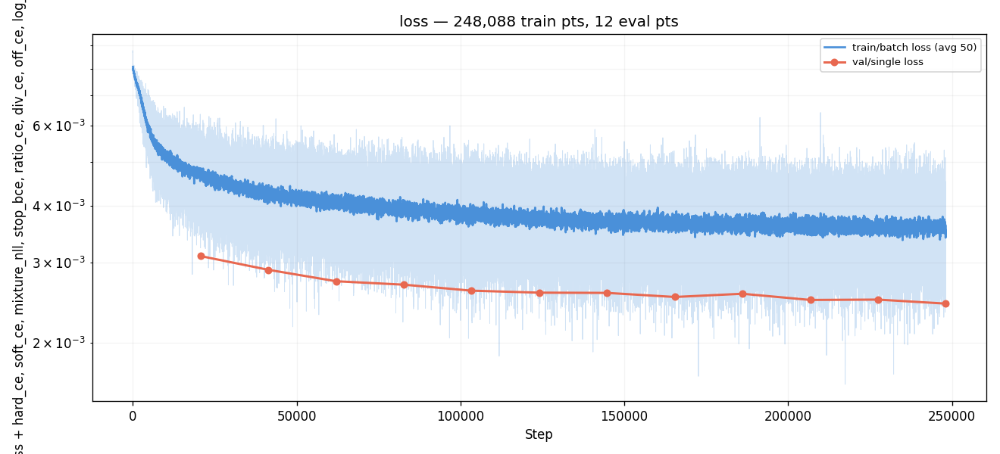

# Experiment 014 — Diffusion output head

## Status

`Planned`.

## Context

[#013](../013-conformer/) was the first trunk-architecture variation
in 143 experiments and confirmed that **+80 % parameters in the trunk
do not lift per-step val miss** [exp_013_conformer, step 227,414,
val/single/onset/miss = 0.2536; vs exp_007_time_stretch, same step,
val/single/onset/miss = 0.2493 → +0.43 pp regression]. Combined
with the [#011b](../011b-onset-disagreement/) cross-channel finding
that pairwise ODF unions can recover recall 0.9052
[011b-onset-disagreement/results/summary.json:pairwise.pairs.hfc_mel+spectral_flux.recall_union]
where the best single channel only reaches 0.7802 [same file],
and with [#007](../007-time-stretch/)'s, [#008](../008-log-emd/)'s,
[#010](../010-ratio-decomposition/)'s persistent `±log(2)` /
`±log(3)` ratio-banding ridges across three different loss
families, the active hypothesis is that the model frequently has
**multiple plausible answers** for a given cursor and the standard
softmax + cross-entropy head averages them rather than committing.

`±log(2)` ridges show up because at a given moment two different
beat-grids (e.g. an 8th-note grid and a 4th-note grid) are both
musically valid; argmax over the bin axis chooses one or splits the
mass. The "matches in top-K but not top-1" behavior documented in
taiko1 (`top-5 ≈ 95 %`) is the same shape from the metric side.

This experiment replaces the deterministic softmax head with an
**iterative diffusion head**. The trunk's cursor token is fed as
conditioning into a small denoiser that, over `T = 64` training
timesteps, learns to denoise a noised one-hot bin target back to a
clean `(B, 501)` distribution. At inference, a DDIM sampler takes
4–32 steps starting from Gaussian noise and produces a final
`(B, 501)` logit vector; argmax decodes the bin offset. With
`n_samples > 1` the sampler is run multiple times from independent
initial noise and the resulting softmax distributions are averaged
("mean of softmax") before argmax.

The motivation is the standard one for diffusion: tasks where the
same input has multiple valid outputs are exactly where averaging in
a single-shot softmax under-performs and iterative refinement helps,
because the sampler can commit to one mode per draw rather than
hedging across modes. (Ho et al. 2020; Han et al. 2022 specifically
for classification.)

## Citations

- Direct baseline: [#007 — TimeStretch](../007-time-stretch/). Best
  val miss 0.2406 [exp_007_time_stretch, step 372,132,
  val/single/onset/miss], best AR `matched_rate` 0.7061
  [exp_007_time_stretch, step 413,480,
  infer_corpus/eval_413480/gt_cond/comparisons_summary.json:fields.matched_rate.median],
  best AR `error_median_ms` 8 [same file:fields.error_median_ms.median].
  Same dataset (`taiko2_v1`, 80 mel rows), same trunk, same loss
  recipe up to the head. Only the head + loss change here.
- Best AR-corpus result so far: [#012](../012-onset-channels/),
  best `matched_rate` 0.7080 [exp_012_onset_channels, step 308,550,
  infer_corpus/eval_308550/gt_cond/comparisons_summary.json:fields.matched_rate.median].
  #012 attacks the *input* axis (sub-band SF channels) — orthogonal
  to #014's *output* axis; the two could stack later.
- Capability evidence motivating "multiple modes per cursor":
  - [#005 — Gaussian-CE](../005-gaussian-ce/), [#007](../007-time-stretch/),
    [#008 — Log-EMD](../008-log-emd/) and the
    [#010](../010-ratio-decomposition/) family all left intact
    `±log(2)` and `±log(3)` ratio-banding ridges in the prediction
    heatmaps. Three different loss-side families (trapezoid,
    Gaussian, log-EMD) failed to compress them.
  - [#011b — onset disagreement](../011b-onset-disagreement/):
    cross-group ODF pairs recover `recall_union ≈ 0.91`, single
    channels max ~0.78. The "right answer is in the candidate set;
    the head can't pick it" pattern.
  - taiko1's exp 65-S2v2b structural floor at ~16 % "audio + context
    paths miss the same onsets" [taiko1 exp 65-S2v2b](../../../taiko/experiments/experiment_65_s2v2b/)
    — invariant across loss / arch swaps.
- Cross-experiment record: [`PERFORMANCE.md`](../../PERFORMANCE.md).
- External:
  - [Denoising Diffusion Probabilistic Models (Ho, Jain, Abbeel,
    NeurIPS 2020)](https://arxiv.org/abs/2006.11239) — DDPM, the
    original. Forward q-process, noise-prediction loss.
  - [Denoising Diffusion Implicit Models (Song, Meng, Ermon, ICLR
    2021)](https://arxiv.org/abs/2010.02502) — DDIM, the
    deterministic / few-step sampler used at inference.
  - [Improved Denoising Diffusion Probabilistic Models (Nichol &
    Dhariwal, ICML 2021)](https://arxiv.org/abs/2102.09672) —
    cosine schedule (Sec. 3.2). Used here.
  - [Progressive Distillation for Fast Sampling of Diffusion Models
    (Salimans & Ho, ICLR 2022)](https://arxiv.org/abs/2202.00512) —
    introduces the v-parameterization. Listed as a registered
    parameterization, not used in the first run.
  - [Efficient Diffusion Training via Min-SNR Weighting Strategy
    (Hang et al., ICCV 2023)](https://arxiv.org/abs/2303.09556) —
    Min-SNR γ=5. Reported as a diagnostic metric; flag for the
    follow-up if the SNR-weighted variant decouples from
    unweighted.
  - [CARD: Classification and Regression Diffusion Models (Han,
    Zheng & Zhou, NeurIPS 2022)](https://arxiv.org/abs/2206.07275)
    — the closest published reference for diffusing a categorical
    output conditioned on features. Confirms the design's
    architectural sketch (small denoiser MLP conditioned on a
    learned representation of the input) is viable on classification
    targets.
  - [Argmax Flows and Multinomial Diffusion (Hoogeboom et al.,
    NeurIPS 2021)](https://arxiv.org/abs/2102.05379) — true discrete
    diffusion. Listed for completeness; #014 starts with the simpler
    Gaussian-on-one-hot continuous design and leaves D3PM-style
    discrete diffusion to a follow-up if continuous proves
    insufficient.

---
<!--
Everything above this divider may be written freely.
Everything between the two dividers is PRE-RUN and must be filled
BEFORE the run. Do not edit it afterwards — use the amendment rule.
-->
─────────────────────────────────────────────────────────────────────

## Hypothesis

### Claim

If the deterministic `Linear(384, 501) + Conv1d_smooth` softmax head
in [#007](../007-time-stretch/)'s `EventEmbeddingDetector` is
replaced by an iterative diffusion head (cosine schedule with
`T = 64`, x0-parameterized continuous Gaussian process on a scaled
one-hot target, 3-layer MLP denoiser conditioned on the cursor
token, DDIM sampler with 16 inference steps + `eta = 0` at decode
time) — everything else identical (same trunk, same dataset, same
augmentations, same optimizer / schedule) — then **AR
`matched_rate` will reach a best value at least 1.0 pp above #007's
0.7061** (i.e. ≥ 0.716) **and** **`±log(2)` ratio-banding ridges
will visibly compress in the per-eval prediction heatmap** at the
best eval, because the iterative refinement lets the model commit
to one mode per draw instead of averaging across competing modes,
and `n_samples > 1` aggregation (mean-of-softmax) marginalizes
which mode is chosen rather than hedging in logit space.

### Mechanism

Three effects, stacked:

1. **Iterative commitment.** A single forward pass through a
   softmax head outputs a single `(501,)` distribution. When two
   bins are equally plausible, gradient descent under cross-entropy
   pushes both up — that's the source of the `±log(2)` /
   `±log(3)` ridges visible in [#007](../007-time-stretch/)'s,
   [#008](../008-log-emd/)'s, and [#010](../010-ratio-decomposition/)'s
   heatmaps. A DDIM sampler that takes `T_inf = 16` steps over a
   noisy x_t starting from `x_T ~ N(0, I)` instead navigates a
   reverse trajectory; small initial perturbations push it toward
   one mode, larger toward another. With `eta = 0` the trajectory
   is deterministic given x_T, so per-draw mode-picking is what
   makes diffusion useful here.
2. **Per-step diagnostic at training time.** The training loss
   reports per-t-quartile MSE (`loss/per_t_q0..3`). If the model
   learns the easy (low-t, near-clean) regime quickly but lags
   on the hard (high-t, near-prior) regime, that's directly
   observable — the existing softmax head has no analogue.
   `argmax_match` (the predicted-x_0-at-sampled-t argmax matching
   the GT bin) gives a per-eval scalar comparable to the existing
   `onset/exact` metric.
3. **Marginalization across initial noise.** With `n_samples > 1`
   the sampler is run independently from `n_samples` different
   `x_T` draws and the resulting softmax distributions are
   averaged. If the model represents two competing modes
   (`t = 100` and `t = 200`, say), independent draws will pick
   each in proportion to the model's belief, and the averaged
   softmax recovers the bimodal shape — argmax then commits to
   the heavier mode. The `n_samples = 1` baseline is the apples-
   to-apples comparison with #007's deterministic softmax; the
   `n_samples = 4` post-run ablation tests the marginalization
   benefit.

The rationale for each design choice:

- **Cosine schedule, T = 64.** Linear schedules waste capacity on
  the very-noisy end (Nichol & Dhariwal 2021 Sec. 3.2). T = 64 is
  on the small end for image generation but matches CARD-class
  classification setups where the target is much lower-dimensional
  (501 bins vs 32×32×3 = 3072). Trades off training compute (each
  forward only sees one sampled t per sample) against denoiser
  capability across the schedule.
- **x0-parameterization with `x0_scale = 2.0`.** The denoiser
  predicts a clean one-hot target directly. Scaling the one-hot to
  ±1 (peak = +2, off-bins = 0) gives the loss MSE values around
  the same magnitude as the noise std, which keeps gradient
  magnitudes balanced across t. Noise-parameterization is registered
  as an alternative; left for a follow-up if x0 underperforms.
- **3-layer MLP denoiser, `hidden_dim = 1536`.** Concat-and-MLP is
  the cheapest viable architecture; a transformer denoiser is the
  obvious upgrade if expressivity is the bottleneck. 7.34 M
  denoiser params on top of the 16.35 M trunk = 23.70 M total
  [computed by instantiating `DiffusionDetector(config)` with
  `experiments/014-diffusion/config/model.json` and summing
  `p.numel() for p in m.parameters()`], +45 % vs #007's 16.35 M.
  This is closer to #013's +80 % than to #012's flat parameter
  count; the param-count confound is real and noted below.
- **DDIM 16 steps `eta = 0` at inference.** 16 << 64 to keep AR
  inference tractable (every cursor advance does 16 denoiser
  forwards × 1 batch sample × 1 sampler call); deterministic so
  the same seed → same chart. Reduced-step DDIM ablation runs
  post-hoc via `cli.diffusion_sampler_ablation`.

### Predicted numbers

Reference: [#007](../007-time-stretch/) at its best AR-corpus eval
(step 413,480) and best per-step val (step 372,132); also #012's
best AR.

| Metric | #007 best | #012 best | Predicted (#014, mature eval) | Notes |
|---|---:|---:|---:|---|
| AR `matched_rate` (gt_cond, median) | 0.7061 | 0.7080 | **≥ 0.716** | must-have, ≥ +1 pp above #007; new taiko2 best |
| AR `error_median_ms` | 8 | 8 | 8 | likely tied at the 5 ms grid; iterative head doesn't sharpen frame-level placement |
| AR `dc_human` | 92.81 | 91.89 | ≥ 92.0 | density consistency should hold |
| AR `hi_pspace` | 90.40 | 89.4 | ≥ 90.0 | should hold |
| val/single/diff/argmax_match (≈ exact) | n/a (different metric) | n/a | ≥ 0.55 | per-step, at sampled t — not directly comparable to #007's `exact` 0.5748 because #014 has noise injected |
| training stable, no NaN | yes | yes | yes | macaron didn't destabilize #013; denoiser MLP is well-studied |
| train_noaug → val gap @ best eval | −2.62 pp (#012) / −3.50 pp (#007) | −2.62 pp | −2.5 to −3.5 pp | watch — capacity bump risks more overfit |

Observational (not gated):

- **Per-t-quartile loss** (`loss/per_t_q0..3`). Shape expectation:
  q0 (low-t, near-clean) drops fastest, q3 (high-t, near-prior)
  lags. If they all drop together, the model is using the cursor
  token everywhere; if q3 stays flat, the prior end of the
  schedule is uninformative and we'll know to revisit T or the
  schedule shape. No hard cutoff — diagnostic only.
- **`±log(2)` ridges in the prediction heatmap.** Direct test of
  the "iterative commitment compresses ridges" hypothesis. Compare
  side-by-side against #007's E18 heatmap. Ridges visibly weaker =
  hypothesis confirmed; same intensity = the bottleneck is not
  hedging in logit space and we'll know to look elsewhere.
- **AR sampler ablation grid.** Post-run, run
  `cli.diffusion_sampler_ablation` over the `config/ablation_matrix.json`
  variants (DDIM `T_inf ∈ {4, 8, 16, 32}`, `eta ∈ {0, 1}`,
  `n_samples ∈ {1, 4}`, plus DDPM-64 reference). Two questions:
  (a) where's the steps / quality knee? (b) does `n_samples = 4`
  marginalization beat `n_samples = 1` by ≥ 0.5 pp on `matched_rate`?

### Param-count flag (open question)

Diffusion-head on top of #007 trunk has **23.70 M params** vs
#007's **16.35 M** (+45 %, computed as above). The denoiser MLP
adds 7.34 M; the trunk is unchanged. As with [#013](../013-conformer/),
if #014 wins this run alone won't tell us whether the win is from
(a) the diffusion machinery (iterative commitment + multi-sample
marginalization), or (b) just having extra parameters in the head.

A **matched-param softmax baseline** (replace the diffusion head
with a 7.34 M Linear-Smooth-MLP head, same trunk, same training
recipe, same loss family equivalent) would disambiguate. Flagged
for follow-up if #014's `matched_rate` lift exceeds the must-have
threshold; not blocking for #014 itself.

The result is reported both as absolute and as Δ vs #007 so the
comparison stays honest.

## Success criteria

- **Must have:** AR `matched_rate` ≥ 0.716 at the best AR-corpus
  eval (≥ +1.0 pp above #007's 0.7061; ≥ +0.8 pp above #012's
  0.7080).
- **Must have:** training stable, no NaN, no Inf, runs to E20+.
  Loss curve descends through E5; per-t-quartile loss curves all
  trend down (any flat or rising bucket is a fails-if).
- **Must have:** `±log(2)` ratio-banding ridges in the
  predicted-x_0 heatmap at the best eval are visibly weaker than
  #007's at matched compute (qualitative — judged by side-by-side
  PNG inspection by the human reviewer; recorded with both heatmaps
  side-by-side under `graphs/`).
- **Must have:** train_noaug → val gap not materially worse than
  #007's −3.50 pp at best eval (−4.0 pp is the fails-if line).
- **Nice-to-have:** AR `matched_rate` ≥ 0.725 — clear architectural
  win that justifies escalating to a transformer denoiser or to
  D3PM-style discrete diffusion.
- **Nice-to-have:** `n_samples = 4` mean-of-softmax beats
  `n_samples = 1` by ≥ 0.5 pp on `matched_rate` (post-run ablation).
- **Nice-to-have:** AR `error_median_ms` ≤ 8 (matches the all-time
  best); diffusion is not expected to *sharpen* per-frame placement
  but shouldn't regress it either.
- **Fails if:** AR `matched_rate` < 0.700 at every eval after E10
  — diffusion head hurt vs #007.
- **Fails if:** train_noaug → val gap > 4 pp at any post-warmup
  eval — head capacity overfits.
- **Fails if:** loss diverges or any per-t-quartile bucket stays
  flat for the first 10 evals — denoiser is not learning the
  schedule end uniformly; would invalidate the "iterative
  refinement" mechanism.
- **Fails if:** AR inference wall-clock is > 8× #007's at the same
  step (16-step DDIM × 1 sample = ~16× theoretical denoiser cost,
  but the trunk is shared and the denoiser is small; in practice
  expect ~3–5× #007). > 8× makes the post-run ablation runtime
  prohibitive.

## Changes from baseline

Baseline: [#007 — TimeStretch](../007-time-stretch/).

- **New domain ABCs.** `domain/diffusion.py` (new) — four ABCs:
  `NoiseSchedule[Config]`, `DiffusionProcess[Config]`,
  `DenoiserHead[Config]` (an `nn.Module` ABC), `DiffusionSampler[Config]`.
  Each ABC has its own `*Config` dataclass; concrete configs go
  in the `diffusion/` sub-package.
- **Reference concrete diffusion components.**
  `diffusion/schedules.py`, `diffusion/processes.py`,
  `diffusion/denoisers.py`, `diffusion/samplers.py` (all new).
  Concrete classes: `LinearSchedule` and `CosineSchedule`,
  `GaussianContinuousProcess` (x0 / noise / v parameterizations),
  `MLPDenoiser`, `DDPMSampler`, `DDIMSampler`. 53 unit tests in
  `tests/test_diffusion.py` cover ABC enforcement, schedule
  monotonicity, process round-trips per parameterization,
  denoiser shape + grad, sampler timestep generation + sample
  shape + reproducibility.
- **Model.** `models/diffusion_detector.py` (new) —
  `DiffusionDetector(EventEmbeddingDetector)`. Subclass that
  inherits the trunk unchanged from `EventEmbeddingDetector`
  (conv stem, audio + event mixer, 8 × Transformer encoder layers
  with per-layer FiLM) and replaces the parent's softmax head with
  a `(NoiseSchedule, DiffusionProcess, DenoiserHead)` triple
  selected by sub-config `__class__` strings. The parent's
  `head_proj` / `head_smooth` / `head_norm` modules remain in the
  parameter dict but receive zero gradient — leaving them in
  preserves the parent's signature and lets shared trunk code
  paths run unchanged. The model exposes two forward methods:
  `predict(input)` returns just the cursor token (training fields
  None) for inference where the decoder runs the sampler; and
  `forward_diffusion(cursor_token, target_bin)` does the full
  training-step sampling of `t`, `noise`, `x_t`, denoiser forward,
  and decoded predicted-x_0-at-sampled-t logits.
- **Loss.** `training/diffusion_loss.py` (new) — `DiffusionLoss`.
  MSE or Huber on the structured `DiffusionModelOutput`, optional
  Min-SNR weighting (γ = 5.0), STOP-class multiplier
  `stop_weight = 1.5` (matches `OnsetLoss` convention).
  Reports diagnostic metrics `loss/per_t_q0..3`,
  `loss/snr_weighted`, `argmax_match`, `stop_rate`. The trainer's
  loss-binding step also calls `loss.bind_schedule(model.schedule.alphas_cumprod())`
  so SNR is computable as a metric even when not used as the
  loss weighting.
- **AR decoder.** `inference/autoregressive/diffusion_decoder.py`
  (new) — `DiffusionDecoder(ARDecoder[..., DiffusionModelOutput])`.
  Constructs lazily via a `bind_model(model)` hook called by
  `inference.spec.assemble_predictor` after the model is loaded;
  picks the concrete sampler class from a registry keyed on
  `sampler_config` type. `decode()` runs `sampler.sample(cursor_token)`
  to get final logits, optionally aggregates `n_samples`
  independent draws via mean-of-softmax, then argmaxes (or
  categorical-samples, configurable via `decode_strategy`).
- **`inference/spec.py`.** Added the `if hasattr(decoder,
  "bind_model"): decoder.bind_model(model)` hook in both
  `assemble_predictor` and `assemble_predictor_with_model`. Pure
  no-op for `ArgmaxDecoder` and `MdnDecoder`.
- **Post-run ablation runner.** `cli/diffusion_sampler_ablation.py`
  (new). Reads `config/infer.json` + `config/ablation_matrix.json`,
  applies per-variant sampler/decoder overrides, runs
  `inference.corpus.run_infer_corpus` per variant on a fraction
  of val, writes per-variant subdirectories + an aggregate
  `summary.csv` / `summary.json`. Decoupled from training; runs
  once after the run completes, against `runs/exp_014_diffusion/checkpoints/best.pt`.
- **Tests.** `tests/test_diffusion.py` (53 tests, ABCs and
  reference concretes) and `tests/test_diffusion_detector.py`
  (20 tests, model + loss + decoder + spec.bind_model + JSON
  round-trip). 458 / 458 passing as of pre-run.
- **Configs.** `config/model.json` switches the model
  `__class__` to
  `osu.taiko2.models.diffusion_detector:DiffusionDetectorConfig`
  with the full schedule / process / denoiser sub-configs inline.
  `config/loss.json` switches to `DiffusionLossConfig`. Trainer
  watches `loss` rather than `onset/miss` because the per-step
  metrics rely on `argmax_match`-at-sampled-t which is a noisy
  proxy for the inference-time prediction; the AR-corpus
  `matched_rate` is the canonical headline metric and is reported
  per eval via the `InferCorpusHook`.
  `config/infer.json` switches the decoder to `DiffusionDecoder`
  with a 16-step `DDIMSamplerConfig` (`eta = 0`, `n_samples = 1`).
  `config/data.json`, `config/adapter.json` are byte-identical to
  #007's. `config/ablation_matrix.json` is new.

## Run config

- Run name: `exp_014_diffusion`.
- Config snapshots: [`config/`](./config/).
- Dataset: `taiko2_v1` (80-row mel; same as #007 / #013).
- Command:
  ```bash
  osu/taiko2/.venv/Scripts/python.exe -m osu.taiko2.cli.train \
      --run-name exp_014_diffusion \
      --config-dir osu/taiko2/experiments/014-diffusion/config \
      --dataset taiko2_v1 --device cuda \
      --time-stretch-prob 0.3 --time-stretch-max-scale 1.4 \
      --benchmarks all --benchmark-fraction 0.05 \
      --train-noaug-fraction 0.05 \
      --infer-corpus-spec osu/taiko2/experiments/014-diffusion/config/infer.json \
      --infer-corpus-config osu/taiko2/configs/infer_corpus_per_eval.json
  ```
- Post-run ablation:
  ```bash
  osu/taiko2/.venv/Scripts/python.exe -m osu.taiko2.cli.diffusion_sampler_ablation \
      --base-spec osu/taiko2/experiments/014-diffusion/config/infer.json \
      --matrix osu/taiko2/experiments/014-diffusion/config/ablation_matrix.json \
      --dataset taiko2_v1 \
      --out-dir osu/taiko2/experiments/014-diffusion/ablations
  ```

─────────────────────────────────────────────────────────────────────
<!--
POST-RUN. Do not fill until the run completes.
Everything below comes from real measurements, not predictions.
-->
─────────────────────────────────────────────────────────────────────

## Results summary

### Final vs baseline

| Metric | Baseline (exp 007) | This run (final) | Δ | Direction |
|---|---:|---:|---:|:---:|
| AR matched_rate | 0.7061 | — | — | — |
| AR error_median_ms | 8 | — | — | — |
| val/single/loss | (CE — not directly comparable) | — | — | — |
| train_noaug gap @ best | −3.50 pp | — | — | — |

Final eval: eval step `{n}`, wall time `{hh:mm}`, epochs `{k}`.

### Per-eval progression

{One row per eval. Include every metric the trainer reported.
Generated from `runs/exp_014_diffusion/metrics.jsonl`.}

| Eval | Step | val/single/loss | val/single/diff/argmax_match | val/single/diff/loss/per_t_q0 | val/single/diff/loss/per_t_q1 | val/single/diff/loss/per_t_q2 | val/single/diff/loss/per_t_q3 | AR matched_rate | AR error_median_ms | wall_time |
|---:|---:|---:|---:|---:|---:|---:|---:|---:|---:|---:|
| 1 | — | — | — | — | — | — | — | — | — | — |

Machine-readable copies (both tables): [`metrics.json`](./metrics.json).

## Visualizations


*Training loss over steps (log-y).*


*AR `matched_rate` across evals — the watched metric.*

{Add custom graphs as needed — per-t-quartile loss curves, AR
matched_rate vs sampler steps, ratio_error heatmap with #007 side-by-
side, per-`n_samples` quality curves, etc. Each gets a numbered file
in `graphs/` and a one-sentence caption here.}

## Custom analyses (optional)

- [Sampler ablation matrix](custom/sampler_ablation/) — post-run
  results from `cli.diffusion_sampler_ablation` over
  `config/ablation_matrix.json`. CSV + summary table of `matched_rate`
  / `error_median_ms` / inference wall-clock per variant.

## Vs prediction

- AR `matched_rate` ≥ 0.716: predicted +1.0 pp above #007 → actual `{Δ}` → **{match / beat / miss / wrong direction}**
- `±log(2)` ridges visibly compress: predicted yes → actual `{…}` → **{…}**
- training stable / no NaN: predicted yes → actual `{…}` → **{…}**
- AR `error_median_ms` ≤ 8: predicted tied → actual `{…}` → **{…}**
- train_noaug gap ≤ −3.5 pp at best eval: predicted yes → actual `{…}` → **{…}**
- AR `matched_rate` ≥ 0.725 (nice): predicted yes → actual `{…}` → **{…}**
- `n_samples = 4` ≥ +0.5 pp over `n_samples = 1` (nice, post-run): predicted yes → actual `{…}` → **{…}**

{One-paragraph summary. Reject the hypothesis here if applicable; put
the *why* in Takeaways.}

## Takeaways

- {One concrete sentence.}
- {Next.}
- {No retrofitting — label surprises as "unexpected: …".}

## Followup questions

- {Question.} — {suggested next experiment or dataset probe}
- {Question.} — {…}
