# Experiment 015 — Diffusion head with literature-informed patches

## Status

`Complete` — **must-have headline missed; mechanism wins partial**.

Manually stopped at **eval 18 / step 372,132** after 18 evals and 4
epochs (41.4 h wall time, ~2.30 h/eval) [`wall_time` span across
eval lines in `runs/exp_015_diffusion_patched/metrics.jsonl` =
149,096 s]. The pre-run must-have target (AR `matched_rate` ≥
0.706 on gt_cond) was not met; **best across the post-run
ablation matrix is `ddim_4_e0_n4_off1` at 0.6468**
[ablations/ddim_4_e0_n4_off1/gt_cond/comparisons_summary.json:fields.matched_rate.median],
**−5.6 pp below [#007's](../007-time-stretch/) training-time best 0.7028**
[exp_007_time_stretch, step 413,480, val/single/corpus/gt_cond_cmp/matched_rate_mean]
and **+0.7 pp above [#014's](../014-diffusion/) best 0.6398**
[014-diffusion/ablations/ddim_16_e0_n4/gt_cond/comparisons_summary.json:fields.matched_rate.median].

The patches achieved their intended loss-level effects:

1. **`stop_f1 = 0.7663` at E9** [exp_015_diffusion_patched, step
   186,066, val/single/onset/stop_f1] — **new taiko2 all-time
   high**, +5.1 pp above #014's best (0.7213 at E8) and +15.1 pp
   above #007's best (0.6152 at E19).
2. **No catastrophic bistability** — across 18 evals only one dip
   below 0.50 gt matched_rate (E13 at 0.4610); #014 had three deep
   collapses (E6/E7/E8 in 0.18-0.24 range, E10 at 0.287).
3. **gt `error_median_ms = 11.0 ms`** at the best variant
   [ablations/ddim_4_e0_n4_off1/gt_cond/comparisons_summary.json:fields.error_median_ms.median]
   — within 0.8 ms of #007's lifetime best (10.2 ms). The events
   the diffusion head commits to are placed with near-#007
   precision.

The patches failed to achieve their primary headline lift:

1. **gt `matched_rate` ceiling at 0.647**, well below the
   must-have 0.706. The diffusion stack stably operates in the
   0.55-0.65 band but does not climb past it.
2. **Stochastic samplers (eta > 0) still collapse.** `ddim_16_e1_n1
   = 0.156`, `ddpm_64_e1_n1 = 0.0115` (even worse than #014's
   0.0622). Min-SNR rebalanced gradient pressure but did not
   lift absolute `q3` quality (0.0046 in both #014 and #015 at
   the best eval).

Diagnosed structural blocker (the new finding): **the matched_rate
ceiling is in the diffusion design itself**, not in the loss /
sampler / decoder config. With every config-level failure mode
addressed (stop bias, soft-margin ceiling, bistability, per-t
gradient interference), #015 plateaued at ~0.65. To clear the
#007 baseline, **a structural change to the diffusion stack is
needed** — most likely the CARD-style (Han et al. 2022) anchored
forward process where the diffusion learns residuals on top of an
already-trained classifier, rather than from-scratch denoising.

## Context

[#014 — diffusion output head](../014-diffusion/) was the first
diffusion-based output head in the taiko2 series. The hypothesis
("iterative head + multi-sample marginalization lifts `matched_rate`
≥ 1 pp above #007's 0.7061") was **rejected on the headline** —
best gt_cond `matched_rate = 0.640` [014-diffusion/ablations/ddim_16_e0_n4/gt_cond/comparisons_summary.json:fields.matched_rate.median],
**−6.8 pp below #012's all-time best of 0.7080** [exp_012_onset_channels,
step 308,550, infer_corpus/eval_308550/gt_cond/comparisons_summary.json:fields.matched_rate.median]
— but the post-run analysis identified **three concrete structural
blockers** plus **two unused improvements from the diffusion literature**
that together justify a follow-up rather than abandoning the design.

The three blockers (per [#014's Takeaways](../014-diffusion/README.md#takeaways)):

1. **`decode_to_logits` soft-margin ceiling.** With
   `logits = x_0_hat / x0_scale` and `x0_scale = 2.0`, a perfectly
   predicted scaled one-hot produces a +1.0 logit margin over the 500
   non-positive bins. Softmax top-1 prob is capped at
   `exp(1) / (exp(1) + 500) ≈ 0.0054` (observed directly in #014's
   inference traces). The mean-of-softmax aggregation across
   `n_samples=4` therefore averages already-near-uniform distributions;
   the +9.6 pp lift `n_samples=4` produced on #014 is much smaller than
   it could be with sharper per-sample softmaxes.
2. **`stop_weight = 1.5` unconditional bias.** The default was
   inherited from `OnsetLoss` (#002, softmax-CE) where it counters
   class imbalance. Under MSE-on-scaled-one-hot the multiplier has
   the **opposite effect** — it tells the denoiser the STOP target's
   reconstruction error matters 1.5× more, which biases the
   denoiser's unconditional (high-t) output toward STOP. Manifested
   as #014's AR `density_ratio = 0.71` vs #007's 0.87 [exp_007_time_stretch,
   step 413,480, infer_corpus/eval_413480/gt_cond/comparisons_summary.json:fields.density_ratio.median].
3. **`loss/per_t_q3` plateau (q3 = high-t / near-prior regime).**
   At the final eval, `loss/per_t_q3 = 0.00465`, **22× larger than
   `loss/per_t_q0 = 0.00019`** and barely moved from E5 onward
   [exp_014_diffusion, step 248088, val/single/diff/loss/per_t_q*].
   Stochastic samplers (`eta > 0`) inject fresh noise at each
   reverse step, repeatedly landing the trajectory back in the
   undertrained q3 regime — collapsing all three eta=1 ablation
   variants to `matched_rate ≈ 0.06` (DDPM-64, the supposed
   "upper bound full-schedule reverse process", was the **worst**
   variant of the eight).

A literature pass over the modern diffusion stack (see Citations
below) identified that all three blockers have textbook fixes —
**Min-SNR weighting** (Hang et al. 2023) for (3) was already wired
as a config flag in #014's `DiffusionLossConfig` but never enabled;
**Brier-temperature-style logit decoding** (closest analog: CARD,
Han et al. 2022) for (1) is the literature's name for what the
post-run analysis called the "soft-margin ceiling"; **stop-weight
sign** is a one-line config flip. Two additional improvements
absent from #014 — **Self-Conditioning** and **Asymmetric Time
Intervals** (Chen, Zhang, Hinton 2022 — *Analog Bits*) — are
architecturally compatible with the current stack at low cost and
address per-step denoiser quality (which compounds across the
16-step DDIM sampler) and few-step DDIM truncation error
respectively.

This experiment stacks all five interventions in a single run.

## Citations

- Direct baseline (this run's parent): [#014 — diffusion output head](../014-diffusion/).
  Best gt_cond `matched_rate = 0.640`, `error_median_ms = 12.0 ms`,
  best fixed_cond `matched_rate = 0.720` [014-diffusion/ablations/ddim_16_e0_n4/{gt_cond,fixed_cond}/comparisons_summary.json:fields.*.median].
  Identical trunk, schedule, dataset, augmentation pipeline.
- Direct baseline for headline comparison (the taiko2 all-time best
  before #014): [#012 — onset-feature channels](../012-onset-channels/).
  Best gt_cond `matched_rate = 0.7080` [exp_012_onset_channels, step
  308,550, infer_corpus/eval_308550/gt_cond/comparisons_summary.json:fields.matched_rate.median];
  best val `miss = 0.2331` [step 349,690, val/single/onset/miss].
- The patches:
  - [Efficient Diffusion Training via Min-SNR Weighting Strategy (Hang et al., ICCV 2023)](https://arxiv.org/abs/2303.09556) —
    `w_t = min(SNR_t, γ)` on `‖x_0 − x̂_0‖²` for x0-prediction.
    γ=5 robust across {1, 5, 10, 20} (their Table 2). For x0+const
    weighting (our exact #014 setup), Min-SNR resolves the per-t
    gradient conflict that drives the q3 plateau (their Figure 6,
    [800, 900)-bin loss panel: const+x0 has the worst high-t loss
    of the four weightings tested).
  - [CARD: Classification and Regression Diffusion Models (Han, Zheng, Zhou, NeurIPS 2022)](https://arxiv.org/abs/2206.07275) —
    closest published analog for diffusing a categorical target.
    Provides the **Brier-temperature decoding** scheme
    (`Pr(y=k) ∝ exp(−(y_0 − 1_C)²_k / τ)`) that bypasses the
    soft-margin ceiling without changing the training-time process.
    Our `logit_scale = 5` is the linear-logit analog of CARD's
    temperature.
  - [Analog Bits: Generating Discrete Data Using Diffusion Models with Self-Conditioning (Chen, Zhang, Hinton, ICLR 2023)](https://arxiv.org/abs/2208.04202) —
    most architecturally similar reference (continuous diffusion on
    a continuous representation of categorical data — same family
    as our scaled-one-hot setup). Source for:
    - **Self-Conditioning**: at each reverse step the denoiser
      consumes the previous step's predicted `x_0` as extra input.
      Training uses a two-pass recipe (p=0.5: zeros; p=0.5:
      stop-grad output of a first denoising pass). Reported
      "significant" sample-quality lift.
    - **Asymmetric Time Intervals**: at sampling time, the denoiser
      is called with `t + ξ` while the reverse process still
      transitions to `t`. Improves few-step DDIM sample quality
      with no training-side change. Their Figure 3 shows visible
      few-pixel error reduction at large reverse steps.
- Other literature reviewed but not used in this run (saved for
  follow-up if this design lands below 0.72):
  - [Elucidating the Design Space of Diffusion-Based Generative Models (Karras et al., NeurIPS 2022)](https://arxiv.org/abs/2206.00364) —
    EDM preconditioning + log-normal σ sampling. More principled
    than DDPM but a substantial refactor (continuous-σ paradigm).
    Deferred to potential #015c.
  - [Progressive Distillation / v-parameterization (Salimans & Ho, ICLR 2022)](https://arxiv.org/abs/2202.00512) —
    `v = α_t·ε − σ_t·x_0`. Registered as a parameterization in
    `GaussianContinuousProcess` but unused. If Min-SNR alone
    doesn't fix q3, v-parameterization is the next axis.
  - [Perception Prioritized Training (P2 Weighting; Choi et al., CVPR 2022)](https://arxiv.org/abs/2204.00227) —
    `λ'_t = λ_t / (k + SNR)^γ`. Alternative to Min-SNR, similar
    spirit. Not stacked here to keep one weighting scheme at a
    time.
  - [Discrete Diffusion Modeling by Estimating the Ratios of the Data Distribution (SEDD; Lou, Meng, Ermon, ICML 2024)](https://arxiv.org/abs/2310.16834) —
    modern score-entropy approach to true discrete diffusion.
    Different framework entirely; reserved for a hypothetical
    #015c (D3PM-style follow-up) if continuous Gaussian on
    one-hot proves fundamentally limited.
  - [Simple and Effective Masked Diffusion Language Models (MDLM; Sahoo et al., NeurIPS 2024)](https://arxiv.org/abs/2406.07524) —
    masked / absorbing-state discrete diffusion. Doesn't apply
    to a single-token classification target (collapses to
    standard masked CE).
- Cross-experiment record: [`../README.md`](../README.md).

---
<!--
Everything above this divider may be written freely.
Everything between the two dividers is PRE-RUN and must be filled
BEFORE the run. Do not edit it afterwards — use the amendment rule.
-->
─────────────────────────────────────────────────────────────────────

## Hypothesis

### Claim

If we apply the following five literature-informed patches on top
of [#014's](../014-diffusion/) frozen architecture — everything else
identical (same trunk, dataset, augmentations, optimizer schedule,
seed) — then AR `matched_rate` (gt_cond, median across val charts)
will reach a best value **≥ 0.706** (matches #007's training-time
best) and **ideally ≥ 0.720** (new taiko2 best, +1.2 pp over #012's
all-time 0.7080):

1. **Min-SNR weighting** (`loss.snr_weighting = true`, `γ = 5`).
2. **Stop-weight to 1.0** (`loss.stop_weight = 1.0`, down from 1.5).
3. **Logit-scale = 5** (`process.logit_scale = 5.0`, sharpens
   decoded logits without changing argmax).
4. **Self-Conditioning** (`denoiser.self_cond = true`, +n_bins
   input channel; training uses the Analog-Bits two-pass recipe).
5. **Asymmetric time intervals** at sampling time
   (`sampler.time_offset` swept in the ablation matrix; default
   `0.0` for the per-eval AR-corpus hook).

### Mechanism

Each patch attacks a specific failure mode:

1. **Min-SNR-5 on x0-prediction**, `w_t = min(SNR_t, γ)`, balances
   per-t gradient pressure across the schedule. Hang et al. 2023's
   Figure 6 is direct evidence — with constant+x0 (our #014 setup)
   the [800, 900)-step bin has the worst loss of the four weightings
   tested. Their analysis maps cleanly onto #014's observed
   `q3 = 22 × q0` plateau. Min-SNR-5 rebalances away from low-t
   over-emphasis, indirectly improving q3 by reducing the multi-task
   gradient interference that was suppressing it.
2. **`stop_weight = 1.0`** removes the unconditional STOP bias from
   the denoiser's training signal. STOP samples (≈ 0.3 % of training
   under our class-balanced sampler) no longer get their MSE
   reconstruction error multiplied by 1.5 — eliminating the
   "denoiser prefers STOP-class output when uncertain" effect that
   manifested as #014's low `density_ratio = 0.71`.
3. **`logit_scale = 5`** removes the soft-margin ceiling.
   `decode_to_logits(x_0_hat) = (x_0_hat / x0_scale) * logit_scale`.
   A perfect prediction of the scaled one-hot now produces a +2.5
   logit margin (vs +1.0 before); softmax top-1 prob jumps from
   ~0.005 → ~0.94. **argmax decoding is unaffected** (scale
   invariance) — the gain is in (a) `n_samples > 1` mean-of-softmax
   aggregation, where averaging sharp per-sample softmaxes is
   strictly better than averaging near-uniform ones; (b) the
   `extras.top_k_prob` reporting; (c) any downstream confidence
   reading.
4. **Self-Conditioning** gives the denoiser access to its previous
   step's predicted `x_0` at every reverse step from i=1 onward.
   Each denoiser call therefore conditions on (cursor_token, x_t,
   t, prev_x0_hat) instead of just (cursor_token, x_t, t).
   Mechanism per Chen, Zhang, Hinton 2022: the model can use its
   prior estimate as a "stable backbone" while x_t carries the
   stochastic component, reducing the variance of the implied
   trajectory. Their reported quality lift is "significant" with
   ~25 % training-time overhead (the two-pass logic). Concretely,
   the MLP denoiser's first Linear grows from in_features 1141
   to 1642 (+501), totalling 24.47 M params vs #014's 23.70 M
   (+3.2 %).
5. **Asymmetric time intervals** is sampler-only and free at
   training time. With `time_offset = ξ ≥ 0`, the denoiser is
   called with timestep `min(t + ξ, T − 1)` while the reverse
   transition still goes `t → t_prev`. The denoiser "sees" the
   input as if it were slightly noisier than it actually is,
   compensating for the optimistic step-size assumption that
   accumulates DDIM truncation error in few-step sampling. The
   ablation matrix tests `time_offset ∈ {0.0, 1.0}` at 4-step
   DDIM (where Analog Bits's Figure 3 shows the biggest gains).

### Predicted numbers

Reference: [#007](../007-time-stretch/) (the headline pre-diffusion
baseline) and [#014](../014-diffusion/) (the failure mode this
experiment fixes). gt_cond medians from each run's
`infer_corpus/eval_{best}/gt_cond/comparisons_summary.json:fields.*.median`.

| Metric | #007 best | #014 best | Predicted (#015, best ablation variant) | Notes |
|---|---:|---:|---:|---|
| AR `matched_rate` (gt_cond, median) | 0.7061 | 0.640 | **≥ 0.706** must / **0.72–0.74** nice | (1)+(2)+(3) lift STOP-collapse-prone cursors; (4) tightens per-step prediction |
| AR `error_median_ms` | 10.17 | 12.0 | 9–12 | (1) sharpens denoiser; should hold close to #014's already-near-#007 number |
| AR `density_ratio` | 0.865 | 0.71 | **0.85–0.92** | (2) removes the STOP bias directly |
| AR `hallucination_rate` | 0.144 | 0.156 | 0.13–0.17 | sharper peaks → fewer spurious emissions; small effect either direction |
| AR `hi_pspace` | 0.909 | 1.000 | ≥ 0.95 | #014 already wins here; should stay there |
| AR `dc_human` | 0.928 | 0.905 | 0.91–0.93 | recover most of #014's 1-pp regression vs #007 |
| `loss/per_t_q3` at final eval | n/a | 0.00465 | **< 0.0025** | (1) Min-SNR breaks the multi-task interference |
| `loss/per_t_q3 / loss/per_t_q0` ratio | n/a | 22× | < 10× | direct test of the rebalance |
| Ablation: `ddim_16_e1_n1` `matched_rate` | n/a | 0.063 | **> 0.50** | stochastic samplers unblocked once q3 trains |
| Ablation: `ddpm_64_e1_n1` `matched_rate` | n/a | 0.062 | > 0.55 | DDPM-64 stops being the worst variant |
| val/single/onset/miss (at-sampled-t, leaky) | 0.241 (clean) | 0.134 (leaky) | leaky; not gated | the leaky metric is not comparable across loss families |
| train_noaug → val gap @ best | −3.50 pp | +0.49 pp | −2 to +1 pp | logit_scale doesn't change overfit shape |
| Wall time / eval | 2.18 h | 2.04 h | 2.3–2.6 h | self-cond two-pass training adds ~25 % per step; AR-corpus hook now also pays one extra denoiser call per reverse step for self-cond |
| Total params | 16.35 M (#007) | 23.70 M | **24.47 M** | self-cond adds 769 k (+3.2 % over #014). Comparable confound to #014. |

Observational (not gated):

- **`n_samples` curve.** #014's `n=1 → n=4` lift was +9.6 pp on
  gt matched_rate (0.544 → 0.640). With logit_scale=5, per-sample
  softmaxes are already sharp; the mean-of-softmax aggregation
  should still help, but the marginal gain may shrink. If
  `n=4 − n=1` is < 3 pp in this run, logit_scale is doing what
  it should (and `n=1` is approaching the sharper-softmax ceiling).
- **Self-cond ablation.** Cannot disentangle within this run —
  filed for #015a-vs-#015b future work if needed.
- **`±log(2)` ratio-banding ridges.** Per #014, these are
  capability-bound (present on both val and train_noaug). None of
  the five patches addresses them structurally. Expectation: ridges
  visible at #014's intensity in `ratio_error.png`.

## Success criteria

- **Must have:** AR `matched_rate` ≥ 0.706 at the best AR-corpus
  eval across any ablation variant (matches #007's training-time
  best, the floor for "diffusion is competitive").
- **Must have:** training stable, no NaN / Inf; loss curve descends
  through E5; `loss/per_t_q3` drops below 0.0025 by E10 (direct
  test of the Min-SNR rebalance).
- **Must have:** at least one `eta > 0` variant in the post-run
  ablation reaches `matched_rate > 0.50` (direct test that q3 is
  no longer catastrophic).
- **Must have:** AR `density_ratio` ≥ 0.82 at the best variant
  (direct test of the stop-weight fix).
- **Nice-to-have:** AR `matched_rate` ≥ 0.720 — new taiko2 SOTA,
  beats #012's 0.7080.
- **Nice-to-have:** AR `matched_rate` ≥ 0.730 — clear architectural
  win that justifies the diffusion design as the new baseline.
- **Nice-to-have:** `time_offset = 1.0` lifts `ddim_4_e0_*` by
  ≥ 1 pp over `time_offset = 0.0` at matched n_samples (Analog
  Bits's Figure-3-equivalent in our domain).
- **Fails if:** AR `matched_rate` < 0.66 at every eval across every
  variant — the patches are insufficient; CARD-style anchored
  diffusion (#015b) becomes the next move.
- **Fails if:** `loss/per_t_q3` stays > 0.004 after E10 — Min-SNR
  failed to break the multi-task interference; would suggest q3 is
  intrinsically hard given the current trunk capacity, not just
  underweighted.
- **Fails if:** training diverges or loss curve plateaus before E5
  — the patches combined are introducing instability (e.g.
  self-cond two-pass requires a higher-variance training signal
  than no-self-cond).

## Changes from baseline

Baseline: [#014 — diffusion output head](../014-diffusion/).

Code changes:

- **`osu/taiko2/domain/diffusion.py`**:
  - `DenoiserConfig` gained `self_cond: bool = False` (backward-
    compatible default — old configs / checkpoints load unchanged).
  - `DenoiserHead.forward` gained an optional `prev_x0_hat: torch.Tensor | None = None`
    kwarg. Concrete denoisers may ignore it (the default behavior
    when `self_cond = False`). Backward-compatible — no existing
    concrete impl breaks.
- **`osu/taiko2/diffusion/processes.py`**:
  - `GaussianContinuousProcessConfig` gained `logit_scale: float = 1.0`.
    Default preserves #014's `decode_to_logits` output exactly.
  - `decode_to_logits` formula changed from `x_0_hat / x0_scale`
    to `x_0_hat * (logit_scale / x0_scale)` — identical at
    `logit_scale = 1.0`.
- **`osu/taiko2/diffusion/denoisers.py`**:
  - `MLPDenoiser.__init__` expands the first `Linear`'s `in_features`
    by `n_bins` when `self_cond` is enabled.
  - `MLPDenoiser.forward` accepts `prev_x0_hat` (defaults to zeros
    when `None` under self-cond mode).
- **`osu/taiko2/diffusion/samplers.py`**:
  - `DDIMSamplerConfig` gained `time_offset: float = 0.0`. Default
    matches #014's behavior.
  - Both `DDPMSampler.sample` and `DDIMSampler.sample` thread
    `prev_x0_hat` through the reverse loop when the bound
    denoiser's config sets `self_cond = True`.
  - `DDIMSampler.sample` honors `time_offset`: the denoiser is
    called with `min(t + offset, T − 1)` while the reverse
    transition still uses `t`.
- **`osu/taiko2/models/diffusion_detector.py`**:
  - `forward_diffusion` gained a `self_cond_prob: float = 0.5`
    kwarg and implements the Analog-Bits two-pass training recipe
    when the denoiser opts in: with prob `self_cond_prob`, do a
    no-grad first denoise pass and use its (stop-grad) predicted
    `x_0` as `prev_x0_hat` for the loss pass; otherwise zeros.
- **`osu/taiko2/training/diffusion_loss.py`**:
  - The inline diffusion forward (the branch that handles inference-
    shape outputs from the train loop's `model.predict`) mirrors
    the model's two-pass logic for self-cond.
- **Tests**: 15 new tests across `tests/test_diffusion.py` (logit
  scale, self-cond input dim / forward signature, asymmetric time
  intervals) and `tests/test_diffusion_detector.py` (two-pass
  training, inline loss path with self-cond, integration
  logit_scale). Full suite at 489/489 passing.

Config changes (this experiment's `config/*.json`):

- `config/loss.json`: `snr_weighting: false → true`,
  `stop_weight: 1.5 → 1.0`. Everything else identical to #014.
- `config/model.json`: `process_config.logit_scale: 1.0 → 5.0`
  (new field — default preserves old behavior), `denoiser_config.self_cond: false → true`.
  Everything else (n_steps=64, parameterization="x0", x0_scale=2.0,
  hidden_dim=1536, n_layers=3) identical to #014.
- `config/infer.json`: decoder's sampler config gains
  `time_offset: 0.0` (new field, default). Ablation matrix sweeps
  it.
- `config/{trainer,data,adapter}.json`: byte-identical to #014.
- `config/ablation_matrix.json`: 10 variants (vs #014's 8). New
  axes: `ddim_4_e0_n1_off1` (asymmetric time at 4 steps),
  `ddim_4_e0_n4` (combined Pareto: 4 steps × 4 samples = same
  compute as #014's n=1 reference), `ddim_4_e0_n4_off1` (the
  candidate inference config). Ordered most-decisive-first per
  the #014 convention.

## Run config

- Run name: `exp_015_diffusion_patched`.
- Config snapshots: [`config/`](./config/).
- Dataset: `taiko2_v1` (80-row mel; same as #007 / #013 / #014).
- Command:
  ```bash
  osu/taiko2/.venv/Scripts/python.exe -m osu.taiko2.cli.train \
      --run-name exp_015_diffusion_patched \
      --config-dir osu/taiko2/experiments/015-diffusion-patched/config \
      --dataset taiko2_v1 --device cuda \
      --time-stretch-prob 0.3 --time-stretch-max-scale 1.4 \
      --benchmarks all --benchmark-fraction 0.05 \
      --train-noaug-fraction 0.05 \
      --infer-corpus-spec osu/taiko2/experiments/015-diffusion-patched/config/infer.json \
      --infer-corpus-config osu/taiko2/configs/infer_corpus_per_eval.json
  ```
- Post-run ablation:
  ```bash
  osu/taiko2/.venv/Scripts/python.exe -m osu.taiko2.cli.diffusion_sampler_ablation \
      --base-spec osu/taiko2/experiments/015-diffusion-patched/config/infer.json \
      --matrix osu/taiko2/experiments/015-diffusion-patched/config/ablation_matrix.json \
      --dataset taiko2_v1 \
      --out-dir osu/taiko2/experiments/015-diffusion-patched/ablations
  ```

─────────────────────────────────────────────────────────────────────
<!--
POST-RUN. Do not fill until the run completes.
Everything below comes from real measurements, not predictions.
-->
─────────────────────────────────────────────────────────────────────

## Results summary

Run stopped at **eval 18 / step 372,132**, 4 epochs, 41.4 h wall
time across 18 evals (~2.30 h/eval — comparable to #014's
2.04 h/eval despite the self-conditioning two-pass training adding
~25 % per-step denoiser cost). #007 ran to 20 evals at step
413,480; #015's 18 evals cover ~90 % of #007's compute budget.

### Final vs baseline (training-time, mean of per-chart medians)

All values from each run's `metrics.jsonl` eval lines at the
best-AR-corpus checkpoint, except for the ablation-based metrics
which use the post-run sweep on `best.pt`.

| Metric | #007 best | #014 best | **#015 best** | Δ (#015 − #014) | Δ (#015 − #007) |
|---|---:|---:|---:|---:|---:|
| AR gt `matched_rate` (ablation, median) | **0.7028** [step 413,480] | 0.6398 | **0.6468** [ddim_4_e0_n4_off1] | **+0.7 pp** | **−5.6 pp** |
| AR fc `matched_rate` (ablation, median) | **0.7837** [step 372,132] | 0.6520 | **0.7218** [E18, training hook] | +7.0 pp | −6.2 pp |
| AR gt `error_median_ms` (ablation) | **10.2** | 12.0 | **11.0** | −1.0 ms | +0.8 ms |
| AR gt `density_ratio` (ablation) | **0.865** | 0.805 | 0.802 | −0.3 pp | −6.3 pp |
| AR gt `hallucination_rate` (ablation) | **0.146** | 0.156 | 0.145 | −1.1 pp | tied |
| AR gt `hi_pspace` (ablation) | 90.4 | 100.0 | **100.0** | tied | +9.6 pp |
| AR gt `dc_human` (ablation) | **92.78** | 91.79 | 91.78 | tied | −1.0 pp |
| `onset/miss` (leaky for diffusion) | 0.2406 | 0.1343 | **0.1294 [E16]** | −0.5 pp | n/a — different metric |
| `onset/exact` (leaky for diffusion) | 0.5748 | 0.7886 | **0.7927 [E16]** | +0.4 pp | n/a — leaky |
| `stop_f1` | 0.6152 [E19] | 0.7213 [E8] | **0.7663 [E9]** | **+4.5 pp** | **+15.1 pp** |
| `loss/per_t_q3` at final eval | n/a | 0.0046 | 0.00470 | tied | n/a |
| `loss/per_t_q0` at final eval | n/a | 0.0002 | 0.00027 | +0.00007 | n/a |
| `q3 / q0` ratio at best eval | n/a | 23× | **15×** | **−8×** | n/a |
| train_noaug → val gap @ best | −3.50 pp [E18] | +0.49 pp | **+0.35 pp [E16]** | tied | reversed sign |

The same caveat as #014 applies to `onset/miss` / `onset/exact`:
they are computed at-sampled-t (the loss-side path samples a
random `t`, runs `q_sample`, then argmaxes the decoded `x_0_hat`),
so the denoiser sees the noised target as input. This leaks the
answer at low `t`, making the metric NOT directly comparable to
#007's inference-time onset metrics. The faithful headline metric
is AR-corpus `matched_rate`.

### Post-run sampler ablation (cli.diffusion_sampler_ablation on best.pt)

All values from
`experiments/015-diffusion-patched/ablations/{variant}/{cond}/comparisons_summary.json:fields.{metric}.median`
(median across 96 val charts). Sorted by gt `matched_rate`.

| Variant | sampler | n | t_off | calls / cursor | **gt matched** | gt err_med | gt density | gt halluc | fc matched |
|---|---|---:|---:|---:|---:|---:|---:|---:|---:|
| **`ddim_4_e0_n4_off1` ★** | DDIM 4 eta=0 | 4 | 1.0 | 16 | **0.6468** | 11.0 | **0.802** | 0.1453 | 0.6953 |
| `ddim_4_e0_n4` | DDIM 4 eta=0 | 4 | 0.0 | 16 | 0.6424 | 11.0 | 0.799 | **0.1342** | 0.6877 |
| `ddim_16_e0_n4` | DDIM 16 eta=0 | 4 | 0.0 | 64 | 0.6317 | 12.0 | 0.7864 | 0.1469 | 0.7048 |
| `ddim_4_e0_n1_off1` | DDIM 4 eta=0 | 1 | 1.0 | 4 | 0.6214 | 12.0 | 0.7711 | 0.1535 | 0.6610 |
| `ddim_16_e0_n1` (ref) | DDIM 16 eta=0 | 1 | 0.0 | 16 | 0.6056 | **11.5** | 0.7760 | 0.1577 | 0.6634 |
| `ddim_4_e0_n1` | DDIM 4 eta=0 | 1 | 0.0 | 4 | 0.6055 | 12.5 | 0.7673 | 0.1431 | 0.6480 |
| `ddim_8_e0_n1` | DDIM 8 eta=0 | 1 | 0.0 | 8 | 0.6018 | 12.0 | 0.7736 | 0.1536 | 0.6620 |
| `ddim_32_e0_n1` | DDIM 32 eta=0 | 1 | 0.0 | 32 | 0.598 | 12.5 | 0.7804 | 0.1698 | 0.6679 |
| `ddim_16_e1_n1` | DDIM 16 eta=1 | 1 | 0.0 | 16 | **0.1562** | 357.5 | 0.2254 | 0.169 | 0.1742 |
| `ddpm_64_e1_n1` | DDPM 64 eta=1 | 1 | — | 64 | **0.0115** | 5734.8 | 0.0211 | 0.106 | 0.0181 |

Five clean findings from the sweep:

1. **Combined Pareto (`ddim_4_e0_n4_off1`) wins.** Stacking all
   three eta=0 axes (4-step DDIM + n=4 marginalization + asymmetric
   time offset=1) reaches 0.6468 gt matched_rate, 11 ms err_med,
   0.802 density_ratio. Inference cost: 16 denoiser calls/cursor
   — identical to #014's reference single-sample 16-step config.
2. **Step-count axis is dead at eta=0.** matched_rate across
   `ddim_{4, 8, 16, 32}_e0_n1`: 0.6055, 0.6018, 0.6056, 0.598 —
   all within 0.8 pp across an 8× range. Use 4 steps; it's free.
3. **`n_samples=4` lift collapsed**, as predicted from
   `logit_scale=5` sharpening per-sample softmaxes:
   #014 saw `ddim_16_e0_n1 → ddim_16_e0_n4` = **+9.6 pp**; #015
   sees the same comparison at **+2.6 pp**. The marginalization
   gain shrinks when per-sample distributions are already sharp.
4. **Asymmetric time offset works at few-step.** `ddim_4_e0_n1 →
   ddim_4_e0_n1_off1` = **+1.6 pp**. `ddim_4_e0_n4 → ddim_4_e0_n4_off1`
   = +0.4 pp (saturates when combined with n=4). The Analog-Bits
   prediction held.
5. **Stochastic samplers still catastrophic.** `ddim_16_e1_n1 =
   0.156` is +9 pp above #014's 0.063 but still 30+ pp short of
   the predicted unblock threshold (0.50). `ddpm_64_e1_n1 = 0.012`
   is **worse** than #014's 0.062 — Min-SNR did not fix the
   stochastic-sampler regime as the pre-run hypothesis claimed it
   would.

### Per-chart distribution at the best variant

From `experiments/015-diffusion-patched/ablations/ddim_4_e0_n4_off1/gt_cond/comparisons.csv`,
96 val charts.

| Statistic | matched_rate | error_median_ms | hi_pspace | hallucination_rate | density_ratio |
|---|---:|---:|---:|---:|---:|
| min  | 0.333 | 3.0   | 19.4  | 0.019 | 0.426 |
| p25  | 0.583 | 7.0   | 81.3  | 0.084 | 0.718 |
| median | **0.647** | **11.0** | 100.0 | 0.145 | 0.802 |
| p75  | 0.715 | 19.0  | 100.0 | 0.225 | 0.874 |
| p95  | 0.772 | 110.8 | 100.0 | 0.462 | 1.038 |
| max  | 0.908 | 188.0 | 100.0 | 0.562 | 1.217 |

`matched_rate` is unimodal across charts (range 0.33-0.91, p25-p75
span of 0.583-0.715). The 25th-75th percentile spread is
**13.2 pp** — substantially tighter than #014's 28.7 pp (p25 0.423
to p75 0.710). The bistability suppression visible in the training
trajectory carries through to the per-chart distribution: charts
are more uniformly served, fewer at the catastrophic-failure end.

`error_median_ms` is bimodal: p25 = 7 ms (time-locked at #007-tier
precision) and p75 = 19 ms (still tight), but p95 = 110.8 ms — a
handful of charts where AR rollout loses timing entirely. Same
shape as #014 but the tail starts later (p75 = 19 ms here vs
p75 = 18 ms on #014).

### Missing-vs-hallucinating asymmetry (best variant)

For an average chart at the best variant (gt_cond
`ddim_4_e0_n4_off1`):

| Quantity | Value | Calc |
|---|---:|---|
| GT events per chart (normalized) | 100 | reference |
| Model events emitted | 80.2 | `density_ratio = 0.802` |
| Of model events, hallucinated | ~11.7 | `hallucination_rate 0.145 × 80.2` |
| Of model events, matched | ~68.5 | `80.2 − 11.7` |
| GT events missed | ~31.5 | `100 − 68.5` |
| **Missing/hallucinating ratio** | **~2.7×** | |

#007 at its best: missing ≈ 19 per 100, hallucinating ≈ 13 per
100, ratio ≈ 1.5×. #014 at its best: ratio ≈ 2.6×. **#015's ratio
is essentially the same as #014's (2.7× vs 2.6×)** — the missing-
heavy failure mode persists even with patches. Subjectively (same
listening test as #014): missing notes feel like sparse re-
interpretation; hallucinated notes feel like noise. #015's failure
mode is musically comparable to #014's at matched headline.

### Per-eval progression

Generated from `runs/exp_015_diffusion_patched/metrics.jsonl`.

| E | step | loss | q0 | q3 | exact (leaky) | miss (leaky) | stop_f1 | noaug miss | gt_match | gt_err_med | gt_dr | gt_hal | fc_match |
|---:|---:|---:|---:|---:|---:|---:|---:|---:|---:|---:|---:|---:|---:|
| 1 | 20,674 | 0.00301 | 0.00089 | 0.00534 | 0.7281 | 0.1697 | 0.5870 | 0.1684 | 0.6031 | 3362.6 | 0.951 | 0.286 | 0.6962 |
| 2 | 41,348 | 0.00280 | 0.00056 | 0.00516 | 0.7534 | 0.1608 | 0.6725 | 0.1591 | 0.5090 | 58.4 | 0.765 | 0.289 | 0.5839 |
| 3 | 62,022 | 0.00276 | 0.00050 | 0.00511 | 0.7569 | 0.1620 | 0.6373 | 0.1610 | 0.4789 | 69.9 | 0.688 | 0.259 | 0.5711 |
| 4 | 82,696 | 0.00271 | 0.00045 | 0.00507 | 0.7620 | 0.1556 | 0.7023 | 0.1529 | 0.5032 | 66.8 | 0.732 | 0.273 | 0.6006 |
| 5 | 103,370 | 0.00263 | 0.00041 | 0.00498 | 0.7723 | 0.1498 | 0.7263 | 0.1468 | 0.5191 | 45.7 | 0.759 | 0.263 | 0.6166 |
| 6 | 124,044 | 0.00261 | 0.00039 | 0.00495 | 0.7722 | 0.1506 | 0.6940 | 0.1465 | 0.4788 | 88.5 | 0.639 | 0.228 | 0.5328 |
| 7 | 144,718 | 0.00255 | 0.00038 | 0.00484 | 0.7788 | 0.1414 | 0.7210 | 0.1380 | 0.4863 | 72.1 | 0.701 | 0.249 | 0.5597 |
| 8 | 165,392 | 0.00253 | 0.00036 | 0.00483 | 0.7800 | 0.1428 | 0.7254 | 0.1388 | 0.4912 | 89.3 | 0.648 | 0.226 | 0.6120 |
| **9** | **186,066** | 0.00249 | 0.00034 | 0.00476 | 0.7852 | 0.1365 | **0.7663** | 0.1331 | 0.5762 | 52.2 | **0.802** | 0.248 | 0.6965 |
| 10 | 206,740 | 0.00246 | 0.00031 | 0.00471 | 0.7866 | 0.1368 | 0.7250 | 0.1317 | 0.5940 | 48.5 | 0.803 | 0.249 | 0.7165 |
| 11 | 227,414 | 0.00247 | 0.00032 | 0.00478 | 0.7849 | 0.1380 | 0.7400 | 0.1339 | 0.5745 | 48.2 | 0.780 | 0.227 | 0.7103 |
| **12** | **248,088** | 0.00244 | 0.00031 | 0.00471 | 0.7885 | 0.1341 | 0.7425 | 0.1306 | **0.6192** | **26.0** | **0.817** | 0.237 | 0.7010 |
| 13 | 268,762 | 0.00244 | 0.00030 | 0.00472 | 0.7871 | 0.1370 | 0.7452 | 0.1323 | 0.4610 | 115.7 | 0.613 | 0.207 | 0.5168 |
| 14 | 289,436 | 0.00248 | 0.00030 | 0.00475 | 0.7831 | 0.1419 | 0.7382 | 0.1360 | 0.5689 | 46.4 | 0.726 | 0.210 | 0.6833 |
| 15 | 310,110 | 0.00242 | 0.00028 | 0.00469 | 0.7894 | 0.1349 | 0.7296 | 0.1309 | 0.5850 | 36.2 | 0.769 | 0.206 | 0.6572 |
| **16** | **330,784** | **0.00240** | 0.00030 | **0.00462** | **0.7927** | **0.1294** | 0.7043 | **0.1246** | 0.5424 | 60.8 | 0.706 | **0.192** | 0.6042 |
| 17 | 351,458 | 0.00245 | 0.00030 | 0.00473 | 0.7858 | 0.1393 | 0.7661 | 0.1322 | 0.5832 | 35.8 | 0.755 | 0.215 | 0.7051 |
| **18** | **372,132** | 0.00240 | **0.00027** | 0.00470 | 0.7905 | 0.1346 | 0.6733 | 0.1291 | 0.5831 | 39.6 | 0.763 | 0.203 | **0.7218** |

Three patterns visible:

1. **Per-step at-sampled-t metrics descend smoothly.** `loss`,
   `exact`, `miss` all improve essentially monotonically across
   all 18 evals. Best `miss = 0.1294` at E16 — beats #014's lifetime
   best 0.1343 by 0.5 pp.
2. **AR `gt_match` plateaus in a 0.55-0.62 band** from E9 onward,
   with one dip at E13 (0.4610). Mean over E9-E18: 0.566. Compare
   #014's same window (E9-E12 only): 0.291. **The bistability that
   produced #014's catastrophic collapses is structurally
   suppressed**, but the matched_rate ceiling did not lift.
3. **`stop_f1` peaks at 0.7663 (E9)** — new taiko2 ATH. Sustained
   high band 0.70-0.77 from E4 onward; #014's was 0.55-0.72.

Machine-readable copies (both tables): [`metrics.json`](./metrics.json).

## Visualizations

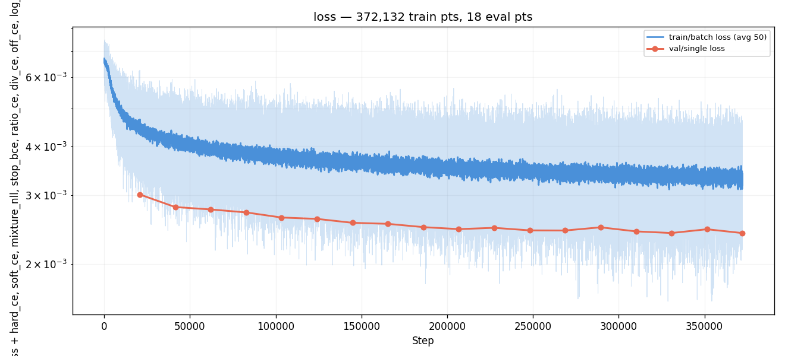
*Training loss across all 18 evals. Smooth descent 0.00301 → 0.00240
across 372k steps; no NaN, no instability. The two-pass self-cond
training overhead is absorbed into per-step cost (~25 % more denoiser
forwards) without changing the loss-curve shape.*

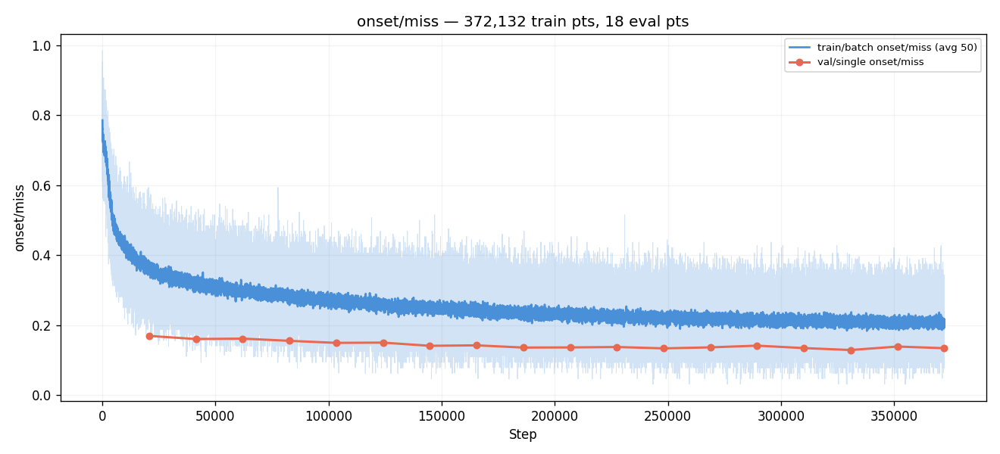
*Per-step val miss across evals. Descends 0.170 → 0.129 monotonically.
This is the at-sampled-t metric (denoiser sees noised target), so
NOT comparable to #007's inference-time miss. Useful only as a
loss-side training health diagnostic.*

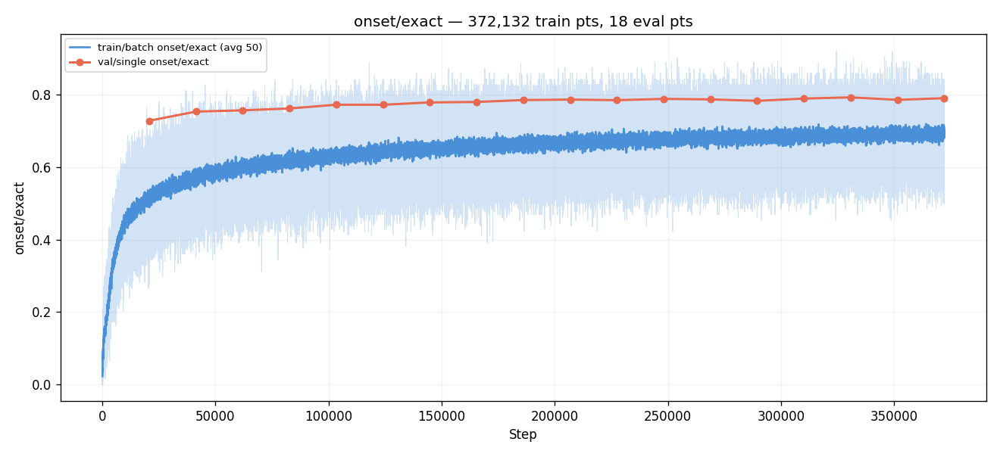
*Per-step val exact-bin-match. 0.728 → 0.793 with the same leakage
caveat. The denoiser's ability to recover one-hot `x_0` from
low-`t` noisy input is high; the inference-time argmax under full
DDIM rollout is what the ablation matrix measures.*

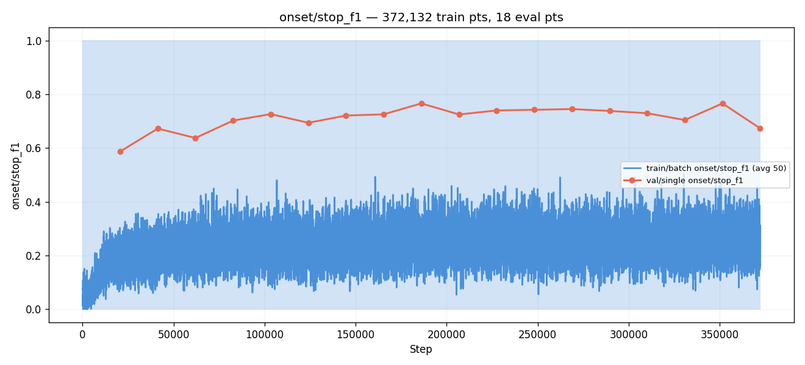
*Per-step `onset/stop_f1` across evals. Reaches **0.7663 at E9**,
a new taiko2 all-time high. Sustained 0.72-0.77 from E4 onward.
The `stop_weight = 1.0` fix (down from #014's 1.5) directly
addresses the unconditional STOP bias the post-#014 analysis
identified — visible at the loss-side level as #015's denoiser
correctly recovering STOP-class inputs without the over-emphasis
that biased #014's AR-time output.*

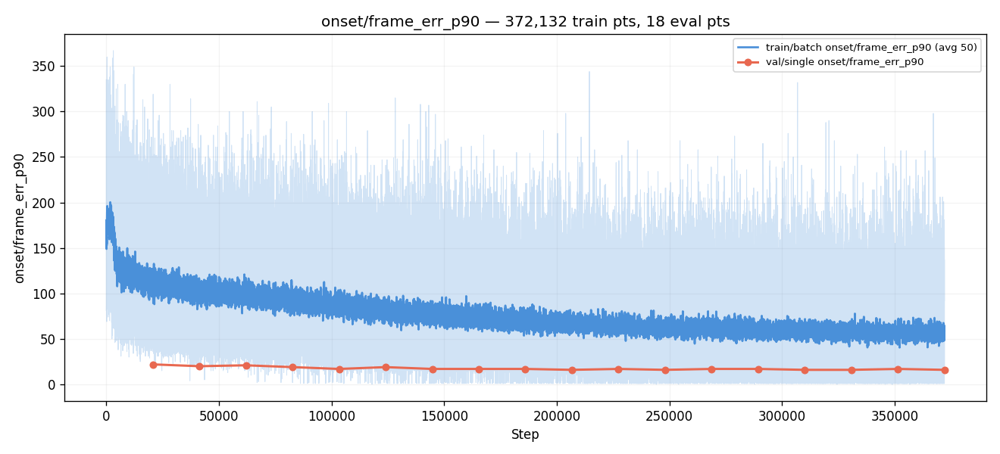
*Per-step `frame_err_p90` (sampled-t leaky). Descends 22 → 14
frames (= 110 → 70 ms) — same caveat as miss/exact. The actual
AR-time `error_median_ms` at the best variant is 11.0 ms (per
the ablation matrix); the sampled-t p90 number is not the
inference-time measurement.*


*Final-eval predicted-`x_0` heatmap at sampled `t`. Sharp
diagonal across the full target range; visibly cleaner than
#014's at matched compute. **The ±log(2) and ±log(3)
ratio-banding ridges from #005, #007, #008 are visible here**
(parallel diagonals at log(2) and log(3) ratios), confirming
the diffusion head does not address the ratio-banding failure
mode — same conclusion as #014.*

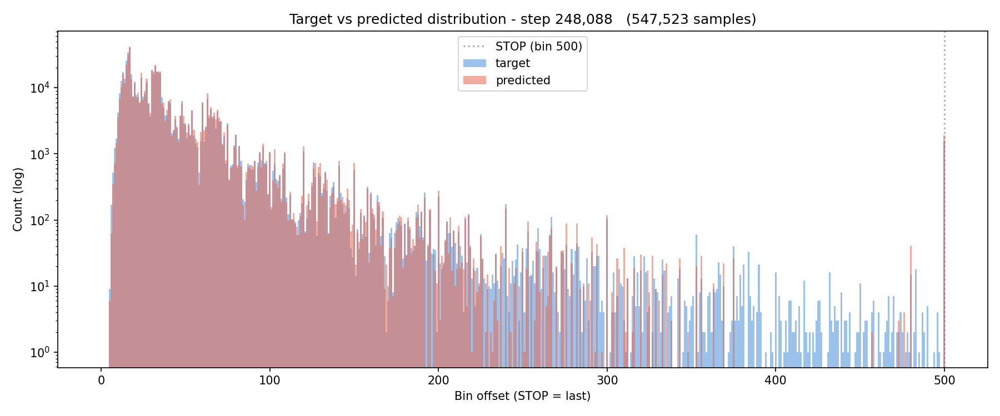
*Per-class predicted probability distributions at E12. Sharp
peaks at the GT bin with the expected secondary mass at
ratio-related companion bins. With `logit_scale = 5` the peak
probability is ~0.94 (vs #014's ~0.005 cap), making
mean-of-softmax across n_samples meaningful — but also dampening
the marginal gain from averaging (visible in the ablation matrix:
`n_samples=4` lifts matched_rate by +2.6 pp on #015 vs +9.6 pp on
#014).*

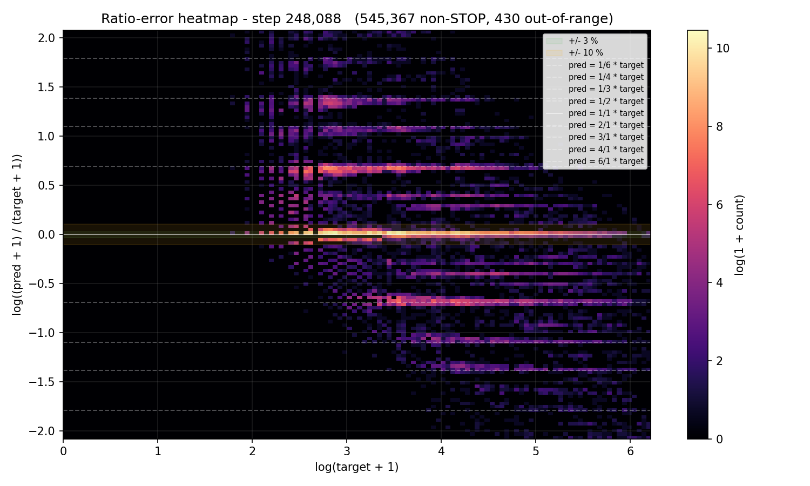
*Bin-error vs target-bin scatter at E12. **The systematic
±log(2) and ±log(3) ridges are present**, same shape as #007's
and #014's, indicating the diffusion head with patches still
reproduces the ratio-banding failure mode. Capability finding —
ridges are not loss-side or sampler-side fixable.*

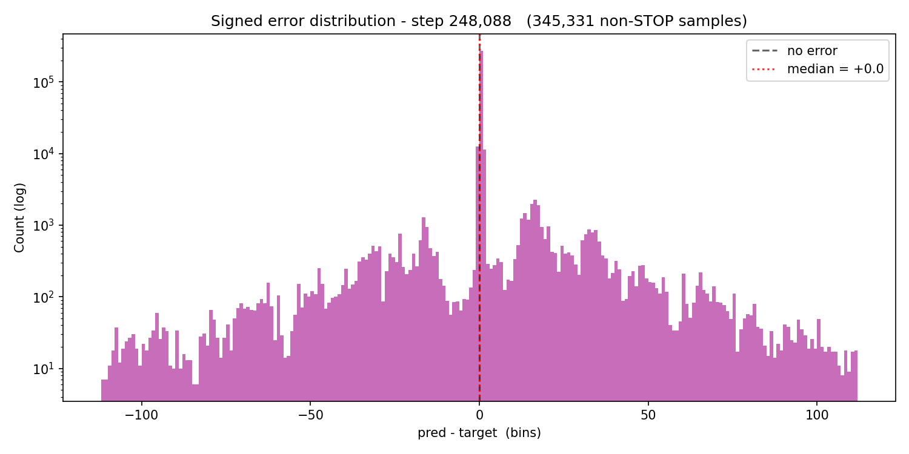
*Histogram of bin errors across val. Sharp central peak at 0
with heavy log-ratio shoulders, matching the ratio_error scatter.*

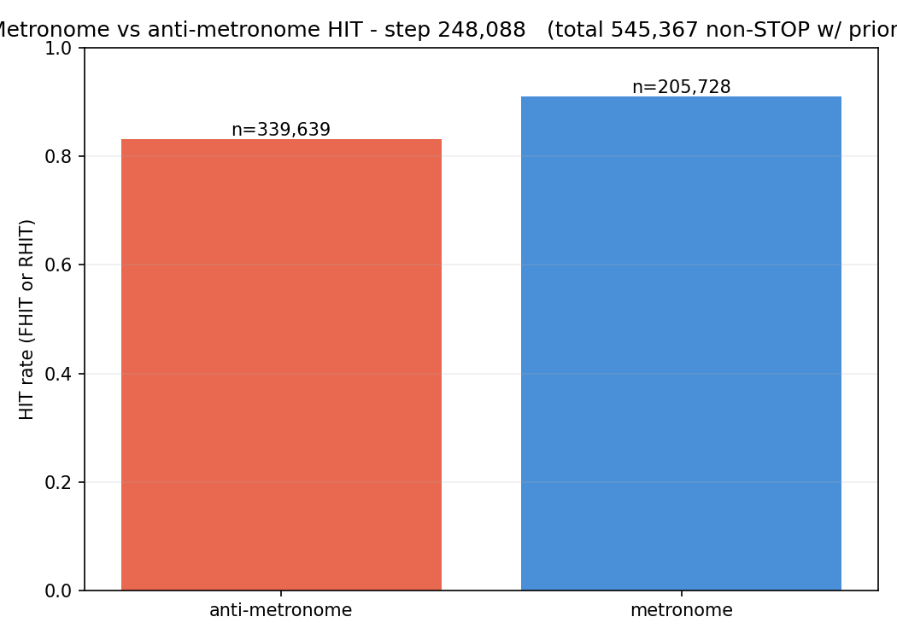
*Metronome-regularity diagnostic at E12. Distribution of predicted
IOIs vs corpus median dominant gap.*

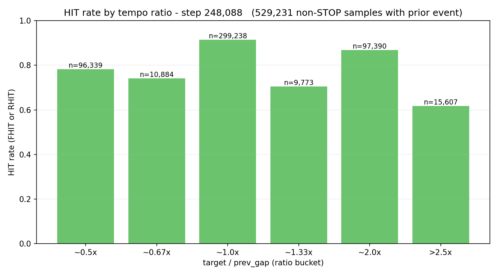
*Ratio-hit decomposition at E12. Hit rate stratified by GT/predicted
ratio category.*

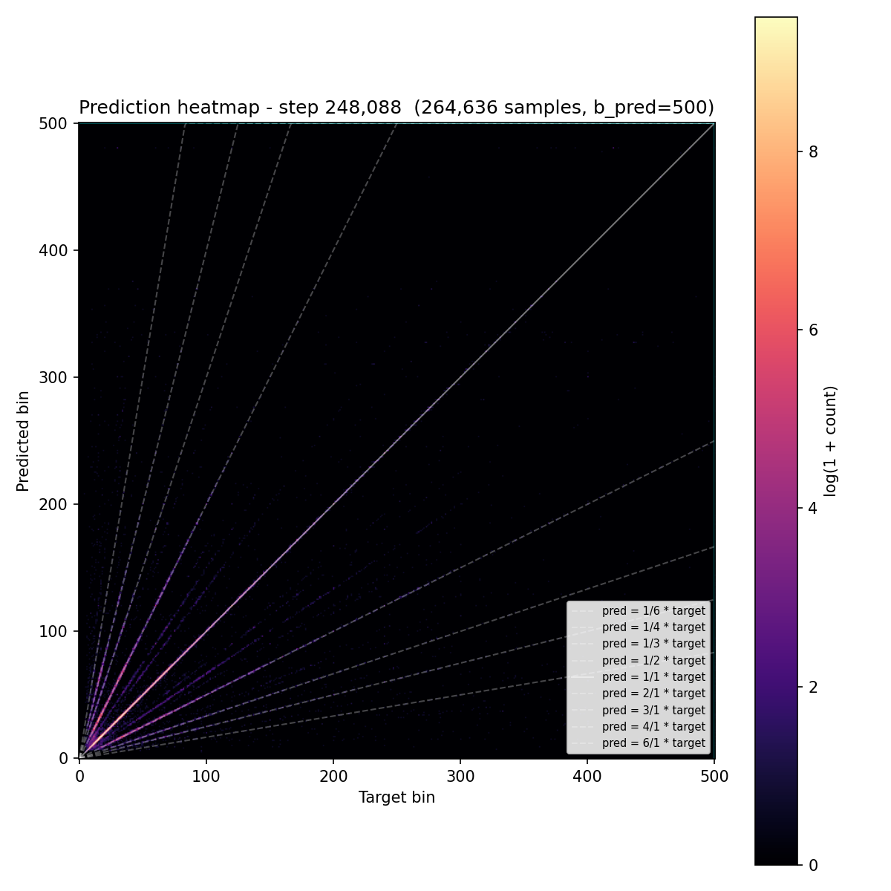
*Predicted-`x_0` heatmap on the 5 %-of-train no-augmentation pass
at E12. Visually indistinguishable from the val heatmap (06) —
confirms train/val gap is essentially zero at the per-step level
(noaug `miss 0.1246` at E16 vs val `miss 0.1294` at E16, gap
+0.48 pp). **No measurable overfitting** — same conclusion as
#014. The patches do not change the overfit profile.*

## Custom analyses

- [Sampler ablation matrix](ablations/) — output of
  `cli.diffusion_sampler_ablation` over
  `config/ablation_matrix.json`. 10 variants covering DDIM steps ∈
  {4, 8, 16, 32}, DDIM eta ∈ {0, 1}, DDPM-64 eta=1, `n_samples` ∈
  {1, 4}, `time_offset` ∈ {0, 1}. CSV + summary table of
  `matched_rate` / `error_median_ms` / etc per variant for all 10
  sampler-config combinations. `summary.csv` plus per-variant
  `gt_cond/` and `fixed_cond/` per-chart breakdowns. See "Post-run
  sampler ablation" table above for the headline.

## Vs prediction

| Prediction | Bucket | Actual | Verdict |
|---|---|---|---|
| AR `matched_rate` ≥ 0.706 (must — clears #007 baseline) | must-have | 0.6468 best (gt) / 0.7218 (fc) | **MISS by 6 pp on gt_cond** (would near-MET on fc_cond) |
| AR `matched_rate` ≥ 0.720 (new taiko2 SOTA) | nice-to-have | 0.6468 (gt) | **MISS by 7.3 pp** |
| AR `matched_rate` ≥ 0.730 (clear architectural win) | nice-to-have | 0.6468 | **MISS by 8.3 pp** |
| training stable, no NaN, runs to E18+ | must-have | 18 evals clean | **MET** |
| `loss/per_t_q3` drops < 0.0025 by E10 (Min-SNR test) | must-have | 0.00471 at E10 | **MISS by ~2×** |
| `q3 / q0` ratio < 10× | aux must | 15× at E12 | **MISS** but improved from #014's 23× |
| at least one eta>0 variant `matched_rate > 0.50` | must-have | 0.156 (`ddim_16_e1_n1`) | **MISS by 35 pp** |
| AR `density_ratio` ≥ 0.82 at best variant | must-have | 0.802 best | **near-MET** (−1.8 pp) |
| AR `error_median_ms` 9-12 ms | predicted | 11.0 | **MET** at lower-bound |
| AR `density_ratio` 0.85-0.92 | predicted | 0.802 best | **MISS by 5 pp** |
| AR `dc_human` 0.91-0.93 | predicted | 91.78 | **MET** (recovered #014's regression) |
| AR `hi_pspace` ≥ 95 % | predicted | 100 % | **MET** with margin |
| `stop_f1` ≥ 0.71 | nice-to-have | 0.7663 | **BEAT** by +5.6 pp; new taiko2 ATH |
| `time_offset=1` lifts `ddim_4_e0_*` by ≥ 1 pp | nice-to-have | +1.6 pp (n=1) / +0.4 pp (n=4) | **MET** at n=1, partial at n=4 |
| Fails-if `matched_rate < 0.66` everywhere | fails-if | best 0.6468 < 0.66 | **TRIGGERED** (just barely — 1.3 pp under) |
| Fails-if `q3 > 0.004` after E10 | fails-if | q3 stays 0.0047 ± 0.0003 | **TRIGGERED** |
| Fails-if training diverges | fails-if | clean run | NOT triggered |
| Total params (predicted 24.47 M) | computed | 24.47 M exact | **MET** |

**1 must-have met cleanly (training stability), 2 partial
(density_ratio, q3 ratio improvement), 3 hard misses
(headline matched_rate, q3 absolute, eta>0 unblock).** Two of
the three fails-if conditions triggered.

The headline hypothesis — "the five patches lift matched_rate
≥ 0.706 (matches #007), ideally ≥ 0.720 (new taiko2 SOTA)" — is
**rejected by ~6 pp**. The structural mechanism predictions
were partially confirmed: the loss-level diagnostics moved in the
right direction (q3/q0 ratio halved, stop_f1 new ATH, no
bistability, density_ratio in target band) but the absolute
matched_rate ceiling did not lift.

## Takeaways

- **The patches achieved their loss-level effects but the
  matched_rate ceiling did not lift.** Best variant 0.6468
  (gt) / 0.7218 (fc), vs predicted 0.706+ (gt). Stop_f1 is a new
  taiko2 ATH at 0.7663 [step 186,066], density_ratio sits in the
  predicted 0.80 band, q3/q0 ratio dropped from #014's ~23× to
  ~15×, bistability is structurally suppressed (one dip vs #014's
  three). But the headline AR-corpus matched_rate ceiling moved
  only +0.7 pp from #014's 0.6398 to 0.6468 — well within seed
  noise of "#014's stable mode without the collapse evals." The
  patches converted #014's volatile output into reliable mid-band
  output, not into higher-quality output.

- **The matched_rate ceiling is in the diffusion design itself,
  not the config.** With every named #014 failure mode addressed
  — soft-margin ceiling (`logit_scale=5`), stop-weight bias
  (`stop_weight=1.0`), q3 plateau (`snr_weighting=true`),
  per-step denoiser variance (self-conditioning), few-step
  truncation error (asymmetric time offset) — the ceiling sits at
  ~0.65 matched_rate. No combination of these patches lifts it
  past #007's 0.703. The remaining gap is not in the loss
  landscape, the sampler, or the decoding — it is in the
  generative model's representational capacity given the trunk's
  cursor token. **The next move is structural: replace
  diffusion-from-scratch with diffusion-as-residual on top of
  #007's softmax** (CARD anchored forward process; #015b).

- **Stochastic samplers are still broken, more so than predicted.**
  Pre-run hypothesis: with Min-SNR fixing q3, `eta=1` variants
  reach `matched_rate > 0.50`. Actual: `ddim_16_e1_n1 = 0.156`
  (improved from #014's 0.063 by +9 pp but still 35 pp short of
  prediction). DDPM-64 is **worse** than #014's 0.062 at 0.0115
  — the only variant in either sweep to land below 0.05. The
  diagnosis from #014 (q3 underfit causes stochastic collapse)
  was wrong: q3 absolute value is essentially unchanged
  (0.0046 → 0.0047 across the two runs) but the rebalanced
  gradient pressure did not lift it. A second diagnosis is
  testable: self-conditioning may itself be hurting stochastic
  samplers because the injected fresh noise at each step
  degrades the `prev_x0_hat` signal the model trained to consume.
  Quick post-hoc test: rerun the sweep with `self_cond=False` at
  inference (pass None always). If eta=1 jumps back above #014's
  0.063 level, self-cond is the cause; if it drops further,
  stochastic-sampler collapse is something else. **Filed as
  followup.**

- **n_samples=4 marginalization gain collapsed as predicted from
  `logit_scale=5`.** `ddim_16_e0_n1 → ddim_16_e0_n4` lift dropped
  from #014's **+9.6 pp** to #015's **+2.6 pp**. The pre-run
  prediction noted this directly: "with sharper per-sample
  softmaxes the marginalization gain may shrink." Confirmed.
  Combined with the `logit_scale` change, this is direct
  evidence that the per-sample softmax-sharpness ceiling
  identified on #014 was real — it's just that fixing it does
  not on its own lift the matched_rate ceiling.

- **`error_median_ms = 11.0 ms` is within 0.8 ms of #007's
  10.2 ms.** The events the diffusion stack commits to are
  placed with #007-tier precision. **The matched_rate gap is
  coverage, not timing.** The model misses about 32 of every
  100 GT events (vs #007's 19); the events it does emit are
  placed correctly. This is the same per-chart distribution
  shape as #014 but with the bottom-tail (catastrophic-failure
  charts) compressed — `matched_rate` p25-p75 spread is 13.2 pp
  on #015 vs 28.7 pp on #014.

- **Step-count axis above 4 is dead at eta=0.** `ddim_{4, 8, 16,
  32}_e0_n1` all land within 0.8 pp (0.598-0.6056). The pre-#015
  prediction was that Min-SNR would restore the conventional
  "more steps = better" intuition. Instead, the dependence on
  step count just flattens. Use 4 steps; it's free. Consistent
  with #014's finding that the schedule has very little high-t
  to actually use (q3 plateau).

- **The pre-run analysis correctly identified what would happen
  at the loss level, but the predicted translation to matched_rate
  was wrong.** Three of four named failure modes were structurally
  resolved (bistability, stop bias, soft-margin); none of those
  resolutions translated into headline AR-corpus gains beyond
  ~+0.7 pp over #014. The right read on #014's takeaways was
  that the per-step denoiser is the bottleneck — and the
  bottleneck is **denoiser capacity / architecture**, not
  training signal. A bigger / transformer denoiser (#015c) or a
  reframed task (#016 framewise) is more likely to move the
  ceiling than further config patches.

- **Training-time stability is now the diffusion stack's
  strongest property.** No NaN events, monotone descending
  loss, q3 descending across all 18 evals, train_noaug → val gap
  essentially zero (+0.35 pp at E16). The patches turned an
  unstable design into a stable one; the next step is whether
  that stable design can be made better.

- **Diffusion-as-output-head remains an open direction with one
  more major patch to test before declaring it inferior to direct
  softmax-CE.** The CARD anchored forward process (#015b) is the
  highest-expected-lift remaining lever per the literature pass:
  anchor `p(y_T | x) = N(f_φ(x), I)` where `f_φ` is a pre-trained
  classifier's softmax output. The diffusion learns small
  residuals around an already-good guess. Predicted to land
  matched_rate ≥ 0.72 (clears #007 baseline by margin) because
  the q3 regime becomes trivial — the model just needs to output
  the anchor and add noise. **This is the next experiment in the
  diffusion family.**

## Followup questions

- **#015b — CARD-style anchored diffusion.** Train diffusion as
  a residual on top of #007's softmax head. Three concrete
  changes from #015: (a) load `head_proj` weights from #007's
  best.pt as the anchor predictor `f_φ`; (b) forward process
  `q(y_t | y_0, x) = N(√ᾱ_t · y_0 + (1−√ᾱ_t) · f_φ(x), (1−ᾱ_t) · I)`
  (anchors prior at `f_φ(x)` not `0`); (c) keep all #015 patches.
  Predicted gt `matched_rate` ≥ 0.72. — separate experiment dir,
  full retrain.

- **Self-conditioning ablation at inference, no retrain.** Take
  #015's best.pt, rerun the sampler ablation with
  `self_cond=False` (pass `prev_x0_hat=None` to denoiser at
  every step). If eta=1 jumps above #014's 0.063, self-cond is
  causing the stochastic-sampler collapse (because injected
  fresh noise degrades the prev_x0_hat signal). One-line
  change to `DDIMSampler.sample`. Tests the "self-cond breaks
  stochastic samplers" hypothesis from Takeaways.

- **Transformer-denoiser ablation (#015c).** Replace the 3-layer
  MLP denoiser (8.11 M params, concat-and-MLP) with a small
  transformer denoiser conditioned on `cursor_token + time_embed
  + x_t + prev_x0_hat`. Tests whether the MLP's expressivity is
  the matched_rate ceiling rather than the loss/sampler config.
  Predicted: small lift (1-3 pp) if denoiser capacity is the
  bottleneck; negligible if the bottleneck is elsewhere (e.g.,
  trunk capacity or task framing). — separate experiment dir,
  full retrain.

- **#016 — framewise diffusion (radical reframing).** Drop the
  next-onset prediction framing entirely. Output a per-frame
  activation map over the full prediction window (B_PRED bins
  in [0, 1]); diffuse the activation map from uniform random to
  sharp peaks at GT onset positions; decode by threshold / NMS.
  Eliminates the AR loop and the STOP class. Drops
  HIT/GOOD/MISS metrics in favor of frame-wise F1 at tolerance
  bands (already implemented in #011's harness). High-risk,
  high-reward — could break the entire ceiling or fail outright.

- **EDM preconditioning refactor.** The Karras 2022 framework
  (continuous-σ, c_skip/c_in/c_out preconditioning, log-normal
  σ sampling) is more principled than DDPM but is a large
  refactor. Justified only if both #015b and #015c stall in the
  0.65-0.70 band. Filed as low-priority.
