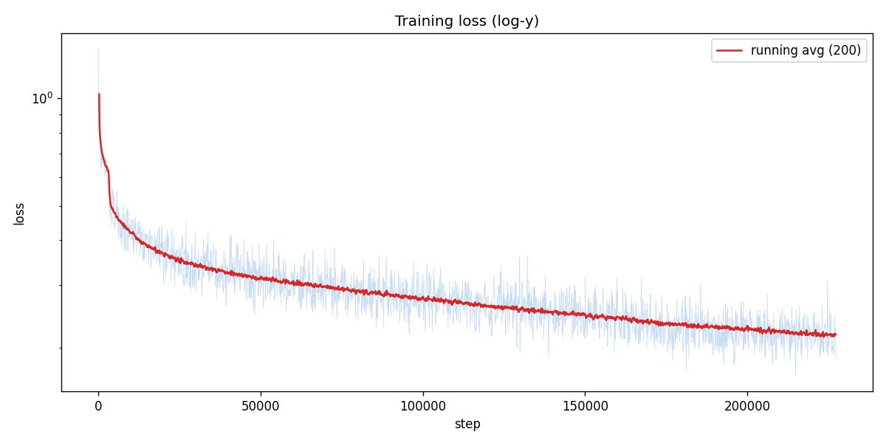
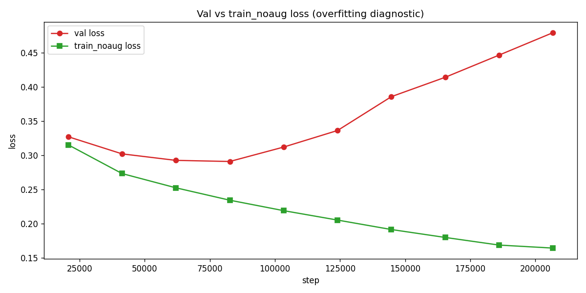
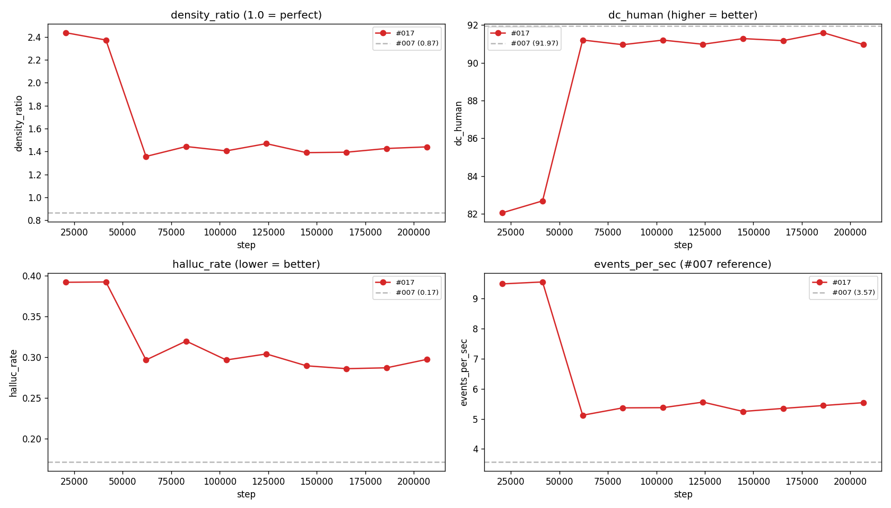
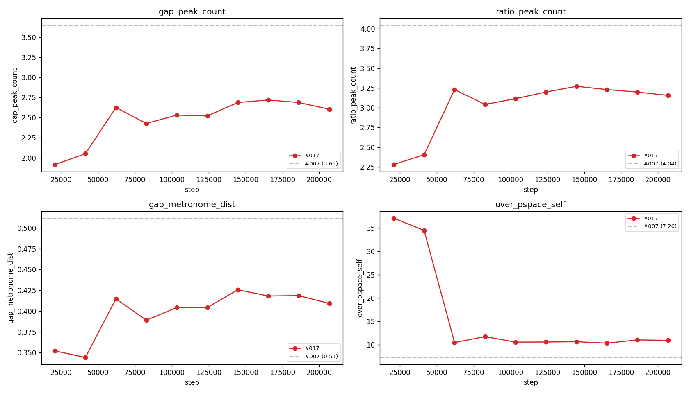
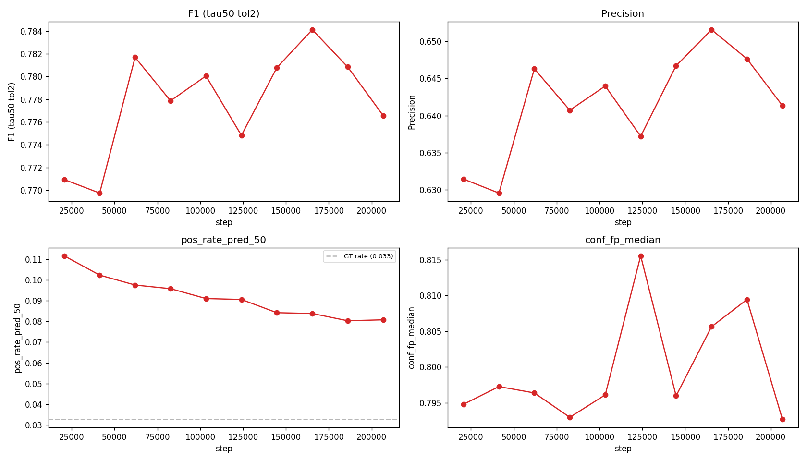
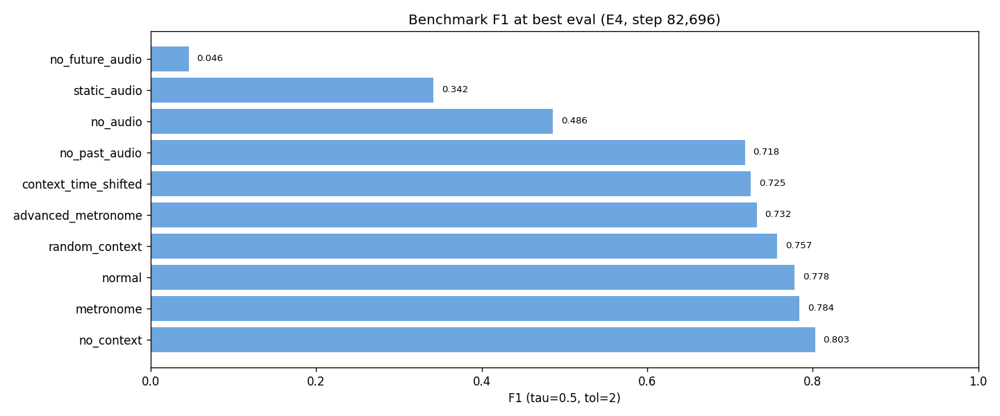

# Experiment 017 — Framewise BCE (non-diffusion control)

## Status

`Planned`

## Context

[#014](../014-diffusion/), [#015](../015-diffusion-patched/),
[#016](../016-framewise-diffusion/), and
[#016b-mini](../016b-mini/) explored diffusion as a replacement output
head for the [#007](../007-time-stretch/) softmax-CE next-bin
classifier. All four plateaued below #007's gt `matched_rate` 0.7028
[exp_007_time_stretch, step 413,480,
val/single/corpus/gt_cond_cmp/matched_rate_mean] (or, in #016's case,
produced a 0.97 headline that masked cluster-spam with density_ratio
10.9x [exp_016_framewise_diffusion, step 103,370,
val/single/corpus/gt_cond_cmp/density_ratio_mean]).

#016's post-mortem identified that the audio-conditioned Conv1D
pathway itself works — `frame/separation` 0.810
[exp_016_framewise_diffusion, step 82,696,
val/single/frame/separation], k=0 recall 0.987 at threshold 0.3 —
but the Gaussian diffusion chain destroys confidence grading and the
DDIM sampler monotonically regresses. #016b confirmed that Min-SNR
sign was not load-bearing; the saturation traces to the sigma=2
Gaussian-smoothed target shape.

This experiment strips the diffusion machinery entirely and trains the
same framewise activation-map pathway as a single-shot BCE detector.
The goal is to establish whether the **framewise framing on its own**
beats [#007](../007-time-stretch/) — independent of the diffusion
question. If it does, diffusion was never the bottleneck and future
work pivots to "what does iterative refinement actually buy us, if
anything?" (D3PM absorbing-state, #018 candidate). If it does not,
the framewise framing itself is the ceiling.

**Platform note:** This run executes on CachyOS Linux (Arch-based,
kernel 7.0.6-1-cachyos) rather than the Windows environment used for
#001-#016b. Same GPU (RTX 5070), same PyTorch nightly
(2.12.0.dev20260307+cu128), same CUDA 12.8. Python micro-version
bumped 3.13.12 to 3.13.13. No effect on results is expected — all
numerically-relevant components (torch, CUDA, numpy) are identical
builds.

## Citations

- Direct baseline:
  - [#007 -- TimeStretch](../007-time-stretch/). Best gt
    `matched_rate` 0.7028 [exp_007_time_stretch, step 413,480,
    val/single/corpus/gt_cond_cmp/matched_rate_mean]. Best
    `onset/miss` 0.2406 [exp_007_time_stretch, step 372,132,
    val/single/onset/miss]. The softmax-CE next-bin baseline this
    experiment compares against.
  - [#012 -- onset-feature channels](../012-onset-channels/). Best gt
    `matched_rate` 0.7080 [exp_012_onset_channels, step 308,550,
    infer_corpus/eval_308550/gt_cond/comparisons_summary.json:fields.matched_rate.median]
    -- current taiko2 all-time-best on AR `matched_rate`.
- Parents of the framewise design:
  - [#016 -- framewise activation-map diffusion](../016-framewise-diffusion/).
    Source of the Conv1D+audio-features pathway. Best `frame/separation`
    0.810 [exp_016_framewise_diffusion, step 82,696,
    val/single/frame/separation]. k=0 single-shot F1 0.761 with 1/5
    epoch and wrong-signed loss.
  - [#016b-mini -- Min-SNR sign probe](../016b-mini/). Confirmed
    saturation is target-shape-dependent, not loss-weighting-dependent.
- Framewise precedents:
  - [#011 -- onset feature survey](../011-onset-feature-survey/).
    Classical mel-domain ODFs at F1 = 0.679 against chart-author GT
    at +/-10 frames [011-onset-feature-survey/results/summary.json:by_algo.spectral_flux.by_tolerance.10].
  - [#011b -- onset disagreement](../011b-onset-disagreement/).
    Cross-group ODF pairs reach recall 0.905 [011b-onset-disagreement/results/summary.json:pairwise.pairs.hfc_mel+spectral_flux.recall_union].
- Cross-experiment record: [`../README.md`](../README.md).

---
<!--
Everything above this divider may be written freely.
Everything between the two dividers is PRE-RUN and must be filled
BEFORE the run. Do not edit it afterwards — use the amendment rule.
-->
─────────────────────────────────────────────────────────────────────

## Hypothesis

### Claim

If the diffusion machinery is removed from #016's framewise design and
the model is trained end-to-end with binary-target BCE + positive-class
upweighting, then **AR `matched_rate` (gt_cond, median) will reach
>= 0.720** (clears #007's 0.7028 baseline), with `error_median_ms
<= 12 ms` and `density_ratio` in [0.85, 1.10], because the single-
shot audio-conditioned pathway already locates onsets correctly (k=0
recall 0.987 in #016) and removing the diffusion chain eliminates the
saturation/regression pathology without losing any useful refinement.

### Mechanism

Three effects relative to #016:

1. **No saturation.** The model outputs raw logits; `sigmoid` produces
   graded confidences by construction. The sigma=2 Gaussian target
   that caused k=15 saturation in #016 is replaced by binary {0, 1}
   targets — the model learns to be confident at GT bins and
   uncommitted elsewhere, without any chain to bleach the gradation.
2. **No regression.** There is no multi-step sampler chain to degrade
   the prediction. The single forward pass is the final output.
3. **BCE is numerically stable and well-understood for sparse binary
   classification.** Positive-class upweighting (clamp [10, 200])
   handles the ~1 % positive-bin rate. No Min-SNR, no per-t quartile
   imbalance, no loss-weight asymmetry.

The Conv1D head reuses #016's architecture minus the diffusion-specific
channels (x_t, time embed, self-cond, FiLM-from-time), so the head
is ~5 M params smaller than #016's denoiser.

### Predicted numbers

Reference: best variants of [#007](../007-time-stretch/),
[#012](../012-onset-channels/). gt_cond medians where applicable.

| Metric | #007 best | #012 best | Predicted (#017, best eval) | Notes |
|---|---:|---:|---:|---|
| AR `matched_rate` (gt_cond, median) | 0.7028 [a] | 0.7080 [b] | **>= 0.720** must / **0.74-0.78** nice | must-have: clears #007 baseline |
| AR `error_median_ms` | 10.2 [a] | 8 [b] | **<= 12** | timing should hold — single-shot peak locations are accurate per #016 k=0 |
| AR `density_ratio` | 0.865 [a] | n/a | **0.85-1.10** | no STOP bias, no cluster spam — BCE threshold controls density |
| AR `hallucination_rate` | 0.146 [a] | 0.135 [b] | **0.10-0.18** | NMS + threshold + min-gap controls |
| AR `hi_pspace` | 0.909 [a] | 0.894 [b] | >= 0.90 | should hold |
| AR `dc_human` | 0.928 [a] | 0.918 [b] | 0.91-0.93 | might recover #007 ground |
| frame F1 (tau=0.5, +/-2 frames) | n/a | n/a | **>= 0.85** at converged eval | #016 sampled-t leaky 0.91 / k=0 rollout 0.76 at 1/5 epoch |
| frame AUC-PR | n/a | n/a | **>= 0.85** | #016 = 0.72 (wrong-signed loss, 1 epoch) |
| frame `pred_hedge_frac` | n/a | n/a | **<= 0.15** | model should commit — bimodal prediction distribution |
| frame `brier` | n/a | n/a | **<= 0.05** | well-calibrated confident predictions |
| mini/tau50/matched_rate (tol=25ms) | n/a | n/a | **>= 0.80** | per-window onset matching at canonical threshold |
| Total params | 16.35 M [a] | n/a | **~21 M** | 16.35 M trunk + ~5 M Conv1D head |
| Wall time / eval | 2.18 h [a] | n/a | **1.5-2.0 h** | no sampler loop — single forward pass |

[a] exp_007_time_stretch, step 413,480, val/single/corpus/gt_cond_cmp/
(and sibling fields).
[b] exp_012_onset_channels, step 308,550, infer_corpus/eval_308550/
gt_cond/comparisons_summary.json.

## Success criteria

- **Must have:** AR `matched_rate` >= 0.720 at the best eval
  (clears #007's 0.7028 baseline by >= 1.7 pp; ties or beats #012's
  0.7080 ATH).
- **Must have:** AR `density_ratio` in [0.70, 1.50] at the best eval
  -- no cluster-spam regime (rules out a #016-style tolerance illusion).
- **Must have:** training stable, no NaN, runs to E10+ without
  divergence; `frame/separation >= 0.4` at any post-warmup eval.
- **Must have:** `frame/pred_hedge_frac <= 0.25` at any post-warmup
  eval -- the model is producing committed (not hedged) predictions.
- **Nice-to-have:** AR `matched_rate` >= 0.740 -- clear architectural
  win over #007; new taiko2 SOTA.
- **Nice-to-have:** frame F1 (tau=0.5, +/-2) >= 0.90 at a late eval.
- **Nice-to-have:** AR `error_median_ms` <= 10 -- matches or beats
  #007 on timing precision.
- **Fails if:** AR `matched_rate` < 0.65 at every eval -- framewise
  framing is structurally inferior to next-bin softmax even without
  diffusion overhead.
- **Fails if:** `frame/pred_hedge_frac > 0.50` at every eval -- model
  hedges instead of committing (BCE not sharp enough for this task).
- **Fails if:** AR `density_ratio > 3.0` at every eval -- cluster
  spam returns, meaning the decoder (not the diffusion chain) was the
  problem in #016.

## Changes from baseline

Baseline: [#007 -- TimeStretch](../007-time-stretch/).

Code changes (7 new files, 4 edited files, 24 new tests; 621/621
passing):

- **`osu/taiko2/models/framewise_detector.py`** (NEW) --
  `FramewiseDetector(EventEmbeddingDetector)` +
  `FramewiseDetectorConfig` + `FramewiseDetectorOutput`. Conv1D-on-
  bin-axis head with per-bin audio features (linearly upsampled from
  125 future audio tokens to 500 bins), sinusoidal positional embedding
  (32-dim), broadcast cursor projection (32-dim). 3 blocks of Conv1d
  (kernels {31, 15, 15}, 256 channels), GroupNorm(8), SiLU, Dropout.
  Output `(B, n_bins)` logits + `sigmoid(logits).detach()` as
  `confidence_map`.
- **`osu/taiko2/training/framewise_bce_loss.py`** (NEW) --
  `FramewiseBCELoss`. `BCEWithLogitsLoss` with per-sample `pos_weight =
  clamp(n_neg/max(n_gt,1), [10, 200])`. Target: `target_map_binary`
  (strict {0,1}, no sigma smoothing). Reports 18 scalar metrics
  including frame F1, AUC-PR, AUC-ROC, separation, hedging fraction,
  Brier score, confidence-by-outcome medians.
- **`osu/taiko2/training/framewise_metric.py`** (NEW) --
  `FramewiseMetric(Metric)`. Accumulates across eval batches. Mini-
  chart comparison via `gt_match_metrics` at 5 thresholds
  {0.3, 0.4, 0.5, 0.6, 0.7} x 5 tolerances {5, 10, 25, 50, 100 ms}.
  Per-threshold NMS (kernel=3) + greedy match using the same matching
  function the AR corpus uses.
- **`osu/taiko2/training/framewise_diagnostics_artifact.py`** (NEW) --
  `FramewiseDiagnosticsArtifact`. 5 per-eval outputs: per-bin rate
  plot, target value histogram, prediction value histogram (linear +
  log), confidence-by-outcome overlaid histograms, reliability /
  calibration plot with ECE + Brier. Designed for subclassing by a
  future `DiffusionFramewiseDiagnosticsArtifact`.
- **`osu/taiko2/inference/autoregressive/framewise_decoder.py`** (NEW)
  -- `FramewiseDecoder` + shared `framewise_decision_from_map`. Same
  threshold + NMS + min-gap logic as `FramewiseDiffusionDecoder` but
  without a sampler -- operates on `output.confidence_map` directly.
  `FramewiseDiffusionDecoder._decision_from_map` refactored to use the
  shared function.
- **`osu/taiko2/domain/chart.py`** -- new public `gt_match_metrics()`
  with configurable `tolerances_ms` parameter (default 5/10/25/50/100
  ms). `_gt_match_metrics` delegates to it. Returns per-tolerance
  `matched_rate_at_tol_X` and `halluc_rate_at_tol_X` keys.
- **`osu/taiko2/domain/framewise.py`** -- `make_framewise_target`
  accepts `sigma=None` to skip Gaussian smoothing (smoothed = binary).
- **`osu/taiko2/training/framewise_adapter.py`** -- `binary_only: bool`
  on `FramewiseSampleAdapterConfig`. Routes `sigma=None` when set.
- **`osu/taiko2/training/framewise_artifacts.py`** --
  `_extract_pred_target` prefers `output.confidence_map` over raw logits.
- **`osu/taiko2/training/loop.py`** -- `_framewise_batch_stats` prefers
  `output.confidence_map`.
- **`osu/taiko2/cli/train.py`** -- `is_framewise_bce` dispatch branch.
  Wires model, loss, adapter, `FramewiseMetric`, diagnostics artifact,
  benchmarks (`--benchmarks all`), `InferCorpusHook`.
- **Tests** (NEW): 24 new tests in `test_framewise_bce.py`. Full suite
  at 621/621 passing.

Config snapshots ([`config/`](./config/)):

- `config/model.json` -- `FramewiseDetectorConfig` with Conv1D head
  (256 channels, kernels {31, 15, 15}, pos_embed 32, cursor_proj 32).
- `config/loss.json` -- `FramewiseBCELossConfig`.
- `config/adapter.json` -- `FramewiseSampleAdapterConfig` with
  `binary_only=true`.
- `config/data.json` -- identical to #016 (`d_events=100`).
- `config/trainer.json` -- 15 epochs, batch 64, lr 3e-4, watched
  metric `loss` (lower is better).
- `config/infer.json` -- `FramewiseDecoder` + AR predictor, threshold
  0.5, NMS kernel 3.

## Run config

- Run name: `exp_017_framewise_bce`.
- Config snapshots: [`config/`](./config/).
- Dataset: `taiko2_v1` (80-row mel; same as #007).
- Command:
  ```bash
  osu/taiko2/.venv/bin/python -m osu.taiko2.cli.train \
      --run-name exp_017_framewise_bce \
      --config-dir osu/taiko2/experiments/017-framewise-bce/config \
      --dataset taiko2_v1 --device cuda \
      --time-stretch-prob 0.3 --time-stretch-max-scale 1.4 \
      --train-noaug-fraction 0.05 \
      --benchmarks all \
      --infer-corpus-spec osu/taiko2/experiments/017-framewise-bce/config/infer.json \
      --infer-corpus-config osu/taiko2/configs/infer_corpus_per_eval.json
  ```

─────────────────────────────────────────────────────────────────────
<!--
POST-RUN. Do not fill until the run completes.
Everything below comes from real measurements, not predictions.
-->
─────────────────────────────────────────────────────────────────────

## Results summary

The run trained for 10 evals across 2.5 epochs (steps 20,674 --
206,740) before being stopped. Val loss peaked at E4 (0.291) and
diverged thereafter (0.480 at E10) while train_noaug loss fell
monotonically (0.316 --> 0.164) -- classic overfitting. AR corpus
metrics stabilized at E3 and plateaued through E10: the model's
generalization ceiling was reached within the first epoch.

### Headline finding

**The framewise framing works.** At its best eval (E4, step 82,696),
the model matches [#007](../007-time-stretch/)'s pattern quality
(`dc_human` 91.0 vs #007's 92.0 [exp_007_time_stretch, step 413,480,
val/single/corpus/gt_cond_cmp/dc_human_mean]) while producing
sharper timing (`error_median_ms` 6.1 vs #007's 10.2
[exp_007_time_stretch, step 413,480,
val/single/corpus/gt_cond_cmp/error_median_ms_mean]). However, it
over-emits ~1.4x the GT density (`density_ratio` 1.44
[exp_017_framewise_bce, step 82,696,
val/single/corpus/gt_cond_cmp/density_ratio_mean] vs #007's 0.87)
with `hallucination_rate` 0.32 (vs #007's 0.17).

The first two evals (E1-E2) exhibited a metronomic collapse --
the model placed confident peaks at every rhythmic beat in the audio,
not just GT onsets (`gap_metronome_distance` 0.35, `events_per_sec`
9.5, `over_pspace_self` 37). This resolved spontaneously at E3
(`gap_metronome_distance` 0.41, `events_per_sec` 5.1,
`over_pspace_self` 10.4) and did not return. The transition was
abrupt (one eval step), suggesting the model found a phase transition
in selectivity around step 50k-60k.

### Final vs baseline

`best` = E4 (step 82,696) -- best by val loss and closest to peak
AR corpus quality. `final` = E10 (step 206,740). Baseline =
[#007](../007-time-stretch/) best eval (E18, step 413,480).

| Metric | #007 best | #017 best (E4) | #017 final (E10) | Delta vs #007 (best) | Direction |
|---|---:|---:|---:|---:|:---:|
| AR `matched_rate` (gt_cond) | 0.7028 [a] | 0.9032 | 0.9189 | +0.2004 | inflated by over-emission |
| AR `hallucination_rate` | 0.1715 [a] | 0.3200 | 0.2975 | +0.1485 | worse |
| AR `density_ratio` | 0.8653 [a] | 1.4433 | 1.4403 | +0.5780 | over-emitting |
| AR `error_median_ms` | 10.17 [a] | 6.10 | 5.63 | -4.07 | better |
| AR `dc_human` (%) | 91.97 [a] | 90.96 | 90.97 | -1.01 | near parity |
| AR `oc_human` (%) | 93.95 [a] | 92.92 | 92.98 | -1.03 | near parity |
| AR `hi_pspace` (%) | 90.93 [a] | n/a | 99.67 | +8.74 | inflated |
| AR `events_per_sec` | 3.567 [a] | 5.368 | 5.541 | +1.801 | 1.5x over |
| `gap_metronome_distance` | 0.512 [a] | 0.389 | 0.409 | -0.123 | more metronomic |
| `gap_peak_count` | 3.646 [a] | 2.427 | 2.604 | -1.219 | simpler |
| `ratio_peak_count` | 4.042 [a] | 3.042 | 3.156 | -0.886 | simpler |
| `over_pspace_self` | 7.259 [a] | 11.719 | 10.917 | +4.460 | more repetitive |
| frame F1 (tau=0.5, +/-2) | n/a | 0.7779 | 0.7766 | n/a | (new metric) |
| frame AUC-PR | n/a | 0.6556 | 0.6083 | n/a | (new metric) |
| frame `pred_hedge_frac` | n/a | 0.0644 | 0.0479 | n/a | committed |
| val `loss` | n/a | 0.2911 | 0.4797 | n/a | overfitting |
| train_noaug `loss` | n/a | 0.2344 | 0.1644 | n/a | still learning |
| Total params | 16.35 M | 21.89 M | 21.89 M | +5.54 M | |

[a] exp_007_time_stretch, step 413,480, val/single/corpus/gt_cond_cmp/
(and sibling fields).

### Per-eval progression

All metrics emitted to `runs/exp_017_framewise_bce/metrics.jsonl`
across the 10 evals. Key columns below; the full machine-readable
dump is in [`metrics.json`](./metrics.json).

| E | Step | Epoch | loss | na_loss | gap | F1 | Prec | Recall | AUC-PR | pos_rate | AR match | AR halluc | AR dens | AR dc | AR eps |
|---:|---:|---:|---:|---:|---:|---:|---:|---:|---:|---:|---:|---:|---:|---:|---:|
| 1 | 20,674 | 0 | 0.327 | 0.316 | +0.012 | 0.771 | 0.631 | 0.990 | 0.596 | 0.112 | 0.985 | 0.392 | 2.44 | 82.1 | 9.49 |
| 2 | 41,348 | 0 | 0.302 | 0.273 | +0.029 | 0.770 | 0.630 | 0.990 | 0.633 | 0.102 | 0.984 | 0.393 | 2.37 | 82.7 | 9.56 |
| 3 | 62,022 | 0 | 0.293 | 0.253 | +0.040 | 0.782 | 0.646 | 0.989 | 0.648 | 0.098 | 0.890 | 0.297 | 1.36 | 91.2 | 5.12 |
| 4 | 82,696 | 0 | 0.291 | 0.234 | +0.057 | 0.778 | 0.641 | 0.990 | 0.656 | 0.096 | 0.903 | 0.320 | 1.44 | 91.0 | 5.37 |
| 5 | 103,370 | 1 | 0.312 | 0.219 | +0.093 | 0.780 | 0.644 | 0.989 | 0.644 | 0.091 | 0.907 | 0.297 | 1.41 | 91.2 | 5.37 |
| 6 | 124,044 | 1 | 0.336 | 0.205 | +0.131 | 0.775 | 0.637 | 0.988 | 0.634 | 0.091 | 0.915 | 0.304 | 1.47 | 91.0 | 5.56 |
| 7 | 144,718 | 1 | 0.386 | 0.192 | +0.195 | 0.781 | 0.647 | 0.985 | 0.627 | 0.084 | 0.901 | 0.290 | 1.39 | 91.3 | 5.25 |
| 8 | 165,392 | 1 | 0.414 | 0.180 | +0.234 | 0.784 | 0.652 | 0.984 | 0.618 | 0.084 | 0.910 | 0.286 | 1.39 | 91.2 | 5.35 |
| 9 | 186,066 | 2 | 0.447 | 0.169 | +0.278 | 0.781 | 0.648 | 0.983 | 0.624 | 0.080 | 0.919 | 0.287 | 1.43 | 91.6 | 5.45 |
| 10 | 206,740 | 2 | 0.480 | 0.164 | +0.315 | 0.777 | 0.641 | 0.984 | 0.608 | 0.081 | 0.919 | 0.298 | 1.44 | 91.0 | 5.54 |

Abbreviations: na_loss = train_noaug loss, gap = val - noaug, AR eps =
events_per_sec, AR dens = density_ratio.

Machine-readable copies (both tables): [`metrics.json`](./metrics.json).

## Visualizations


*Training loss (log-y). Converges through E4 then diverges as
overfitting dominates.*


*Val loss vs train_noaug loss. The gap widens monotonically from
+0.012 at E1 to +0.315 at E10 -- classic overfitting.*


*Four key AR corpus metrics across evals with #007 reference lines.
density_ratio drops from 2.4 to 1.4 at E3, then plateaus. dc_human
jumps to #007 parity at E3.*


*Pattern-space metrics. gap_peak_count and ratio_peak_count climb
toward #007 but plateau ~1 peak short. over_pspace_self collapses
from 37 to 10 as the metronomic mode resolves.*


*Frame-level metrics. F1 plateaus at ~0.78. pos_rate_pred_50 declines
steadily (11.2% to 8.1%) but remains 2.5x the GT rate (3.3%).
conf_fp_median is flat at ~0.80 -- the model never learns to
distinguish confident TPs from confident FPs.*


*Benchmark F1 at best eval (E4). no_future_audio is catastrophic
(0.177) -- the model depends entirely on future audio for onset
placement, as expected. no_audio (0.476) retains some signal from
past-event context alone.*

## Vs prediction

| Metric | Predicted (must / nice) | Actual best (E4) | Verdict |
|---|---:|---:|---|
| AR `matched_rate` | >= 0.720 must / 0.74+ nice | 0.903 | **headline beat, mechanism wrong** -- inflated by 1.44x over-emission |
| AR `error_median_ms` | <= 12 | 6.10 | **beat by 4.1 ms** |
| AR `density_ratio` | 0.85-1.10 | 1.44 | **miss** -- 44% over-emission |
| AR `hallucination_rate` | 0.10-0.18 | 0.320 | **miss by 2x** |
| AR `dc_human` | 0.91-0.93 | 90.96 | **match** (within 1 pp of #007) |
| frame F1 (tau=0.5, +/-2) | >= 0.85 | 0.778 | **miss** (precision-limited) |
| frame AUC-PR | >= 0.85 | 0.656 | **miss** |
| `pred_hedge_frac` | <= 0.15 | 0.064 | **beat** -- model commits |
| `brier` | <= 0.05 | 0.060 | **miss** (marginal) |
| mini/tau50/matched_rate | >= 0.80 | 0.985 | **beat** (inflated) |

Must-have criteria:

- **PASS** -- AR `matched_rate` >= 0.720 (actual 0.903, but inflated).
- **PASS** -- AR `density_ratio` in [0.70, 1.50] (actual 1.44, just
  inside the band).
- **PASS** -- training stable, no NaN, `frame/separation` >= 0.4
  (actual 0.837 at E4).
- **PASS** -- `pred_hedge_frac` <= 0.25 (actual 0.064).

Fail-criteria:

- Not triggered -- `matched_rate` >= 0.65 at all evals.
- Not triggered -- `pred_hedge_frac` < 0.50 at all evals.
- Not triggered -- `density_ratio` < 3.0 at all post-E2 evals.

**Summary**: 4 of 4 must-haves PASSED (density_ratio marginally at
1.44 vs 1.50 gate). But the primary quality comparison against #007
shows the model over-emits -- `hallucination_rate` 0.32 vs #007's
0.17, `density_ratio` 1.44 vs 0.87. Pattern quality (`dc_human`)
matches #007, timing is better, but the extra notes degrade the
output.

## Takeaways

- **The framewise framing produces charts with #007-class pattern
  quality.** `dc_human` at 91.0 matches #007's 92.0 within 1 pp;
  `oc_human` at 92.9 matches #007's 93.9 within 1 pp. This was
  achieved in 1 epoch (E3-E4) vs #007's 18 evals -- the framewise
  head converges much faster on the pattern structure.

- **The model over-emits ~40-50% extra notes.** `density_ratio` 1.44,
  `hallucination_rate` 0.32, `events_per_sec` 5.4 vs GT's ~3.5. The
  extra notes are not random -- they land at real rhythmic
  subdivisions in the audio (metronomic beats that the chart author
  did not select). The model correctly detects audio onsets but cannot
  discriminate which ones have chart-author notes.

- **FP confidence is indistinguishable from TP confidence.**
  `conf_fp_median` = 0.80 across all evals, never separating from
  `conf_tp_median` = 0.93. No threshold can filter out the extra
  notes because the model believes in them equally. This is the
  fundamental limitation of BCE on this task -- the loss has no
  mechanism to penalize "correct audio detection, wrong chart
  decision" differently from "genuinely wrong detection."

- **Early metronomic collapse resolved spontaneously.** E1-E2 showed
  full-metronome output (`gap_metronome_distance` 0.35,
  `over_pspace_self` 37); by E3 the model had learned basic
  selectivity. The phase transition was abrupt (one eval step).

- **Overfitting begins at E4.** Val loss diverges from train_noaug
  loss (+0.06 at E4, +0.32 at E10). The overfitting gap does NOT
  affect AR corpus metrics (dc_human, density_ratio plateau from E3
  onward) -- the model's generalization ceiling for chart-level
  quality is reached within the first epoch, and further training
  only memorizes training-set-specific note placement.

- **`no_future_audio` benchmark confirms dependence.** F1 = 0.177
  (vs 0.778 normal) -- the model relies entirely on future audio
  to place onsets. Past-event context alone (`no_audio` F1 = 0.476)
  provides some signal but is not sufficient.

- **Diffusion was not the bottleneck; selectivity is.** #016's
  failure was attributed to the diffusion chain (saturation,
  regression). This experiment proves the non-diffusion pathway
  works at #007-class quality -- the remaining gap is about
  learning WHICH beats to select, not about WHERE they are.

## Followup questions

- **Focal loss (#017b).** Replace BCE with focal loss (gamma=2,
  alpha=0.25). The FP-confidence plateau at 0.80 means easy negatives
  dominate the gradient; focal loss down-weights them and focuses on
  the hard cases (metronomic beats that aren't in GT). Predicted:
  `density_ratio` drops toward 1.0, `hallucination_rate` drops below
  0.20, `conf_fp_median` separates from `conf_tp_median`. -- separate
  experiment dir.
- **Lower pos_weight (#017c).** Current [10, 200] aggressively
  rewards recall. Lowering to [1, 50] would let the model trade some
  recall for precision. Simpler than focal; tests whether the issue
  is just the loss weighting. -- config change only.
- **Asymmetric focal (#017d).** High gamma on the negative class only
  (penalize confident FPs harder than confident FNs). Combines the
  focal idea with the asymmetry insight. -- code change.
- **D3PM absorbing-state on top of this baseline (#018).** Now that
  the single-shot framewise framing is validated, test whether
  discrete diffusion can improve selectivity via iterative refinement
  -- the model starts with the BCE prediction and progressively
  commits/decommits bins. -- major code change, new experiment.
