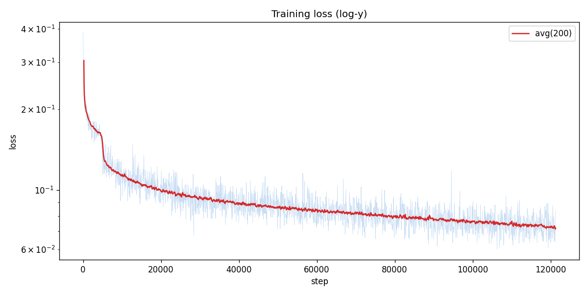
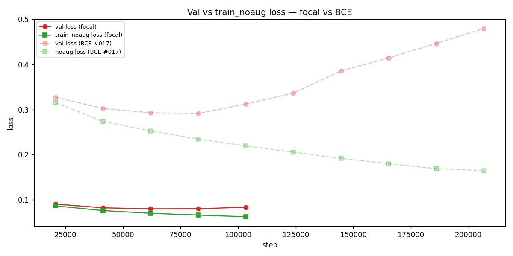
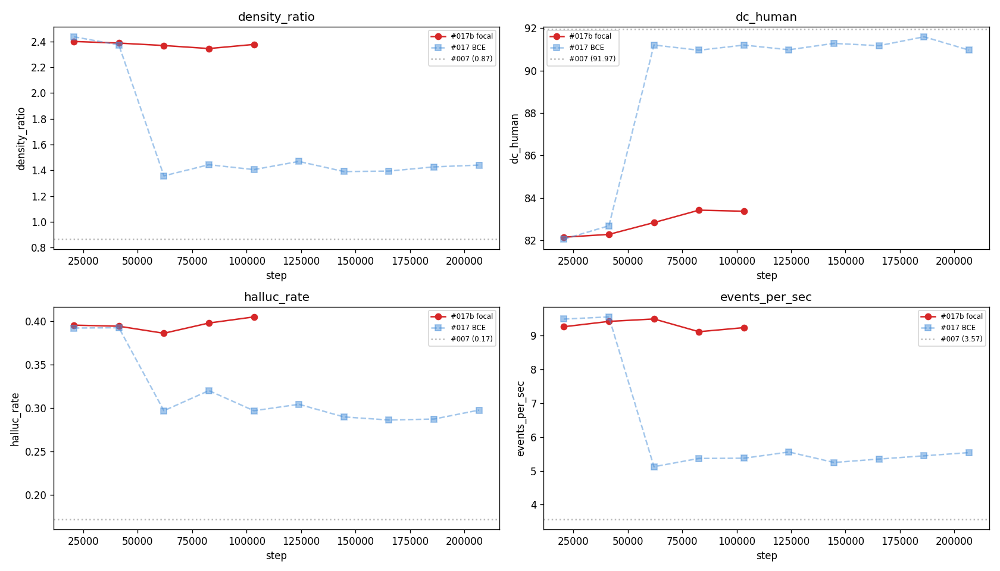
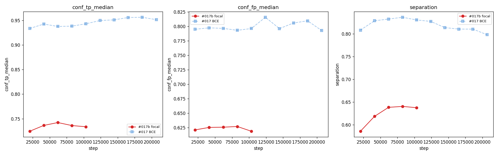
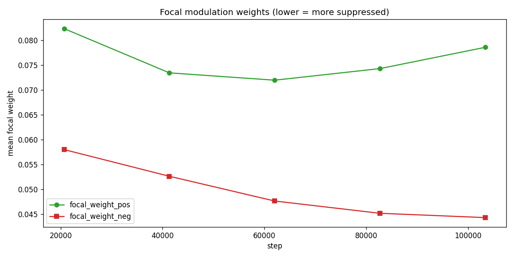

# Experiment 017b — Framewise focal loss

## Status

`Planned`

## Context

[#017](../017-framewise-bce/) validated the framewise framing: pattern
quality (`dc_human` 91.0 [exp_017_framewise_bce, step 82,696,
val/single/corpus/gt_cond_cmp/dc_human_mean]) matches
[#007](../007-time-stretch/)'s 92.0, with better timing
(`error_median_ms` 6.1 vs 10.2). However, the model over-emits ~44%
extra notes (`density_ratio` 1.44 [exp_017_framewise_bce, step 82,696,
val/single/corpus/gt_cond_cmp/density_ratio_mean],
`hallucination_rate` 0.32 vs #007's 0.17).

The root cause identified in #017: the model confidently predicts
onsets at every rhythmic beat in the audio, not just the ones the
chart author selected. `conf_fp_median` = 0.80
[exp_017_framewise_bce, step 82,696,
val/single/frame/conf_fp_median] is indistinguishable from
`conf_tp_median` = 0.93 — no threshold can separate true from false
positives. The per-window mini-chart data shows `density_ratio` = 4.7
[exp_017_framewise_bce, step 82,696,
val/single/frame/mini/τ50/density_ratio] at the raw model output;
the AR loop's cursor-advance mechanics mask ~70% of the over-emission
down to the 1.44 reported in the AR corpus.

With BCE loss, the gradient is dominated by the ~97% true-negative
bins (confidence near 0, correctly classified). These easy bins
contribute most of the loss magnitude but carry no useful learning
signal for the selectivity problem. The hard cases — metronomic
beats that the model confidently predicts as onsets but that aren't
in the GT chart — are a tiny fraction of the gradient.

This experiment replaces BCE with **focal loss** (Lin et al., 2017),
which down-weights well-classified examples via the `(1 - p_t)^gamma`
modulation. At gamma=2, an easy TN with `p_t = 0.95` gets weight
`0.05^2 = 0.0025` (400x down-weighted), while a hard FP with
`p_t = 0.20` gets weight `0.80^2 = 0.64`. This should redirect
gradient from easy TNs to the hard "correct audio detection, wrong
chart decision" FPs.

## Citations

- Direct baseline:
  - [#017 -- framewise BCE](../017-framewise-bce/). Best `dc_human`
    91.0 [exp_017_framewise_bce, step 82,696,
    val/single/corpus/gt_cond_cmp/dc_human_mean]. Best
    `density_ratio` 1.44, `hallucination_rate` 0.32 at same step.
    `conf_fp_median` = 0.80 across all evals (never separating).
  - [#007 -- TimeStretch](../007-time-stretch/). Best gt
    `matched_rate` 0.7028, `dc_human` 92.0, `density_ratio` 0.87,
    `hallucination_rate` 0.17 [exp_007_time_stretch, step 413,480,
    val/single/corpus/gt_cond_cmp/ fields].
- Loss design:
  - [Focal Loss for Dense Object Detection (Lin et al., ICCV 2017)](https://arxiv.org/abs/1708.02002).
    Source of the `(1 - p_t)^gamma` modulation. gamma=2 is the
    default recommended in the paper for sparse positive classes.
- Cross-experiment record: [`../README.md`](../README.md).

---
<!--
Everything above this divider may be written freely.
Everything between the two dividers is PRE-RUN and must be filled
BEFORE the run. Do not edit it afterwards — use the amendment rule.
-->
─────────────────────────────────────────────────────────────────────

## Hypothesis

### Claim

If focal loss (gamma=2) replaces BCE on the otherwise-identical #017
architecture, then **`conf_fp_median` will drop below 0.60**
(separating from `conf_tp_median`), **`density_ratio` will reach
0.85-1.15** (vs #017's 1.44), and **`hallucination_rate` will drop
below 0.20** (vs #017's 0.32), because the focal modulation
redirects gradient from easy true-negatives to the hard false-
positive metronomic beats, teaching the model to suppress them.

### Mechanism

Two effects:

1. **Down-weights easy TNs.** ~97% of bins are negative with
   confidence near 0. Their `p_t ≈ 1.0` gives focal weight
   `(1 - 1.0)^2 ≈ 0` — effectively removed from the gradient.
   In BCE these bins dominate; in focal they contribute almost
   nothing.
2. **Preserves gradient on hard FPs.** The metronomic-beat false
   positives have confidence ~0.80, so `p_t = 1 - 0.80 = 0.20`,
   focal weight `(1 - 0.20)^2 = 0.64` — still a strong gradient
   signal. These are the bins the model needs to learn to suppress.

`pos_weight` (clamp [10, 200]) is kept unchanged to handle the
3%/97% class imbalance. Focal and pos_weight are complementary:
pos_weight addresses count imbalance, focal addresses confidence-
calibration imbalance.

### Predicted numbers

Reference: [#017](../017-framewise-bce/) best (E4, step 82,696) and
[#007](../007-time-stretch/) best (E18, step 413,480). gt_cond.

| Metric | #017 best | #007 best | Predicted (#017b) | Notes |
|---|---:|---:|---:|---|
| AR `density_ratio` | 1.44 | 0.87 | **0.85-1.15** must | primary target — over-emission eliminated |
| AR `hallucination_rate` | 0.32 | 0.17 | **<= 0.20** must | direct consequence of density fix |
| AR `dc_human` | 91.0 | 92.0 | **>= 90** | should hold or improve |
| AR `matched_rate` | 0.90 | 0.70 | **0.70-0.85** | will drop as over-emission drops — this is expected and healthy |
| AR `error_median_ms` | 6.1 | 10.2 | **<= 10** | should hold |
| `conf_fp_median` | 0.80 | n/a | **<= 0.60** | the key diagnostic — FP confidence must separate from TP |
| `conf_tp_median` | 0.93 | n/a | **>= 0.85** | TP confidence should remain high |
| frame F1 (tau=0.5, +/-2) | 0.78 | n/a | **>= 0.80** | precision should improve with fewer FPs |
| `loss/focal_weight_neg` | n/a | n/a | **<= 0.30** | confirms focal is down-weighting easy negatives |
| `loss/focal_weight_pos` | n/a | n/a | **>= 0.10** | confirms positives still get gradient |
| mini tau50 density_ratio | 4.70 | n/a | **<= 2.0** | raw per-window over-emission (before AR masking) |

## Success criteria

- **Must have:** AR `density_ratio` in [0.70, 1.30] at the best eval
  -- the over-emission problem is materially reduced vs #017's 1.44.
- **Must have:** `conf_fp_median` < `conf_tp_median` - 0.15 at any
  post-warmup eval -- the model has learned to assign lower confidence
  to false positives than true positives.
- **Must have:** AR `dc_human` >= 88 -- pattern quality does not
  regress catastrophically.
- **Nice-to-have:** AR `hallucination_rate` <= 0.15 -- below #007's
  0.17.
- **Nice-to-have:** AR `density_ratio` in [0.85, 1.10] -- near-
  perfect density matching.
- **Nice-to-have:** frame F1 >= 0.85.
- **Fails if:** AR `density_ratio` > 1.40 at every eval -- focal did
  not reduce over-emission (the problem is not about easy-vs-hard
  gradient distribution).
- **Fails if:** AR `dc_human` < 80 -- focal loss damaged pattern
  quality (the down-weighting of easy negatives harmed the model's
  ability to learn where NOT to place notes).
- **Fails if:** `loss/focal_weight_pos` < 0.01 at any eval -- focal
  is suppressing TP gradient (gamma too high for this class ratio).

## Changes from baseline

Baseline: [#017 -- framewise BCE](../017-framewise-bce/).

**Single change:** `loss.json` swapped from `FramewiseBCELossConfig`
to `FramewiseFocalLossConfig` with `gamma=2.0`. All other configs
are byte-identical to #017.

Code:

- **`osu/taiko2/training/framewise_focal_loss.py`** (NEW in this
  session, written alongside #017b planning) -- `FramewiseFocalLoss`.
  Applies `(1 - p_t)^gamma` modulation on top of BCE + pos_weight.
  Reports two additional diagnostics vs #017's BCE loss:
  `loss/focal_weight_pos` and `loss/focal_weight_neg` (mean focal
  modulation weight per class, for gamma tuning).
- **`osu/taiko2/cli/train.py`** -- 2-line dispatch addition for
  `FramewiseFocalLossConfig`.
- **Tests**: 4 new tests in `test_framewise_bce.py` (smoke,
  gamma=0 matches BCE, focal reduces easy-neg weight, backward).
  Full suite 625/625 passing.

Config snapshots ([`config/`](./config/)):

- `config/model.json` -- byte-identical to #017.
- `config/loss.json` -- `FramewiseFocalLossConfig`, gamma=2.0,
  pos_weight [10, 200].
- `config/adapter.json` -- byte-identical to #017.
- `config/data.json` -- byte-identical to #017.
- `config/trainer.json` -- byte-identical to #017 (15 epochs).
- `config/infer.json` -- byte-identical to #017 except checkpoint
  path.

## Run config

- Run name: `exp_017b_framewise_focal`.
- Config snapshots: [`config/`](./config/).
- Dataset: `taiko2_v1` (80-row mel; same as #007/#017).
- Command:
  ```bash
  osu/taiko2/.venv/bin/python -m osu.taiko2.cli.train \
      --run-name exp_017b_framewise_focal \
      --config-dir osu/taiko2/experiments/017b-framewise-focal/config \
      --dataset taiko2_v1 --device cuda \
      --time-stretch-prob 0.3 --time-stretch-max-scale 1.4 \
      --train-noaug-fraction 0.05 \
      --benchmarks all \
      --compile \
      --infer-corpus-spec osu/taiko2/experiments/017b-framewise-focal/config/infer.json \
      --infer-corpus-config osu/taiko2/configs/infer_corpus_per_eval.json
  ```

─────────────────────────────────────────────────────────────────────
<!--
POST-RUN. Do not fill until the run completes.
Everything below comes from real measurements, not predictions.
-->
─────────────────────────────────────────────────────────────────────

## Results summary

The run trained for 5 evals across 1.25 epochs (steps 20,674 --
103,370) before being stopped. Focal loss (gamma=2) **compressed the
confidence range** without improving selectivity. The metronomic
collapse that [#017](../017-framewise-bce/) resolved at E3 **never
resolved** under focal — `over_pspace_self` increased from 39 to 53
across the 5 evals, and `dc_human` plateaued at 83 (vs #017's 91 at
E3). Val loss began rising at E4 (0.080 --> 0.083).

### Headline finding

**Focal loss suppresses gradient on both classes equally, preventing
the model from learning to commit.** `focal_weight_pos` = 0.074
[exp_017b_framewise_focal, step 82,696,
val/single/loss/focal_weight_pos] means TPs receive only 7.4% of
the gradient they would under BCE. The model cannot push TP confidence
past ~0.74 (`conf_tp_median` 0.736 [exp_017b_framewise_focal, step
82,696, val/single/frame/conf_tp_median] vs #017's 0.938). FP
confidence did drop (0.627 vs #017's 0.793), but the TP-FP gap
actually *shrank* (0.109 vs #017's 0.145) and separation collapsed
(0.641 vs #017's 0.837).

The calibration data shows the model is internally well-calibrated
within its compressed range — `pos_rate_at_90` = 0.967 (when the
model says 0.9, it's right 97% of the time). The problem is that it
rarely *says* 0.9 — most predictions sit in the 0.5-0.7 band, making
threshold-based decoding ineffective.

### Final vs baseline

`final` = E5 (step 103,370). Baseline = [#017](../017-framewise-bce/)
best (E4, step 82,696).

| Metric | #017 BCE (E4) | #017b Focal (E5) | Delta | Direction |
|---|---:|---:|---:|:---:|
| AR `density_ratio` | 1.44 | 2.38 | +0.94 | worse |
| AR `hallucination_rate` | 0.32 | 0.41 | +0.09 | worse |
| AR `matched_rate` | 0.90 | 0.98 | +0.08 | inflated |
| AR `error_median_ms` | 6.10 | 5.67 | -0.43 | better |
| AR `dc_human` (%) | 91.0 | 83.4 | -7.6 | much worse |
| AR `oc_human` (%) | 92.9 | 86.2 | -6.7 | much worse |
| AR `events_per_sec` | 5.37 | 9.24 | +3.87 | 2.7x over |
| `conf_tp_median` | 0.938 | 0.734 | -0.204 | compressed |
| `conf_fp_median` | 0.793 | 0.619 | -0.174 | compressed |
| `separation` | 0.837 | 0.638 | -0.199 | compressed |
| `hedge_frac` | 0.064 | 0.187 | +0.123 | hedging |
| `over_pspace_self` | 11.7 | 53.2 | +41.5 | much worse |
| `gap_metronome_distance` | 0.389 | 0.418 | +0.029 | similar |
| frame F1 | 0.778 | 0.780 | +0.002 | flat |
| `focal_weight_pos` | n/a | 0.079 | — | TPs starved |
| `focal_weight_neg` | n/a | 0.044 | — | TNs suppressed |
| val `loss` | 0.291 | 0.083 | -0.208 | not comparable (different loss) |
| train_noaug `loss` | 0.234 | 0.062 | -0.172 | not comparable |

### Per-eval progression

| E | Step | Epoch | loss | na_loss | gap | F1 | Prec | Rec | Sep | hedge | fp_med | tp_med | AR dens | AR dc | AR eps | op_self |
|---:|---:|---:|---:|---:|---:|---:|---:|---:|---:|---:|---:|---:|---:|---:|---:|---:|
| 1 | 20,674 | 0 | 0.090 | 0.086 | +0.004 | 0.773 | 0.635 | 0.988 | 0.586 | 0.262 | 0.621 | 0.725 | 2.40 | 82.2 | 9.27 | 39.0 |
| 2 | 41,348 | 0 | 0.082 | 0.076 | +0.006 | 0.774 | 0.636 | 0.990 | 0.619 | 0.225 | 0.625 | 0.737 | 2.39 | 82.3 | 9.42 | 39.1 |
| 3 | 62,022 | 0 | 0.080 | 0.070 | +0.010 | 0.775 | 0.636 | 0.990 | 0.639 | 0.197 | 0.626 | 0.742 | 2.37 | 82.8 | 9.50 | 43.3 |
| 4 | 82,696 | 0 | 0.080 | 0.066 | +0.014 | 0.776 | 0.639 | 0.989 | 0.641 | 0.186 | 0.627 | 0.736 | 2.35 | 83.4 | 9.12 | 43.0 |
| 5 | 103,370 | 1 | 0.083 | 0.062 | +0.021 | 0.780 | 0.645 | 0.989 | 0.638 | 0.187 | 0.619 | 0.734 | 2.38 | 83.4 | 9.24 | 53.2 |

Machine-readable copies: [`metrics.json`](./metrics.json).

## Visualizations


*Training loss (log-y). Converges to E3-E4 then begins rising.*


*Val vs train_noaug loss overlaid with #017 BCE for comparison.
Focal loss values are ~3x smaller than BCE (different loss scale)
but the overfitting gap shape is similar.*


*AR corpus metrics overlaid with #017 BCE and #007 reference.
density_ratio stays at 2.4 (vs #017's drop to 1.4 at E3).
dc_human stays at 83 (vs #017's jump to 91 at E3).*


*conf_tp_median, conf_fp_median, and separation — focal (red) vs
BCE (blue). Focal compresses both TP and FP confidence ranges
without widening the gap between them.*


*Mean focal modulation weight per class. pos weight ~0.07-0.08
(TPs get 7-8% of gradient); neg weight ~0.04-0.06 (TNs get 4-6%).
The ratio pos/neg is only 1.4-1.8x — insufficient asymmetry.*

## Vs prediction

| Metric | Predicted | Actual (E4/E5) | Verdict |
|---|---:|---:|---|
| AR `density_ratio` | 0.85-1.15 must | 2.35 | **FAIL** — no improvement over #017 E1-E2 |
| `conf_fp_median` < `conf_tp_median` - 0.15 | must | gap = 0.109 | **FAIL** — gap is 0.109 < 0.15 required |
| AR `dc_human` >= 88 | must | 83.4 | **FAIL** — 5 pp below gate |
| AR `hallucination_rate` <= 0.15 | nice | 0.41 | **FAIL** |
| AR `density_ratio` 0.85-1.10 | nice | 2.35 | **FAIL** |
| `loss/focal_weight_pos` >= 0.01 | fail-if | 0.079 | **PASS** (not triggered) |
| AR `density_ratio` > 1.40 at every eval | fail-if | 2.35+ | **TRIGGERED** |
| AR `dc_human` < 80 | fail-if | 83.4 | **PASS** (not triggered) |

**Summary**: 0 of 3 must-haves PASSED. 1 of 2 fail-criteria
TRIGGERED (`density_ratio > 1.40` at every eval). Hypothesis
rejected — focal loss does not address the selectivity problem.

## Takeaways

- **Focal loss (gamma=2) is the wrong tool for this problem.** The
  premise of focal — "easy negatives dominate the gradient" — is
  correct in principle (97% of bins are TN), but the cure is worse
  than the disease: suppressing TP gradient prevents the model from
  learning to commit to detected onsets, and the compressed confidence
  range makes threshold-based decoding impossible.

- **The metronomic phase transition requires confident predictions.**
  [#017](../017-framewise-bce/) had its selectivity breakthrough at E3
  when `conf_tp_median` was already at 0.93 and `separation` at 0.83.
  Focal's compressed confidence (0.74 TP, 0.64 separation) prevents
  this transition from occurring — the model can't create the sharp
  TP/FP distinction needed to break out of the metronomic mode.

- **Calibration is good but irrelevant.** The calibration positive
  rates (`pos_rate_at_90` = 0.97) show the model *internally*
  distinguishes GT from non-GT — it just does so in a confidence
  range too narrow for the threshold decoder to exploit. A
  calibration-aware decoder could potentially use this, but that
  adds complexity without addressing the root cause.

- **The `focal_weight_pos / focal_weight_neg` ratio of 1.4-1.8x is
  insufficient.** The class ratio is ~33x (97% neg vs 3% pos).
  Focal's modulation creates only 1.4-1.8x asymmetry — three orders
  of magnitude too weak to counteract the class imbalance after
  pos_weight is already applied. The two mechanisms (pos_weight +
  focal) partially cancel each other.

- **`over_pspace_self` increasing to 53 is a new failure mode.**
  Neither #017 at any eval nor #016 produced this level of self-
  repetition. The model under focal is *converging toward a more
  uniform metronomic output* as training progresses — the opposite
  of the desired behavior.

## Followup questions

- **#017c — lower pos_weight only.** Replace [10, 200] with [1, 5]
  or [1, 10] under plain BCE (no focal). The scalar model (#007) uses
  a balanced softmax-CE with no explicit positive weighting and
  achieves selectivity. High pos_weight may be the direct cause of
  over-emission by making every missed positive cost 100x a FP.
- **#017d — focal + dice, no pos_weight.** Dice loss handles class
  imbalance inherently (it measures set overlap). Combined with focal
  to suppress easy negatives. No pos_weight term to distort the
  gradient balance.
- **#017e — no weighting at all.** Plain BCE with `pos_weight=1`
  everywhere. Literature suggests this underperforms on imbalanced
  tasks, but the scalar model baseline never needed explicit positive
  weighting — worth establishing as a lower bound.
