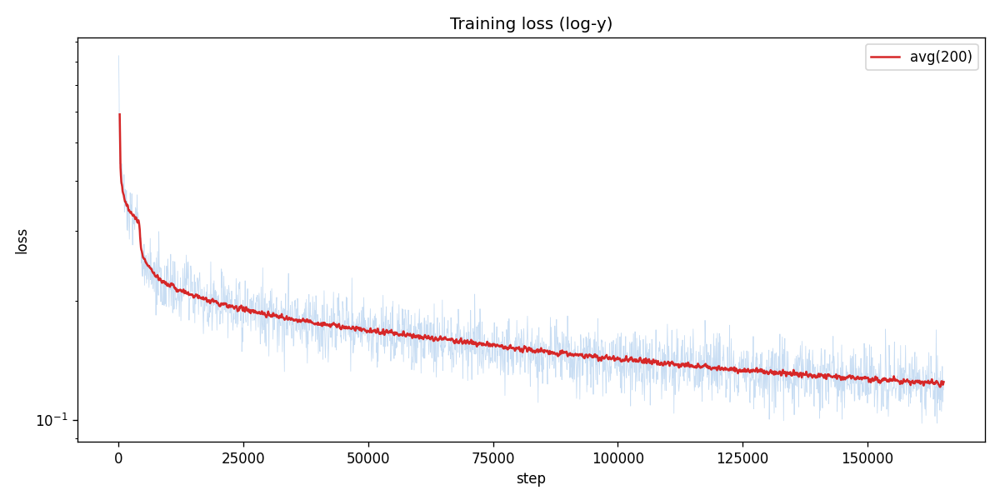
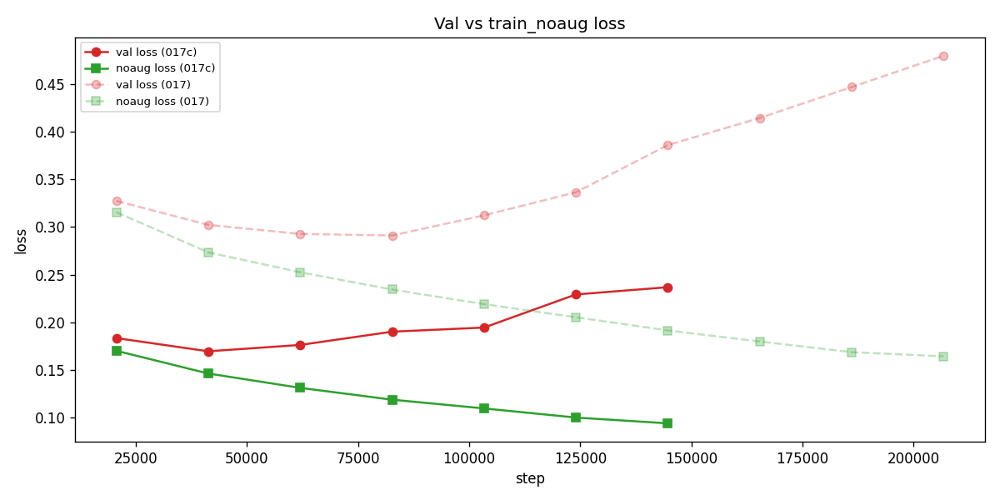
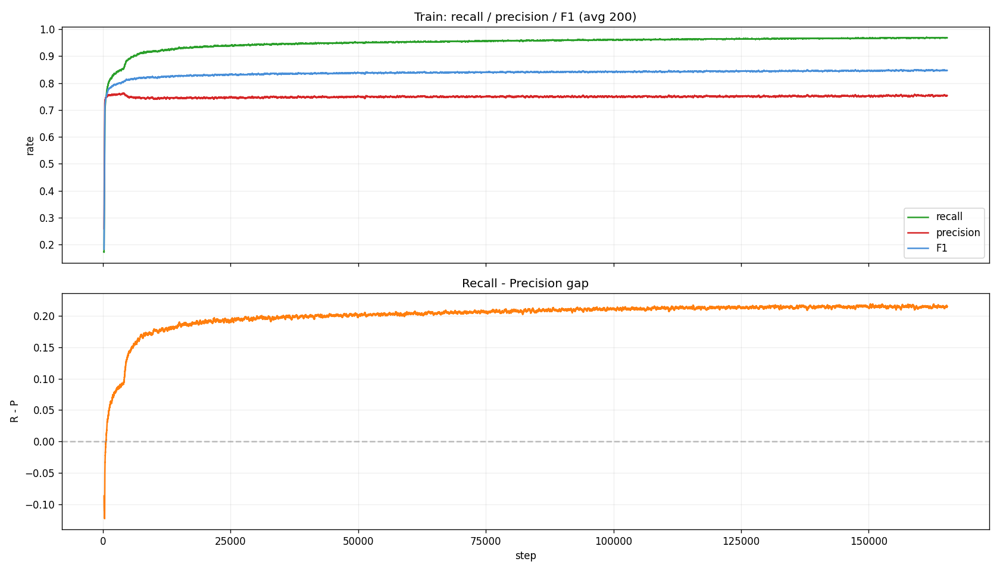
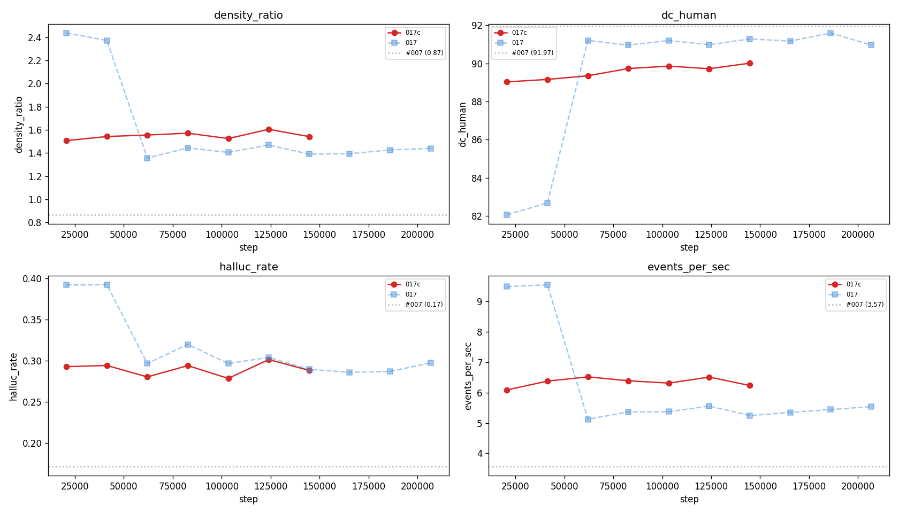
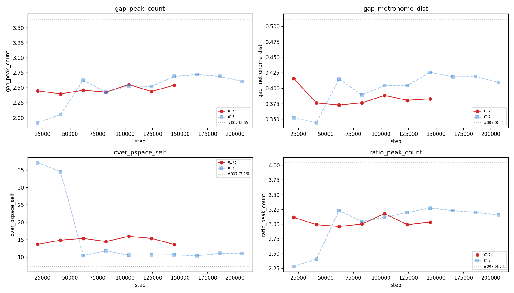
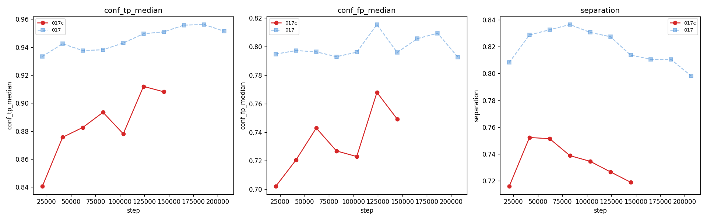

# Experiment 017c — Framewise BCE with low pos_weight

## Status

`Planned`

## Context

[#017](../017-framewise-bce/) proved the framewise framing matches
[#007](../007-time-stretch/) on pattern quality (`dc_human` 91.0 vs
92.0) but over-emits ~44% extra notes (`density_ratio` 1.44,
`hallucination_rate` 0.32). [#017b](../017b-framewise-focal/) showed
focal loss is not the solution — it compressed confidences without
improving selectivity.

Analysis of the dataset reveals the pos_weight mechanism as the likely
cause. With `pos_weight_clamp = [10, 200]`, the typical training
window (11 GT onsets / 500 bins) gives `pos_weight = 44.5` — each
missed positive costs **44x** a false positive. The model rationally
responds by firing at every plausible audio onset to avoid the
asymmetric penalty.

The scalar model ([#007](../007-time-stretch/)) uses softmax-CE where
all 501 bins compete in a single distribution — no explicit positive
weighting, and the competition naturally enforces selectivity. The
framewise model's per-bin BCE has no such competition mechanism, but
lowering pos_weight dramatically reduces the incentive to over-emit.

Dataset statistics (sampled 89,753 windows from taiko2_v1):
- GT=1 bins: 2.54 % (38.4:1 negative-to-positive ratio)
- GT onsets per window: median 11, p5=3, p95=27
- At median (11 onsets), raw pos_weight = 44.5

## Citations

- Direct baseline:
  - [#017 -- framewise BCE](../017-framewise-bce/). `pos_weight_clamp
    = [10, 200]`. Best `density_ratio` 1.44, `dc_human` 91.0,
    `hallucination_rate` 0.32 [exp_017_framewise_bce, step 82,696].
  - [#017b -- framewise focal](../017b-framewise-focal/). Showed
    focal loss compresses confidences without fixing selectivity.
    `density_ratio` stuck at 2.35 [exp_017b_framewise_focal, step
    82,696].
  - [#007 -- TimeStretch](../007-time-stretch/). `density_ratio`
    0.87, `dc_human` 92.0, `hallucination_rate` 0.17
    [exp_007_time_stretch, step 413,480].
- Cross-experiment record: [`../README.md`](../README.md).

---
<!--
PRE-RUN. Do not edit after the run.
-->
─────────────────────────────────────────────────────────────────────

## Hypothesis

### Claim

If `pos_weight_clamp` is reduced from [10, 200] to [3, 8] on the
otherwise-identical #017 architecture, then **AR `density_ratio`
will reach 0.80-1.15** and **`hallucination_rate` will drop below
0.20**, because the model will no longer have a 44x incentive to
fire at every audio onset and will instead learn to be selective
about which beats receive notes.

### Mechanism

With `pos_weight_clamp = [3, 8]`, the typical window (11 GT onsets)
gets pos_weight = 8 (clamped from raw 44.5). A missed onset now
costs only 8 FPs instead of 44 — the model can tolerate a few
missed onsets in exchange for much cleaner output. At the p5 window
(3 onsets, raw 165), the weight clamps to 8 instead of 165 — sparse
charts no longer get runaway recall bias.

The floor of 3 ensures even dense charts (27+ onsets, raw weight
< 18) still get moderate recall pressure, preventing collapse to
all-zeros.

### Predicted numbers

Reference: [#017](../017-framewise-bce/) best (E4) and
[#007](../007-time-stretch/) best (E18).

| Metric | #017 (E4) | #007 | Predicted (#017c) | Notes |
|---|---:|---:|---:|---|
| AR `density_ratio` | 1.44 | 0.87 | **0.80-1.15** must | primary target |
| AR `hallucination_rate` | 0.32 | 0.17 | **<= 0.20** must | consequence of density fix |
| AR `dc_human` | 91.0 | 92.0 | **>= 88** must | may regress if recall drops too much |
| AR `matched_rate` | 0.90 | 0.70 | **0.65-0.80** | expected to drop as over-emission drops |
| AR `error_median_ms` | 6.1 | 10.2 | **<= 12** | timing should hold |
| Recall | 0.990 | n/a | **>= 0.90** | may trade some recall for precision |
| Precision | 0.641 | n/a | **>= 0.70** | should improve with fewer FPs |
| frame F1 | 0.778 | n/a | **>= 0.78** | precision gain + recall loss should net ≈ neutral |
| `conf_fp_median` | 0.793 | n/a | **<= 0.60** | FPs should be less confident with lower reward |
| mini tau50 density_ratio | 4.70 | n/a | **<= 2.5** | raw per-window over-emission |

## Success criteria

- **Must have:** AR `density_ratio` in [0.60, 1.30] at the best eval
  -- over-emission materially reduced vs #017's 1.44.
- **Must have:** AR `dc_human` >= 85 -- pattern quality does not
  regress catastrophically.
- **Must have:** Recall >= 0.85 at any post-warmup eval -- the model
  did not collapse to all-zeros under weak positive pressure.
- **Nice-to-have:** AR `hallucination_rate` <= 0.15 -- below #007.
- **Nice-to-have:** AR `density_ratio` in [0.85, 1.05] -- near-perfect
  density matching.
- **Fails if:** AR `density_ratio` > 1.40 at every eval -- low
  pos_weight did not reduce over-emission (the problem is
  architectural, not loss-weight-driven).
- **Fails if:** Recall < 0.70 at every eval -- pos_weight too low,
  model collapsed.
- **Fails if:** AR `dc_human` < 75 -- catastrophic pattern regression.

## Changes from baseline

Baseline: [#017 -- framewise BCE](../017-framewise-bce/).

**Single change:** `loss.json` `pos_weight_clamp` from [10, 200] to
[3, 8]. All other configs byte-identical.

No code changes — the existing `FramewiseBCELoss` already supports
arbitrary clamp values.

Config snapshots ([`config/`](./config/)):

- `config/model.json` -- byte-identical to #017.
- `config/loss.json` -- `pos_weight_clamp_min: 3.0`,
  `pos_weight_clamp_max: 8.0`.
- `config/adapter.json` -- byte-identical to #017.
- `config/data.json` -- byte-identical to #017.
- `config/trainer.json` -- byte-identical to #017.
- `config/infer.json` -- byte-identical to #017 except checkpoint.

## Run config

- Run name: `exp_017c_framewise_bce_lowweight`.
- Config snapshots: [`config/`](./config/).
- Dataset: `taiko2_v1`.
- Command:
  ```bash
  osu/taiko2/.venv/bin/python -m osu.taiko2.cli.train \
      --run-name exp_017c_framewise_bce_lowweight \
      --config-dir osu/taiko2/experiments/017c-framewise-bce-lowweight/config \
      --dataset taiko2_v1 --device cuda \
      --time-stretch-prob 0.3 --time-stretch-max-scale 1.4 \
      --train-noaug-fraction 0.05 \
      --benchmarks all \
      --compile \
      --infer-corpus-spec osu/taiko2/experiments/017c-framewise-bce-lowweight/config/infer.json \
      --infer-corpus-config osu/taiko2/configs/infer_corpus_per_eval.json
  ```

Future note: a potential architectural approach would make bins
compete directly (e.g. softmax-over-windows, energy-based output,
or a learned NMS layer). Deferred to a later experiment.

─────────────────────────────────────────────────────────────────────
<!--
POST-RUN. Do not fill until the run completes.
-->
─────────────────────────────────────────────────────────────────────

## Results summary

The run trained for 7 evals across 1.75 epochs (steps 20,674 --
144,718) before being stopped. Low pos_weight [3, 8] produced the
best E1 of any framewise run (`dc_human` 89.0, `density_ratio` 1.51,
F1 0.846) and skipped the metronomic collapse that
[#017](../017-framewise-bce/) exhibited at E1-E2. However, the model
hit a **precision plateau** — recall climbed from 0.85 to 0.97 while
precision stayed flat at ~0.74 across all 7 evals. AR metrics
plateaued at E1 levels (`density_ratio` ~1.5, `dc_human` ~89-90) and
never reached [#017](../017-framewise-bce/)'s post-transition
quality (`density_ratio` 1.44, `dc_human` 91.0).

### Headline finding

**Even at 8x asymmetry, pos_weight causes recall-dominated
optimization that prevents precision from developing.** Training
batch analysis shows recall rose +0.099 (0.848 to 0.947) while
precision rose only +0.008 (0.740 to 0.748) — a 12:1 ratio of
recall-to-precision improvement. The recall-precision gap widened
from +0.11 to +0.20 across training, confirming the gradient
path is entirely recall-focused.

The model reached effective recall saturation (~0.96-0.97) by E2-E3
but could not redirect gradient toward precision because the 8x
pos_weight makes any recall sacrifice too expensive. To improve F1
the model needs to fire fewer predictions (increase precision), but
firing fewer means occasionally missing a GT onset, which costs 8x
a false positive — so the model never explores that direction.

### Final vs baseline

`best` = E1 (step 20,674) by F1. `final` = E7 (step 144,718).
Baseline = [#017](../017-framewise-bce/) best (E4, step 82,696).

| Metric | #017 (E4) | 017c best (E1) | 017c final (E7) | Delta (best vs #017) |
|---|---:|---:|---:|---:|
| AR `density_ratio` | 1.44 | 1.51 | 1.54 | +0.07 |
| AR `hallucination_rate` | 0.32 | 0.29 | 0.29 | -0.03 |
| AR `matched_rate` | 0.90 | 0.93 | 0.95 | +0.03 |
| AR `error_median_ms` | 6.10 | 6.65 | 5.39 | +0.55 |
| AR `dc_human` (%) | 91.0 | 89.0 | 90.0 | -2.0 |
| AR `oc_human` (%) | 92.9 | 91.6 | 91.8 | -1.3 |
| AR `events_per_sec` | 5.37 | 6.09 | 6.24 | +0.72 |
| `over_pspace_self` | 11.7 | 13.7 | 13.6 | +2.0 |
| `gap_metronome_dist` | 0.389 | 0.416 | 0.383 | +0.027 |
| `gap_peak_count` | 2.43 | 2.45 | 2.54 | +0.02 |
| frame F1 | 0.778 | **0.846** | 0.834 | **+0.068** |
| frame Precision | 0.641 | **0.757** | 0.738 | **+0.116** |
| frame Recall | 0.990 | 0.958 | 0.958 | -0.032 |
| `conf_tp_median` | 0.938 | 0.841 | 0.908 | -0.097 |
| `conf_fp_median` | 0.793 | 0.702 | 0.749 | -0.091 |
| Separation | 0.837 | 0.716 | 0.719 | -0.121 |
| val `loss` | 0.291 | 0.184 | 0.237 | -0.107 |
| train_noaug `loss` | 0.234 | 0.170 | 0.094 | -0.064 |
| first_note tau70 hit | n/a | **0.772** | 0.765 | n/a |
| cal/ece | n/a | 0.041 | 0.028 | n/a |

### Per-eval progression

| E | Step | Epoch | loss | na_loss | gap | F1 | Prec | Recall | AR dens | AR dc | AR eps | op_self |
|---:|---:|---:|---:|---:|---:|---:|---:|---:|---:|---:|---:|---:|
| 1 | 20,674 | 0 | 0.184 | 0.170 | +0.013 | 0.846 | 0.757 | 0.958 | 1.51 | 89.0 | 6.09 | 13.7 |
| 2 | 41,348 | 0 | 0.170 | 0.146 | +0.023 | 0.838 | 0.739 | 0.968 | 1.54 | 89.2 | 6.38 | 14.8 |
| 3 | 62,022 | 0 | 0.176 | 0.131 | +0.045 | 0.835 | 0.733 | 0.969 | 1.56 | 89.4 | 6.52 | 15.3 |
| 4 | 82,696 | 0 | 0.190 | 0.119 | +0.071 | 0.837 | 0.740 | 0.963 | 1.57 | 89.7 | 6.39 | 14.4 |
| 5 | 103,370 | 1 | 0.195 | 0.110 | +0.085 | 0.837 | 0.740 | 0.963 | 1.52 | 89.9 | 6.32 | 15.9 |
| 6 | 124,044 | 1 | 0.229 | 0.100 | +0.129 | 0.826 | 0.723 | 0.964 | 1.60 | 89.7 | 6.51 | 15.3 |
| 7 | 144,718 | 1 | 0.237 | 0.094 | +0.143 | 0.834 | 0.738 | 0.958 | 1.54 | 90.0 | 6.24 | 13.6 |

Machine-readable copies: [`metrics.json`](./metrics.json).

## Visualizations


*Training loss (log-y). Converges to E2 then diverges — overfitting.*


*Val vs train_noaug loss overlaid with #017 BCE. Same overfitting
shape, earlier onset due to lower pos_weight providing less
regularization.*


*Training batch recall, precision, F1 over steps. Recall climbs
+0.10 while precision is flat at ~0.75. The R-P gap widens from
+0.11 to +0.20 — the model exclusively improves recall.*


*AR corpus metrics overlaid with #017 and #007 reference.
density_ratio flat at ~1.5 (017c never gets the E3 transition
that 017 had). dc_human flat at ~89-90.*


*Pattern metrics. gap_peak_count and ratio_peak_count start higher
than 017 but plateau — the model learns basic rhythm complexity
early then stops.*


*conf_tp_median rises toward 0.91 but conf_fp_median rises with it
(0.75) — the gap doesn't widen. Separation stays around 0.72, well
below 017's 0.84.*

## Vs prediction

| Metric | Predicted | Actual (best) | Verdict |
|---|---:|---:|---|
| AR `density_ratio` 0.60-1.30 must | 1.51 | **FAIL** |
| AR `dc_human` >= 85 must | 89.0 | **PASS** |
| Recall >= 0.85 must | 0.958 | **PASS** |
| AR `hallucination_rate` <= 0.15 nice | 0.29 | **FAIL** |
| AR `density_ratio` 0.85-1.05 nice | 1.51 | **FAIL** |
| AR `density_ratio` > 1.40 at every eval (fail-if) | 1.51-1.60 | **TRIGGERED** |
| Recall < 0.70 (fail-if) | 0.958 | **not triggered** |
| AR `dc_human` < 75 (fail-if) | 89.0 | **not triggered** |

**Summary**: 2 of 3 must-haves PASSED but the primary target
(`density_ratio` in [0.60, 1.30]) FAILED. The fail-criterion
`density_ratio > 1.40 at every eval` TRIGGERED — the model never
broke below 1.51. Low pos_weight improved E1 quality but did not
solve the over-emission problem.

## Takeaways

- **Low pos_weight [3, 8] eliminates the metronomic collapse.**
  017c never entered the "fire at everything" regime that 017 and
  017b exhibited at E1-E2. `over_pspace_self` started at 13.7 (vs
  017's 37.1), confirming the metronomic phase is a direct
  consequence of high pos_weight driving runaway recall.

- **Best E1 of any framewise run.** F1 0.846, precision 0.757,
  `dc_human` 89.0 — all better than any other 017-family experiment
  at the same training stage. The low weighting lets the model
  develop balanced predictions from the start.

- **Precision plateaus at ~0.74 regardless of training time.** The
  training batch analysis is unambiguous: recall gained +0.099 while
  precision gained +0.008 over 43k steps. The 8x loss asymmetry
  routes all gradient to recall. Once recall saturates at ~0.96,
  there is no gradient pressure to improve precision because the
  loss penalizes recall loss 8x more than precision gain.

- **The model cannot explore "fire less" under asymmetric loss.**
  To increase precision, the model must suppress some predictions.
  Suppressing a prediction that was a GT onset costs 8x. The model
  would need to "get lucky" — suppress only FPs and keep all TPs —
  but the gradient doesn't distinguish between the two. The model
  is stuck at the precision plateau because the only path to
  improvement requires temporarily accepting recall loss that the
  loss function forbids.

- **AR metrics plateaued at E1 levels and never improved.**
  `density_ratio` oscillated in [1.51, 1.60] across 7 evals.
  `dc_human` crept from 89.0 to 90.0 but never reached 017's
  post-transition 91.0. The E3 phase transition from 017 did
  not occur — 017c started past the metronomic regime but couldn't
  progress further because precision is the bottleneck.

- **Calibration is excellent (ECE 0.028-0.041).** The model's
  confidence values are well-calibrated — when it says 0.9, ~70%
  are truly positive. The threshold sweep at tau=70 gives estimated
  AR density ~1.1 and first-note hit rate 0.77 (matching #007).
  The model is internally good at ranking; the problem is that it
  emits too many high-confidence predictions.

## Followup questions

- **#017e — pos_weight=1 (no weighting).** Remove all asymmetry.
  The scalar model (#007) uses softmax-CE with no explicit
  pos_weight; per-bin BCE with pos_weight=1 is the closest analog.
  Recall and precision should develop together since the gradient is
  symmetric. Risk: the 38:1 class imbalance may cause the model to
  predict all-zeros (literature concern). But #007 proves the task
  is solvable without explicit weighting.
- **Architectural change — bin competition.** The fundamental
  difference between softmax-CE (#007) and per-bin BCE is that
  softmax forces bins to compete for probability mass. A future
  experiment could add a learned NMS layer, a softmax-over-windows
  head, or an energy-based output that enforces competition without
  changing the loss.
