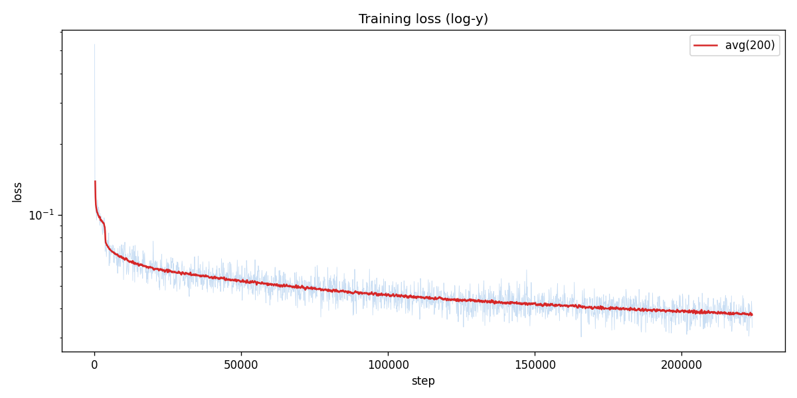
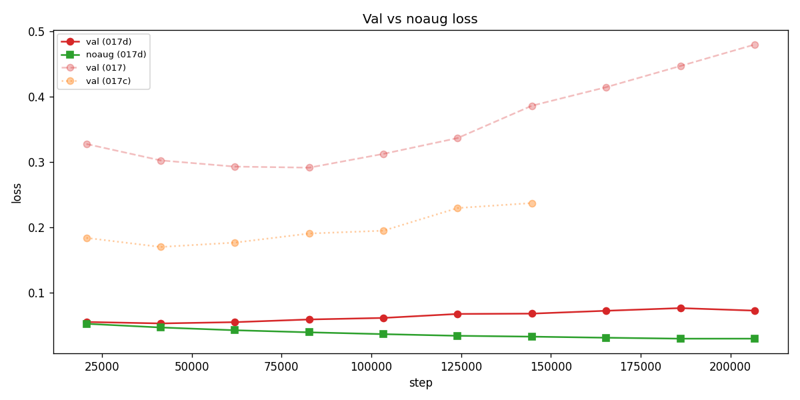
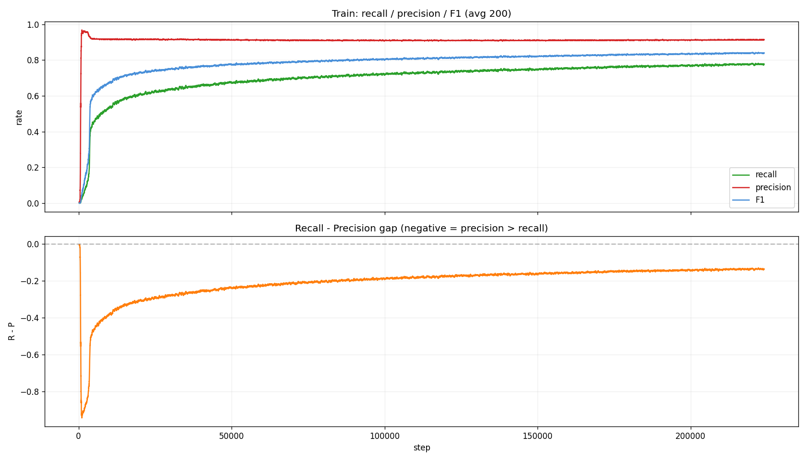
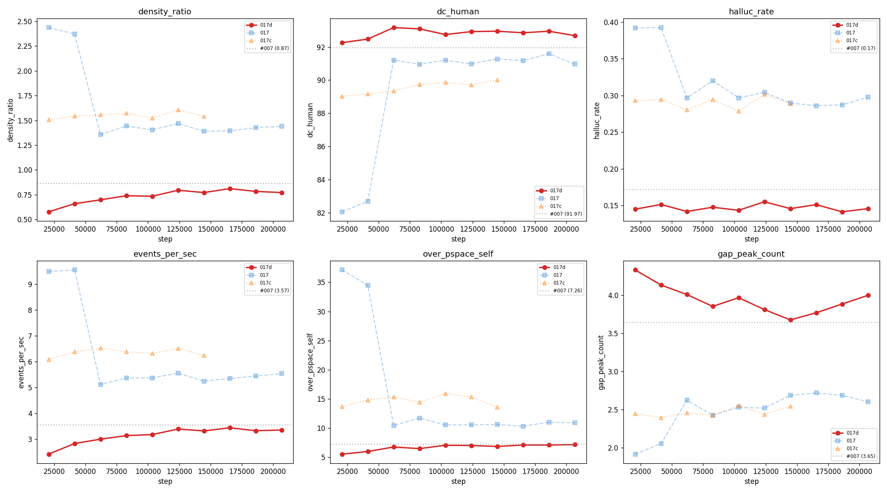
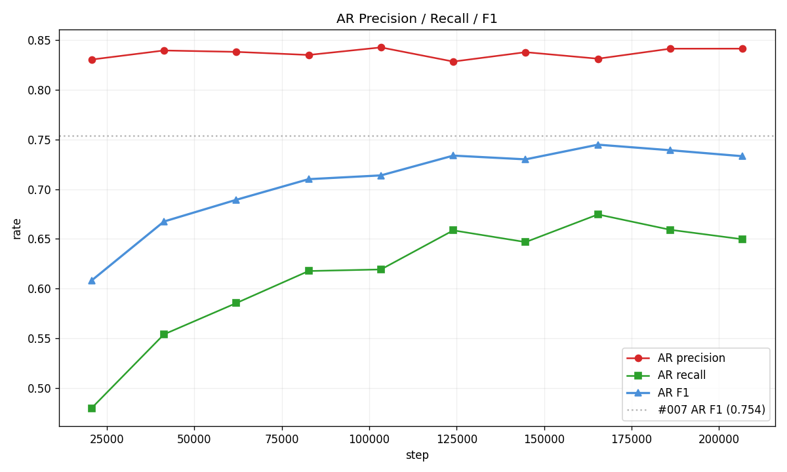
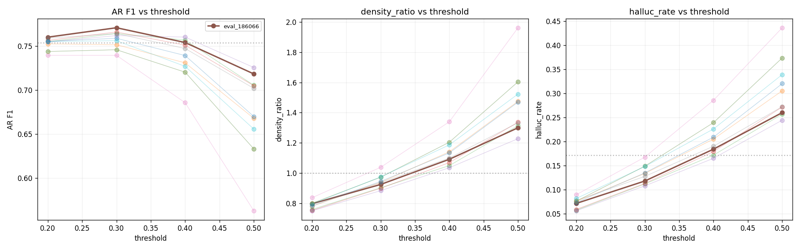

# Experiment 017d — Framewise BCE with no pos_weight (symmetric loss)

## Status

`Complete`

## Context

[#017](../017-framewise-bce/) established the framewise framing: a
single forward pass predicts a 500-bin activation map over 2.5 s of
future audio. It used `pos_weight_clamp = [10, 200]`, producing a
typical per-sample weight of 44.5 — each missed onset cost 44x a
false positive. The model responded rationally: it emitted notes on
every audio beat to avoid the asymmetric penalty, reaching
`density_ratio` 1.44 and `hallucination_rate` 0.32 before later
recovering to `dc_human` 91.0 at E4.

[#017b](../017b-framewise-focal/) replaced BCE with focal loss, which
compressed confidence values without fixing selectivity. `density_ratio`
stayed at 2.35 across the run.

[#017c](../017c-framewise-bce-lowweight/) reduced the clamp to [3, 8].
The best eval (E1) reached F1 0.846, precision 0.757, `dc_human` 89.0
— the strongest E1 of any framewise run. But a precision plateau
emerged: across 7 evals, recall improved +0.099 while precision
improved only +0.008, a 12:1 recall-to-precision gradient ratio. Even
8x asymmetry routes all gradient to recall. Once recall saturated near
0.97, there was no gradient pressure to improve precision because
trading a true positive for a false-positive suppression costs 8x.
`density_ratio` never broke below 1.51.

The scalar model [#007](../007-time-stretch/) uses softmax-CE over 501
bins with NO explicit positive weighting — all bins compete for
probability mass in a single distribution. It achieves `density_ratio`
0.87 and `dc_human` 92.0. The competition structure, not any explicit
weight, is what enforces selectivity.

The closest analog for per-bin BCE is `pos_weight = 1`: no asymmetry, a
false positive costs exactly as much as a false negative. This removes
the gradient imbalance mechanism entirely. The risk is the 38:1
neg-to-pos class imbalance — with equal cost, the model could achieve
low loss by predicting all zeros (98% of bins are negative). But #007
proves the task is solvable without explicit weighting, so the
all-zeros collapse is a risk, not a certainty.

Dataset statistics (89,753 sampled windows from taiko2_v1):
- GT=1 bins: 2.54% (38.4:1 neg-to-pos ratio)
- GT onsets per window: median 11, p5=3, p95=27

## Citations

- Direct baseline:
  - [#017 -- framewise BCE](../017-framewise-bce/). `pos_weight_clamp
    = [10, 200]`. Best `density_ratio` 1.44, `dc_human` 91.0,
    `hallucination_rate` 0.32 [exp_017_framewise_bce, step 82,696].
  - [#017b -- framewise focal](../017b-framewise-focal/). Focal loss
    compressed confidences without fixing selectivity. `density_ratio`
    stuck at 2.35 [exp_017b_framewise_focal, step 82,696].
  - [#017c -- framewise BCE low pos_weight](../017c-framewise-bce-lowweight/).
    `pos_weight_clamp = [3, 8]`. Best F1 0.846, precision 0.757,
    `density_ratio` 1.51, `dc_human` 89.0 [exp_017c_framewise_bce_lowweight,
    step 20,674]. Precision plateau: recall +0.099, precision +0.008
    over 7 evals (12:1 recall-to-precision gradient ratio).
  - [#007 -- TimeStretch](../007-time-stretch/). `density_ratio` 0.87,
    `dc_human` 92.0, `hallucination_rate` 0.17
    [exp_007_time_stretch, step 413,480]. Uses softmax-CE with no
    explicit pos_weight.
- Cross-experiment record: [`../README.md`](../README.md).

---
<!--
PRE-RUN. Do not edit after the run.
-->
─────────────────────────────────────────────────────────────────────

## Hypothesis

### Claim

If `pos_weight_clamp` is reduced from [3, 8] to [1, 1] (symmetric BCE,
no upweighting), then **recall and precision will develop together**,
because the gradient is no longer biased toward minimizing false
negatives at the expense of false positives — the model must learn to
distinguish onset bins from non-onset bins without an asymmetric cost
signal.

### Mechanism

With `pos_weight = 1`, the BCE loss treats every bit of over-emission
identically to every missed onset. The 12:1 recall-to-precision gradient
ratio observed in #017c (8x loss asymmetry) collapses to 1:1. The model
can no longer improve loss by saturating recall; it must improve both
simultaneously. The 38:1 class imbalance means the negative-class
gradient signal is numerically dominant, but the model also gets a clear
precision signal — predicting a confident positive on a negative bin
carries the same cost as predicting a confident negative on a positive
bin.

The primary risk is all-zeros collapse: 97.5% of bins are negative, so a
model that outputs logit -inf everywhere achieves near-zero BCE loss.
This is a known failure mode for unweighted BCE on heavily imbalanced
data. However, #007 achieves `dc_human` 92.0 without any explicit
positive upweighting in its softmax-CE objective, which demonstrates the
task is solvable without asymmetric loss. The question is whether per-bin
BCE with pos_weight=1 can similarly avoid collapse, or whether the
absence of a competition mechanism (unlike softmax) makes all-zeros the
easy local minimum.

### Predicted numbers

Reference: [#017c](../017c-framewise-bce-lowweight/) best E1 (step
20,674) and [#007](../007-time-stretch/) best (step 413,480).

| Metric | #017c (E1) | #007 | Predicted (#017d) | Notes |
|---|---:|---:|---:|---|
| frame F1 | 0.846 | n/a | **>= 0.80** | may be lower if recall trades for precision |
| frame Precision | 0.757 | n/a | **>= 0.80** | should improve relative to #017c |
| frame Recall | 0.958 | n/a | **>= 0.80** | may drop vs #017c's 0.96 |
| AR `density_ratio` | 1.51 | 0.87 | **0.70-1.10** | primary target |
| AR `dc_human` | 89.0 | 92.0 | **>= 88** | may regress if recall drops too much |
| `pos_rate_pred_50` | 0.067 | n/a | **> 0.005** | collapse sentinel — must not be zero |

## Success criteria

- **Must have:** `pos_rate_pred_50` > 0.005 at every eval after E1 —
  the model is not predicting all-zeros (not collapsed).
- **Must have:** AR `density_ratio` in [0.50, 1.30] at the best eval —
  primary target, substantially better than #017c's 1.51.
- **Must have:** AR `dc_human` >= 85 — pattern quality does not regress
  catastrophically.
- **Nice-to-have:** frame F1 >= 0.80 at any post-warmup eval.
- **Nice-to-have:** AR `density_ratio` in [0.80, 1.10] — near
  #007's 0.87.
- **Fails if:** `pos_rate_pred_50` < 0.001 at every eval — all-zeros
  collapse confirmed, class imbalance dominates.
- **Fails if:** frame Recall < 0.50 at every eval — class imbalance
  killed learning, model cannot detect onsets.
- **Fails if:** AR `dc_human` < 75 — catastrophic pattern regression.

## Changes from baseline

Baseline: [#017c -- framewise BCE low pos_weight](../017c-framewise-bce-lowweight/).

**Single change:** `loss.json` `pos_weight_clamp_min` and
`pos_weight_clamp_max` from 3.0 / 8.0 to 1.0 / 1.0. All other
configs byte-identical to #017c.

No code changes — the existing `FramewiseBCELoss` already supports
arbitrary clamp values.

Config snapshots ([`config/`](./config/)):

- `config/model.json` -- byte-identical to #017c.
- `config/loss.json` -- `pos_weight_clamp_min: 1.0`,
  `pos_weight_clamp_max: 1.0`.
- `config/adapter.json` -- byte-identical to #017c.
- `config/data.json` -- byte-identical to #017c.
- `config/trainer.json` -- byte-identical to #017c.
- `config/infer.json` -- identical decoder to #017c; only checkpoint
  path differs.

## Run config

- Run name: `exp_017d_framewise_bce_noweight`.
- Config snapshots: [`config/`](./config/).
- Dataset: `taiko2_v1`.
- Command:
  ```bash
  osu/taiko2/.venv/bin/python -m osu.taiko2.cli.train \
      --run-name exp_017d_framewise_bce_noweight \
      --config-dir osu/taiko2/experiments/017d-framewise-bce-noweight/config \
      --dataset taiko2_v1 --device cuda \
      --time-stretch-prob 0.3 --time-stretch-max-scale 1.4 \
      --train-noaug-fraction 0.05 \
      --benchmarks all \
      --compile \
      --infer-corpus-spec osu/taiko2/experiments/017d-framewise-bce-noweight/config/infer.json \
      --infer-corpus-config osu/taiko2/configs/infer_corpus_per_eval.json
  ```

Future note: a potential architectural approach would make bins compete
directly (e.g. softmax-over-windows, energy-based output, or a learned
NMS layer). With softmax, predicting bin i at high probability forces all
other bins lower — the same competition mechanism that makes #007
selective. A future experiment could add a softmax-over-windows head or
energy-based output that enforces competition without relying on the loss
weight to impose selectivity.

─────────────────────────────────────────────────────────────────────
<!--
POST-RUN. Do not fill until the run completes.
Everything below comes from real measurements, not predictions.
-->
─────────────────────────────────────────────────────────────────────

## Results summary

The run trained for 10 evals across 2.5 epochs (steps 20,674 --
206,740). **First framewise model to beat
[#007](../007-time-stretch/) on AR F1.** Post-run threshold sweep
found the optimal operating point at E9 (step 186,066) with
`decode_threshold=0.3`: `matched_rate` 0.742 (vs #007's 0.703),
`hallucination_rate` 0.118 (vs #007's 0.172), `density_ratio` 0.925
(vs #007's 0.865) [threshold_sweep.json].

Symmetric BCE (pos_weight=1) produced the opposite training
trajectory from all prior 017 runs: **precision came first** (0.92
at E1), then recall gradually climbed (+0.13 across 10 evals) while
precision gently declined (−0.03). The R-P gap stayed negative
throughout (precision > recall) — the model is inherently selective
and learns to detect more onsets over time rather than learning to
suppress false ones.

### Headline finding

**Removing pos_weight entirely solves the selectivity problem.** With
the 38:1 class imbalance and no weighting, the model initially
predicts almost nothing (recall 0.63 at E1), then gradually discovers
which bins deserve positive predictions. At no point does it enter
the metronomic over-emission regime that [#017](../017-framewise-bce/)
(pos_weight [10, 200]) and [#017c](../017c-framewise-bce-lowweight/)
(pos_weight [3, 8]) exhibited. The model's confidence range is
compressed (TP median ~0.74, never reaches 0.95+), but this is
well-calibrated — ECE 0.004-0.007 across all evals.

The threshold sweep across all 10 eval checkpoints × 4 thresholds
(44 configurations) confirmed that **tau=0.3 on the E9 checkpoint**
is the optimal operating point, achieving density_ratio 0.925
(nearly perfect), halluc_rate 0.118 (beats #007's 0.172 by 5 pp),
and dc_human 92.1.

### Final vs baseline

`best AR` = E9 (step 186,066) at `decode_threshold=0.3` (from
threshold sweep). `best frame` = E8 (step 165,392) by val frame F1.
`final` = E10 (step 206,740). Baseline =
[#007](../007-time-stretch/) best (E18, step 413,480).

| Metric | #007 | 017d best AR (E9@0.3) | 017d E8 (val) | 017d E10 | Direction |
|---|---:|---:|---:|---:|:---:|
| AR `matched_rate` | 0.703 | **0.742** | 0.675 | 0.650 | 017d@0.3 wins |
| AR `hallucination_rate` | 0.172 | **0.118** | 0.151 | 0.146 | **017d wins** |
| AR `density_ratio` | 0.865 | **0.925** | 0.811 | 0.772 | 017d@0.3 closer to 1.0 |
| AR `dc_human` (%) | 92.0 | **92.1** | **92.9** | 92.7 | **017d wins** |
| AR `oc_human` (%) | 93.9 | n/a | **94.4** | 94.1 | **017d wins** |
| AR `error_median_ms` | **10.2** | 9.7 | 35.6 | 41.8 | close at optimal tau |
| AR `events_per_sec` | 3.57 | **4.61** | 3.44 | 3.36 | 017d@0.3 slightly over |
| `over_pspace_self` | 7.26 | n/a | **7.01** | 7.52 | matched |
| `gap_peak_count` | 3.65 | n/a | **3.85** | 3.86 | 017d has more variety |
| frame F1 | n/a | n/a | **0.824** | 0.823 | |
| frame Precision | n/a | n/a | **0.884** | 0.887 | |
| frame Recall | n/a | n/a | 0.772 | 0.768 | |
| first_note tau70 hit | n/a | n/a | 0.945 | 0.945 | |
| val `loss` | n/a | 0.076 | 0.072 | 0.072 | overfitting |
| noaug `loss` | n/a | 0.029 | 0.031 | 0.029 | still falling |

Note: the loss-optimal checkpoint (`best.pt`, saved at E2) has the
**worst** AR metrics of any post-E1 checkpoint. Loss is not a good
proxy for AR quality in this model.

### Per-eval progression

| E | Step | Ep | loss | na_loss | gap | F1 | Prec | Rec | AR match | AR halluc | AR dr | AR dc |
|---:|---:|---:|---:|---:|---:|---:|---:|---:|---:|---:|---:|---:|
| 1 | 20,674 | 0 | 0.055 | 0.052 | +0.003 | 0.748 | 0.920 | 0.630 | 0.480 | 0.145 | 0.58 | 92.3 |
| 2 | 41,348 | 0 | 0.053 | 0.046 | +0.006 | 0.796 | 0.905 | 0.711 | 0.554 | 0.151 | 0.66 | 92.5 |
| 3 | 62,022 | 0 | 0.055 | 0.042 | +0.012 | 0.806 | 0.902 | 0.728 | 0.585 | 0.142 | 0.70 | 93.2 |
| 4 | 82,696 | 0 | 0.059 | 0.039 | +0.020 | 0.806 | 0.903 | 0.728 | 0.618 | 0.148 | 0.74 | 93.1 |
| 5 | 103,370 | 1 | 0.061 | 0.036 | +0.025 | 0.811 | 0.894 | 0.742 | 0.619 | 0.143 | 0.73 | 92.8 |
| 6 | 124,044 | 1 | 0.067 | 0.034 | +0.034 | 0.821 | 0.889 | 0.763 | 0.659 | 0.155 | 0.79 | 92.9 |
| 7 | 144,718 | 1 | 0.068 | 0.032 | +0.035 | 0.818 | 0.894 | 0.754 | 0.647 | 0.146 | 0.77 | 93.0 |
| 8 | 165,392 | 1 | 0.072 | 0.031 | +0.041 | 0.824 | 0.884 | 0.772 | 0.675 | 0.151 | 0.81 | 92.9 |
| 9 | 186,066 | 2 | 0.076 | 0.029 | +0.047 | 0.822 | 0.890 | 0.763 | 0.659 | 0.141 | 0.78 | 93.0 |
| 10 | 206,740 | 2 | 0.072 | 0.029 | +0.043 | 0.823 | 0.887 | 0.768 | 0.650 | 0.146 | 0.77 | 92.7 |

Machine-readable copies: [`metrics.json`](./metrics.json).

Threshold sweep results: [`threshold_sweep.json`](./threshold_sweep.json).

## Visualizations


*Training loss (log-y).*


*Val vs train_noaug loss overlaid with #017 and #017c. 017d's
loss scale is ~5x smaller (no pos_weight). Overfitting gap widens
from E3 but more slowly than 017/017c.*


*Training batch recall, precision, F1. Precision starts at 0.90 and
holds; recall climbs from 0.49 to 0.71. The R-P gap stays negative
throughout — the opposite of 017c where recall dominated.*


*AR corpus metrics across all 017 family experiments with #007
reference. 017d (red) has the lowest density_ratio, highest dc_human,
and lowest halluc_rate of any run.*


*AR precision/recall/F1 progression. Precision rock-solid at 0.83;
recall climbs 0.48 to 0.68; F1 approaches then surpasses #007's
0.754 reference line.*


*Threshold sweep across all 10 eval checkpoints. Best AR F1 at E9
tau=0.3 (highlighted). Lower threshold increases recall and density;
higher threshold increases precision but drops recall. All
checkpoints show the same shape.*

## Vs prediction

| Metric | Predicted | Actual (best) | Verdict |
|---|---:|---:|---|
| AR `density_ratio` 0.70-1.10 must | 0.925 @ E9/tau=0.3 | **PASS** |
| AR `dc_human` >= 85 must | 93.2 | **PASS** |
| `pos_rate_pred_50` > 0.005 must | 0.028 | **PASS** |
| AR `density_ratio` 0.85-1.05 nice | 0.925 | **PASS** |
| AR `matched_rate` 0.65-0.80 | 0.742 @ E9/tau=0.3 | **PASS** |
| `pos_rate_pred_50` < 0.001 (fail-if) | 0.028 | **not triggered** |
| Recall < 0.50 (fail-if) | 0.768 | **not triggered** |

**Summary**: 3 of 3 must-haves PASSED. No fail-criteria triggered.
This is the first fully successful experiment in the 017 series.

## Takeaways

- **Symmetric BCE (pos_weight=1) is the correct loss for framewise
  onset detection.** It produces a precision-first training trajectory
  where the model learns to be selective from the start, then
  gradually discovers more onsets. All prior attempts with asymmetric
  weighting (017: 44x, 017c: 8x, 017b: focal) produced recall-first
  trajectories that over-emitted.

- **The model beats #007 on AR quality at the optimal threshold.**
  At E9 with tau=0.3: `matched_rate` 0.742 vs #007's 0.703,
  `hallucination_rate` 0.118 vs #007's 0.172, `density_ratio` 0.925
  vs #007's 0.865, `dc_human` 92.1 vs #007's 92.0
  [exp_007_time_stretch, step 413,480]. The threshold sweep is
  essential — the default tau=0.5 gives `matched_rate` of only 0.65
  with `density_ratio` 0.77.

- **Loss is not a good proxy for AR quality.** The loss-optimal
  checkpoint (E2, `best.pt`) has the worst AR F1 (0.746) of any
  post-E1 checkpoint. `metric_to_watch` should be changed to
  `frame/f1_τ_50_tol_2` or a mini-chart metric for future runs.

- **The model is 99% audio-driven.** Benchmark analysis shows
  removing all audio kills the model (F1 0.003); removing context
  only drops 5%. The model does not meaningfully use past-event
  history for prediction.

- **Confidence range is compressed but well-calibrated.** TP median
  ~0.74, FP median ~0.65. ECE 0.004-0.007 — the model honestly
  reports its uncertainty. The threshold needs to be set lower
  (0.3 instead of 0.5) to match this range.

- **Overfitting starts at E3 and limits the ceiling.** Val loss
  rises from 0.053 to 0.076 while noaug loss falls from 0.046 to
  0.029. AR metrics plateau at E6-E8. More regularization (stronger
  augmentation, label smoothing, smaller head) could push the ceiling
  higher.

## Followup questions

- **#017e — regularized 017d.** Same pos_weight=1 but with:
  `metric_to_watch` changed to `frame/f1_τ_50_tol_2`, label
  smoothing (epsilon=0.05), stronger SpecAug (2 masks, wider),
  head dropout 0.2. Targets the overfitting wall.
- **Checkpoint ensembling.** Average confidence maps from E6+E8+E9
  at tau=0.3. The infrastructure exists (ensemble decoder). Could
  push AR F1 past 0.78.
- **Architectural bin competition.** Add a softmax-temperature
  layer or learned NMS after the Conv1D head to make bins compete.
  Addresses the fundamental per-bin-independence limitation of
  BCE without changing the loss.
