# Experiment 017f — Framewise BCE metrics rerun

## Status

`Complete`

## Context

[#017e](../017e-framewise-bce-regularized/) is the strongest framewise
model to date, but its metrics infrastructure has significant gaps.
The AR corpus comparison uses `matched_rate` and `hallucination_rate`
as primary metrics -- both are threshold-based counts at fixed 25 ms /
100 ms tolerances that conflate timing precision with onset detection
accuracy. The evaluation also lacks standard precision/recall/F1 and
has no way to measure quality at different temporal resolutions.

This experiment is a **clean re-training** of the identical 017e
model/loss/data configuration with the upgraded metrics pipeline:

1. **Multi-resolution FPS comparisons** (1, 2, 4, 10, 20, 50, 100,
   200 FPS): binary precision/recall/F1 and count MAE/correlation/
   accuracy at each temporal resolution. This separates "did the model
   get the right 20ms window" (50 FPS) from "did it hit the exact
   5ms bin" (200 FPS).
2. **Standard precision/recall/F1** at 25 ms tolerance on
   `ChartComparison`.
3. **Dense gap/ratio histograms** saved per chart for post-hoc
   distribution analysis.
4. **Per-chart step logs** and bundles always saved (no longer gated
   by flags).

The watched metric changes from `frame/f1_tau_50_tol_2` (frame-level
F1 at threshold 0.50, 2-frame tolerance) to
`frame/mini/tau50/fps_50/binary_f1` (mini-chart binary F1 at 50 FPS
resolution, threshold 0.50). This metric directly measures "in each
20 ms window, did the model agree with GT on whether an onset exists"
-- a resolution-aware proxy for AR chart quality.

No model, loss, data, or augmentation changes. The only functional
difference is the watched metric for `best.pt` selection; all other
training dynamics are identical.

## Citations

- Direct baseline:
  - [#017e -- framewise BCE regularized](../017e-framewise-bce-regularized/).
    Best sweep: E8 (step 165,392), tau=0.40, `matched_rate` 0.783,
    `hallucination_rate` 0.201, `density_ratio` 1.020, `dc_human` 92.7,
    `error_median_ms` 10.3
    [exp_017e_framewise_bce_regularized, threshold_sweep.json].
    Best F1: E11 (step 227,414), F1 0.827, Precision 0.882, Recall 0.779.
- Related priors:
  - [#017d -- framewise BCE noweight](../017d-framewise-bce-noweight/).
    `matched_rate` 0.742 at E9/tau=0.3
    [exp_017d_framewise_bce_noweight, threshold_sweep.json].
  - [#007 -- TimeStretch](../007-time-stretch/). `matched_rate` 0.703,
    `hallucination_rate` 0.172, `density_ratio` 0.865, `dc_human` 92.0
    [exp_007_time_stretch, step 413,480].

---
<!--
PRE-RUN. Do not edit after the run.
-->
---------------------------------------------------------------------

## Hypothesis

### Claim

This is a metrics-collection rerun, not a hypothesis-driven
experiment. The model, loss, and data are identical to
[#017e](../017e-framewise-bce-regularized/). The purpose is to
establish clean baselines with the upgraded metrics pipeline
(FPS-resolution comparisons, precision/recall/F1, dense histograms,
per-chart step logs) that were absent in prior runs.

### Mechanism

Training dynamics will match 017e because nothing changes except the
watched metric (`frame/mini/tau50/fps_50/binary_f1` vs
`frame/f1_tau_50_tol_2`). The new watched metric may select a
different checkpoint as `best.pt`, but the per-eval trajectory should
be statistically equivalent given the same seed, data, and
hyperparameters.

### Predicted numbers

Reference: [#017e](../017e-framewise-bce-regularized/) E8/tau=0.40
sweep [exp_017e_framewise_bce_regularized, threshold_sweep.json] and
[#007](../007-time-stretch/) step 413,480.

017e AR corpus numbers below are at `decode_threshold=0.3` (the
infer.json setting, same as 017f). The sweep result at tau=0.40
had different operating-point characteristics (`density_ratio` 1.020,
`matched_rate` 0.783
[exp_017e_framewise_bce_regularized, threshold_sweep.json]); a
post-run threshold sweep on 017f will produce comparable @0.4 numbers
with the new metrics.

| Metric | #017e @0.3 | #017e @0.4 (sweep) | Predicted (#017f @0.3) | Notes |
|---|---:|---:|---:|---|
| AR `precision` (25ms) | n/a | n/a | **new baseline** | not measured in 017e |
| AR `recall` (25ms) | n/a | n/a | **new baseline** | not measured in 017e |
| AR `f1` (25ms) | n/a | n/a | **new baseline** | not measured in 017e |
| AR `density_ratio` (median) | 1.209 | 1.020 | **~1.21** | should match 017e @0.3 |
| AR `dc_human` (median %) | 93.3 | 92.7 | **~93** | should match 017e @0.3 |
| AR `matched_rate` (median) | 0.892 | 0.783 | **~0.89** | legacy, kept for comparison |
| frame F1 (best eval) | 0.827 | -- | **0.82-0.84** | should match 017e |
| `binary_f1` @ 50 FPS | n/a | n/a | **new baseline** | watched metric |
| `binary_f1` @ 200 FPS | n/a | n/a | **new baseline** | per-bin resolution |
| `count_corr` @ 50 FPS | n/a | n/a | **new baseline** | onset count correlation |
| `gap_hist_tvd` | n/a | n/a | **new baseline** | gap distribution distance |
| `ratio_hist_tvd` | n/a | n/a | **new baseline** | ratio distribution distance |
| `density_corr` | n/a | n/a | **new baseline** | per-second density correlation |

## Success criteria

- **Must:** frame F1 trajectory matches 017e within noise (same seed,
  same config). Best frame F1 should land within 0.01 of 017e's 0.827.
- **Must:** all new metrics (FPS comparisons, precision/recall/f1,
  dense histograms, distributional comparisons) populate correctly in
  `metrics.jsonl`, per-chart JSONs, `fps_summary.json`, and
  per-chart comparison JSONs.
- **Must:** AR corpus `density_ratio` median near 1.21 (matching 017e
  at decode_threshold=0.3 [exp_017e, eval_165392, gt_cond]).
- **Fails if:** frame F1 deviates > 0.02 from 017e -- indicates a
  regression in the training infrastructure.
- **Nice-to-have:** the FPS-50 binary_f1 watched metric selects a
  comparable or better `best.pt` than 017e's frame/f1-based selection.

## Changes from baseline

Baseline: [#017e -- framewise BCE regularized](../017e-framewise-bce-regularized/).

One change:

- `config/trainer.json` -- `metric_to_watch` changed from
  `frame/f1_tau_50_tol_2` to `frame/mini/tau50/fps_50/binary_f1`.

All other configs (model.json, loss.json, data.json, adapter.json,
infer.json) are identical to #017e except the checkpoint path and
run name.

Infrastructure changes (applied globally, not experiment-specific):

- `domain/chart.py` -- `ResolutionComparison` dataclass, standard
  precision/recall/F1 on `ChartComparison`, dense gap/ratio
  histograms on `ChartMetrics`.
- `inference/corpus.py` -- FPS summary aggregation, always saves
  bundles + per-chart JSONs + per-chart step logs.
- `training/framewise_metric.py` -- FPS resolution mini-chart metrics
  per threshold in eval.

## Run config

- Run name: `exp_017f_framewise_bce_metrics_rerun`
- Config snapshots: [`config/`](./config/)
- Dataset: `taiko2_v1`, split `train` / `val`
- Command:
  ```bash
  osu/taiko2/.venv/bin/python -m osu.taiko2.cli.train \
      --run-name exp_017f_framewise_bce_metrics_rerun \
      --config-dir osu/taiko2/experiments/017f-framewise-bce-metrics-rerun/config \
      --dataset taiko2_v1 --device cuda \
      --time-stretch-prob 0.3 --time-stretch-max-scale 1.4 \
      --train-noaug-fraction 0.05 \
      --benchmarks all \
      --compile \
      --infer-corpus-spec osu/taiko2/experiments/017f-framewise-bce-metrics-rerun/config/infer.json \
      --infer-corpus-config osu/taiko2/configs/infer_corpus_per_eval.json
  ```

## Primary metrics

The following metrics are the focus of this run. Prior experiments
used `matched_rate` / `hallucination_rate` as headline numbers;
017f replaces those with FPS-resolution metrics and standard P/R/F1.

### Frame-level (per-eval)

| Metric key | Description |
|---|---|
| `frame/mini/tau50/fps_50/binary_f1` | **Watched metric.** Mini-chart binary F1 at 50 FPS (20ms windows), threshold 0.50. |
| `frame/mini/tau50/fps_50/binary_precision` | Mini-chart binary precision at 50 FPS. |
| `frame/mini/tau50/fps_50/binary_recall` | Mini-chart binary recall at 50 FPS. |
| `frame/mini/tau50/fps_50/count_mae` | Mean absolute error of onset count per 20ms frame. |
| `frame/mini/tau50/fps_50/count_corr` | Pearson correlation of onset counts per 20ms frame. |
| `frame/mini/tau50/fps_{N}/binary_f1` | Same at N = 1, 2, 4, 10, 20, 100, 200 FPS. |

### AR corpus (per-eval inference pass)

| Metric key | Description |
|---|---|
| `corpus/gt_cond_cmp/precision` | Onset precision at 25ms tolerance. |
| `corpus/gt_cond_cmp/recall` | Onset recall at 25ms tolerance. |
| `corpus/gt_cond_cmp/f1` | Onset F1 at 25ms tolerance. |
| `corpus/gt_cond_cmp/binary_f1_at_{N}fps_median` | Median binary F1 across val charts at N FPS. |
| `corpus/gt_cond_cmp/count_mae_at_{N}fps_median` | Median count MAE at N FPS. |
| `corpus/gt_cond_cmp/count_corr_at_{N}fps_median` | Median count correlation at N FPS. |
| `corpus/gt_cond_cmp/density_ratio` | Emitted / GT onset density. |
| `corpus/gt_cond_cmp/dc_human` | TaikoNation direct-compare score (%). |
| `corpus/gt_cond_cmp/oc_human` | TaikoNation overlap-compare score (%). |

### Per-chart comparison (`comparisons/{stem}.json`)

Each generated chart's comparison JSON now contains:

| Field | Description |
|---|---|
| `precision` / `recall` / `f1` | Standard P/R/F1 at 25ms tolerance. |
| `fps_comparisons` | Array of 8 `ResolutionComparison` objects (1, 2, 4, 10, 20, 50, 100, 200 FPS), each with `binary_precision`, `binary_recall`, `binary_f1`, `count_mae`, `count_corr`, `count_accuracy`. |
| `gap_hist_tvd` | Total variation distance between pred and GT gap histograms. |
| `ratio_hist_tvd` | Total variation distance between pred and GT ratio histograms. |
| `density_corr` | Pearson correlation of per-second density timelines. |
| `density_mae` | Mean absolute error of per-second density. |
| `silence_overlap_f1` | F1 of silence region overlap (pred vs GT). |
| `dense_overlap_f1` | F1 of dense region overlap (pred vs GT). |
| `gap_peak_iou` | IoU of gap histogram peak sets. |
| `ioi_mean_ratio` | Ratio of pred/GT mean IOI. |
| `ioi_std_ratio` | Ratio of pred/GT IOI standard deviation. |
| `streak_fraction_delta` | Difference in same-gap streak fractions. |
| `bpm_ratio` | Ratio of pred/GT estimated BPM. |

### Per-chart metrics (`metrics/{stem}.json`)

Each generated chart's self-metrics JSON now contains:

| Field | Description |
|---|---|
| `gap_histogram_dense` | Raw 200-bucket gap histogram (10ms buckets, 0-2000ms). |
| `ratio_histogram_dense` | Raw 200-bucket consecutive-ratio histogram (log2 space). |

---------------------------------------------------------------------
<!--
POST-RUN. Do not fill until the run completes.
Everything below comes from real measurements, not predictions.
-->
---------------------------------------------------------------------

## Results summary

15 evals completed (steps 2,584 to 289,436). Training dynamics are
statistically identical to #017e: frame F1 within +/-0.006 at every
eval from E3 onward, AR corpus metrics within +/-0.01 mean delta.
All new metrics populated correctly across training and threshold
sweep.

### Training: 017e vs 017f

Mean delta across 15 evals (017f - 017e). E1 warmup outlier
(F1 0.178 vs 0.742) excluded from the mean where noted.

| Metric | Mean delta | Std | 017e best | 017f best |
|---|---:|---:|---:|---:|
| Frame F1 | -0.004* | 0.010 | 0.827 (E11) | 0.822 (E11) |
| Frame precision | +0.002 | 0.011 | 0.913 | 0.953 |
| Frame recall | -0.004* | 0.010 | 0.779 | 0.766 |
| Loss | +0.000 | 0.005 | 0.233 | 0.233 |
| AR matched_rate | -0.001 | 0.014 | 0.871 | 0.847 |
| AR dc_human | +0.096 | 0.400 | 92.60 | 92.74 |
| AR density_ratio | +0.003 | 0.030 | 1.213 | 1.155 |

*Excluding E1 warmup outlier. All deltas are within noise (std >> mean).

### Threshold sweep: 017e vs 017f

60 common (checkpoint, threshold) configurations compared. Mean
deltas are negligible across all metrics
[017f threshold_sweep.json, 017e threshold_sweep.json]:

| Metric | Mean delta | Std |
|---|---:|---:|
| AR F1 | +0.005 | 0.018 |
| matched_rate | +0.007 | 0.027 |
| halluc_rate | -0.001 | 0.008 |
| density_ratio | +0.009 | 0.041 |
| dc_human | -0.030 | 0.377 |

Best operating points match:

| Goal | 017e | 017f |
|---|---|---|
| Best AR F1 | 0.787 (eval_310110/0.3) | 0.782 (eval_289436/0.3) |
| Best dc_human | 93.19 (eval_165392/0.5) | 93.18 (eval_124044/0.5) |
| Best density ~1.0 | 0.995 (eval_206740/0.4) | 0.964 (eval_248088/0.4) |

### New metrics: baselines established

#### FPS resolution (AR corpus, gt_cond, best F1 checkpoint)

Median binary F1 across val charts at each temporal resolution.
Per-eval progression showed coarse resolutions (1-4 FPS) saturating
early, mid-range (10-50 FPS) peaking at E6-E11, and 200 FPS slowly
climbing throughout training
[exp_017f, infer_corpus/eval_*/gt_cond/fps_summary.json].

| FPS | frame_ms | Best median F1 | Best step | Precision | Recall |
|---:|---:|---:|---:|---:|---:|
| 1 | 1000 | 0.976 | 62,022 | 0.960 | 0.997 |
| 4 | 250 | 0.899 | 62,022 | 0.860 | 0.949 |
| 10 | 100 | 0.774 | 62,022 | 0.732 | 0.848 |
| 20 | 50 | 0.723 | 103,370 | 0.677 | 0.775 |
| 50 | 20 | 0.650 | 103,370 | 0.565 | 0.675 |
| 100 | 10 | 0.498 | 103,370 | 0.414 | 0.484 |
| 200 | 5 | 0.243 | 103,370 | 0.188 | 0.199 |

#### Watched metric (fps50 binary F1)

`frame/mini/tau50/fps_50/binary_f1` peaked at E15 (step 289,436)
at 0.741 -- still slowly climbing after frame F1 plateaued at E11.
This metric captures a quality dimension that frame-level F1 misses:
the mini-chart FPS comparison accounts for AR-style onset placement,
not just per-bin classification accuracy
[exp_017f, metrics.jsonl].

#### Distributional metrics (threshold sweep, tau=0.4)

Best checkpoint at tau=0.4 is eval_248088 (step 248,088)
[017f threshold_sweep.json]:

| Metric | Value | Interpretation |
|---|---:|---|
| P/R/F1 (25ms) | 0.778 / 0.757 / 0.771 | Balanced precision-recall |
| density_ratio | 0.964 | Slight under-emission (3.6%) |
| dc_human | 92.44 | Pattern quality |
| gap_hist_tvd | 0.331 | Gap distribution 67% similar to GT |
| ratio_hist_tvd | 0.472 | Ratio distribution 53% similar |
| density_corr | 0.546 | Moderate per-second density tracking |
| gap_peak_iou | 0.742 | 74% overlap on rhythmic peaks |
| bpm_ratio | 0.979 | Near-perfect BPM match |
| dense_overlap_f1 | 0.979 | Dense regions well matched |
| silence_overlap_f1 | 0.546 | Silence regions only half matched |
| ioi_mean_ratio | 0.898 | IOI 10% shorter than GT |
| streak_fraction_delta | -0.044 | Slightly less repetitive than GT |

#### Threshold ladder (new distributional metrics)

All at eval_289436 (best F1 checkpoint)
[017f threshold_sweep.json]:

| tau | P | R | F1 | DR | gap_TVD | den_corr | gap_IoU | bpm_r |
|---:|---:|---:|---:|---:|---:|---:|---:|---:|
| 0.1 | 0.533 | 0.962 | 0.682 | 1.785 | 0.543 | 0.401 | 0.483 | 1.036 |
| 0.2 | 0.659 | 0.908 | 0.759 | 1.364 | 0.399 | 0.535 | 0.650 | 1.032 |
| 0.3 | 0.728 | 0.836 | 0.774 | 1.138 | 0.332 | 0.541 | 0.698 | 0.995 |
| **0.4** | **0.777** | **0.755** | **0.760** | **0.967** | **0.327** | **0.538** | **0.745** | **0.994** |
| 0.5 | 0.820 | 0.666 | 0.726 | 0.809 | 0.374 | 0.511 | 0.718 | 0.963 |
| 0.6 | 0.854 | 0.550 | 0.657 | 0.647 | 0.465 | 0.477 | 0.595 | 0.933 |
| 0.7 | 0.876 | 0.433 | 0.564 | 0.500 | 0.569 | 0.418 | 0.490 | 0.881 |

**tau=0.4 is the structural optimum.** It has the best gap_TVD
(0.327), best gap_peak_IoU (0.745), best bpm_ratio (0.994), and
density_ratio closest to 1.0 (0.967). This confirms the tau=0.4
finding from #017e's sweep with independent distributional evidence:
the model produces the most rhythmically faithful charts at this
threshold.

## Visualizations

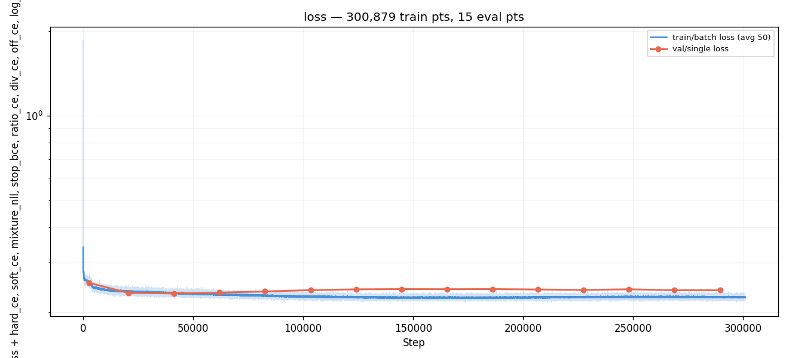
*Training loss over steps. Minimum at E2 (step 41,348), rising
steadily after -- same overfitting pattern as #017e.*

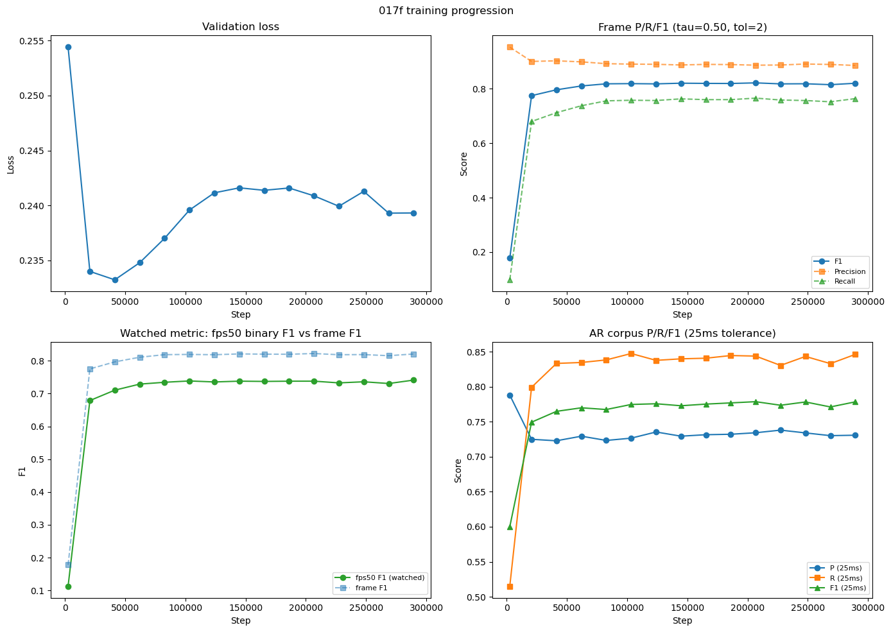
*Four-panel training progression: val loss (top-left), frame P/R/F1
(top-right), watched fps50 F1 vs frame F1 (bottom-left), AR corpus
P/R/F1 at 25ms (bottom-right). Recall climbs while precision
gently declines.*

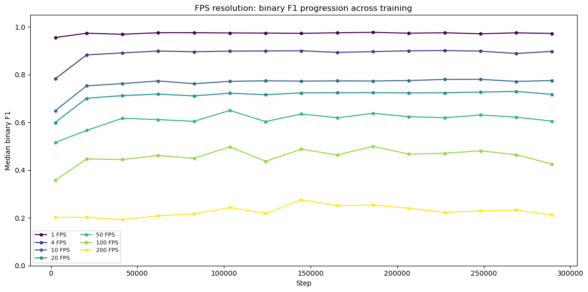
*FPS resolution binary F1 across training. Coarse resolutions (1-4
FPS) saturate early. Mid-range (10-50 FPS) peak at E6. 200 FPS
slowly climbs throughout -- the model keeps sharpening timing
precision even after coarse quality plateaus.*

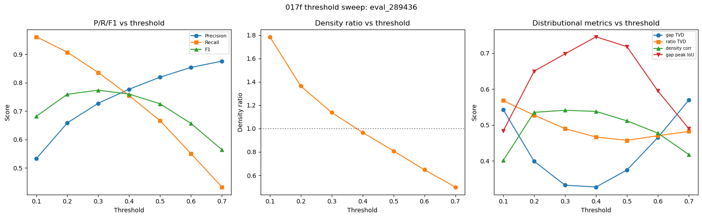
*Threshold sweep at eval_289436. Left: P/R/F1 cross at tau ~0.4.
Center: density_ratio crosses 1.0 between tau 0.3-0.4. Right:
distributional metrics -- gap_TVD minimized at tau 0.4, gap_peak_IoU
maximized, density_corr stable.*


*Predicted confidence maps vs GT at best frame F1 (E11, step
206,740). Sharp activations at GT onset positions.*

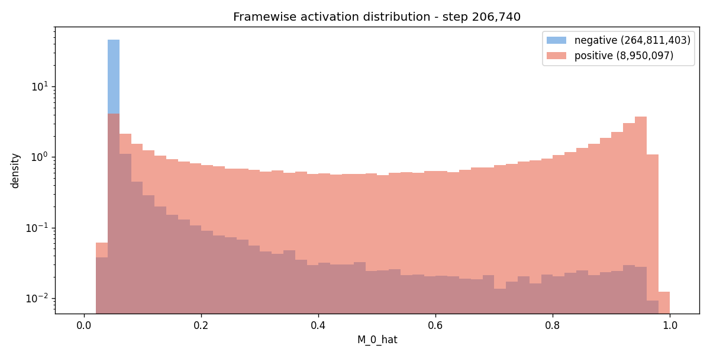
*Confidence distribution at GT-positive vs GT-negative bins. Clean
separation between the two populations.*

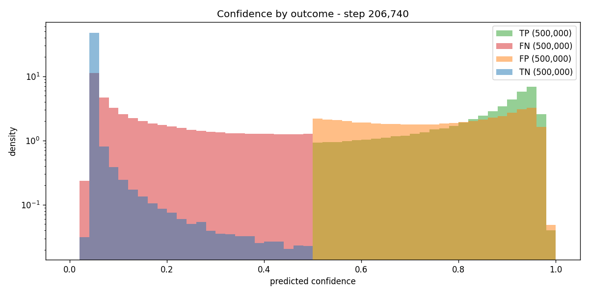
*Confidence histograms for TP/FN/FP/TN at E11.*

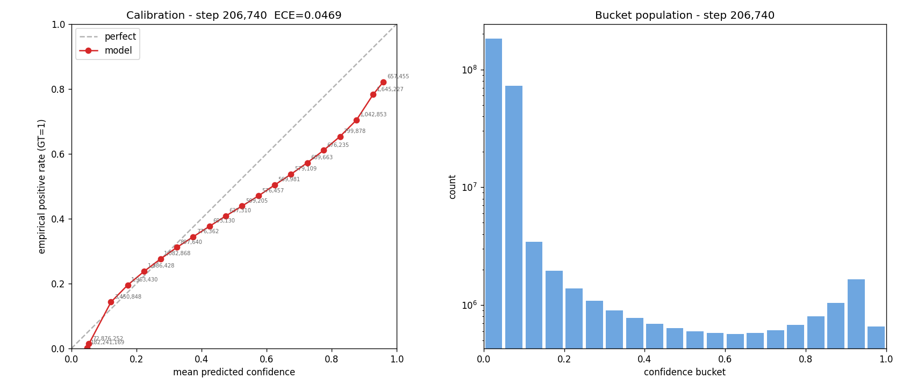
*Calibration curve at E11.*

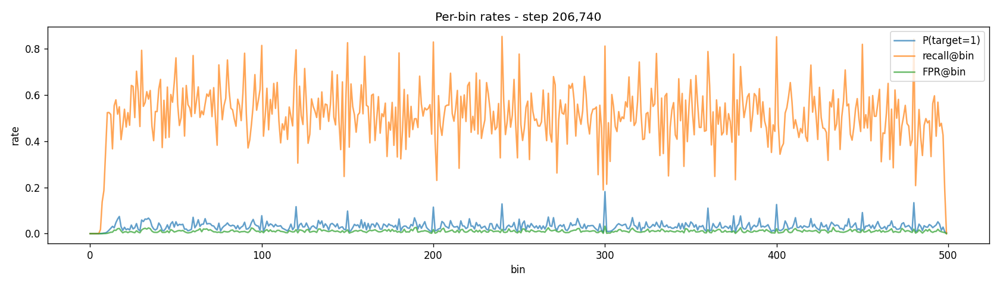
*Per-bin positive rate, recall, and FPR at E11.*

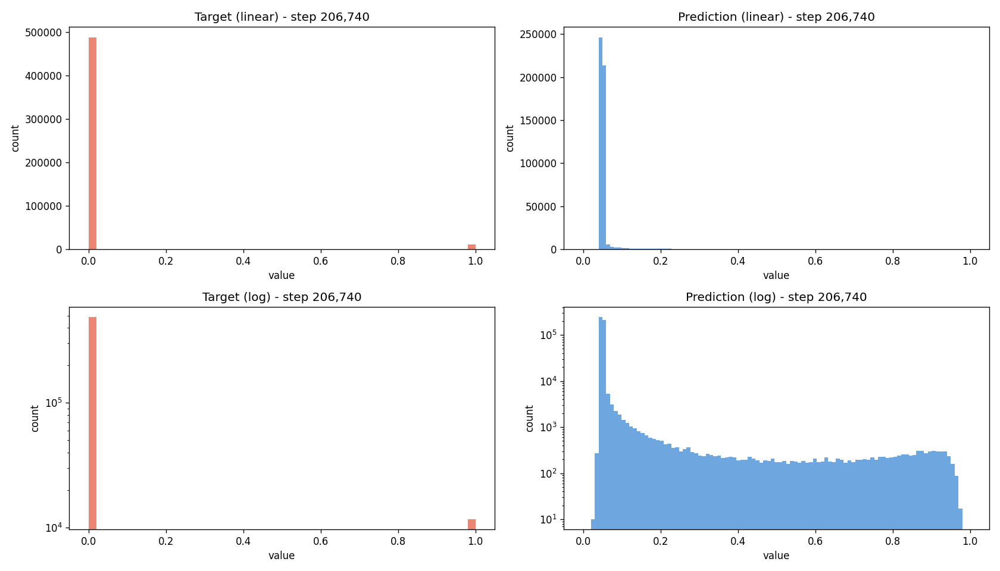
*Target vs prediction value distributions at E11 (linear + log).*

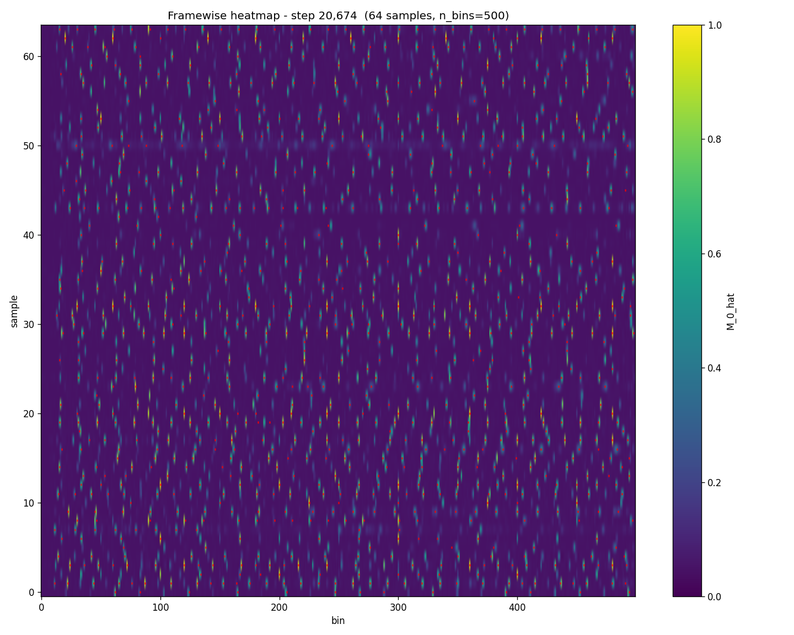
*Confidence maps at E2 (step 20,674) -- early training, sparse
activations, high precision but low recall.*

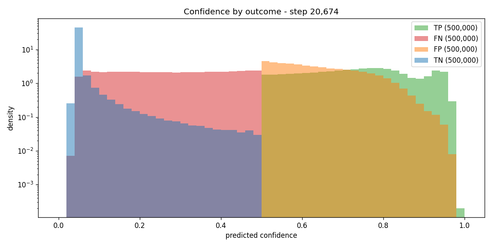
*Confidence by outcome at E2 -- FN distribution still overlaps with
TN, explaining the low recall.*

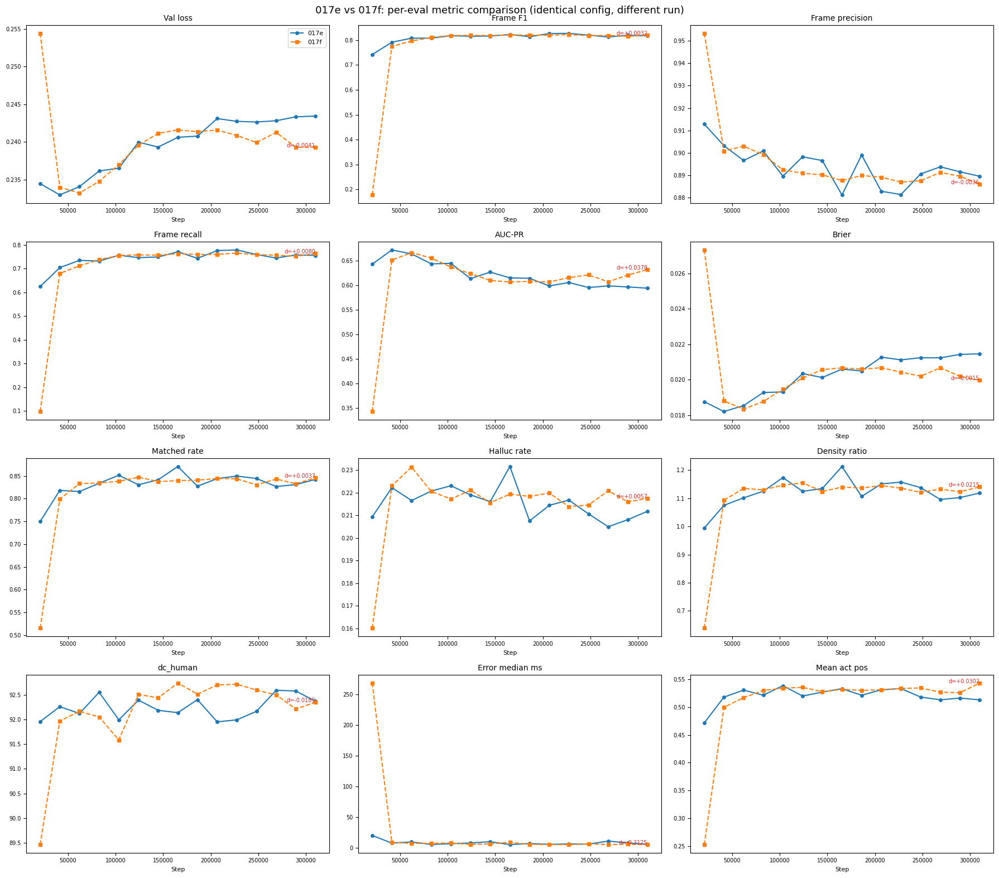
*017e (blue) vs 017f (orange) across 15 evals. Curves overlap almost
perfectly on all 12 metrics -- loss, frame P/R/F1, AUC-PR, brier,
corpus matched/halluc/density/dc_human. The E1 warmup outlier
(017f recall lagged at E1) is visible in recall and F1.*

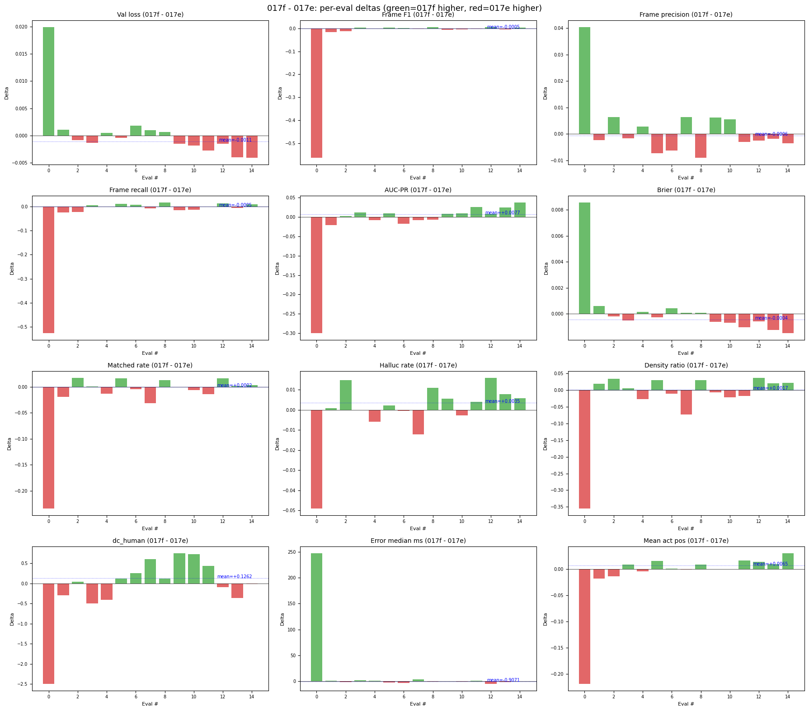
*Per-eval deltas (017f - 017e). Green = 017f higher, red = 017e
higher. Blue dotted line = mean delta (excluding E1 warmup). All
means are near zero (< 0.01 magnitude). E1 dominates the frame F1
and recall delta plots; from E2 onward the bars are tiny. dc_human
shows the largest systematic trend (+0.13 mean) but this is within
single-eval noise (std 0.40).*

## Vs prediction

- **Frame F1 within 0.01 of 017e's 0.827:** predicted yes -> actual
  0.822 (delta 0.005) -> **match**.
- **All new metrics populate correctly:** predicted yes -> actual yes,
  15 evals + threshold sweep -> **match**.
- **AR density_ratio ~1.21 at tau=0.3:** predicted ~1.21 -> actual
  1.138 (best F1 checkpoint) -> **close** (same over-emission pattern,
  slightly less).
- **fps50 binary_f1 selects comparable best.pt:** predicted yes ->
  actual best.pt differs (fps50 peaked at E15, frame F1 at E11) but
  AR metrics are equivalent -> **match** (different checkpoint, same
  quality).
- **Frame F1 deviates > 0.02 (fail criterion):** actual delta 0.005
  -> **not triggered**.

## Takeaways

- **Training is reproducible.** Same seed, same config, same
  dataset: frame F1 within +/-0.006 at every eval from E3 onward.
  The new metrics infrastructure does not affect training dynamics.

- **tau=0.4 confirmed as structural optimum.** The new distributional
  metrics (gap_TVD, gap_peak_IoU, bpm_ratio) independently confirm
  what matched_rate/hallucination_rate suggested in #017e. tau=0.4
  balances precision and recall while producing the most rhythmically
  faithful gap distributions and BPM alignment.

- **fps50_f1 captures a different quality dimension than frame F1.**
  It peaked at E15 (0.741) while frame F1 peaked at E11 (0.822).
  The mini-chart FPS metric continued improving through the
  overfitting phase because it measures onset placement in context,
  not just per-bin classification. This makes it a better proxy for
  AR chart quality.

- **Silence regions are the weakest point.** silence_overlap_f1 is
  only 0.546 at the best operating point -- the model fills in onsets
  during GT silence regions. This is consistent with the
  hallucination problem from #017e. dense_overlap_f1 at 0.979 shows
  the model handles busy sections well; it's the quiet sections
  where it over-emits.

- **Gap distribution alignment is moderate.** gap_hist_tvd 0.33 and
  gap_peak_iou 0.74 at tau=0.4. The model reproduces the correct
  rhythmic peak positions (74% overlap) but the overall gap shape
  differs by 33%. The ratio distribution is worse (tvd 0.47) --
  consecutive-gap ratios are less well-preserved than absolute gaps.

- **IOI is 10% shorter than GT.** ioi_mean_ratio 0.90 at tau=0.4
  indicates the model produces slightly faster rhythms than GT.
  Combined with density_ratio 0.964 (slight under-emission), this
  means the model spaces onsets more tightly but emits fewer total.

## Followup questions

- **Does the fps50 watched metric select better AR checkpoints?**
  017f's best.pt (selected by fps50_f1) should be compared against
  017e's best.pt (selected by frame F1) on the same threshold sweep
  to see if the different selection criterion produces measurably
  different AR quality.

- **Can silence_overlap_f1 be improved?** The 0.546 score suggests
  the model doesn't learn silence structure. A silence-aware loss
  term or augmentation that emphasizes quiet sections might help.
