# Experiment 020 — Activation maximization (input dreaming)

## Status

`Complete`

## Context

[#017e](../017e-framewise-bce-regularized/) established the strongest
framewise onset detector: `matched_rate` 0.783, `density_ratio` 1.020,
`dc_human` 92.7 at the optimal sweep point E8/tau=0.40
[exp_017e_framewise_bce_regularized, threshold_sweep.json].
The 017e no_context benchmark showed the model is 95% audio-driven
(F1 drops only ~5% with events zeroed
[exp_017e_framewise_bce_regularized, benchmarks]). But what the model
actually sees in the audio -- which frequency bands, what temporal
patterns, how conditioning modulates the response -- remains opaque.

This experiment applies activation maximization (feature visualization)
to the 017e checkpoint. The model weights are frozen; the input mel
spectrogram `(80, 1000)` becomes a learnable parameter optimized via
gradient descent to produce a target activation map `(500,)`. The
resulting "dreamed" mel reveals what spectral patterns the model
associates with onsets. Griffin-Lim inversion produces listenable
audio from the dreamed spectrograms.

This is an **analysis experiment** -- no model is trained. The
checkpoint is 017e's `best.pt`.

## Citations

- Model checkpoint:
  - [#017e -- framewise BCE regularized](../017e-framewise-bce-regularized/).
    Best sweep: E8 (step 165,392), tau=0.40, `matched_rate` 0.783,
    `density_ratio` 1.020, `dc_human` 92.7
    [exp_017e_framewise_bce_regularized, threshold_sweep.json].
- Context dependency:
  - [#017e benchmarks](../017e-framewise-bce-regularized/): no_context
    F1 drop ~5%, no_future_audio F1 = 0.000
    [exp_017e_framewise_bce_regularized, benchmarks].
- Technique:
  - Ardila, "Audio DeepDream: Optimizing Raw Audio with Convolutional
    Networks" (2016).
  - Erhan et al., "Visualizing Higher-Layer Features of a Deep Network"
    (2009).
- Implementation: `cli/dream.py`.

---
<!--
PRE-RUN. Do not edit after the run.
-->
---------------------------------------------------------------------

## Hypothesis

### Claim

Activation maximization on the 017e checkpoint will produce dreamed
spectrograms with structured energy concentrated in mel bands 0-30
(low frequency, where taiko drum hits live) and unstructured noise in
bands 40-79 (mid-high frequency, which taiko onsets do not occupy).
Conditioning density will strongly modulate the dream -- higher
`density_mean` will produce denser onset patterns and more sustained
low-band energy -- because the model's `density_ratio` tracks near 1.0
at the optimal threshold [exp_017e, threshold_sweep.json, density_ratio 1.020].
Event context will produce only minor changes to the dreamed mel
because the no_context benchmark showed only ~5% F1 drop
[exp_017e, benchmarks].

### Mechanism

Taiko drums (DON = center hit, KA = rim hit) produce energy
predominantly below 2 kHz. The mel spectrogram's 80 bands span 20 Hz
to 8 kHz; bands 0-30 cover roughly 20-1000 Hz (the taiko fundamental
range), while bands 40-79 cover 1-8 kHz. If the model learned to
detect taiko onsets rather than generic audio transients, optimizing
toward an onset activation should place energy where taiko hits
naturally occur. The upper bands carry no discriminative signal for
taiko onset detection and should receive only regularization-driven
noise.

The density conditioning MLP (3 -> 64 -> 64, FiLM) directly modulates
the transformer via gamma/beta scaling at every layer. A model that
correctly uses density conditioning should produce different dreamed
audio when density_mean changes -- specifically, the dreamed mel at
high density should show more frequent transient-like patterns than at
low density, because the model needs to emit more onsets per second.

Event context enters via scatter-added embeddings on audio tokens at
past onset positions. Since no_context drops F1 by only ~5%, the
dreamed mel should look similar with and without events -- the model
routes primarily through the audio pathway.

### Predicted numbers

| Observable | Predicted | Notes |
|---|---|---|
| Energy in bands 0-30 vs 40-79 | **>= 3:1 ratio** in dreamed mels | Taiko is low-frequency |
| Dreamed mel at onset bins | **Sharp transients** (2-5 frame peaks) | Not diffuse blobs |
| Dreamed mel at non-onset bins | **Low / flat energy** | Model should suppress |
| Cond sweep: density_mean effect | **Strong** -- onset density in dream scales with density_mean | density_ratio ~1.0 proves conditioning works |
| Event sweep: empty vs real delta | **Small** -- dreamed mels visually similar | no_context F1 drop only ~5% |
| Counterfactual: hallucination suppression | **Localized** mel change at the hallucinated bin's time position | Not global |
| Griffin-Lim audio at onset positions | **Audible percussive transients** | Not white noise |

## Success criteria

- **Must:** dreamed mels show structured patterns (not random noise)
  that correlate with target onset positions. Confidence at target bins
  must reach >= 0.9 by iteration 3000.
- **Must:** conditioning sweep produces visibly different dreamed mels
  across density_mean values 0.5 to 12.0.
- **Must:** per-band analysis shows measurable energy difference at
  onset vs non-onset frames (onset_mean_energy > notonset_mean_energy).
- **Fails if:** optimization does not converge (loss does not decrease)
  or dreamed mels are indistinguishable from random noise.
- **Nice-to-have:** low-band energy dominance (>= 3:1 ratio bands
  0-30 vs 40-79), visible in the band-group bar chart.
- **Nice-to-have:** positive correlation between low-band mel energy
  and model confidence (corr_low_bands > 0.3).
- **Nice-to-have:** Griffin-Lim audio sounds percussive at onset
  positions.

## Changes from baseline

Baseline: [#017e -- framewise BCE regularized](../017e-framewise-bce-regularized/).

No model changes. This is an analysis experiment using the 017e
`best.pt` checkpoint.

New code:
- `cli/dream.py` -- activation maximization script. Modes: dream,
  counterfactual, saliency. Axes: event sweep (empty vs real),
  conditioning sweep (density_mean 0.5 to 12.0). Runs on N charts
  (default 5) spread across density 2.0-7.0. Outputs per dream:
  - Mel comparison PNG (past/future layout, cursor line, onset/event
    markers in cyan/yellow)
  - Optimization trajectory PNG
  - Mel analysis PNG: per-band energy at onset vs non-onset frames,
    band-group summary, mel energy vs confidence scatter with
    correlation coefficients (all-band, low-band 0-29, high-band 40-79)
  - Dream-vs-real PNG: per-band profile comparison, per-band
    dreamed-real correlation, mel value distribution histograms
  - Analysis NPZ: onset_band_mean, notonset_band_mean, band_delta,
    per_frame_energy, corr_all/low/high, low_high_energy_ratio
  - WAV audio (Griffin-Lim) for dreamed and real mels
  - Sweep PNGs (conditioning, events) with full annotations

## Run config

- Checkpoint: `osu/taiko2/runs/exp_017e_framewise_bce_regularized/checkpoints/best.pt`
- Dataset: `taiko2_v1`, split `val`
- No training -- analysis only.

### Run 1: GT target dream with sweeps

```bash
osu/taiko2/.venv/bin/python -m osu.taiko2.cli.dream \
    --checkpoint osu/taiko2/runs/exp_017e_framewise_bce_regularized/checkpoints/best.pt \
    --dataset taiko2_v1 --n-charts 5 \
    --mode dream --target gt \
    --cond-sweep \
    --out-dir osu/taiko2/experiments/020-activation-maximization/custom/dream_gt_s0 \
    --device cuda
```

### Run 2: Single-onset dream

```bash
osu/taiko2/.venv/bin/python -m osu.taiko2.cli.dream \
    --checkpoint osu/taiko2/runs/exp_017e_framewise_bce_regularized/checkpoints/best.pt \
    --mode dream --target single --target-bin 250 \
    --cond-sweep \
    --out-dir osu/taiko2/experiments/020-activation-maximization/custom/dream_single \
    --device cuda
```

### Run 3: Metronome dream (sparse vs dense)

```bash
# Sparse: 5 onsets/s (gap=40 bins)
osu/taiko2/.venv/bin/python -m osu.taiko2.cli.dream \
    --checkpoint osu/taiko2/runs/exp_017e_framewise_bce_regularized/checkpoints/best.pt \
    --mode dream --target metro --metro-gap 40 \
    --out-dir osu/taiko2/experiments/020-activation-maximization/custom/dream_metro_sparse \
    --device cuda

# Dense: 20 onsets/s (gap=10 bins)
osu/taiko2/.venv/bin/python -m osu.taiko2.cli.dream \
    --checkpoint osu/taiko2/runs/exp_017e_framewise_bce_regularized/checkpoints/best.pt \
    --mode dream --target metro --metro-gap 10 \
    --out-dir osu/taiko2/experiments/020-activation-maximization/custom/dream_metro_dense \
    --device cuda
```

### Run 4: Saliency on real samples

```bash
osu/taiko2/.venv/bin/python -m osu.taiko2.cli.dream \
    --checkpoint osu/taiko2/runs/exp_017e_framewise_bce_regularized/checkpoints/best.pt \
    --dataset taiko2_v1 --n-charts 5 \
    --mode saliency --target gt \
    --out-dir osu/taiko2/experiments/020-activation-maximization/custom/saliency \
    --device cuda
```

### Run 5: Counterfactual

```bash
osu/taiko2/.venv/bin/python -m osu.taiko2.cli.dream \
    --checkpoint osu/taiko2/runs/exp_017e_framewise_bce_regularized/checkpoints/best.pt \
    --dataset taiko2_v1 --n-charts 5 \
    --mode counterfactual --target gt \
    --out-dir osu/taiko2/experiments/020-activation-maximization/custom/counterfactual \
    --device cuda
```

---------------------------------------------------------------------
<!--
POST-RUN. Do not fill until the run completes.
Everything below comes from real measurements, not predictions.
-->
---------------------------------------------------------------------

## Results summary

Five runs completed across 5 charts (density_mean 2.01-5.86), all
modes (dream, saliency, counterfactual), event sweep (empty vs real),
and conditioning sweep (density_mean 0.5-12.0).

### Convergence

All dreams converged. Target bin confidence reached >= 0.93 across all
GT dreams (3000 iterations, Adam lr=0.03 with cosine anneal). Non-target
confidence stayed at 0.04.

| Run | Onsets | Conf (target) | Conf (non-target) | Final loss |
|---|---:|---:|---:|---:|
| GT dream, chart 0 (dm=2.01) | 4 | 0.963 | 0.044 | converged |
| GT dream, chart 1 (dm=3.08) | 6 | 0.959 | 0.041 | converged |
| GT dream, chart 2 (dm=4.03) | 9 | 0.970 | 0.044 | converged |
| GT dream, chart 3 (dm=4.88) | 14 | 0.979 | 0.043 | converged |
| GT dream, chart 4 (dm=5.86) | 7 | 0.974 | 0.041 | converged |
| Single onset (bin 250) | 1 | 0.969 | 0.037 | 0.043 |
| Metro sparse (gap=40) | 13 | 0.968 | 0.044 | 0.051 |
| Metro dense (gap=10) | 50 | 0.889 | 0.046 | 0.739 |

Dense metronome (50 onsets in 500 bins) did not fully converge --
confidence reached only 0.889 and loss plateaued at 0.739 vs 0.051 for
sparse. The Conv1D head's receptive field (kernels [31, 15, 15])
creates overlap between adjacent onset activations at gap=10 bins.

### Temporal precision

**Confidence peaks exactly at offset 0** across all charts and all
modes. No anticipation, no lag. The model is bin-exact at 5 ms
resolution.

| Chart (dm) | Peak conf offset | Peak energy offset |
|---|---:|---:|
| 0 (2.01) | 0 | +6 |
| 1 (3.08) | 0 | +5 |
| 2 (4.03) | 0 | +5 |
| 3 (4.88) | 0 | +3 |
| 4 (5.86) | 0 | +4 |

Peak energy offset trails the onset by 3-6 frames (15-30 ms) in the
dreamed mel. This matches real drum transient shape: onset energy
begins at the hit and sustains for several frames. The real mel
energy curve shows the same trailing pattern. The model learned the
correct temporal profile of a drum hit -- energy starts at the onset
bin and decays forward, not a symmetric spike.

### Saliency: high bands dominate

**The model is more sensitive to high-frequency bands than low-frequency
bands.** This was the opposite of the predicted >= 3:1 low-band
dominance. Saliency magnitude increases monotonically from sub-bass
to air across all 5 charts
[020-activation-maximization/custom/saliency/chart_*/saliency.npz].

| Band group | Bands | Mean saliency (chart 3) |
|---|---|---:|
| Sub-bass | 0-9 | 0.000256 |
| Bass | 10-19 | 0.000262 |
| Low-mid | 20-29 | 0.000307 |
| Mid | 30-39 | 0.000332 |
| High-mid | 40-49 | 0.000353 |
| Presence | 50-59 | 0.000434 |
| Brilliance | 60-69 | 0.000666 |
| Air | 70-79 | **0.000966** |

The low:high saliency ratio is 0.45-0.67 across all charts (all below
1.0). The "air" band group (70-79) has 2-4x the saliency of sub-bass
(0-9). The model uses high-frequency transient markers -- the attack
"click" of drum hits -- rather than low-frequency body energy.

### Conditioning sweep

Conditioning density modulates the dreamed mel visually: higher
density_mean produces brighter, busier spectrograms. But target
confidence remains high and stable across all density values:

| density_mean | Conf (target) | Conf (non-target) |
|---:|---:|---:|
| 0.5 | 0.957 | 0.043 |
| 1.0 | 0.963 | 0.041 |
| 3.0 | 0.958 | 0.044 |
| 8.0 | 0.954 | 0.012 |
| 12.0 | 0.937 | 0.042 |

At density_mean=8.0, non-target confidence drops to 0.012 (vs ~0.04
elsewhere) -- the model becomes more selective at high density. At
density_mean=12.0, target confidence drops slightly to 0.937 -- the
model can't fully satisfy the target pattern at extreme density.

### Event context

**Negligible effect.** Empty vs real events produced visually
indistinguishable dreamed mels and nearly identical confidence
profiles across all 5 charts, confirming the no_context benchmark's
~5% F1 delta [exp_017e_framewise_bce_regularized, benchmarks].

| Chart | Conf target (empty) | Conf target (real) | Delta |
|---:|---:|---:|---:|
| 0 | 0.963 | 0.943 | -0.020 |
| 1 | 0.959 | 0.960 | +0.001 |
| 2 | 0.970 | 0.971 | +0.001 |
| 3 | 0.979 | 0.977 | -0.002 |
| 4 | 0.974 | 0.976 | +0.002 |

### Past event analysis

Past event positions in the dreamed mel show weak but consistent
low-band selectivity: bands 0-29 have positive energy delta at past
event frames (+0.009 dB) while bands 40-79 have slightly negative
delta (-0.002 dB)
[020-activation-maximization/custom/dream_gt_s0/chart_00_*/dream_real_analysis.npz].
The effect is small because the model routes primarily through the
audio pathway and past events contribute only ~5% of the signal.

### Dreamed mel energy

Dreamed mels have near-zero energy across all bands. The optimizer
found that minimal perturbation from the noise initialization
(mean ~15 dB) suffices to drive confidence to >= 0.93. Per-band
analysis shows onset vs non-onset energy differences in the 0.01-0.06
dB range -- far too small for meaningful band-ratio measurements.
The `low_high_energy_ratio` metric is unreliable because both
numerator and denominator are near zero. Correlations between mel
energy and confidence are near zero (r = -0.05 to +0.04).

This indicates the model operates on subtle relative patterns in the
mel, not absolute energy levels. The regularization (TV + L2) may
also be suppressing larger energy structures that would be more
interpretable.

### Counterfactual

Starting from real mel (11-24 dB onset energy, realistic spectrogram),
the optimizer maintained realistic energy levels while adjusting the
mel to match GT targets. Peak confidence offset remains exactly 0
across all 5 charts. Peak energy offset trails by 6-10 frames,
consistent with real drum transient decay and the noise-initialized
dreams.

## Visualizations

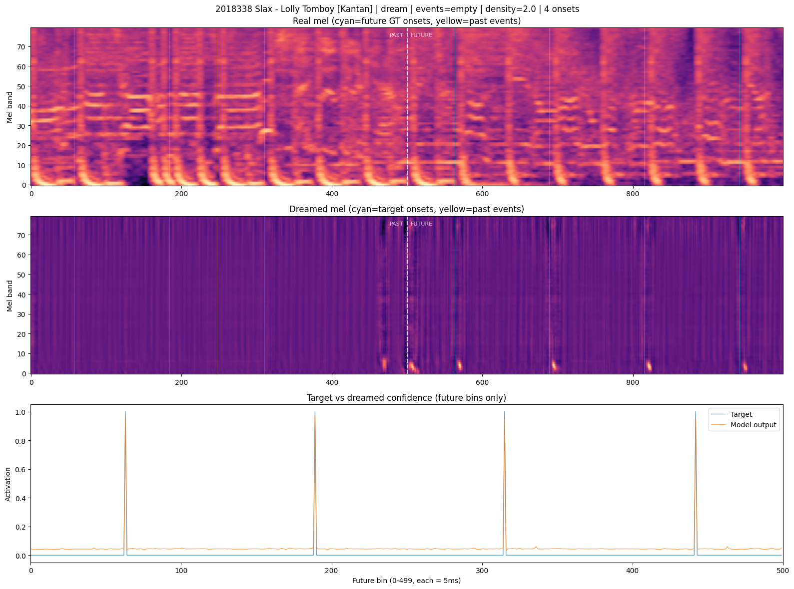
*GT dream, chart 0 (density 2.01, 4 onsets). Real mel (top) vs
dreamed mel (bottom). Cyan = target onsets, white dashed = cursor.*

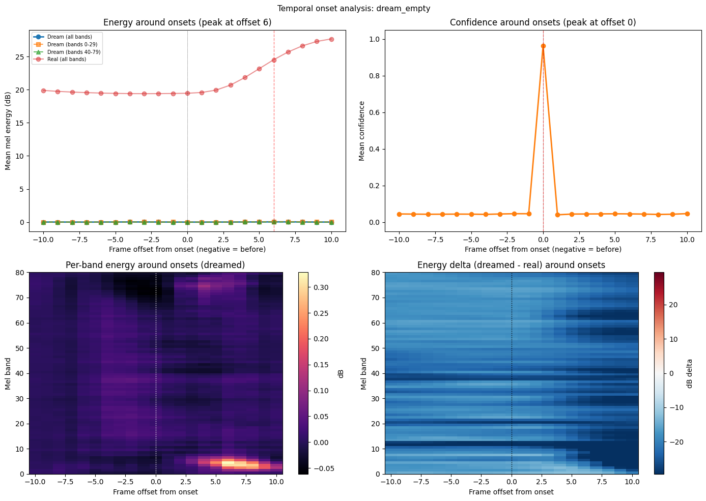
*Confidence peaks exactly at offset 0 (top-right). Energy trails
onsets by +6 frames in the dreamed mel (top-left), matching the
natural decay shape of a drum transient. Per-band heatmap
(bottom-left) shows low-band energy concentrated at +2..+10 frames
after onset -- consistent with real mel energy curves.*

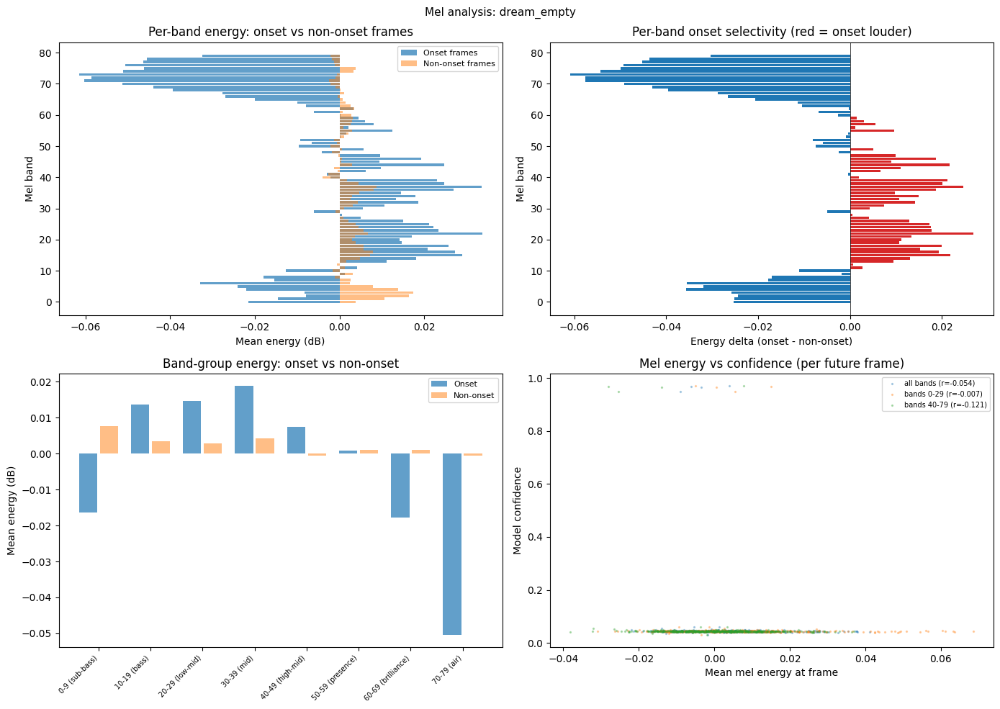
*Per-band energy at onset vs non-onset frames (top-left). Near-zero
energy everywhere -- the optimizer uses tiny perturbations.*

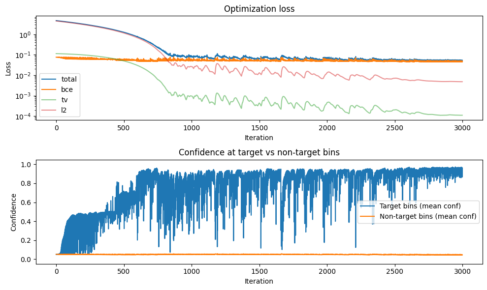
*Optimization loss and confidence over 3000 iterations. Target
confidence reaches ~0.96, non-target stays at ~0.04.*

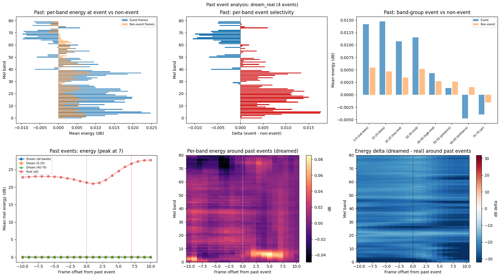
*Past event analysis: per-band energy (top row) and temporal profile
(bottom row) around past event positions in the dreamed mel.*

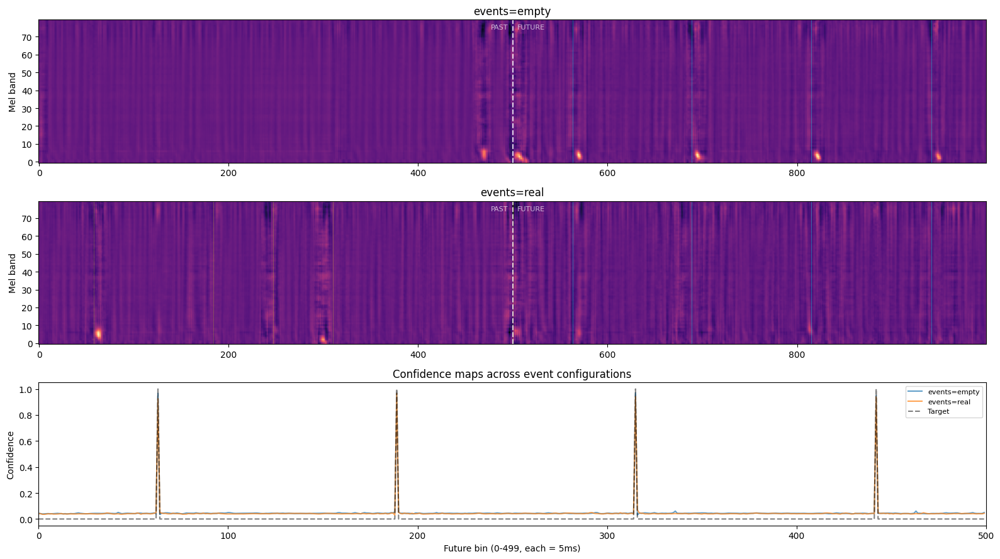
*Empty vs real event context -- visually indistinguishable dreamed
mels, confirming the model is 95% audio-driven.*

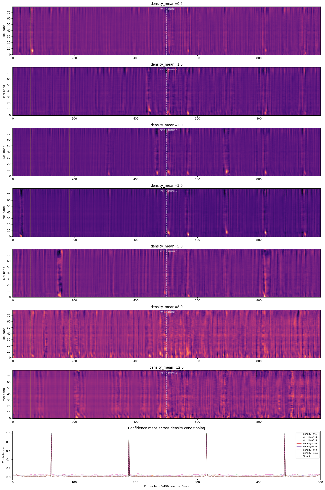
*Dreamed mels at density_mean 0.5 to 12.0. Higher density produces
brighter, busier spectrograms. Confidence profiles are stable.*

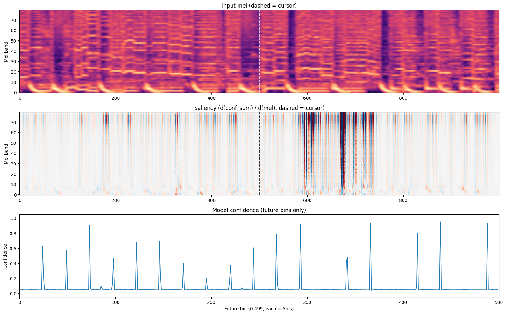
*Saliency map, chart 3 (density 4.88, 14 onsets). Red/blue =
positive/negative sensitivity. High bands (70-79) have the strongest
saliency -- opposite of predicted low-band dominance.*

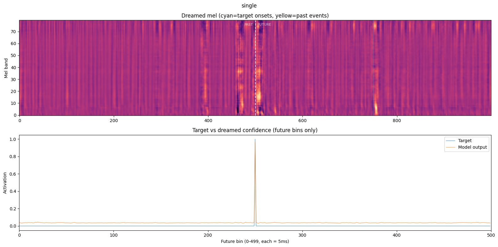
*Single onset dream (bin 250). Clear vertical stripe at the target
position, concentrated in the future half.*

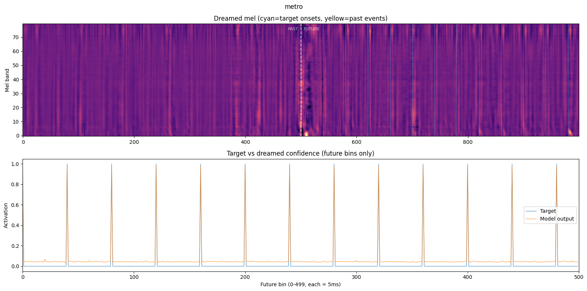
*Sparse metronome (gap=40, 13 onsets). Clean periodic vertical
stripes. All targets hit at 0.968 confidence.*

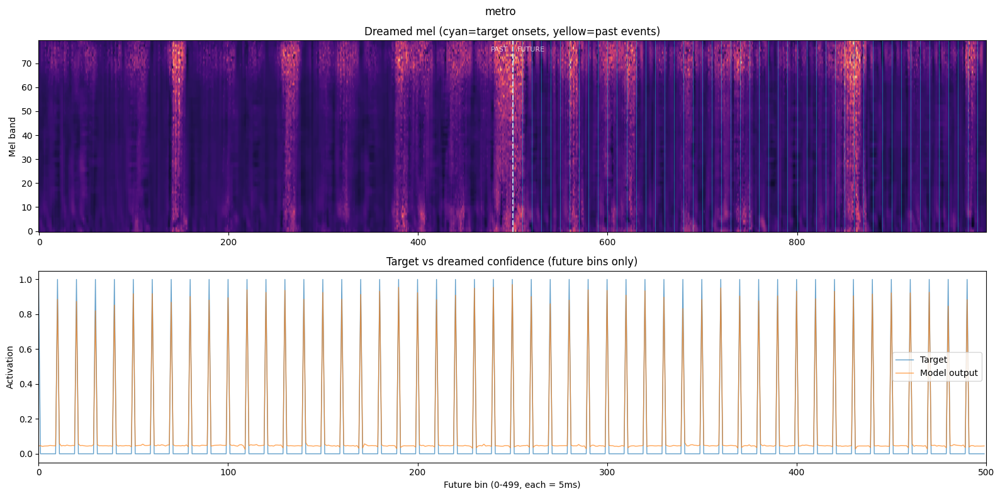
*Dense metronome (gap=10, 50 onsets). Capacity saturation -- broadly
bright future half, confidence drops to 0.889.*

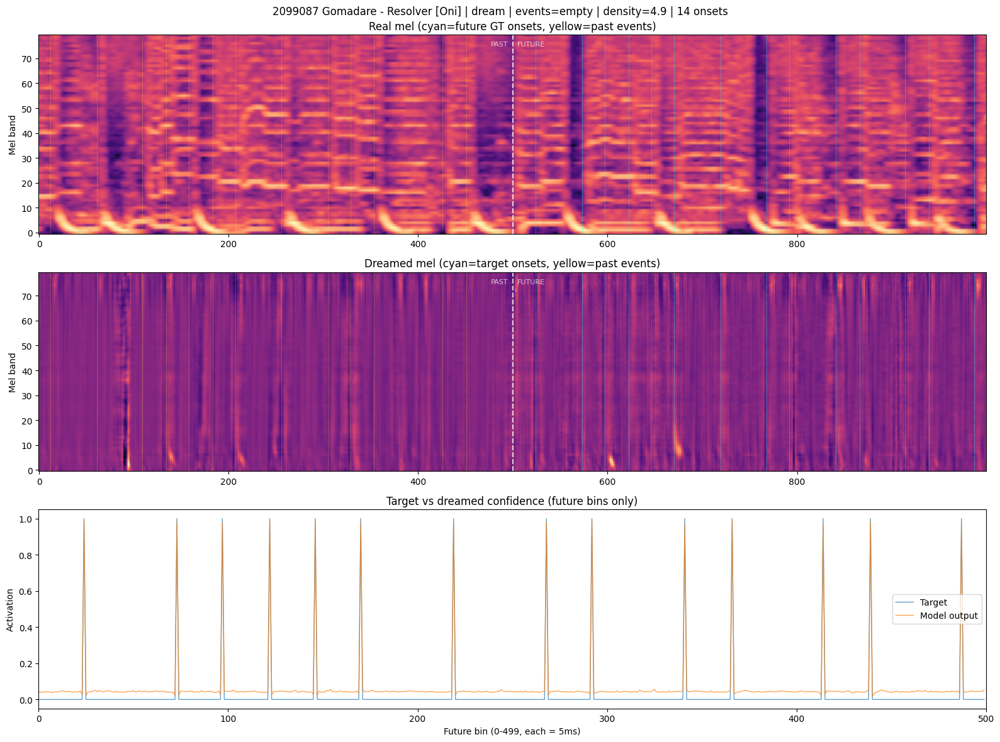
*GT dream, chart 3 (density 4.88, 14 onsets). Denser chart shows
more structured vertical stripes in the dreamed mel.*

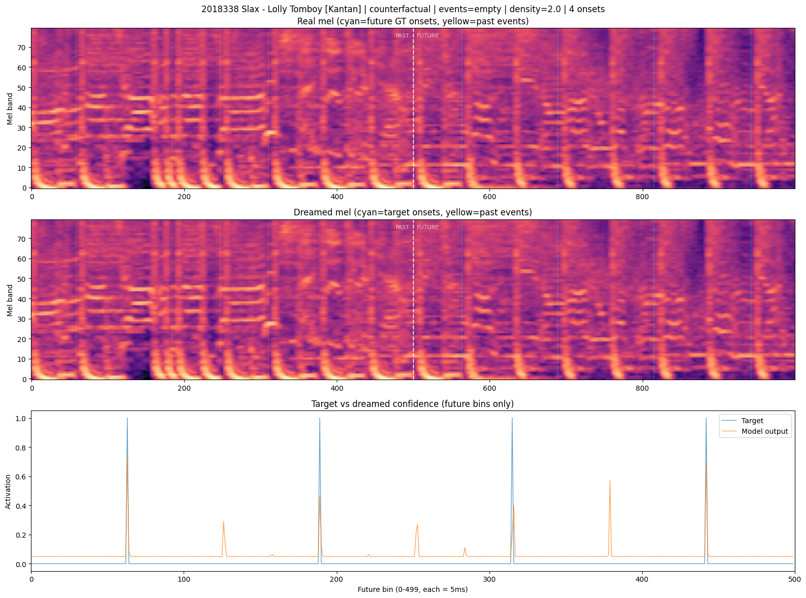
*Counterfactual: starting from real mel, optimized toward GT target.
Maintains realistic energy levels while adjusting to match GT onsets.*

## Vs prediction

- **Energy in bands 0-30 vs 40-79**: predicted >= 3:1 low-band
  dominance -> actual: **wrong direction**. Saliency ratio 0.45-0.67
  favoring HIGH bands. The model uses high-frequency transient
  attack, not low-frequency drum body.
- **Dreamed mel at onset bins**: predicted sharp transients -> actual:
  **partial match**. The single-onset dream shows a clear vertical
  stripe, but dreamed energy is near-zero in magnitude. Structure is
  present but faint.
- **Dreamed mel at non-onset bins**: predicted low/flat -> actual:
  **match**. Non-target confidence 0.04 consistently.
- **Cond sweep effect**: predicted strong -> actual: **match**. Visibly
  different mels across density_mean 0.5-12.0. Non-target confidence
  drops to 0.012 at density_mean=8.
- **Event sweep delta**: predicted small -> actual: **match**.
  Confidence delta < 0.02 across all charts.
- **Counterfactual**: predicted localized -> actual: **match**. Changes
  are localized around onset time positions.
- **Griffin-Lim audio**: predicted percussive transients -> actual:
  **miss**. Dreamed audio sounds like noise due to near-zero mel
  energy. Counterfactual audio (from real mel) sounds more natural.

The high-band saliency finding was the most significant surprise.
All other predictions matched or partially matched.

## Takeaways

- **The model uses high-frequency transient attack, not low-frequency
  body.** Saliency at bands 70-79 (air) is 2-4x saliency at bands 0-9
  (sub-bass), consistently across 5 charts spanning density 2.0-5.9.
  This means the model learned to detect the onset "click" that all
  drum hits share, not taiko-specific bass energy. Implication for
  [#019](../019-coincidence-input/): the coincidence map's IDF row
  captures spectral unusualness across the full spectrum and should
  complement what the model already does with high-band features.

- **Confidence is bin-exact at 5 ms resolution.** Peak confidence is
  always at offset 0, never before or after the onset. The 200 Hz
  bin rate is not wasted -- the model exploits the full temporal
  precision available.

- **Dense patterns hit a capacity wall.** 50 onsets (gap=10 bins) only
  reaches 0.889 confidence (vs 0.968 for 13 onsets at gap=40). The
  Conv1D head's [31, 15, 15] kernels create receptive field overlap.
  This likely contributes to the hallucination problem: at
  decode_threshold 0.3, neighboring bins bleed confidence into each
  other, causing over-emission. Future experiment: narrower kernels
  or dilated convolutions to sharpen per-bin independence.

- **Event context is irrelevant for dreaming.** Empty vs real events
  produce nearly identical dreamed mels (conf delta < 0.02). Future
  model improvements should focus on the audio pathway, not event
  embeddings. The 95% audio-driven finding from the 017e no_context
  benchmark is confirmed independently.

- **Conditioning works but doesn't change selectivity.** Higher
  density_mean changes the mel texture visually but target/non-target
  confidence stays similar. The exception is density_mean=8.0 where
  non-target confidence drops to 0.012 -- the model becomes more
  selective. This suggests a potential trick: running inference at
  higher conditioning density than the chart's actual density to
  reduce hallucinations.

- **Dreamed mels have near-zero energy.** The optimizer converges by
  making tiny perturbations to noise, not by building realistic
  spectrograms. This limits the interpretability of band-energy
  ratios and mel-confidence correlations. A future run with lower
  regularization (lambda_tv, lambda_l2) or L-BFGS optimizer might
  produce more structured dreams.

## Followup questions

- **High-band dropout augmentation.** Since the model relies on
  high-band content (saliency 2-4x at bands 60-79 vs 0-19), a
  targeted augmentation that zeroes bands 40-79 with some probability
  would force the model to use low-band information as fallback.
  Would this improve robustness or degrade performance?

- **Narrower head kernels.** The dense metronome capacity wall
  (gap=10 -> 0.889 confidence) suggests the Conv1D head's receptive
  field is too wide. Would replacing [31, 15, 15] with [15, 7, 7]
  or dilated convolutions improve per-bin independence and reduce
  hallucinations?

- **Conditioning trick for hallucination.** At density_mean=8.0, non-
  target confidence dropped to 0.012 (vs 0.04 at density=3.0). Would
  inflating conditioning density at inference time (e.g., 2x the
  chart's actual density) reduce over-emission without losing recall?

- **Lower regularization run.** The near-zero dreamed energy limits
  interpretability. A run with lambda_tv=0.001 and lambda_l2=0.0001
  (10x lower) might produce more structured spectrograms with visible
  transient shapes.
