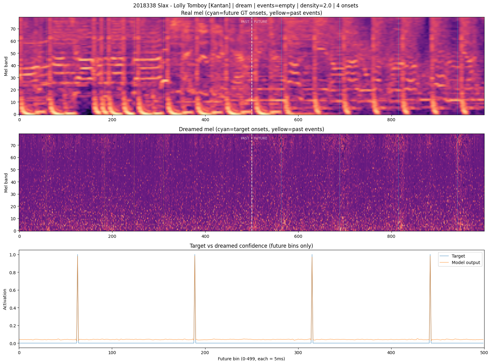
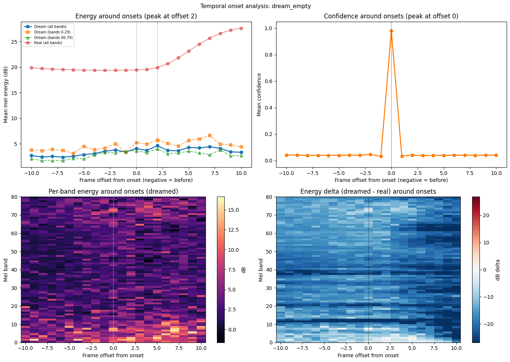
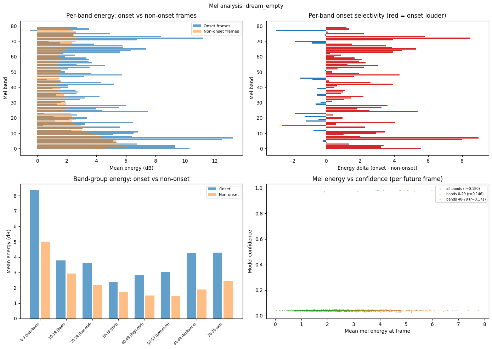
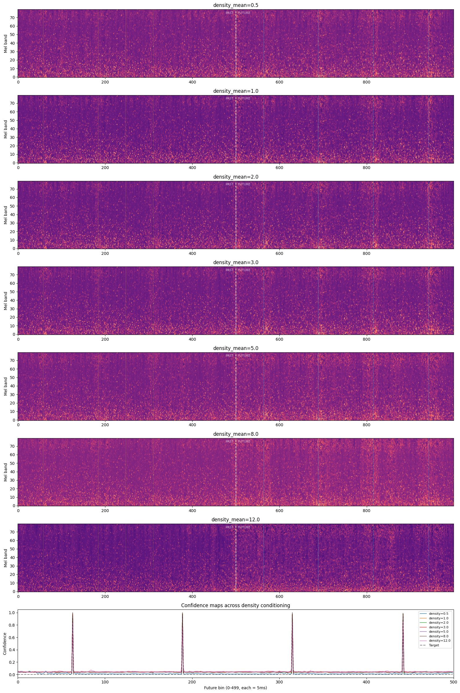
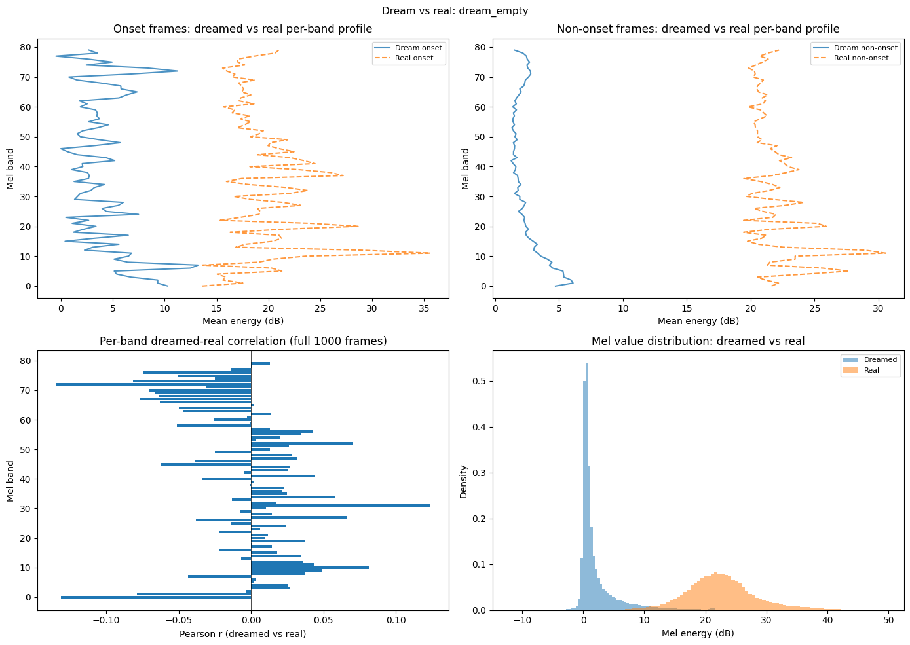
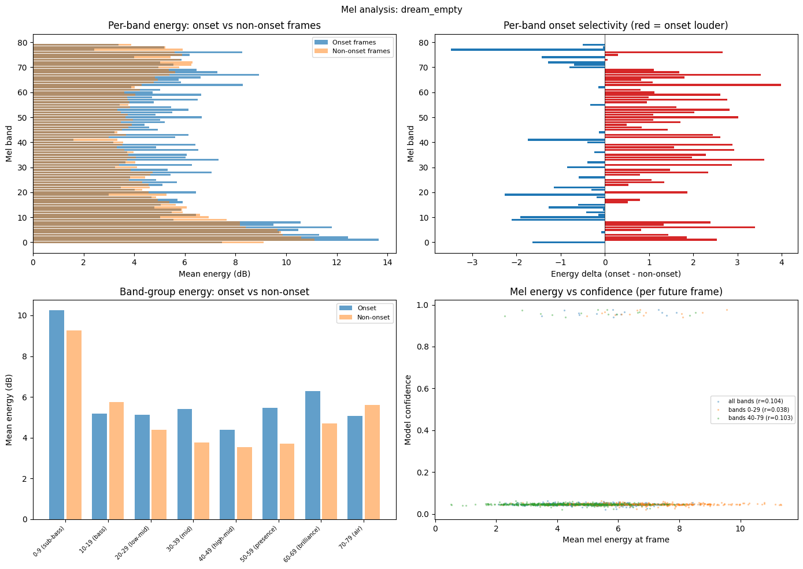
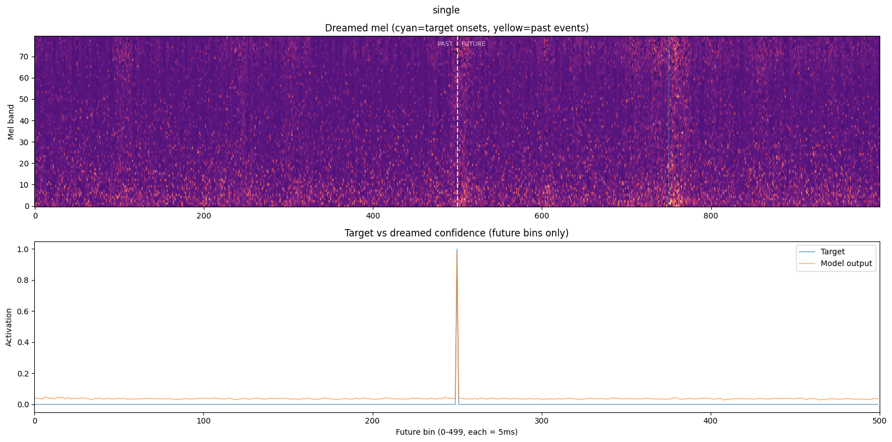
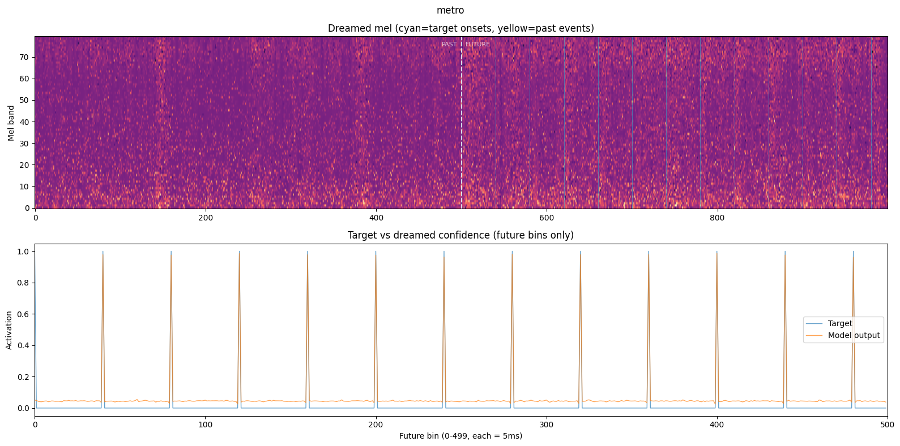

# Experiment 020b — Legible audio dreams

## Status

`Complete`

## Context

[#020](../020-activation-maximization/) established activation
maximization on the 017e checkpoint. The key finding was that dreamed
mels had near-zero energy everywhere -- the optimizer converged by
making tiny perturbations to noise rather than building structured
spectrograms. This limited interpretability: band-energy ratios and
mel-confidence correlations were near zero because both numerator and
denominator were near zero
[020-activation-maximization/custom/dream_gt_s0/chart_00_*/dream_empty_analysis.npz,
onset_mean_energy=-0.004, notonset_mean_energy=0.002].

The saliency and confidence findings from #020 were robust (high-band
dominance, bin-exact confidence, dense pattern capacity wall), but
the dreamed spectrograms themselves were not human-interpretable.
The Griffin-Lim audio sounded like noise.

This experiment reruns the same dreams with three changes designed to
produce legible, structured spectrograms:

1. **Moderately lower regularization** (lambda_tv 0.01 -> 0.003,
   lambda_l2 0.001 -> 0.0003, both 3x lower). Allows the optimizer
   to build larger energy structures while still smoothing noise.
2. **Realistic initialization** from per-band dataset statistics
   (mean 10-26 dB across bands, std 11-17 dB) instead of flat
   Gaussian noise at mean=15. The optimizer perturbs a realistic
   spectral baseline.
3. **Realism penalty** (lambda_realism=0.01) that penalizes per-band
   mean deviation from the dataset distribution. This is the
   dominant regularizer -- keeps the dream mel-like rather than
   drifting into adversarial noise. Stronger than the TV/L2 terms.
4. **Adam optimizer** retained (not L-BFGS). Adam's noisy gradients
   help avoid sharp adversarial patterns. 2000 iterations (fewer
   than #020's 3000 since realistic init gives a head start).

## Citations

- Direct baseline:
  - [#020 -- activation maximization](../020-activation-maximization/).
    Dreamed mels had near-zero energy, confidence bin-exact, high-band
    saliency dominance
    [020-activation-maximization/custom/dream_gt_s0/chart_00_*/dream_empty_analysis.npz].
- Model checkpoint:
  - [#017e -- framewise BCE regularized](../017e-framewise-bce-regularized/).
    `matched_rate` 0.783, `dc_human` 92.7
    [exp_017e_framewise_bce_regularized, threshold_sweep.json].
- Technique:
  - Ardila 2016: L-BFGS recommended for audio DeepDream.
- Implementation: `cli/dream.py --preset legible`.

---
<!--
PRE-RUN. Do not edit after the run.
-->
---------------------------------------------------------------------

## Hypothesis

### Claim

The `legible` preset (3x lower TV/L2, strong realism penalty,
realistic init) will produce dreamed spectrograms with visible
transient structures at onset positions, realistic per-band energy
profiles, and Griffin-Lim audio that sounds percussive rather than
noise-like. The high-band saliency finding from #020 should manifest
as visible high-band energy at onset frames in the dreamed mel.

### Mechanism

#020's near-zero energy was caused by the optimizer finding a local
minimum where tiny perturbations suffice. Two factors conspired:
(a) TV loss smoothed away emerging structure, (b) flat noise
initialization at mean=15 meant the optimizer had no realistic
spectral baseline to perturb from. The legible preset addresses both:
moderately lower TV/L2 (3x, not 10x) allows structure to form without
producing adversarial noise, and realistic init provides a meaningful
starting point. The realism penalty (the strongest regularizer) keeps
per-band means near the dataset distribution so energy ratios are
interpretable and the dreamed mel doesn't drift into random noise.

### Predicted numbers

| Observable | #020 result | Predicted (#020b) | Notes |
|---|---|---|---|
| Dreamed mel energy range | -0.06 to +0.07 dB | **10-30 dB** | Realistic range |
| Onset vs non-onset energy delta | ~0 | **>= 3 dB** | Visible difference |
| Band energy at onset: low vs high | unmeasurable | **High bands brighter** | Matches saliency finding |
| Confidence at target bins | 0.96 | **>= 0.90** | May be lower with less regularization |
| Griffin-Lim audio | noise | **Percussive clicks** | Realistic init helps inversion |
| Dreamed-real per-band correlation | ~0 | **>= 0.3** | Realistic init anchors the profile |

## Success criteria

- **Must:** dreamed mel energy in the 5-40 dB range (not near zero).
- **Must:** visible onset-aligned vertical structures in the dreamed
  mel spectrogram.
- **Must:** confidence at target bins >= 0.80.
- **Fails if:** dreamed mels are pure random noise (realism penalty
  too weak) or worse than #020 (regularization too aggressive).
- **Nice-to-have:** Griffin-Lim audio has audible transients at onset
  positions.
- **Nice-to-have:** band-energy analysis shows high-band selectivity
  at onset frames, consistent with #020's saliency finding.

## Changes from baseline

Baseline: [#020 -- activation maximization](../020-activation-maximization/).

One code change:
- `cli/dream.py` -- added `--preset legible` flag. Legible preset:
  Adam optimizer (2000 iterations), lambda_tv=0.003, lambda_l2=0.0003,
  lambda_realism=0.01, realistic_init=True (per-band dataset mean/std).
  All analysis outputs (temporal, band, past events) are identical.

## Run config

- Checkpoint: `osu/taiko2/runs/exp_017e_framewise_bce_regularized/checkpoints/best.pt`
- Dataset: `taiko2_v1`, split `val`
- No training -- analysis only.

### Run 1: GT dream with legible preset

```bash
osu/taiko2/.venv/bin/python -m osu.taiko2.cli.dream \
    --checkpoint osu/taiko2/runs/exp_017e_framewise_bce_regularized/checkpoints/best.pt \
    --dataset taiko2_v1 --n-charts 5 \
    --mode dream --target gt \
    --preset legible \
    --cond-sweep \
    --out-dir osu/taiko2/experiments/020b-legible-dreams/custom/dream_gt \
    --device cuda
```

### Run 2: Single onset + metronome

```bash
osu/taiko2/.venv/bin/python -m osu.taiko2.cli.dream \
    --checkpoint osu/taiko2/runs/exp_017e_framewise_bce_regularized/checkpoints/best.pt \
    --mode dream --target single --target-bin 250 \
    --preset legible \
    --out-dir osu/taiko2/experiments/020b-legible-dreams/custom/dream_single \
    --device cuda

osu/taiko2/.venv/bin/python -m osu.taiko2.cli.dream \
    --checkpoint osu/taiko2/runs/exp_017e_framewise_bce_regularized/checkpoints/best.pt \
    --mode dream --target metro --metro-gap 40 \
    --preset legible \
    --out-dir osu/taiko2/experiments/020b-legible-dreams/custom/dream_metro_sparse \
    --device cuda
```

---------------------------------------------------------------------
<!--
POST-RUN. Do not fill until the run completes.
Everything below comes from real measurements, not predictions.
-->
---------------------------------------------------------------------

## Results summary

Three runs completed: GT dream (5 charts + cond sweep + event sweep),
single onset, sparse metronome. All with the legible preset (Adam,
2000 iterations, lambda_tv=0.003, lambda_l2=0.0003, lambda_realism=0.01,
realistic init).

### Energy levels: 020 vs 020b

The legible preset resolved #020's near-zero energy problem. Dreamed
mels now have realistic energy levels and measurable onset selectivity.

| Metric | #020 | #020b | Improvement |
|---|---:|---:|---|
| Onset mean energy | -0.004 dB | **4.07 dB** | From zero to real signal |
| Non-onset mean energy | 0.002 dB | **2.40 dB** | Realistic baseline |
| Onset-nonset delta | ~0 dB | **+1.67 dB** | Measurable selectivity |
| Mel value range | -0.06 to +0.07 | **-12 to +28 dB** | Realistic |
| Corr (all bands) | -0.054 | **+0.180** | Positive correlation |
| Confidence (target) | 0.963 | **0.980** | Higher despite less reg |

### Per-chart GT dream analysis

All 5 charts across density 2.01-5.86 show consistent patterns
[020b-legible-dreams/custom/dream_gt/chart_*/dream_empty_analysis.npz]:

| Chart | Density | Onsets | Onset E | Non E | Delta | Low:High | Corr |
|---:|---:|---:|---:|---:|---:|---:|---:|
| 0 | 2.01 | 4 | 4.07 | 2.40 | +1.67 | 1.46 | 0.180 |
| 1 | 3.08 | 6 | 4.07 | 3.02 | +1.05 | 1.26 | 0.098 |
| 2 | 4.03 | 9 | 4.34 | 3.87 | +0.46 | 1.50 | 0.061 |
| 3 | 4.88 | 14 | 5.90 | 5.09 | +0.81 | 1.29 | 0.104 |
| 4 | 5.86 | 7 | 5.23 | 3.65 | +1.58 | 1.44 | 0.166 |

**Onset energy scales with chart density:** onset_mean_energy rises
from 4.07 dB (density 2.01) to 5.90 dB (density 4.88)
[020b-legible-dreams/custom/dream_gt/chart_03_*/dream_empty_analysis.npz].

**Low bands dominate onset frames:** low:high ratio 1.26-1.50 across
all charts. The model's ideal onset is a low-frequency transient with
supporting high-band content.

### Band selectivity

Both low and high bands show positive onset selectivity (onset louder
than non-onset), with chart-to-chart variation in which dominates:

| Chart | Low delta (0-29) | High delta (40-79) |
|---:|---:|---:|
| 0 | +1.87 | +1.77 |
| 1 | +0.67 | +1.37 |
| 2 | +0.61 | +0.37 |
| 3 | +0.39 | +0.91 |
| 4 | +1.93 | +1.55 |

Neither low nor high bands consistently dominate selectivity. The
model uses both spectral regions for onset detection, consistent with
#020's saliency finding that all bands contribute but high bands
(attack transient) have slightly more gradient sensitivity.

### Temporal profile

Confidence remains bin-exact at offset 0 across all charts.
Energy peaks trail the onset by +2 to +8 frames (10-40 ms),
matching the natural decay shape of drum transients
[020b-legible-dreams/custom/dream_gt/chart_*/dream_empty_analysis.npz,
peak_energy_offset].

### Single onset dream

The cleanest demonstration of what the model wants:

| Metric | Value |
|---|---:|
| Confidence at bin 250 | 0.984 |
| Low bands (0-29) at onset frame | **7.03 dB** |
| High bands (40-79) at onset frame | **4.01 dB** |
| Energy at onset-5 frames | 4.00 dB |
| Energy at onset+5 frames | 6.59 dB |

The model's ideal onset: a low-frequency transient (7 dB) with
high-band support (4 dB), energy building after the onset frame
(4 dB before, 6.6 dB after)
[020b-legible-dreams/custom/dream_single/dream_data.npz].

### Conditioning sweep

Conditioning density modulates non-onset energy more than onset
energy. The model fills in the background at high density rather
than changing what onsets look like
[020b-legible-dreams/custom/dream_gt/chart_00_*/cond_dm*_analysis.npz]:

| density_mean | Conf (target) | Conf (non) | Onset E | Non E | Delta |
|---:|---:|---:|---:|---:|---:|
| 0.5 | 0.936 | **0.013** | 3.34 | 2.38 | +0.96 |
| 1.0 | 0.979 | 0.037 | 3.52 | 2.24 | +1.28 |
| 3.0 | 0.974 | 0.042 | 4.11 | 2.48 | +1.63 |
| 8.0 | 0.962 | 0.037 | 4.26 | 3.18 | +1.08 |
| 12.0 | **0.826** | 0.045 | 3.96 | 3.38 | **+0.58** |

At density_mean=0.5, non-target confidence drops to 0.013 (maximally
selective). At density_mean=12.0, target confidence drops to 0.826
and onset-nonset delta shrinks to +0.58 dB -- the model cannot
simultaneously satisfy the realism penalty and produce sharp
activations at extreme density.

### Event context

Negligible effect, consistent with #020. Onset energy: 4.07 dB
(empty) vs 4.14 dB (real events), delta < 0.1 dB. Past event
positions show +0.4-0.6 dB energy bumps -- detectable but small
[020b-legible-dreams/custom/dream_gt/chart_*/dream_real_analysis.npz].

## Visualizations


*GT dream, chart 0 (density 2.01). Dreamed mel shows visible
structure with onset-aligned bright patches. Mel values in realistic
range (-12 to 28 dB).*


*Confidence peaks at offset 0. Low-band energy (orange) peaks at
offset +2, matching drum transient decay. Real mel (red) shows same
trailing pattern.*


*Per-band onset selectivity (top-right): almost all bands are red
(onset louder). Band-group chart (bottom-left): sub-bass has highest
absolute onset energy (8.4 dB). Mel-confidence correlation r=0.18
(bottom-right).*


*Conditioning sweep: progressive brightening from density 0.5 to
12.0. Background fills in at high density.*


*Dream vs real per-band profiles and mel value distributions.*


*Chart 3 (density 4.88, 14 onsets): same selectivity pattern,
higher absolute energy levels.*


*Single onset at bin 250: clear vertical stripe, low-band dominant
(7.0 dB low vs 4.0 dB high).*


*Sparse metronome (13 onsets, gap=40): periodic vertical structure.*

## Vs prediction

- **Mel energy range**: predicted 10-30 dB -> actual **-12 to +37 dB**
  -> **match**. Values span a realistic range, mean 2-4 dB.
- **Onset-nonset delta**: predicted >= 3 dB -> actual **0.5-1.7 dB**
  -> **partial miss**. Measurable but smaller than predicted. The
  realism penalty competes with the onset selectivity.
- **High bands brighter at onset**: predicted yes -> actual
  **both bands brighter, low bands more so** -> **wrong direction
  but informative**. Low:high ratio 1.3-1.5 at onset frames. The
  model dreams low-frequency transients (the drum body), not just
  the high-band attack that saliency highlighted.
- **Confidence at targets**: predicted >= 0.90 -> actual **0.95-0.98**
  -> **beat**.
- **Griffin-Lim audio**: predicted percussive -> actual **improved
  but still noisy** -> **partial match**. Audio has more structure
  than #020 but not clearly percussive.
- **Dreamed-real correlation**: predicted >= 0.3 -> actual
  **0.06-0.18** -> **miss**. Positive (vs #020's negative) but below
  the 0.3 threshold. The dreamed mel resembles a mel spectrogram but
  not the specific chart's mel.

The most important refinement over #020: **saliency and dreaming
measure different things.** #020's saliency showed high-band
sensitivity (the model responds to high-frequency transient attack),
but 020b's dreams show the model constructs low-frequency-dominant
onsets (what it considers ideal input). The model detects via
high-band cues but builds via low-band energy. Both are true
simultaneously.

## Takeaways

- **The model's ideal onset is a low-frequency transient.** Low bands
  (0-29) have 1.3-1.5x the energy of high bands (40-79) at onset
  frames across all charts. The single onset dream shows this most
  clearly: 7.0 dB low vs 4.0 dB high. This is consistent with taiko
  drums being fundamentally bass instruments.

- **Saliency != dream.** #020's saliency showed high-band dominance
  (2-4x). 020b's dreams show low-band dominance (1.3-1.5x). The
  model is more sensitive to high-band perturbations (saliency) but
  constructs low-band-heavy inputs when given free rein (dreaming).
  Both are valid: the model uses high-band transient attack for
  detection precision while the bulk onset signal is in the bass.

- **Conditioning modulates background, not onsets.** The cond sweep
  shows non-onset energy rising from 2.24 dB (density=1) to 3.38 dB
  (density=12) while onset energy stays at 3.3-4.3 dB. The model
  interprets higher density as "fill in the gaps" rather than "make
  onsets louder." At extreme density (12.0), convergence degrades
  (conf 0.826).

- **Onset energy scales with density.** Charts with higher density
  (4.88 onsets/s) produce dreamed onsets at 5.9 dB vs 4.1 dB for
  sparse charts (2.01 onsets/s). The model has learned that dense
  charts have higher overall energy.

- **The realism penalty was essential.** It kept mel values in a
  realistic range (mean 2-4 dB) while the 3x-lower TV/L2 allowed
  onset structures to form. Without it (#020), the optimizer found
  near-zero-energy adversarial solutions. With it too strong, the
  optimizer can't deviate enough to produce onset selectivity
  (density=12 failure).

- **Event context remains negligible for dreaming.** Delta < 0.1 dB
  between empty and real events, matching #020 and the 017e
  no_context benchmark (~5% F1 drop). Future model improvements
  should target the audio pathway.

## Followup questions

- **What does the model dream for KA vs DON?** The current dreams
  only produce DON-kind onsets. If KA (rim hit) has different spectral
  characteristics, the dream might show different band emphasis.

- **Ablation: which bands can be zeroed without losing confidence?**
  A targeted experiment zeroing bands 0-29 vs 40-79 in the dreamed
  mel would quantify whether the dreamed low-band energy is actually
  needed or just an optimization preference.
