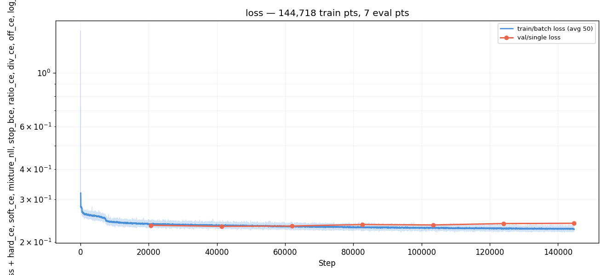
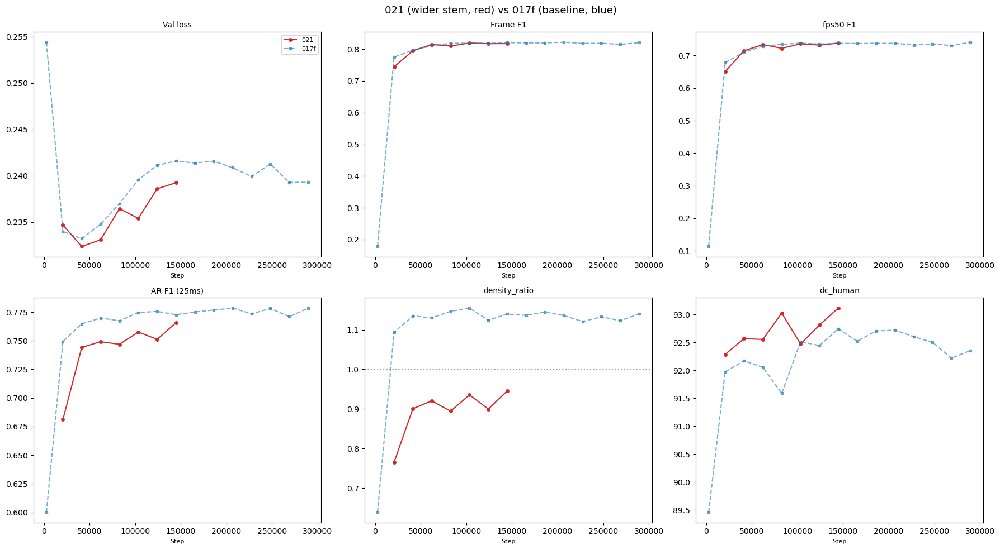
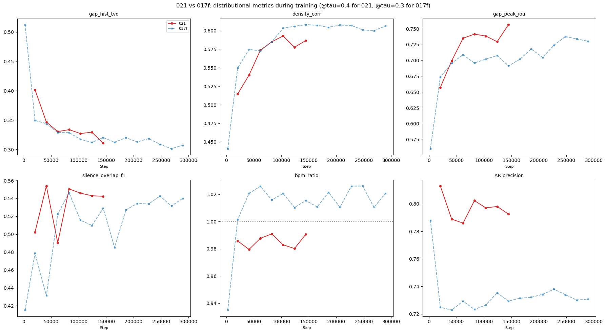
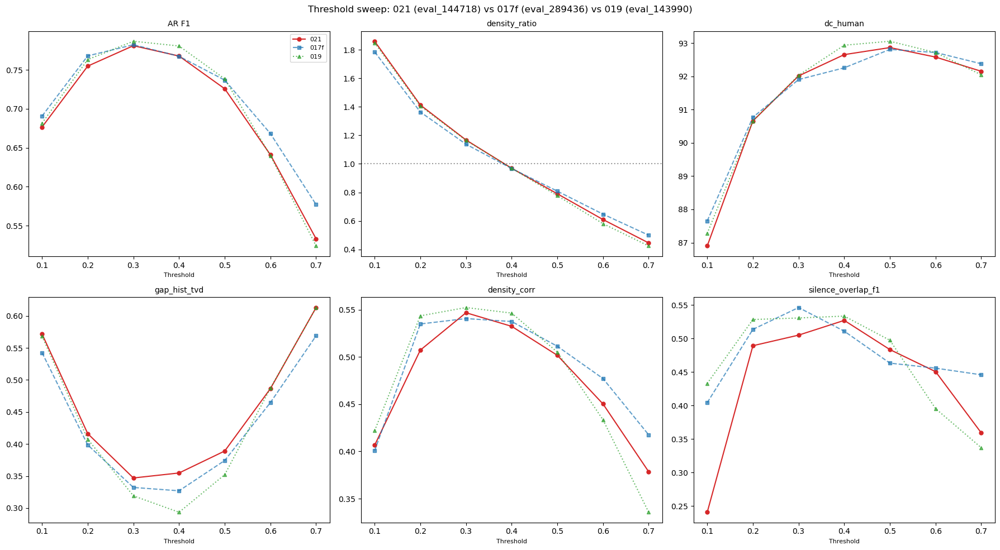
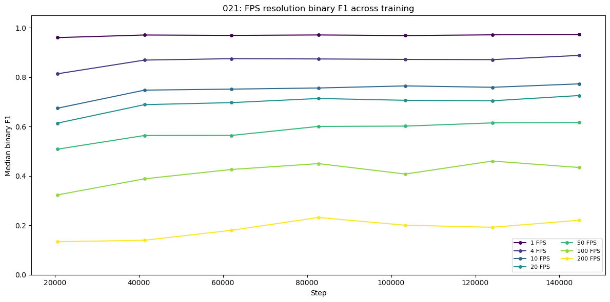
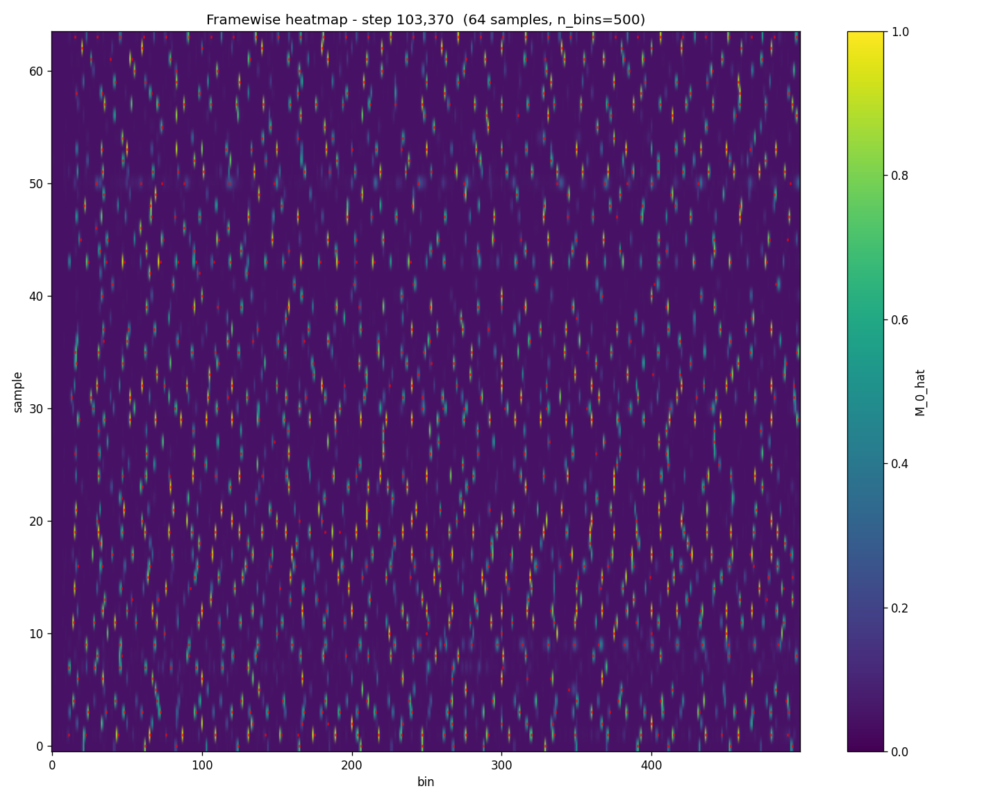
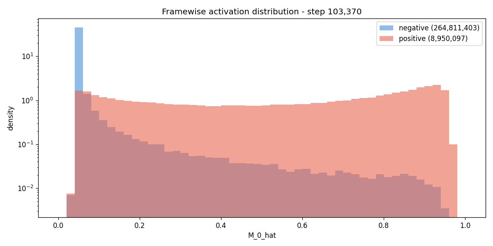
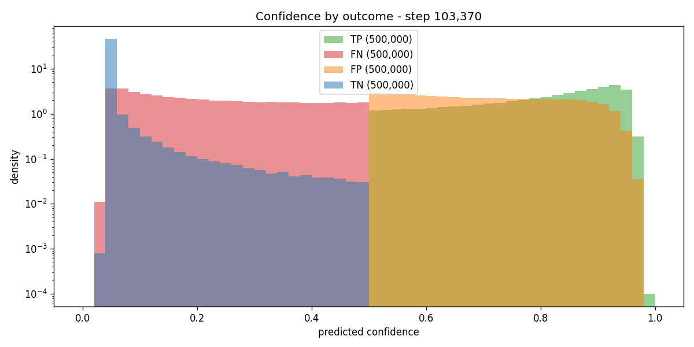
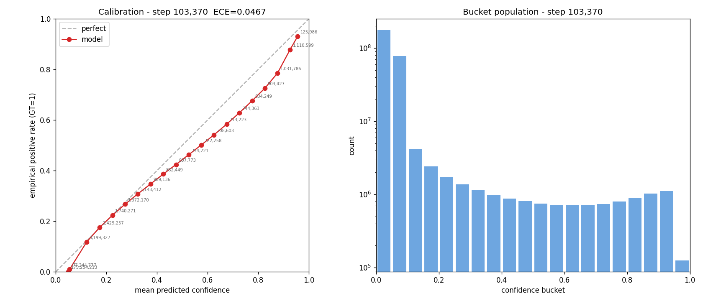

# Experiment 021 — Wider conv stem

## Status

`Complete` (hypothesis rejected)

## Context

[#019](../019-coincidence-input/) showed the model ignores coincidence
channels but produced a small F1 improvement at matched density:
F1 +0.012, gap_TVD -0.041 at tau=0.4
[019 threshold_sweep.json, eval_143990/tau=0.4]. The most likely
explanation is the wider Conv stem (93 vs 80 input channels) providing
more capacity in the first convolution, not the coincidence signal.

This experiment tests that hypothesis directly: widen the Conv stem
intermediate channels from 192 to 256 while keeping the input at 80
mel bands. If the improvement reproduces, the gain is from stem
capacity. If not, 019's gain was specific to the 93-channel input
layout (e.g., the coincidence rows acting as additional learnable
dimensions even though the model "ignored" them per the benchmark).

The conv stem is currently:
```
Conv1d(80, 192, k=7, s=2) -> GroupNorm -> Conv1d(192, 384, k=7, s=2)
```
This experiment changes it to:
```
Conv1d(80, 256, k=7, s=2) -> GroupNorm -> Conv1d(256, 384, k=7, s=2)
```

Cost: +208K parameters (22.1M vs 21.9M, +0.9%).

## Citations

- Direct baseline:
  - [#017f -- framewise BCE metrics rerun](../017f-framewise-bce-metrics-rerun/).
    Best sweep tau=0.4 (eval_248088): `f1` 0.771, `precision` 0.778,
    `recall` 0.757, `density_ratio` 0.964, `dc_human` 92.4,
    `gap_hist_tvd` 0.331, `silence_overlap_f1` 0.527
    [017f threshold_sweep.json].
- Motivation:
  - [#019 -- coincidence input](../019-coincidence-input/).
    At matched DR (tau=0.4): F1 0.781 (+0.012 vs 017f), gap_TVD 0.294
    (-0.041). Model ignored coincidence channels (no_coincidence
    benchmark +0.2%). Gain attributed to wider conv stem (93 vs 80
    input channels) [019 threshold_sweep.json].
- Interpretability:
  - [#020 -- activation maximization](../020-activation-maximization/).
    High-band saliency dominance suggests the conv stem is where
    onset-relevant spectral features are extracted.
- Implementation: `models/common.py:AudioConvStem`, new `stem_width`
  config field on `EventEmbeddingConfig`.

---
<!--
PRE-RUN. Do not edit after the run.
-->
---------------------------------------------------------------------

## Hypothesis

### Claim

Widening the Conv stem intermediate channels from 192 to 256
(`stem_width: 256`) will reproduce the F1 and gap_TVD improvements
seen in #019 (F1 +0.012, gap_TVD -0.041 at matched density), because
019's gain came from conv capacity, not from the coincidence signal.

### Mechanism

The first Conv1d layer mixes mel bands into spectral features. With
192 intermediate channels, it can learn 192 spectral combinations of
the 80 mel bands. Widening to 256 adds 64 more combinations (+33%),
giving the model more expressive power to capture the high-frequency
transient patterns that #020's saliency showed are important for onset
detection. #019 accidentally tested a similar widening (93 input
channels -> 192 intermediate channels meant 93 spectral mixtures in
the first conv; the wider input effectively increased the first
layer's capacity).

### Predicted numbers

Reference: [#017f](../017f-framewise-bce-metrics-rerun/) tau=0.4
sweep [017f threshold_sweep.json, eval_248088] and
[#019](../019-coincidence-input/) tau=0.4
[019 threshold_sweep.json, eval_143990].

| Metric | #017f (tau=0.4) | #019 (tau=0.4) | Predicted (#021) | Notes |
|---|---:|---:|---:|---|
| AR `f1` (25ms) | 0.771 | 0.781 | **>= 0.775** | Between 017f and 019 |
| AR `precision` | 0.778 | 0.776 | **~0.78** | Should hold |
| AR `recall` | 0.757 | 0.769 | **~0.76** | Should hold |
| `density_ratio` | 0.964 | 0.969 | **0.93-1.03** | Near 1.0 at tau=0.4 |
| `dc_human` | 92.4 | 92.9 | **>= 92.4** | Should hold or improve |
| `gap_hist_tvd` | 0.331 | 0.294 | **< 0.32** | Better rhythmic structure |
| `silence_overlap_f1` | 0.527 | 0.533 | **~0.53** | Not expected to change |
| frame F1 | 0.822 | 0.816 | **>= 0.82** | Should match 017f |
| fps50 F1 | 0.741 | 0.731 | **>= 0.73** | Should match 017f |

## Success criteria

- **Must:** frame F1 >= 0.81. The wider stem must not degrade frame
  quality.
- **Must:** AR F1 at tau=0.4 >= 0.77 (matches or exceeds 017f).
- **Confirms hypothesis if:** gap_TVD < 0.32 at matched density,
  reproducing 019's improvement range.
- **Fails if:** frame F1 < 0.80 or AR F1 < 0.75 -- the wider stem
  hurt rather than helped.
- **Rejects hypothesis if:** gap_TVD >= 0.33 (no improvement over
  017f) -- would mean 019's gain was not from conv width.
- **Nice-to-have:** F1 improvement >= 0.01 over 017f at tau=0.4.

## Changes from baseline

Baseline: [#017f -- framewise BCE metrics rerun](../017f-framewise-bce-metrics-rerun/).

One change:

- `config/model.json` -- `stem_width: 256` (was 0, defaulting to
  d_model // 2 = 192). Adds 208K params (+0.9%).

All other configs identical to #017f. decode_threshold set to 0.4
in infer.json (017f's sweep-optimal threshold) for direct AR
comparison during training.

Code change:
- `models/common.py:AudioConvStem` -- added `stem_width` parameter
  (default 0 = d_model // 2, backward compatible).
- `models/event_embedding.py:EventEmbeddingConfig` -- added
  `stem_width: int = 0` field.

## Run config

- Run name: `exp_021_wider_stem`
- Config snapshots: [`config/`](./config/)
- Dataset: `taiko2_v1`, split `train` / `val`
- Total params: ~22.10 M (vs 017f's 21.89 M)
- Command:
  ```bash
  set -e CUDA_VISIBLE_DEVICES && ulimit -n 65536 && \
  osu/taiko2/.venv/bin/python -m osu.taiko2.cli.train \
      --run-name exp_021_wider_stem \
      --config-dir osu/taiko2/experiments/021-wider-stem/config \
      --dataset taiko2_v1 --device cuda \
      --time-stretch-prob 0.3 --time-stretch-max-scale 1.4 \
      --train-noaug-fraction 0.05 \
      --benchmarks all \
      --compile \
      --infer-corpus-spec osu/taiko2/experiments/021-wider-stem/config/infer.json \
      --infer-corpus-config osu/taiko2/configs/infer_corpus_per_eval.json
  ```

---------------------------------------------------------------------
<!--
POST-RUN. Do not fill until the run completes.
Everything below comes from real measurements, not predictions.
-->
---------------------------------------------------------------------

## Results summary

7 evals completed (steps 20,674 to 144,718). Threshold sweep across
all checkpoints x 7 thresholds.

### Training: 021 vs 017f

Frame metrics matched 017f from E2 onward (F1 within +/-0.009).
Distributional metrics during training showed consistent improvements
on dc_human, gap_TVD, and density_corr, but these **did not survive
the threshold sweep**.

| Eval | Step | F1 | fps50 | AR F1 | DR | dc_human | gap_TVD | den_corr |
|---:|---:|---:|---:|---:|---:|---:|---:|---:|
| 1 | 20,674 | 0.744 | 0.651 | 0.681 | 0.765 | 92.28 | 0.402 | 0.515 |
| 2 | 41,348 | 0.795 | 0.715 | 0.744 | 0.901 | 92.57 | 0.347 | 0.540 |
| 3 | 62,022 | 0.815 | 0.734 | 0.749 | 0.920 | 92.55 | 0.331 | 0.574 |
| 4 | 82,696 | 0.810 | 0.722 | 0.747 | 0.894 | 93.02 | 0.334 | 0.585 |
| 5 | 103,370 | 0.820 | 0.736 | 0.758 | 0.936 | 92.47 | 0.327 | 0.593 |
| 6 | 124,044 | 0.817 | 0.732 | 0.751 | 0.900 | 92.81 | 0.330 | 0.578 |
| 7 | 144,718 | 0.818 | 0.738 | 0.766 | 0.946 | 93.11 | 0.311 | 0.587 |

Per-eval deltas vs 017f (training, @tau=0.4 for 021 vs 017f sweep):
- **dc_human:** +0.02 to +0.80 at every eval (consistently positive)
- **gap_TVD:** -0.009 to -0.031 at every eval (consistently better)
- **density_corr:** +0.035 to +0.071 at every eval (consistently better)
- **AR F1:** -0.003 to -0.020 (slightly behind, gap closing)

### Threshold sweep: hypothesis rejected

At matched density in the sweep, 021 does not reproduce 019's gains.
The per-eval training improvements wash out under threshold
normalization
[021 threshold_sweep.json, 017f threshold_sweep.json].

Best operating points:

| Goal | 017f | 021 |
|---|---|---|
| Best AR F1 | 0.782 (eval_289436/0.3) | 0.781 (eval_144718/0.3) |
| Best dc_human | 93.18 (eval_124044/0.5) | 92.88 (eval_82696/0.5) |
| Best DR ~1.0 | 0.968 (eval_144718/0.4) | 1.009 (eval_20674/0.3) |

### 3-way comparison at tau=0.4, matched density (~0.97)

| Metric | 017f | 019 | 021 | Best |
|---|---:|---:|---:|---|
| F1 | 0.769 | **0.781** | 0.768 | 019 |
| Precision | 0.777 | 0.776 | 0.777 | tie |
| Recall | 0.756 | **0.769** | 0.756 | 019 |
| dc_human | 92.50 | **92.94** | 92.65 | 019 |
| gap_TVD | 0.335 | **0.294** | 0.355 | 019 |
| density_corr | **0.538** | 0.547 | 0.533 | 019 |
| gap_IoU | 0.733 | **0.734** | 0.722 | 019 |
| silence_f1 | **0.576** | 0.533 | 0.527 | 017f |
| bpm_ratio | 0.968 | 1.048 | **0.988** | 021 |

019 wins on F1, dc_human, gap_TVD, density_corr, gap_IoU. 021 is
flat with 017f on most metrics and worse on silence_f1 and gap_TVD.
**The wider conv stem does not explain 019's improvement.**

### Threshold ladder (best checkpoint of each)

021 eval_144718 vs 017f eval_289436
[021 threshold_sweep.json, 017f threshold_sweep.json]:

| tau | 021 F1 | 017f F1 | dF1 | 021 DR | 017f DR | 021 gTVD | 017f gTVD | 021 DC | 017f DC |
|---:|---:|---:|---:|---:|---:|---:|---:|---:|---:|
| 0.1 | 0.677 | 0.691 | -0.014 | 1.860 | 1.785 | 0.572 | 0.543 | 86.90 | 87.65 |
| 0.2 | 0.755 | 0.768 | -0.013 | 1.413 | 1.364 | 0.416 | 0.399 | 90.66 | 90.77 |
| 0.3 | 0.781 | 0.782 | -0.001 | 1.168 | 1.138 | 0.347 | 0.332 | 92.01 | 91.90 |
| **0.4** | **0.768** | **0.767** | **+0.000** | 0.969 | 0.967 | 0.355 | 0.327 | **92.65** | 92.26 |
| 0.5 | 0.726 | 0.737 | -0.011 | 0.790 | 0.809 | 0.389 | 0.374 | 92.86 | 92.81 |
| 0.6 | 0.641 | 0.668 | -0.027 | 0.610 | 0.647 | 0.487 | 0.465 | 92.58 | 92.72 |
| 0.7 | 0.533 | 0.577 | -0.044 | 0.446 | 0.500 | 0.613 | 0.569 | 92.15 | 92.38 |

021 matches 017f at tau 0.3-0.4 but underperforms at tau 0.5-0.7.
At high thresholds the wider stem under-emits more aggressively than
017f.

## Visualizations


*Training loss. Same trajectory as 017f.*


*021 (red) vs 017f (blue) across training. Frame F1 and fps50
overlap from E2 onward. AR F1 gap closes by E7. dc_human
consistently higher for 021. Note 021 AR uses tau=0.4 during
training vs 017f's tau=0.3, so density_ratio differs.*


*Distributional metrics during training. gap_TVD and density_corr
show consistent 021 advantage, but this advantage does not survive
the threshold sweep at matched operating points.*


*Threshold sweep: 021 (red), 017f (blue), 019 (green). 019
outperforms both at tau 0.3-0.4 on AR F1, gap_TVD, and dc_human.
021 is flat with 017f.*


*FPS resolution F1 across training. Same saturation pattern as
017f: coarse resolutions (1-4 FPS) plateau early, mid-range
(10-50 FPS) peak at E5, 200 FPS slowly climbs.*


*Confidence maps at best frame F1 (E5, step 103,370).*


*Confidence distribution at E5.*


*Confidence histograms for TP/FN/FP/TN at E5.*


*Calibration curve at E5.*

## Vs prediction

- **Frame F1 >= 0.81:** predicted yes -> actual 0.820 (E5) ->
  **match**.
- **AR F1 >= 0.77 at tau=0.4:** predicted yes -> actual 0.768 ->
  **marginal miss** (delta -0.002 from threshold).
- **gap_TVD < 0.32 (confirms hypothesis):** predicted yes -> actual
  0.355 at tau=0.4 in sweep -> **miss**. Per-eval training showed
  0.311 at E7 but this did not survive the sweep.
- **gap_TVD >= 0.33 (rejects hypothesis):** actual 0.355 ->
  **triggered. Hypothesis rejected.**
- **F1 improvement >= 0.01 over 017f:** predicted nice-to-have ->
  actual +0.000 at tau=0.4 -> **miss**.

The hypothesis is rejected. The wider conv stem does not explain
019's distributional improvements in the threshold sweep.

## Takeaways

- **Conv stem width is not the bottleneck.** Widening from 192 to
  256 intermediate channels (+208K params) produces no measurable
  improvement in the threshold sweep at any operating point. The
  per-eval training improvements (dc_human +0.4, gap_TVD -0.02,
  density_corr +0.05) were real but disappeared under threshold
  normalization -- they were artifacts of the different operating
  point (tau=0.4 during training) rather than genuine quality gains.

- **019's improvement remains unexplained.** The 3-way comparison
  shows 019 outperforms both 017f and 021 at matched density on F1,
  dc_human, gap_TVD, and density_corr. Since 021 (wider stem, same
  mel input) does not reproduce the gains, the improvement is not
  from conv capacity alone. Possible explanations: (a) the
  93-channel input layout acted as implicit regularization during
  training, (b) the different dataset (taiko2_v1_coin, 10 fewer
  charts), or (c) run-to-run variance at the edge of significance.

- **Per-eval metrics can mislead without the threshold sweep.** The
  consistent per-eval improvements on dc_human, gap_TVD, and
  density_corr would have suggested a real gain if the sweep hadn't
  been run. The threshold sweep is essential for comparing
  experiments at matched operating points.

- **dc_human at tau=0.4 is slightly better.** 021 achieves 92.65
  vs 017f's 92.26 (+0.39) at tau=0.4 and 92.86 vs 92.81 (+0.05)
  at tau=0.5. This is the only metric where 021 consistently edges
  ahead across thresholds, but the magnitude is within noise.

## Followup questions

- **Is 019's gain from the coincidence rows or the dataset?** Run
  017f's model (80 mel, stem_width=192) on taiko2_v1_coin to test
  whether the different dataset alone explains the shift.

- **Would a deeper stem help more than a wider one?** Adding a third
  conv layer (e.g., stride-1 refinement) or using dilated convolutions
  would increase the stem's temporal receptive field without adding
  width. The 200 FPS F1 plateau (0.20-0.24 across all experiments)
  suggests temporal resolution, not spectral width, is the remaining
  bottleneck.
