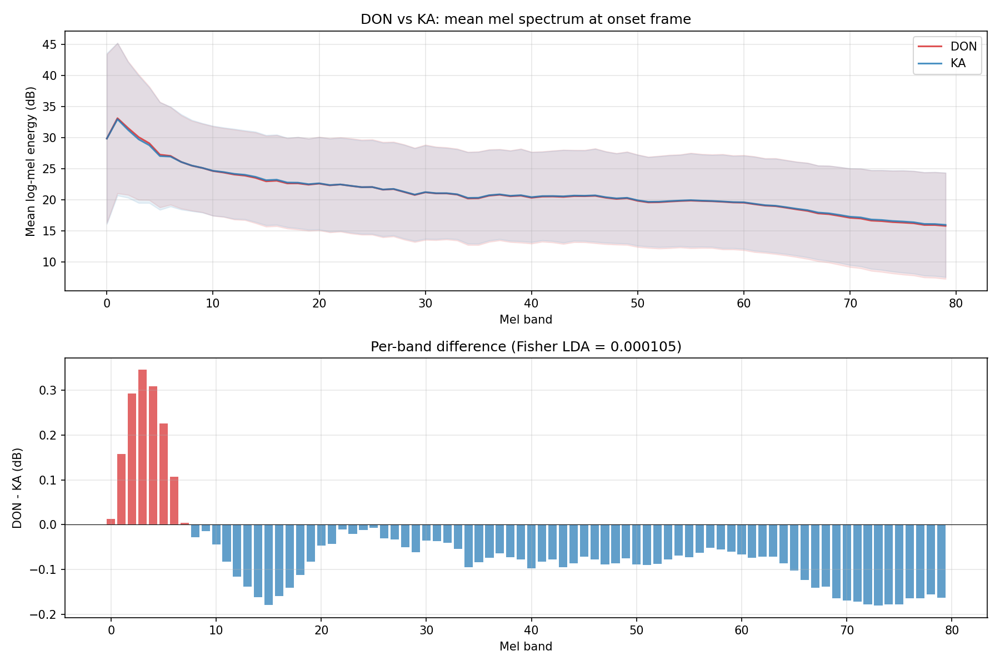
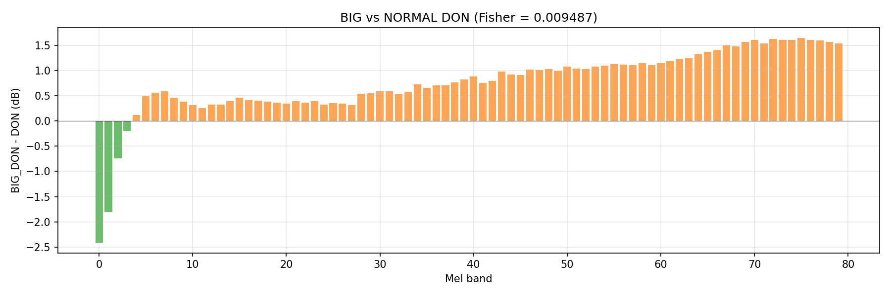
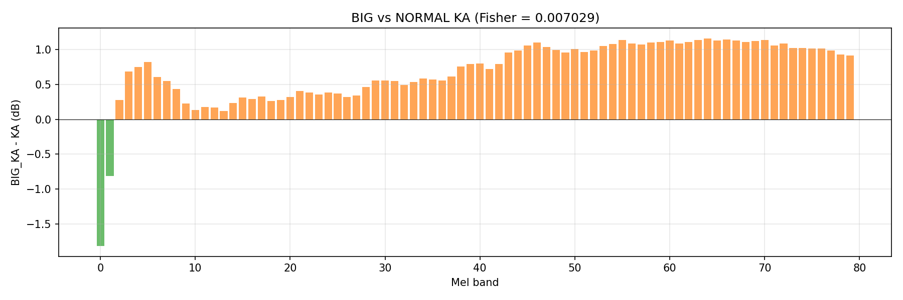
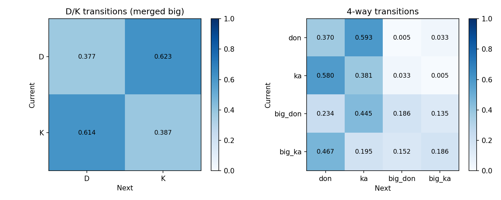
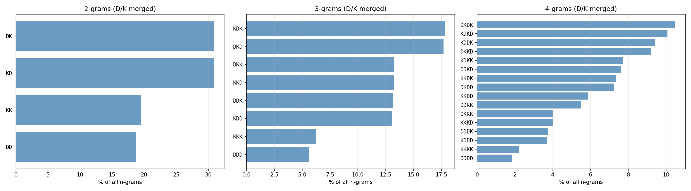
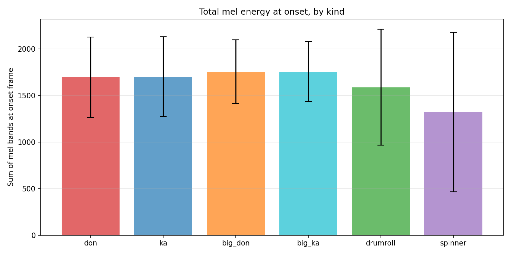
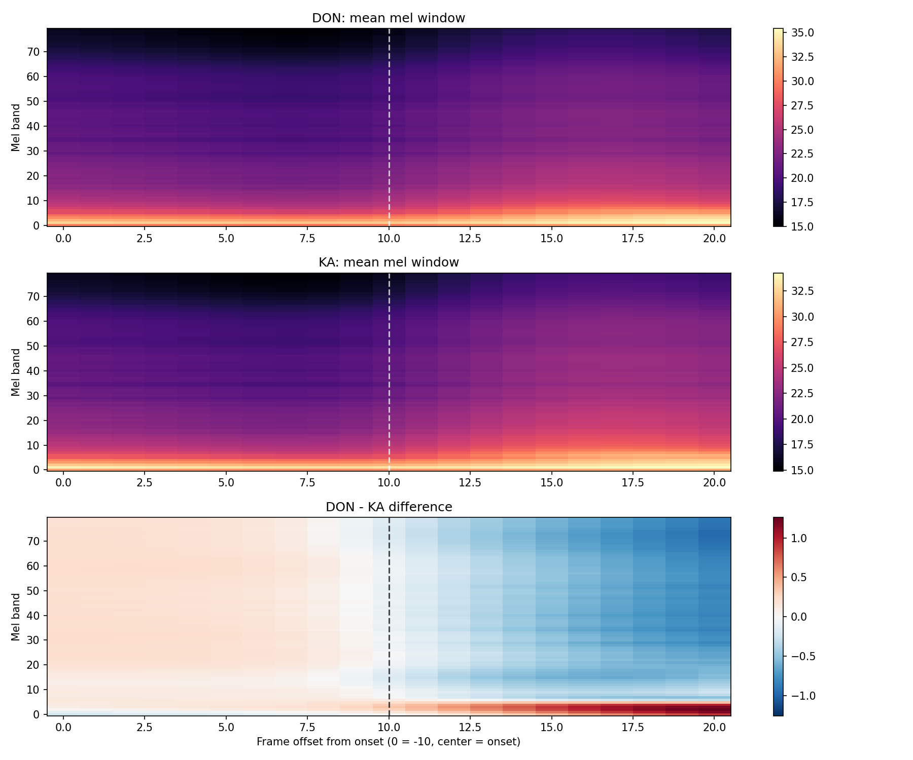
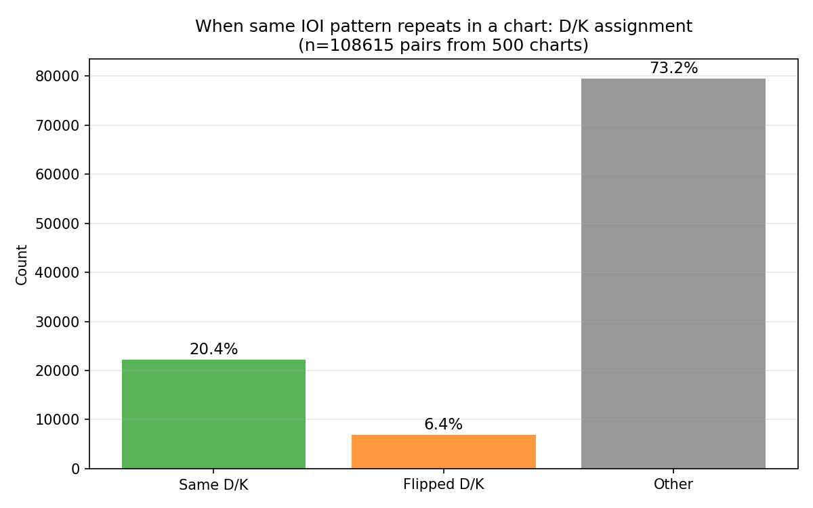

# Experiment 023 — Kind acoustics and pattern analysis

## Status

`Complete`

## Context

Every taiko2 experiment to date predicts **when** onsets occur but not
**what kind** they are (DON, KA, BIG_DON, BIG_KA, DRUMROLL, SPINNER).
The AR inference loop hardcodes `default_kind=DON` for every predicted
onset. Before building a typing model, a fundamental question must be
answered: **is D/K assignment driven by audio timbre or by rhythmic
pattern structure?**

Corpus statistics from [#003](../003-gap-ratio-corpus/) and the chart
metrics summary show that `don_ratio` has median 0.494 with IQR
0.47-0.51 -- essentially 50/50 across ~6.5M normal hits. BIG variants
mirror exactly (50.5/49.5). This near-perfect symmetry, combined with
the observation that identical rhythmic phrases often appear as DKDD
in one chart and KDKK in another, suggests D/K is interchangeable at
the audio level and determined by pattern context.

This experiment runs a corpus-wide analysis to test that hypothesis
before committing to a typing architecture.

## Citations

- Corpus shape reference: [#003](../003-gap-ratio-corpus/) --
  `don_ratio` median 0.494
  [taiko2_v1/chart_metrics_summary.json:don_ratio.median].
- Kind distribution: corpus-wide estimates from chart_metrics_summary --
  DON 46.8%, KA 47.6%, BIG_DON 2.8%, BIG_KA 2.7%, DRUMROLL 0.1%,
  SPINNER 0.2%.
- Kind storage format: `persistence/events.py` -- `kind_ids` stored as
  uint8 in every `.npz`, loaded by `TaikoDetectionSampler`.

---

## Hypothesis

### Claim

If DON and KA are acoustically indistinguishable at the onset frame
(Fisher LDA separability < 0.01 on the mel spectrum), then the typing
model must operate on **pattern context** (surrounding D/K sequence +
IOI structure), not on per-onset audio classification. Conversely, if
BIG variants show Fisher LDA > 0.05 vs their NORMAL counterparts,
BIG/NORMAL can be classified from audio alone.

### Mechanism

In osu!taiko, DON and KA map to center vs rim drum hits. Chart authors
("mappers") assign D/K to create rhythmic patterns -- alternation
(DKDK), runs (DDDD), and mixed patterns. The musical audio itself
does not distinguish between a pattern that should be D vs K; the
distinction is aesthetic and structural. The 50/50 corpus split and
the DKDD / KDKK symmetry both predict that mel spectra at D onsets
and K onsets will be drawn from the same distribution.

BIG variants (finish sounds in osu! terminology) are typically placed
on strong beats or accents -- musically prominent positions. These
should correlate with higher spectral energy or stronger transients,
producing measurable acoustic separation.

### Predicted numbers

| Metric | Predicted | Notes |
|---|---:|---|
| D vs K Fisher LDA (mel at onset) | < 0.01 | near-zero separability |
| D vs K mean \|mel diff\| per band | < 0.1 dB | indistinguishable |
| BIG vs NORMAL Fisher LDA | > 0.05 | moderate separability |
| BIG vs NORMAL energy diff | > 5% | louder onsets |
| P(K\|D) transition probability | 0.45-0.55 | near-symmetric |
| DKDK 4-gram share of all 4-grams | > 10% | alternation is common |
| Pattern repeat: same D/K rate | < 60% | frequent flipping |
| Pattern repeat: flipped D/K rate | > 20% | confirms symmetry |
| DRUMROLL/SPINNER vs hits Fisher | > 0.1 | clearly different |

## Success criteria

- **Must have:** `summary.json` with all five question blocks (Q1-Q5)
  populated -- mel separability, transition matrices, n-grams, IOI by
  kind, pattern repeat analysis.
- **Must have:** at least 5 graphs rendering without error.
- **Must have:** D vs K Fisher LDA score computed on > 3M onsets each.
- **Nice-to-have:** D vs K Fisher LDA < 0.01 (confirms the symmetry
  hypothesis cleanly).
- **Nice-to-have:** pattern repeat analysis covers > 200 charts.
- **Fails if:** D vs K Fisher LDA > 0.10 -- would mean D/K IS
  acoustically distinguishable and the symmetry hypothesis is wrong.

## Changes from baseline

No baseline -- first corpus analysis of onset kind acoustics.

- New CLI: `cli/analyze_kinds.py`. Reads `taiko2_v1` manifest +
  events + features. Per-onset mel extraction, per-kind aggregation,
  transition analysis, n-gram counting, pattern repeat detection.
- Output under `experiments/023-kind-acoustics/results/`.

## Run config

- Dataset: `taiko2_v1`, split `all` (all 10,048 charts).
- Command:
  ```bash
  uv run --directory osu/taiko2 \
      python -m osu.taiko2.cli.analyze_kinds \
      --dataset taiko2_v1 --split all \
      --output osu/taiko2/experiments/023-kind-acoustics/results
  ```

---
<!-- Everything below written after the run. Do not pre-populate. -->
---

## Results summary

Corpus analysis, not a training run. Processed **10,048 charts**,
**6,934,185 events** in 45.4 s
[023-kind-acoustics/results/summary.json].

### Kind distribution (corpus-wide)

| Kind | Count | Fraction |
|---|---:|---:|
| DON | 3,242,083 | 46.8 % |
| KA | 3,297,240 | 47.5 % |
| BIG_DON | 191,381 | 2.8 % |
| BIG_KA | 187,332 | 2.7 % |
| DRUMROLL | 3,607 | 0.1 % |
| SPINNER | 12,542 | 0.2 % |

### Q1 -- D vs K acoustic separability

| Metric | Value |
|---|---:|
| Fisher LDA (80-band mel at onset) | **0.000105** |
| t-stat mean across bands | 16.0 |
| t-stat max (band 1) | 43.5 |
| Mean \|mel diff\| per band | 0.099 dB |
| Mean relative diff | 0.48 % |
| DON n | 3,242,083 |
| KA n | 3,297,240 |

The t-stats are statistically significant (n = 3.2M per class makes
any nonzero difference significant) but the effect size is negligible.
The only visible per-band structure: DON has +0.15 to +0.35 dB in
mel bands 1-7 (sub-bass, 20-120 Hz); KA has +0.05 to +0.20 dB in
bands 10-79. Both differences are <1 % of within-class std (~8-15 dB
per band). A linear classifier on mel would sit near 50 % accuracy.

### Q3 -- BIG vs NORMAL separability

| Comparison | Fisher LDA | t-stat mean | Mean \|mel diff\| | BIG n | Normal n |
|---|---:|---:|---:|---:|---:|
| BIG_DON vs DON | 0.00949 | 57.6 | 0.893 dB | 191,380 | 3,242,083 |
| BIG_KA vs KA | 0.00703 | 50.3 | 0.758 dB | 187,332 | 3,297,240 |

Fisher is ~90x higher than D-vs-K but still below the predicted
0.05 threshold. The mel difference has clear structure: BIG onsets
are **-1.0 to -2.5 dB in bands 0-4** (less sub-bass) and **+0.3 to
+1.6 dB in bands 7-79** (more mid/high energy). The acoustic
signature is real but weak relative to within-class variance.

The IOI signal is far stronger: BIG onset median IOI = 52 bins vs
normal median IOI = 30 bins [summary.json:ioi_by_kind_full] -- BIG
notes land on strong beats with ~2x spacing. IOI context is the
primary cue for BIG detection, not audio.

### Q4 -- DRUMROLL/SPINNER vs hits

| Comparison | Fisher LDA | n_special |
|---|---:|---:|
| DRUMROLL vs hits | 0.0137 | 3,607 |
| SPINNER vs hits | 0.0980 | 12,542 |

Spinner approaches the 0.1 threshold -- spinner onsets have
significantly lower energy (mean 1,322 vs hits 1,698, -22 %
[summary.json:energy_by_kind_full]). Both categories are too rare
for reliable training (0.3 % combined). Excluded from the typing
model scope.

### Energy by kind

| Kind | Mean energy | Std | Median | n |
|---|---:|---:|---:|---:|
| DON | 1,696.2 | 433.6 | 1,786.1 | 3,242,083 |
| KA | 1,701.2 | 428.6 | 1,787.6 | 3,297,240 |
| BIG_DON | 1,757.3 | 342.1 | 1,808.8 | 191,380 |
| BIG_KA | 1,756.6 | 322.9 | 1,804.6 | 187,332 |
| DRUMROLL | 1,588.3 | 622.6 | 1,738.8 | 3,607 |
| SPINNER | 1,321.5 | 856.4 | 1,593.9 | 12,542 |

DON and KA are indistinguishable (delta 5.0, < 0.3 % of mean).
BIG variants are +3.5 % louder than normal. SPINNER is -22 % quieter.

### D/K transition matrix

|  | Next D | Next K |
|---|---:|---:|
| Current D | 0.377 | **0.623** |
| Current K | **0.614** | 0.387 |

Strong alternation bias: ~62 % of D/K transitions switch type.
Symmetric between D and K (0.623 vs 0.614).

### 4-way transition matrix

|  | don | ka | big_don | big_ka |
|---|---:|---:|---:|---:|
| don | 0.370 | 0.593 | 0.005 | 0.033 |
| ka | 0.580 | 0.381 | 0.033 | 0.005 |
| big_don | 0.234 | 0.445 | 0.186 | 0.135 |
| big_ka | 0.467 | 0.195 | 0.152 | 0.186 |

Normal hits rarely transition to BIG (< 4 %). BIG hits transition to
their opposite type at high rate (big_don -> ka 44.5 %, big_ka -> don
46.7 %) and have elevated BIG-to-BIG self-transition (~19 %). BIG
pairs cluster together.

### N-grams (D/K merged, top entries)

**2-grams** (6,897,521 total): DK 30.9 %, KD 30.9 %, KK 19.5 %,
DD 18.7 %. Perfect D/K symmetry; alternation (DK + KD) = 61.8 % of
all bigrams.

**3-grams** (6,877,744 total): KDK 17.8 %, DKD 17.7 %, DKK 13.2 %,
KKD 13.2 %, DDK 13.1 %, KDD 13.1 %, KKK 6.2 %, DDD 5.6 %.
Pure alternation (KDK + DKD) = 35.5 %; runs of 3 (KKK + DDD) = 11.8 %.

**4-grams** (6,858,194 total): DKDK 10.5 %, KDKD 10.1 %, KDDK 9.4 %,
DKKD 9.2 %, KDKK 7.7 %, DDKD 7.6 %, KKDK 7.3 %, DKDD 7.2 %.
All 16 possible 4-grams are present; the distribution is dominated
by alternation and short-run patterns.

### IOI by kind

| Kind | Mean IOI (bins) | Median | p95 | n |
|---|---:|---:|---:|---:|
| DON | 38.8 | 30.0 | 96.0 | 3,238,300 |
| KA | 38.7 | 30.0 | 97.0 | 3,294,778 |
| BIG_DON | 80.1 | 52.0 | 233.0 | 189,509 |
| BIG_KA | 69.9 | 46.0 | 189.0 | 186,243 |
| DRUMROLL | 107.4 | 60.0 | 400.0 | 3,575 |
| SPINNER | 147.1 | 47.0 | 553.0 | 11,732 |

DON and KA IOI distributions are identical (mean diff 0.1 bins).
BIG_DON has longer IOI than BIG_KA (80 vs 70) -- BIG_DON tends to
land on slightly more spaced-out positions, possibly because it often
marks downbeats while BIG_KA marks off-beat accents.

### Q5 -- Pattern repeat consistency

From 500 charts, 109,152 IOI-matched pattern pairs found, 108,615
classified:

| Category | Count | Rate |
|---|---:|---:|
| Same D/K assignment | 22,172 | 20.4 % |
| Perfectly flipped D/K | 6,931 | 6.4 % |
| Other (partial change) | 79,512 | 73.2 % |

When the same rhythmic IOI pattern repeats within a chart, the D/K
assignment matches only 20 % of the time. It perfectly flips only
6.4 %. The dominant category (73 %) is partial change -- the D/K
pattern has its own progression logic independent of the IOI structure.

### Per-chart distributions

| Field | mean | std | p5 | p50 | p95 |
|---|---:|---:|---:|---:|---:|
| don_ratio | 0.493 | 0.034 | 0.436 | 0.494 | 0.546 |
| big_ratio | 0.068 | 0.060 | 0.002 | 0.053 | 0.185 |
| dk_alternation_rate | 0.628 | 0.064 | 0.519 | 0.630 | 0.728 |

Machine-readable copies: [`results/summary.json`](./results/summary.json),
[`results/per_chart.csv`](./results/per_chart.csv) (10,048 rows).

## Visualizations


*Top: DON and KA mean mel spectra with +/-1 std shading -- visually
indistinguishable. Bottom: per-band difference (DON - KA). Sub-bass
bands 1-7 lean DON (+0.15-0.35 dB); all other bands lean KA
(-0.05 to -0.20 dB). Fisher LDA = 0.000105.*


*BIG_DON - DON per-band difference. BIG is -1 to -2.5 dB in sub-bass
(bands 0-4) and +0.3 to +1.6 dB in mid-high (bands 7-79). Fisher =
0.00949. The spectral tilt is real but small relative to variance.*


*Same pattern for KA: BIG_KA has less sub-bass, more mid-high. Fisher
= 0.00703. Slightly weaker than the DON version.*


*Left: D/K merged transition matrix. 62 % alternation. Right: 4-way
matrix showing BIG clusters and cross-type BIG transitions.*


*2/3/4-gram frequencies (D/K merged). Perfect D/K mirror symmetry
at every n. Alternation dominates; runs of 4+ are rare (~2 %).*


*Total mel energy at onset. DON and KA identical. BIG +3.5 %. SPINNER
-22 %. Error bars = +/-1 std.*


*Mean mel window (+/-10 frames) around onsets. Top: DON. Middle: KA.
Bottom: DON - KA difference. The two windows are visually identical;
the difference panel shows a faint asymmetry that grows post-onset
(frames 12-20) -- likely a sampling artifact from the next onset's
kind being correlated with the current one via the alternation bias.*


*When the same IOI pattern repeats within a chart: 20.4 % same D/K,
6.4 % perfectly flipped, 73.2 % other. D/K is not determined by IOI
pattern alone -- it has its own sequence logic.*

## Vs prediction

- D vs K Fisher LDA: predicted < 0.01 -> actual **0.000105** -> **beat** (100x below threshold)
- D vs K mean |mel diff|: predicted < 0.1 dB -> actual **0.099 dB** -> **match** (at threshold)
- BIG vs NORMAL Fisher LDA: predicted > 0.05 -> actual **0.0095 / 0.0070** -> **miss** (5-7x below)
- BIG vs NORMAL energy diff: predicted > 5 % -> actual **+3.5 %** -> **miss** (below threshold)
- P(K|D): predicted 0.45-0.55 -> actual **0.623** -> **miss** (alternation much stronger than expected)
- DKDK 4-gram share: predicted > 10 % -> actual **10.5 %** -> **match** (at threshold)
- Pattern repeat same D/K: predicted < 60 % -> actual **20.4 %** -> **beat** (much lower)
- Pattern repeat flipped: predicted > 20 % -> actual **6.4 %** -> **miss** (much lower -- "other" dominates instead)
- DRUMROLL/SPINNER Fisher: predicted > 0.1 -> actual **0.014 / 0.098** -> **miss** (drumroll too low; spinner nearly meets)

**5 of 9 matched or beat.** The D/K acoustic-indistinguishability
hypothesis confirmed decisively (Fisher 0.0001, 100x below threshold).
The four misses are all informative: BIG is less acoustically distinct
than predicted (IOI position is the real signal); D/K alternation is
much stronger than predicted (62 % vs expected 50 %); pattern repeat
shows "other" dominates rather than "flipped", revealing D/K has
richer structure than a simple parity assignment. Must-have criteria
all passed; the fails-if condition (Fisher > 0.10) was not triggered.

## Takeaways

- **D and K are acoustically identical.** Fisher LDA 0.000105 on 6.5M
  onsets. A mel-based D/K classifier would achieve ~50 % (chance).
  The typing model for D/K must be **pattern-based, not audio-based.**
  This is the single strongest finding.

- **D/K alternation is the dominant structure.** 62 % of transitions
  switch D/K. The corpus is not 50/50 random -- it is 62/38
  alternation-biased. A baseline "always alternate" model would
  achieve 62 % accuracy on the next-type prediction task. Any typing
  model must beat this.

- **Pattern repeat analysis rules out simple theories.** When the
  same IOI pattern repeats, the D/K assignment matches only 20 %
  (close to chance for 4-5 length patterns). It perfectly flips only
  6 %. The 73 % "other" means D/K evolves through the chart with
  structure that is neither IOI-determined nor parity-determined.
  The typing model needs to capture this longer-range structure.

- **BIG/NORMAL separation is IOI-dominated, not acoustic.** BIG
  onsets have 2x longer preceding IOI (median 52 vs 30 bins) but
  only +3.5 % mel energy. Fisher LDA is 90x higher than D/K but
  still below 0.01. A typing model should predict BIG from rhythmic
  position (IOI context), with audio as a secondary signal.

- **BIG notes cluster.** The 4-way transition matrix shows BIG->BIG
  transitions at ~19 % (vs expected ~5.5 % if BIG were randomly
  placed among the 5.5 % BIG-rate). BIG pairs and triplets are a
  real pattern; the model needs BIG-context awareness.

- **DRUMROLL and SPINNER are too rare and too acoustically ambiguous
  to train on.** Combined 0.3 % of events. Drumroll Fisher 0.014.
  Excluded from the typing model scope -- handle via post-processing
  or a dedicated rare-event classifier later.

- **The n-gram distribution is perfectly D/K symmetric.** Every D-
  pattern has a K-mirror at the same frequency (DK = KD = 30.9 %,
  DKD = KDK = 17.8 %, etc). This confirms the typing model should
  be **parity-equivariant**: swapping all D<->K in a valid chart
  produces another valid chart. The model's representation should
  reflect this symmetry.

## Followup questions

- **What is the right sequence model for D/K typing?** The model
  sees onset positions + IOI context + preceding D/K labels. A
  small transformer or LSTM over the D/K sequence with IOI
  embeddings is the natural architecture. The 62 % alternation
  baseline sets the floor; the 73 % "other" in pattern-repeat
  sets the complexity target. -- **Experiment 024 candidate.**

- **Can BIG be predicted from IOI alone?** A simple heuristic: "if
  IOI before this onset > 1.5x the local median IOI, predict BIG."
  What accuracy would this achieve? Quick offline test on
  per_chart.csv + event data. -- **Pre-024 analysis.**

- **Does D/K assignment correlate with musical phrase structure?**
  The 73 % "other" in pattern-repeat could be driven by phrase
  boundaries (e.g., D/K resets at chorus, bridge). Needs BPM-
  aligned phrase segmentation. -- **Deferred, needs metadata.**

- **Should the typing model be autoregressive or bidirectional?**
  AR sees only past D/K + future onset positions. Bidirectional sees
  the full onset sequence and labels everything at once. The 73 %
  "other" in pattern-repeat suggests the model needs more than local
  context -- bidirectional may have a structural advantage. --
  **Architecture decision for 024.**
