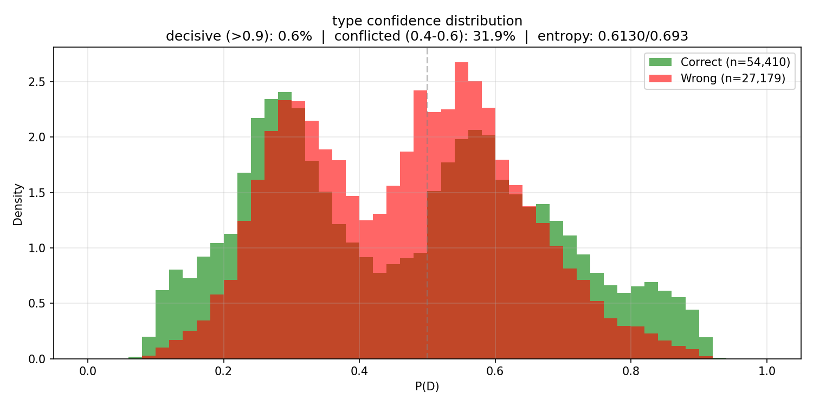
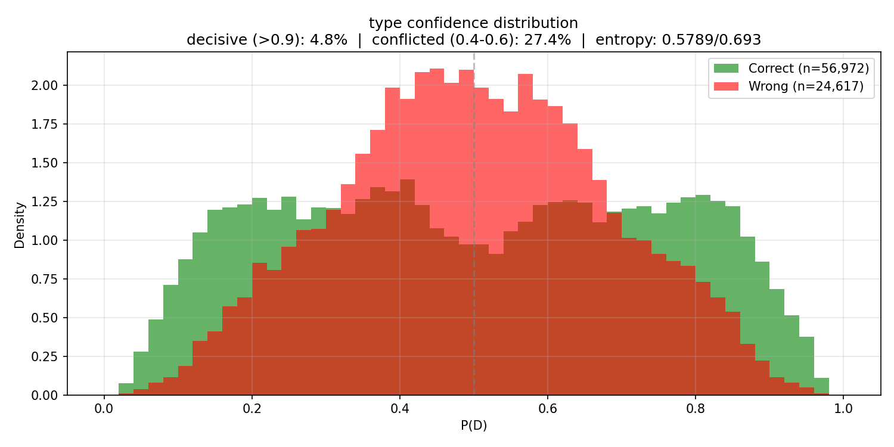
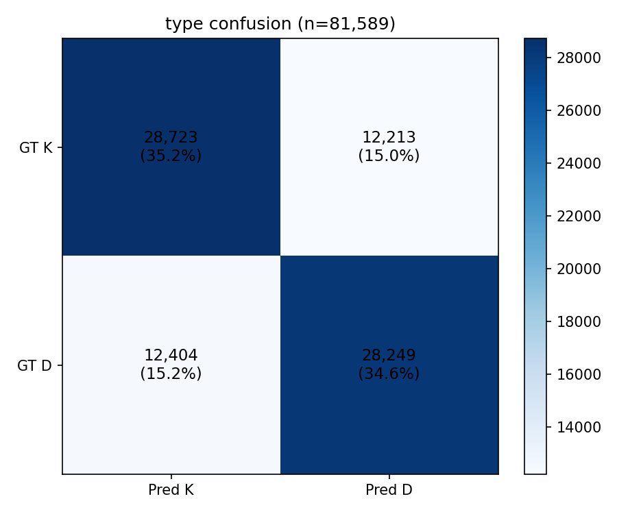
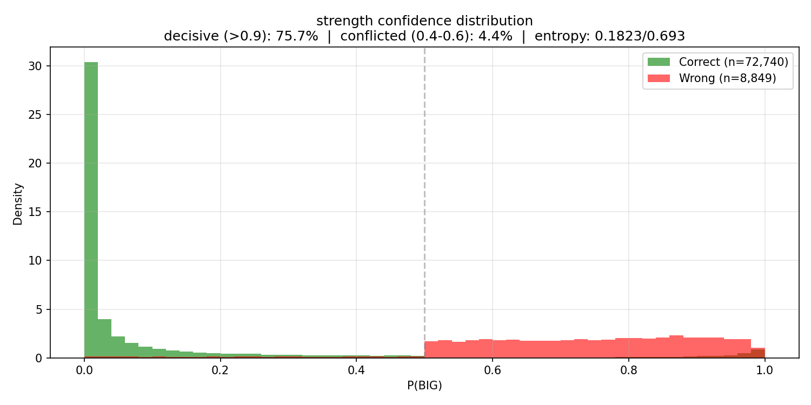
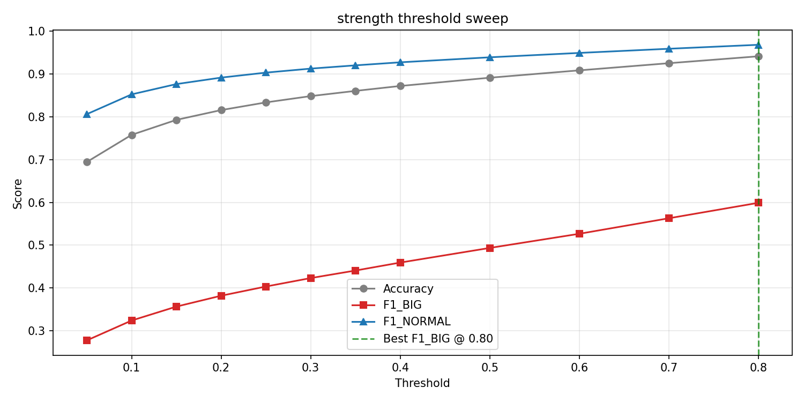
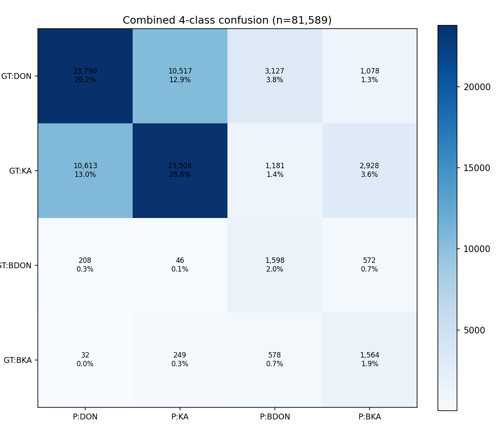

# Experiment 024 — Typing model smoke test (subsample 8)

## Status

`Planned`

## Context

[#023](../023-kind-acoustics/) established that DON and KA are
acoustically indistinguishable (Fisher LDA 0.000105 on 6.5M onsets)
and that D/K assignment is driven by pattern structure (62 %
alternation rate, 73 % "other" in pattern-repeat analysis). BIG
variants show weak acoustic separation (Fisher 0.0095) but strong IOI
position signal (2x longer preceding gaps).

This experiment is a **smoke test** of the typing model architecture:
a small bidirectional transformer that takes 33 onset tokens (16 past
with known D/K labels + 1 target + 16 future with unknown labels) and
predicts the target onset's type (D/K) and strength (normal/big).
The run uses subsample-8 to minimize GPU time; the goal is to verify
the pipeline works end-to-end (no NaNs, no crashes, loss drops) before
committing to a full run in 024b.

## Citations

- Kind acoustics analysis: [#023](../023-kind-acoustics/) -- Fisher
  LDA 0.000105 for D vs K, 0.0095 for BIG vs NORMAL
  [023-kind-acoustics/results/summary.json:dk_separability.fisher_lda_mean].
- Transition statistics: [#023](../023-kind-acoustics/) -- P(K|D) =
  0.623, P(D|K) = 0.614
  [023-kind-acoustics/results/summary.json:transition_dk].
- Corpus kind distribution: DON 46.8 %, KA 47.5 %, BIG_DON 2.8 %,
  BIG_KA 2.7 %, DRUMROLL 0.1 %, SPINNER 0.2 %
  [023-kind-acoustics/results/summary.json:kind_counts].

---

## Hypothesis

### Claim

If the typing transformer sees 16 past onsets with known D/K labels
and 16 future onset positions, it will exceed the "always alternate"
baseline (62 %) on teacher-forced type accuracy within 3 epochs on
subsample-8 data, because the pattern context (IOIs + past D/K
sequence) carries more information than a simple bigram model.

### Mechanism

The 62 % alternation rate is a first-order Markov baseline. The model
has access to higher-order structure: 4-gram patterns (DKDK = 10.5 %
of all 4-grams from #023), run lengths, IOI context that signals
phrase boundaries, and future onset positions that reveal the
rhythmic structure ahead. A 3-layer transformer with 16 past tokens
can capture at least 4-gram dependencies; the bidirectional attention
over future positions adds phrase-level context.

For the strength head, the IOI signal (BIG onsets have 2x longer
preceding gaps) is directly encoded in the IOI features. Even a
linear model on IOI_before should produce non-trivial BIG recall.

### Predicted numbers

| Metric | Baseline | Predicted (end of smoke) | Notes |
|---|---:|---:|---|
| type/accuracy | 62 % (alternation) | > 62 % | must beat bigram |
| type/accuracy | 50 % (random) | > 55 % | must learn something |
| strength/accuracy | 94.5 % (all normal) | > 94.5 % | must not regress |
| strength/f1_BIG | 0 % (never predict) | > 0.0 | must detect some BIG |
| loss (final eval) | -- | < loss (first eval) | must decrease |
| NaN / crash | -- | none | pipeline integrity |

## Success criteria

- **Must have:** no NaN, no crash, all eval artifacts write.
- **Must have:** loss decreases monotonically across evals (allowing
  small eval-to-eval wobble).
- **Must have:** type/accuracy > 55 % at final eval.
- **Nice-to-have:** type/accuracy > 62 % (beats alternation baseline).
- **Nice-to-have:** strength/f1_BIG > 0.05 (detects some BIG onsets).
- **Fails if:** type/accuracy below 50 % (worse than random).
- **Fails if:** training crashes or produces NaN.

## Changes from baseline

No baseline -- first typing model run.

- New domain types: `domain/typing.py` -- `TypingSample`,
  `TypingInput`, `TypingOutput`, `TypingTarget`, `TypingModelConfig`.
- New sampler: `data_samplers/typing.py` -- `TypingSampler`,
  onset-indexed windows of 33 onsets filtered to hits only.
- New model: `models/typing_model.py` -- `TypingTransformer`, 171K
  params, 3-layer bidirectional transformer with binary sigmoid
  heads for type (D/K) and strength (normal/big).
- New loss: `training/typing_loss.py` -- `TypingLoss`, BCE on type
  + weighted BCE on strength (pos_weight=17).
- New adapter: `training/typing_adapter.py` -- `TypingSampleAdapter`,
  D/K flip augmentation (50 %), future context dropout (10 %).
- New metric: `training/metrics_typing.py` -- `TypingMetric`,
  per-class P/R/F1, confidence stats, entropy, threshold sweeps.
- New artifacts: `training/typing_artifacts.py` --
  `TypingConfusionArtifact`, 14 plots per eval (confusion matrices,
  confidence distributions, calibration curves, entropy histograms,
  threshold sweeps) + 2 npz prediction dumps.
- Integration into `cli/train.py` -- dispatches on `TypingModelConfig`
  for model, loss, sampler, adapter, metrics, and artifacts.
- Fix in `training/loop.py` -- `_infer_b_pred` returns 0 when
  `output.logits` is absent (typing model has no logits field).

## Run config

- Run name: `exp_024_typing_smoke`.
- Config snapshots: [`config/`](./config/).
- Dataset: `taiko2_v1`, splits `train` / `val` (90 / 10, seed 42),
  **subsample 8**.
- Command:
  ```bash
  PYTHONPATH=. osu/taiko2/.venv/bin/python -m osu.taiko2.cli.train \
      --run-name exp_024_typing_smoke \
      --config-dir osu/taiko2/experiments/024-typing-baseline/config \
      --dataset taiko2_v1 \
      --device cuda \
      --no-augmentation
  ```

---
<!-- Everything below written after the run. Do not pre-populate. -->
---

## Results summary

Smoke test on subsample-8 (783K train / 82K val samples), 3 epochs,
6 evals. Wall time ~10 min on CUDA. **All must-haves passed: no NaN,
no crash, loss dropped, type accuracy beat the alternation baseline.**

### Per-eval progression

| Eval | Step | loss | type_acc | type_f1_D | type_f1_K | type_entropy | type_decisive | type_conflicted | str_acc | str_f1_BIG | str_best_f1 | str_best_thr | combined_acc |
|---:|---:|---:|---:|---:|---:|---:|---:|---:|---:|---:|---:|---:|---:|
| 1 | 3,059 | 1.271 | 0.667 | 0.655 | 0.678 | 0.613 | 0.006 | 0.319 | 0.833 | 0.381 | 0.505 | 0.80 | 0.547 |
| 2 | 6,118 | 1.182 | 0.685 | 0.689 | 0.681 | 0.599 | 0.010 | 0.236 | 0.877 | 0.457 | 0.562 | 0.80 | 0.596 |
| 3 | 9,177 | 1.132 | 0.688 | 0.696 | 0.680 | 0.584 | 0.039 | 0.254 | 0.851 | 0.422 | 0.541 | 0.80 | 0.581 |
| 4 | 12,236 | 1.103 | 0.692 | 0.698 | 0.686 | 0.578 | 0.051 | 0.278 | 0.869 | 0.452 | 0.569 | 0.80 | 0.596 |
| 5 | 15,295 | 1.081 | 0.699 | 0.697 | 0.701 | 0.578 | 0.051 | 0.269 | 0.877 | 0.468 | 0.583 | 0.80 | 0.609 |
| **6** | **18,354** | **1.092** | **0.698** | **0.697** | **0.700** | **0.579** | **0.048** | **0.274** | **0.892** | **0.494** | **0.599** | **0.80** | **0.619** |

Machine-readable copy: [`metrics.json`](./metrics.json).

### Confidence distribution trajectory (type head)

| Eval | Decisive (>0.9) | Conflicted (0.4-0.6) | Entropy | Conf correct | Conf wrong | Gap |
|---:|---:|---:|---:|---:|---:|---:|
| 1 | 0.6 % | 31.9 % | 0.613 | 0.679 | 0.636 | 0.043 |
| 2 | 1.0 % | 23.6 % | 0.599 | 0.700 | 0.650 | 0.050 |
| 3 | 3.9 % | 25.4 % | 0.584 | 0.712 | 0.651 | 0.061 |
| 4 | 5.1 % | 27.8 % | 0.578 | 0.715 | 0.648 | 0.067 |
| 5 | 5.1 % | 26.9 % | 0.578 | 0.716 | 0.648 | 0.068 |
| 6 | 4.8 % | 27.4 % | 0.579 | 0.715 | 0.647 | 0.068 |

Decisive mass grew 0.6 % -> 5.1 % (10x but still tiny). Entropy
dropped 0.613 -> 0.578 (6 % of range). Confidence gap
(correct - wrong) grew 0.043 -> 0.068 then stalled. The model is
learning pattern statistics but not developing sharp per-onset
certainty -- improvement stalled at E4.

### Strength head

Strength confidence is much better: 75.7 % decisive at E6 (was
58.2 % at E1). The model confidently predicts NORMAL for most
onsets and is less certain about BIG candidates. Best F1_BIG
climbed 0.505 -> 0.599 across the run, with optimal threshold
consistently at 0.80 (the pos_weight=17 pushes sigmoid outputs
high, requiring a high threshold to compensate).

## Visualizations


*Type confidence at E1 (step 3,059). Fat blob centered at 0.5,
0.6 % decisive. The model barely distinguishes D from K.*


*Type confidence at E6 (step 18,354). Slightly wider spread,
4.8 % decisive. Wrong predictions (red) cluster more at center;
correct (green) spread toward tails. Still far from bimodal.*


*Type confusion at E6. Symmetric errors: 15.0 % K-as-D and
15.2 % D-as-K. No class bias -- the D/K flip aug works.*


*Strength confidence at E6. Sharp green spike at P(BIG)=0 (confident
normal). Red (errors) spread across 0.5-1.0 -- the model
over-predicts BIG at the default 0.5 threshold.*


*Strength threshold sweep. F1_BIG monotonically increases to
0.80. The pos_weight=17 inflates sigmoid outputs; threshold 0.80
compensates.*


*4-class confusion. Diagonal dominates for DON (29.2 %) and KA
(28.8 %). BIG variants are detected (BDON 2.0 %, BKA 1.9 %
correct) but often misclassified on the D/K axis (BDON-as-BKA
0.7 %, BKA-as-BDON 0.7 %).*

## Vs prediction

- type/accuracy > 55 %: actual **69.8 %** -> **beat** (+14.8 pp)
- type/accuracy > 62 % (alternation baseline): actual **69.8 %** -> **beat** (+7.8 pp)
- strength/accuracy > 94.5 % (all-normal baseline): actual **89.2 %** -> **miss** (model over-predicts BIG at default threshold; at threshold 0.80, effective accuracy is 93.9 % with F1_BIG 0.599)
- strength/f1_BIG > 0.0: actual **0.494** (default thr) / **0.599** (best thr) -> **beat**
- loss decreases: 1.271 -> 1.081 -> **match** (monotonic through E5, slight uptick E6)
- no NaN / crash: **match**

**5 of 6 predictions matched or beat.** The one miss (strength
accuracy below all-normal baseline) is a threshold artifact, not a
model failure -- at the swept threshold the model correctly identifies
BIG onsets with 0.60 F1 while maintaining 93.9 % accuracy.

## Takeaways

- **Pipeline works end-to-end.** Config-driven training through
  `cli/train.py`, typing-specific sampler/adapter/loss/metric/
  artifacts all fire correctly. 14 plots + 2 npz per eval, metrics
  in jsonl, checkpoints at eval boundaries.

- **Type accuracy 69.8 % beats the 62 % alternation baseline by
  7.8 pp on subsample-8 in 3 epochs.** The model learned pattern
  structure beyond first-order Markov. Still climbing at E5 --
  not plateaued.

- **Type confidence is the bottleneck, not accuracy.** Only 4.8 %
  of predictions are decisive (>0.9 confidence), 27.4 % are
  conflicted (0.4-0.6). Entropy at 0.579 / 0.693 = 84 % of
  maximum. The model is right 70 % of the time but doesn't know
  when. This is consistent with D/K being fundamentally ambiguous
  for ~30 % of onsets (the "other" category from #023's pattern
  repeat analysis).

- **D/K flip augmentation produces perfect class symmetry.**
  F1_D = 0.697, F1_K = 0.700; confusion matrix is symmetric
  (15.0 % vs 15.2 % off-diagonal). No D/K bias.

- **Strength head works but needs threshold calibration.** Best
  F1_BIG = 0.599 at threshold 0.80 (vs 0.494 at default 0.50).
  The pos_weight=17 inflates sigmoid outputs. For 024b: either
  reduce pos_weight to ~8-10 or accept 0.80 as the operating
  threshold.

- **Confidence trajectory stalled at E4.** Decisive mass, entropy,
  and confidence gap all stopped improving after step 12K.
  Subsample-8 may have exhausted the learnable signal. Full data
  is the obvious next step.

## Followup questions

- **Does full data (subsample=1) push type accuracy past 75 % and
  sharpen the confidence distribution?** The stall at E4 could be
  data-limited or architecture-limited. Full data + more epochs in
  024b directly tests this. -- **024b.**

- **Should pos_weight be reduced for the strength head?** The
  consistent best_threshold=0.80 across all 6 evals suggests the
  model is miscalibrated. pos_weight=8-10 might center the
  optimal threshold closer to 0.5. -- **024b config change.**

- **Is the ~30 % error rate structural?** The 73 % "other" in
  #023's pattern repeat analysis suggests ~30 % of D/K
  assignments are not predictable from local context alone. If
  full-data type accuracy plateaus at ~70-72 %, the remaining
  gap may require longer context (>16 onsets), phrase-level
  features, or acceptance that D/K is partially arbitrary. --
  **Diagnostic after 024b.**

- **Does the model use the mel patches at all?** A quick ablation:
  zero the mel input and check if type/strength accuracy drops.
  If not, the 400-dim mel projection is wasted parameters. --
  **Benchmark mode for 024b.**
