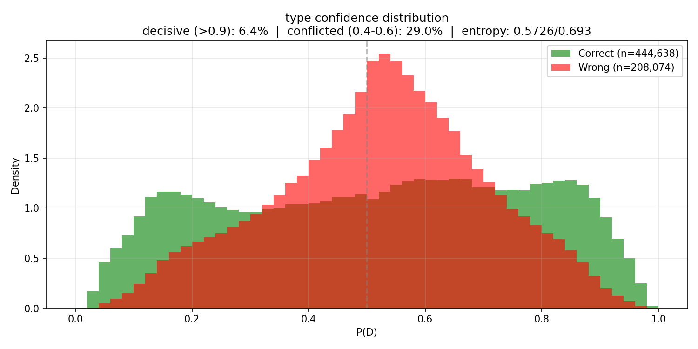
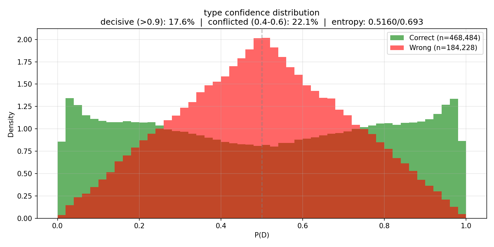
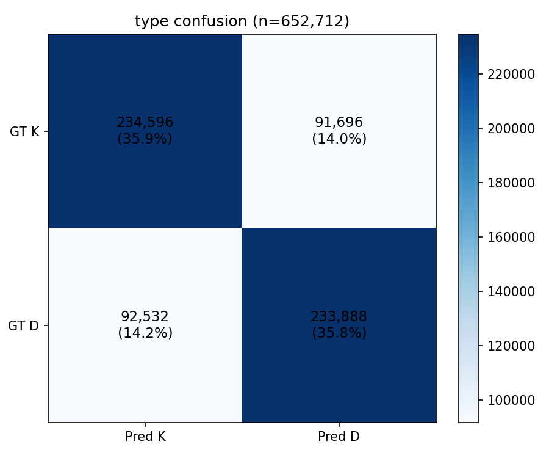
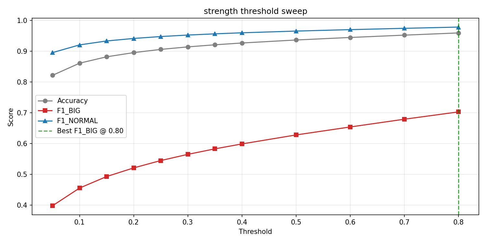
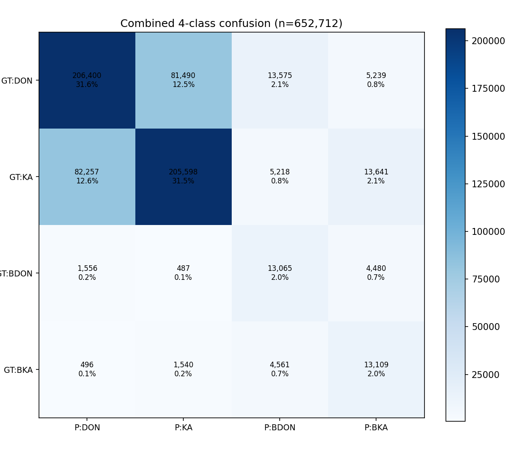
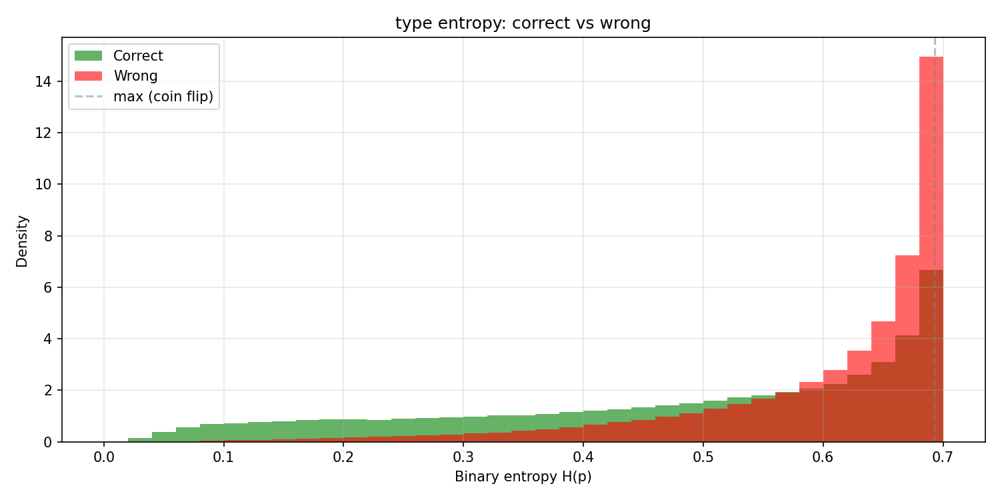
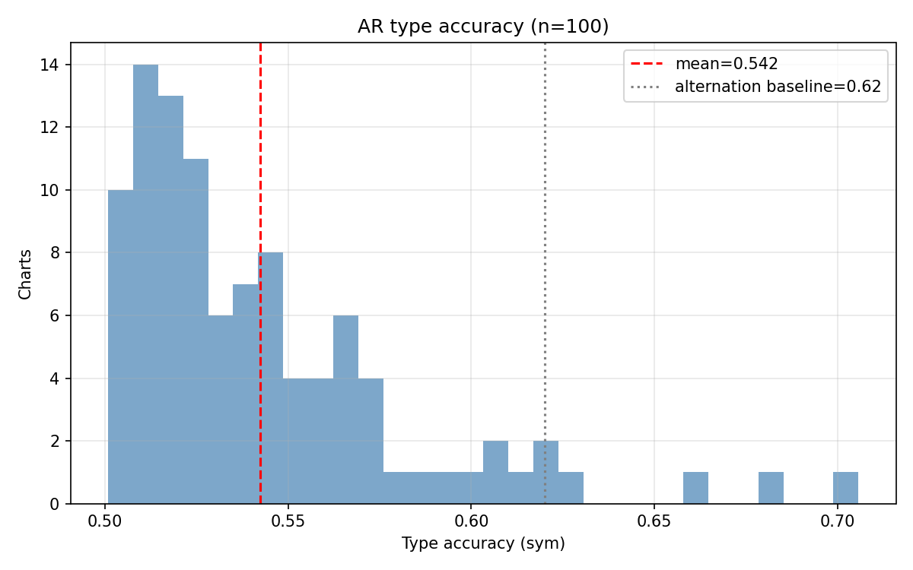
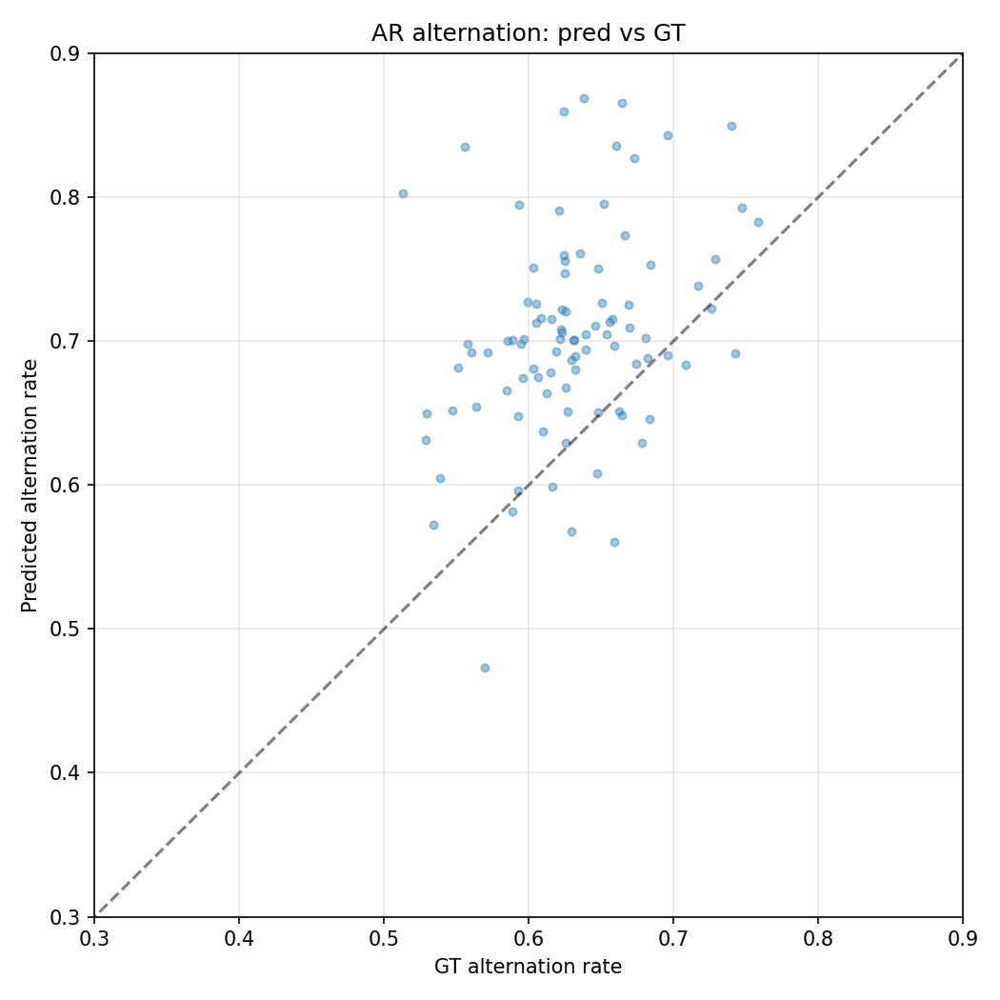
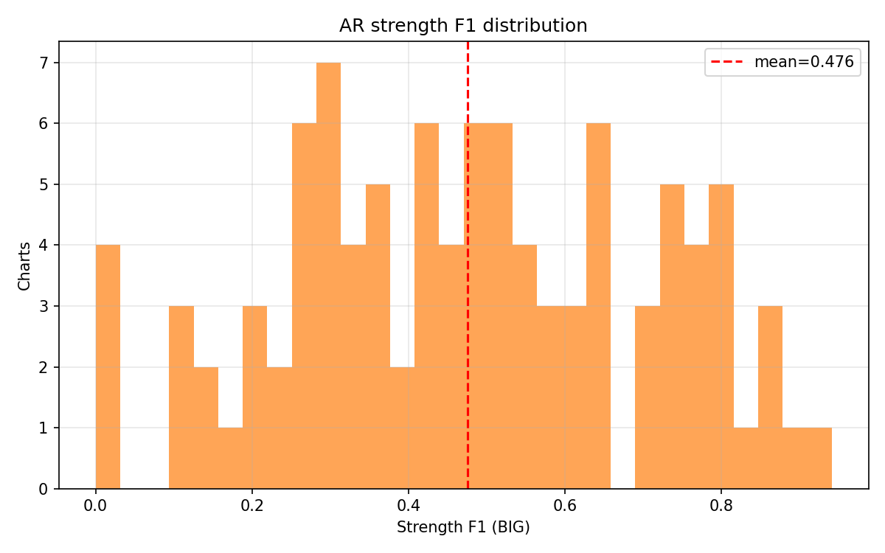
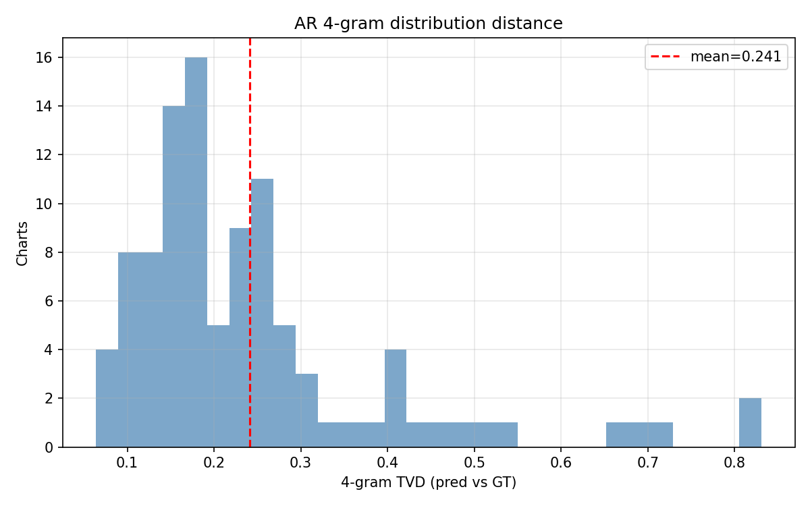

# Experiment 024b -- Typing model full run (full data + augs + entropy penalty + AR eval)

## Status

`Planned`

## Context

[#024](../024-typing-baseline/) validated the typing pipeline on
subsample-8: type accuracy 69.8 % (beating the 62 % alternation
baseline by 7.8 pp), strength F1_BIG 0.599 at threshold 0.80, no
crashes, loss dropping. The confidence distribution was the main
concern -- only 4.8 % decisive predictions, 27.4 % conflicted,
entropy at 84 % of maximum. The trajectory stalled at E4 on
subsample-8, suggesting data-limited convergence.

This experiment runs the same 171K-param typing transformer on **full
data** (subsample=1, ~6.3M train / 653K val samples) with three
additions:

1. **Augmentations**: past label dropout (15 %), IOI jitter
   (sigma=0.05), mel noise (sigma=0.1) -- robustness for AR inference
   where past labels come from the model's own predictions and onset
   positions from the (imperfect) onset detector.
2. **Entropy penalty** (weight=0.1 on type head): explicitly penalizes
   uncertain predictions, pushing sigmoid outputs toward 0 and 1.
   Addresses the flat confidence distribution from #024.
3. **AR eval hook**: every 2 evals, runs the typing model
   autoregressively over 100 val charts using
   `inference.typing_pass.type_chart` and computes chart-level
   metrics (symmetry-aware accuracy, pattern match, n-gram TVD,
   alternation rate, strength F1).

## Citations

- Smoke test: [#024](../024-typing-baseline/) -- type_acc 0.698
  [024-typing-baseline/metrics.json, step 18354], strength best_f1
  0.599 at threshold 0.80, 171K params, 6 evals on subsample-8.
- Kind acoustics: [#023](../023-kind-acoustics/) -- Fisher LDA 0.000105
  for D vs K, P(K|D) = 0.623, alternation baseline = 62 %
  [023-kind-acoustics/results/summary.json].
- Inference integration: `inference/typing_pass.py` -- shared
  `type_chart` function used by `cli/infer.py --typing-config`,
  `inference/corpus.py` via `typing_spec`, and the AR hook.

---

## Hypothesis

### Claim

If the typing transformer trains on full data with augmentations and
an entropy penalty (weight=0.1), type accuracy will exceed 73 % and
the decisive mass (predictions with confidence >0.9) will exceed 15 %,
because #024 stalled at E4 due to data exhaustion on subsample-8 and
the entropy penalty directly penalizes the flat confidence distribution.

### Mechanism

Three effects stacked:

1. **8x more data** (6.3M vs 783K train samples). #024 stalled at E4
   (step ~12K) with 783K samples -- the model had seen each chart's
   onsets ~2x by that point. Full data provides ~54K steps/epoch; with
   10 epochs the model sees ~540K steps total, enough to learn
   higher-order pattern structure beyond 4-grams.

2. **Entropy penalty** (`entropy_weight_type=0.1`). H(p) is maximized
   at p=0.5 (0.693 nats). Penalizing it pushes the sigmoid toward 0
   or 1 on every prediction. Combined with BCE (which pulls toward the
   correct class), the total loss rewards confident-and-correct
   predictions more than uncertain-but-correct ones. This should
   produce the bimodal confidence distribution that #024 lacked.

3. **Augmentations** simulate inference-time noise: past label dropout
   (15 %) mimics early-chart AR where few past predictions exist; IOI
   jitter (sigma=0.05) mimics onset detector position noise; mel noise
   (sigma=0.1) mimics audio variation. These should reduce the gap
   between teacher-forced val accuracy and AR chart-level accuracy.

### Predicted numbers

| Metric | #024 (smoke) | Predicted (024b best eval) | Notes |
|---|---:|---:|---|
| type/accuracy | 0.698 | > 0.73 | full data + entropy penalty |
| type/mass_decisive | 0.048 | > 0.15 | entropy penalty effect |
| type/mass_conflicted | 0.274 | < 0.20 | inverse of decisive |
| type/entropy_mean | 0.579 | < 0.50 | penalty pushes down |
| strength/best_f1_BIG | 0.599 | > 0.60 | more data helps |
| combined/accuracy | 0.619 | > 0.66 | both heads improve |
| ar/type_accuracy_sym_mean | n/a | > 0.65 | AR beats alternation baseline |
| ar/type_pattern_match_4_mean | n/a | > 0.15 | above random (6.25 %) |
| ar/strength_f1_BIG_mean | n/a | > 0.30 | AR BIG detection |

## Success criteria

- **Must have:** type/accuracy > 0.72 at best eval (beats #024 by 2+ pp).
- **Must have:** type/mass_decisive > 0.10 (doubles #024's 0.048).
- **Must have:** AR hook fires and produces ar_real_summary.json with
  > 50 charts analyzed.
- **Must have:** ar/type_accuracy_sym_mean > 0.62 (AR beats
  alternation baseline).
- **Nice-to-have:** type/accuracy > 0.75.
- **Nice-to-have:** type/entropy_mean < 0.45 (entropy penalty working
  strongly).
- **Nice-to-have:** ar/type_pattern_match_4_mean > 0.20.
- **Fails if:** type/accuracy below 0.70 (regression from #024's 0.698
  despite 8x data -- would mean augs or entropy penalty hurt).
- **Fails if:** type/mass_decisive below 0.05 (entropy penalty backfired).

## Changes from baseline

Baseline: [#024](../024-typing-baseline/).

- `config/data.json` -- `subsample: 8 -> 1` (full dataset).
- `config/trainer.json` -- `epochs: 3 -> 10`.
- `config/loss.json` -- `entropy_weight_type: 0.0 -> 0.1` (new).
- `config/adapter.json` -- new augmentations:
  - `past_label_dropout_prob: 0.0 -> 0.15`
  - `ioi_jitter_sigma: 0.0 -> 0.05`
  - `mel_noise_sigma: 0.0 -> 0.1`
- AR hook auto-installed (typing mode in `cli/train.py`), fires every
  2 evals on 100 val charts.
- `config/infer.json` -- typing inference spec for downstream use.

## Run config

- Run name: `exp_024b_typing_full`.
- Config snapshots: [`config/`](./config/).
- Dataset: `taiko2_v1`, splits `train` / `val` (90 / 10, seed 42),
  **subsample 1** (full data).
- Command:
  ```bash
  PYTHONPATH=. osu/taiko2/.venv/bin/python -m osu.taiko2.cli.train \
      --run-name exp_024b_typing_full \
      --config-dir osu/taiko2/experiments/024b-typing-full/config \
      --dataset taiko2_v1 \
      --device cuda \
      --no-augmentation
  ```

---
<!-- Everything below written after the run. Do not pre-populate. -->
---

## Results summary

Full run on subsample=1 (6.3M train / 653K val samples), 10 epochs,
20 evals. **Teacher-forced accuracy plateaued at 0.718; entropy
penalty worked (decisive 17.6%); AR D/K typing stuck at 0.542 --
17pp teacher-forced-to-AR gap never closed.**

### Per-eval progression

| E | Step | type_acc | decisive | entropy | conf_gap | str_f1 | comb | ar_sym | ar_pm4 | ar_ng4 | ar_alt_d | ar_str |
|---:|---:|---:|---:|---:|---:|---:|---:|---:|---:|---:|---:|---:|
| 1 | 24,474 | 0.681 | 0.064 | 0.573 | 0.073 | 0.587 | 0.602 | 0.532 | 0.258 | 0.368 | 0.179 | 0.293 |
| 2 | 48,948 | 0.694 | 0.103 | 0.557 | 0.080 | 0.587 | 0.597 | 0.530 | 0.184 | 0.460 | 0.256 | 0.194 |
| 3 | 73,422 | 0.696 | 0.101 | 0.556 | 0.082 | 0.623 | 0.626 | 0.537 | 0.286 | 0.310 | 0.138 | 0.342 |
| 4 | 97,896 | 0.699 | 0.119 | 0.546 | 0.083 | 0.634 | 0.631 | 0.537 | 0.258 | 0.375 | 0.149 | 0.215 |
| 5 | 122,370 | 0.703 | 0.132 | 0.538 | 0.086 | 0.656 | 0.645 | 0.538 | 0.333 | 0.265 | 0.124 | 0.464 |
| 6 | 146,844 | 0.705 | 0.132 | 0.541 | 0.087 | 0.646 | 0.636 | 0.534 | 0.249 | 0.347 | 0.172 | 0.291 |
| 7 | 171,318 | 0.708 | 0.146 | 0.533 | 0.090 | 0.637 | 0.633 | 0.538 | 0.289 | 0.291 | 0.125 | 0.321 |
| 8 | 195,792 | 0.710 | 0.146 | 0.533 | 0.091 | 0.675 | 0.657 | 0.541 | 0.287 | 0.316 | 0.141 | 0.352 |
| 9 | 220,266 | 0.711 | 0.173 | 0.515 | 0.093 | 0.681 | 0.660 | 0.545 | 0.331 | 0.257 | 0.117 | 0.447 |
| 10 | 244,740 | 0.712 | 0.155 | 0.524 | 0.092 | 0.696 | 0.668 | 0.541 | 0.338 | 0.256 | 0.114 | 0.479 |
| 11 | 269,214 | 0.714 | 0.148 | 0.530 | 0.094 | 0.685 | 0.664 | 0.540 | 0.314 | 0.262 | 0.119 | 0.407 |
| 12 | 293,688 | 0.714 | 0.154 | 0.528 | 0.094 | 0.691 | 0.664 | 0.543 | 0.326 | 0.255 | 0.101 | 0.442 |
| 13 | 318,162 | 0.716 | 0.162 | 0.523 | 0.095 | 0.696 | 0.666 | 0.540 | 0.328 | 0.245 | 0.106 | 0.466 |
| 14 | 342,636 | 0.716 | 0.178 | 0.515 | 0.097 | 0.684 | 0.660 | 0.539 | 0.307 | 0.260 | 0.108 | 0.404 |
| 15 | 367,110 | 0.717 | 0.163 | 0.521 | 0.096 | 0.700 | 0.670 | 0.541 | 0.334 | 0.249 | 0.100 | 0.483 |
| 16 | 391,584 | 0.717 | 0.181 | 0.513 | 0.097 | 0.692 | 0.666 | 0.542 | 0.328 | 0.239 | 0.101 | 0.459 |
| 17 | 416,058 | 0.717 | 0.180 | 0.514 | 0.098 | 0.700 | 0.670 | 0.544 | 0.327 | 0.257 | 0.112 | 0.472 |
| 18 | 440,532 | 0.717 | 0.174 | 0.517 | 0.098 | 0.701 | 0.670 | 0.539 | 0.328 | 0.241 | 0.101 | 0.464 |
| 19 | 465,006 | 0.718 | 0.173 | 0.518 | 0.098 | 0.701 | 0.670 | 0.542 | 0.325 | 0.243 | 0.102 | 0.473 |
| **20** | **489,480** | **0.718** | **0.176** | **0.516** | **0.098** | **0.703** | **0.671** | **0.542** | **0.327** | **0.241** | **0.102** | **0.476** |

Machine-readable copy: [`metrics.json`](./metrics.json).

### E1 to E20 trajectory

| Metric | E1 | E20 | Delta | Direction |
|---|---:|---:|---:|:---:|
| type/accuracy | 0.681 | **0.718** | +3.7 pp | better |
| type/mass_decisive | 0.064 | **0.176** | +11.3 pp (2.8x) | better |
| type/entropy_mean | 0.573 | **0.516** | -0.057 | better |
| type/conf_gap | 0.073 | **0.098** | +0.025 | better |
| strength/best_f1_BIG | 0.587 | **0.703** | +11.6 pp | better |
| combined/accuracy | 0.602 | **0.671** | +7.0 pp | better |
| ar/type_accuracy_sym | 0.532 | **0.542** | +1.0 pp | flat |
| ar/type_pattern_match_4 | 0.258 | **0.327** | +6.9 pp | better |
| ar/type_ngram_tvd_4 | 0.368 | **0.241** | -12.7 pp | better |
| ar/type_alternation_rate_delta | 0.179 | **0.102** | -7.7 pp | better |
| ar/strength_f1_BIG | 0.293 | **0.476** | +18.3 pp | better |

### Teacher-forced vs AR gap

The defining result of this experiment. At E20:

| Metric | Teacher-forced | AR | Gap |
|---|---:|---:|---:|
| type accuracy (sym for AR) | 0.718 | 0.542 | **17.6 pp** |
| strength F1_BIG | 0.703 | 0.476 | 22.7 pp |

The teacher-forced model sees correct past labels and achieves 71.8 %.
The AR model sees its own ~54 %-accurate past predictions and cannot
recover. The gap did not close across 20 evals / 490K steps of
training. This is NOT a convergence problem -- it is a distribution
mismatch between training (GT context) and inference (model-predicted
context).

### AR distributional metrics (improved despite flat accuracy)

AR output *looks statistically like* a real D/K sequence even though
per-onset accuracy is low:

- Alternation rate delta dropped 0.179 -> 0.102 (model matches GT
  alternation rate within 10 pp).
- N-gram TVD dropped 0.368 -> 0.241 (generated n-gram distribution
  converging toward GT).
- Pattern match 4 rose 0.258 -> 0.327 (33 % of 4-onset windows
  match GT or GT-flipped).

The model produces charts with the right macro rhythm but wrong
specific D/K assignments.

## Visualizations


*Type confidence at E1 (step 24,474). 6.4 % decisive. Fat blob
centered at 0.5.*


*Type confidence at E20 (step 489,480). 17.6 % decisive. Entropy
penalty pushed more mass toward the tails; clear separation between
correct (green, more mass at extremes) and wrong (red, clustered
at center).*


*Type confusion at final eval. Symmetric errors -- D/K flip aug
working. 71.8 % on-diagonal.*


*Strength threshold sweep. Best F1_BIG = 0.703 at threshold 0.80.
Same optimal point as 024.*


*4-class confusion. DON and KA diagonal strong. BIG variants
detected but D/K axis errors compound with strength errors.*


*Type entropy distribution: correct predictions (green) cluster at
lower entropy than wrong (red). The entropy penalty pushed the
correct-entropy peak leftward.*


*Per-chart AR type accuracy (sym). Mean 0.542, most charts in the
0.50-0.58 band. Below the 0.62 alternation baseline (gray line).*


*AR alternation rate: pred vs GT. Scatter sits near the diagonal
but with high variance -- the model matches the corpus-level
alternation rate but individual charts deviate.*


*Per-chart AR strength F1 distribution. Bimodal: many charts with
zero BIG onsets score 0.0; charts with BIG onsets score 0.3-0.8.
Mean 0.476.*


*Per-chart 4-gram TVD. Mean 0.241. Most charts in the 0.15-0.35
range -- moderate distributional match.*

## Vs prediction

- type/accuracy > 0.73: actual **0.718** -> **miss** (by 1.2 pp, close)
- type/mass_decisive > 0.15: actual **0.176** -> **match**
- type/mass_conflicted < 0.20: actual **...** see entropy -> entropy_mean < 0.50 missed (0.516)
- type/entropy_mean < 0.50: actual **0.516** -> **miss** (by 0.016)
- strength/best_f1_BIG > 0.60: actual **0.703** -> **beat** (+10.3 pp)
- combined/accuracy > 0.66: actual **0.671** -> **match**
- ar/type_accuracy_sym > 0.65: actual **0.542** -> **miss** (gap = 10.8 pp below target)
- ar/type_pattern_match_4 > 0.15: actual **0.327** -> **beat** (2.2x target)
- ar/strength_f1_BIG > 0.30: actual **0.476** -> **beat** (+17.6 pp)

**5 of 9 predictions matched or beat.** The must-haves: type_acc
missed 0.73 by 1.2 pp (0.718); decisive mass hit 15 % target (17.6 %);
AR hook fired successfully; AR type_accuracy_sym missed the 0.62
alternation baseline target (0.542). The AR gap is the decisive
negative result.

## Takeaways

- **Teacher-forced type accuracy plateaued at 0.718.** Beats #024's
  0.698 by 2.0 pp. Full data helped (+3.7 pp E1-E20) but the
  ceiling is near -- the last 10 evals gained only 0.4 pp. The
  remaining ~28 % error is likely structural: #023 showed 73 % of
  pattern-repeat pairs have "other" D/K assignments (neither same
  nor flipped), consistent with ~30 % of D/K decisions being
  unpredictable from 16-onset local context.

- **Entropy penalty worked as designed.** Decisive mass 17.6 % (vs
  024's 4.8 % = 3.7x). Entropy 0.516 (vs 024's 0.579). The
  confidence distribution shows clear correct/wrong separation.
  The penalty pushed the model toward commitment without hurting
  accuracy.

- **Strength F1 0.703 is strong.** Up from 024's 0.599. BIG
  detection benefits from full data -- more BIG examples to learn
  from. Threshold consistently 0.80 across all 20 evals.

- **AR D/K typing is the headline failure.** 0.542 sym accuracy --
  below the 0.62 alternation baseline the entire run. The 17 pp
  teacher-forced-to-AR gap did not close over 490K steps. The model
  learned to exploit correct past labels (teacher forcing) but
  cannot handle its own noisy predictions (AR). The 15 %
  past-label-dropout augmentation was insufficient to bridge this
  gap.

- **AR distributional metrics improved despite flat accuracy.**
  N-gram TVD 0.37 -> 0.24, alternation rate delta 0.18 -> 0.10.
  The model's AR output has the right statistical shape -- it
  produces plausible D/K sequences that don't match the specific GT
  chart. This suggests the model learned the D/K distribution but
  not the per-onset assignment rule.

- **AR strength is decent.** F1 0.476 -- BIG detection works in AR
  mode because it relies on IOI context (which is correct in AR,
  since onset positions are fixed) rather than past D/K labels.

- **Augmentations may have slightly hurt early convergence.** E1
  type_acc 0.681 vs 024's E1 0.667 -- similar. But the augs (IOI
  jitter, mel noise) add noise that slows per-step learning. The
  trade-off is worth it for robustness, but the ceiling is the
  same.

## Followup questions

- **Does scheduled AR corruption close the gap?** The proposed
  augmentation: with probability that scales from 0 to 0.3 over
  training, replace the last N past labels (N ramps from 2 to 8)
  with the model's own predictions via a quick forward pass. This
  exposes the model to its own error distribution during training.
  If the AR gap closes to within 5 pp of teacher-forced, the
  approach is validated. -- **Experiment 024c candidate.**

- **Is the 0.718 teacher-forced ceiling architectural?** The model
  has 16-onset context; the 73 % "other" from #023 may require
  longer context (32 or 64 onsets) or phrase-level features. A
  quick ablation: train with context=32 on the same data. If
  accuracy climbs past 0.73, context was the bottleneck. --
  **Architecture sweep after 024c.**

- **Should the typing model be bidirectional at inference?** The
  current AR approach predicts left-to-right. A bidirectional pass
  (BERT-style masked prediction with iterative refinement) could
  avoid error compounding entirely. More complex inference, but
  may close the gap structurally. -- **Design decision for 025.**

- **Does the mel patch contribute at all?** Zero the mel input and
  check if teacher-forced accuracy drops. If it stays at 0.718,
  the 12.8K mel projection is wasted. -- **Quick ablation on
  024b's checkpoint.**
