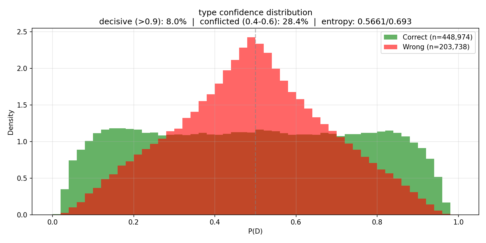
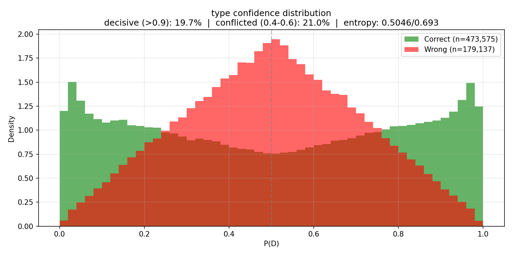
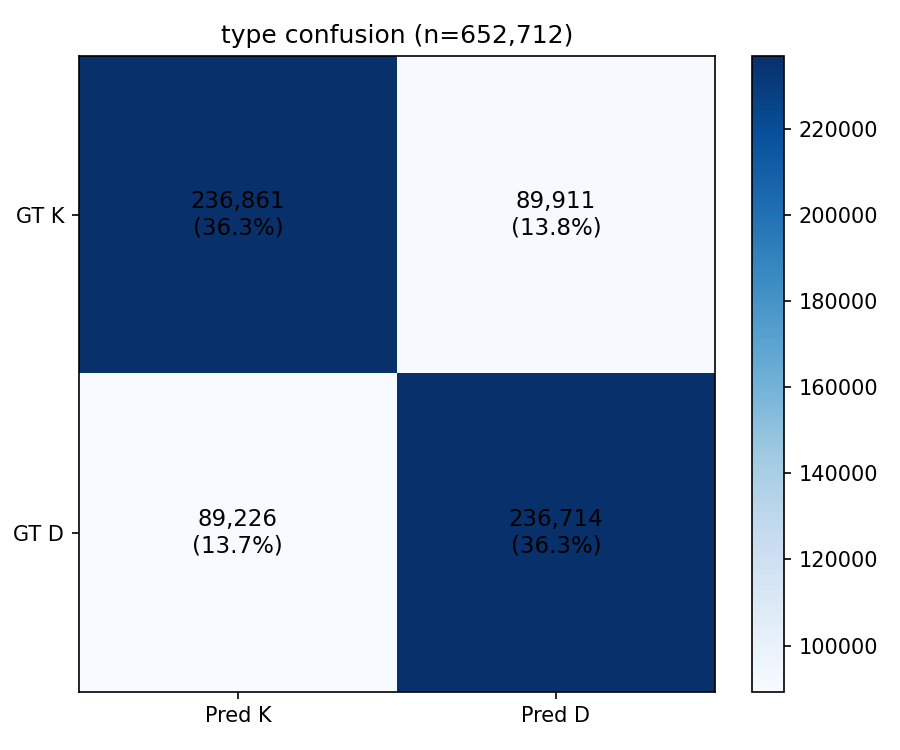
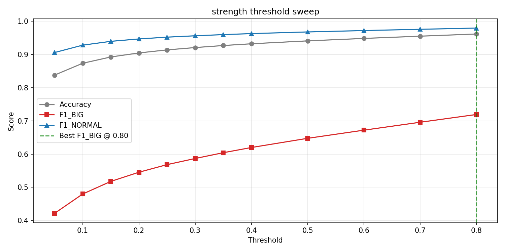
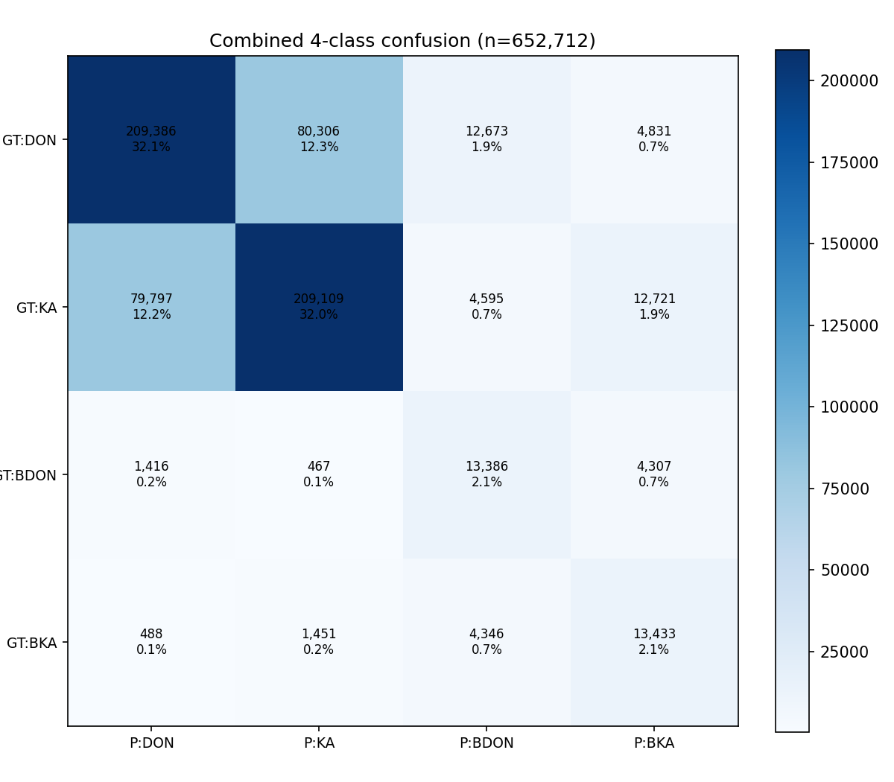
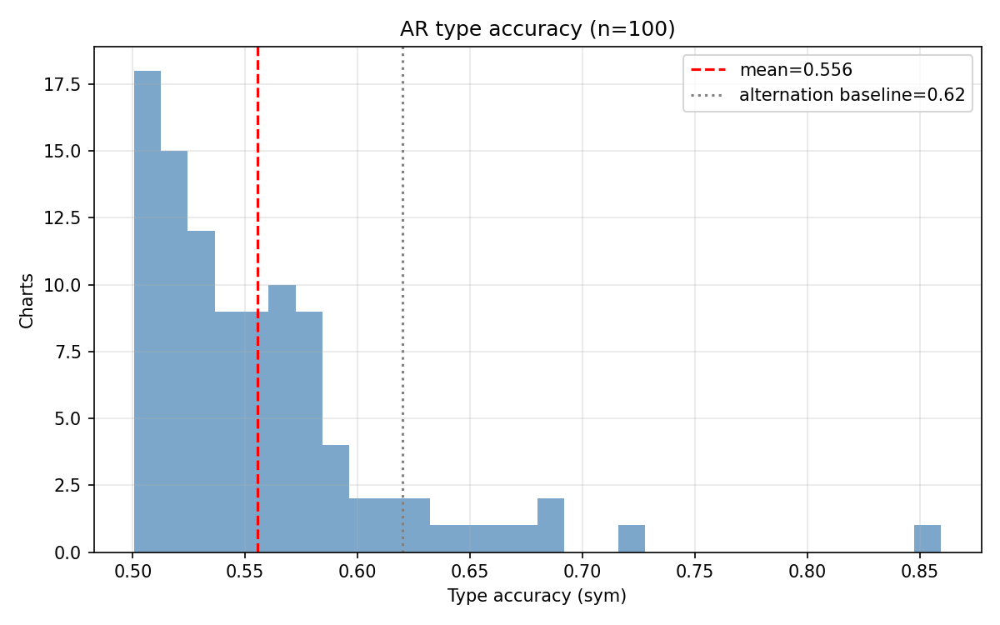
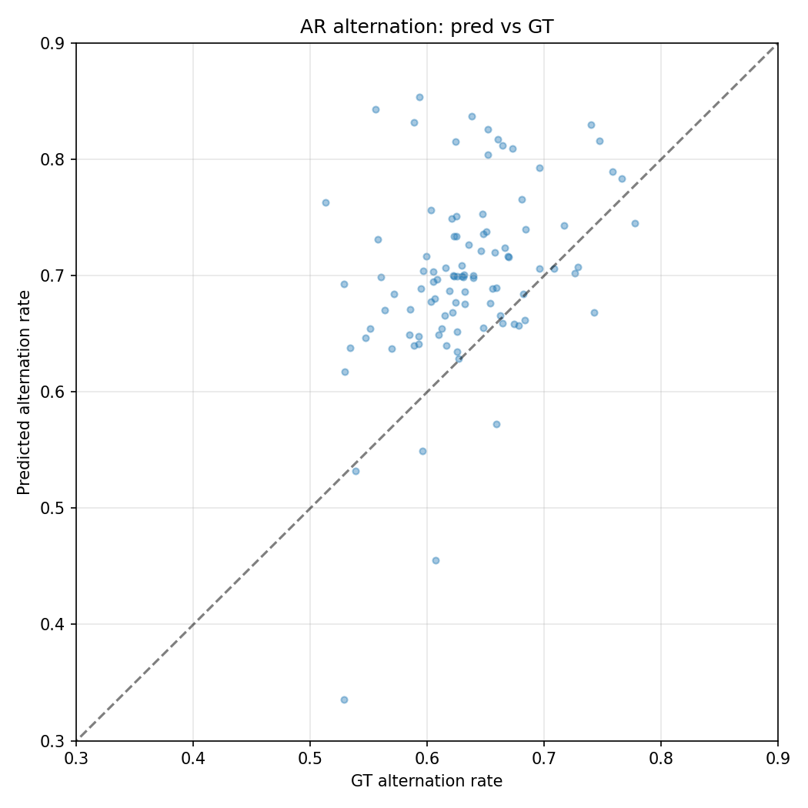
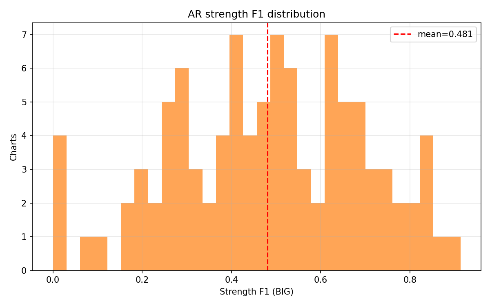
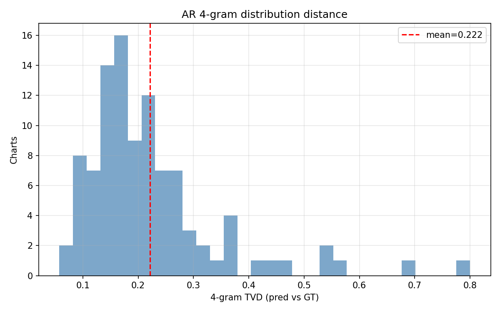

# Experiment 024c -- Typing model with context 32/32

## Status

`Complete`

## Context

[#024b](../024b-typing-full/) plateaued at type accuracy 0.718 with
past/future context of 16 onsets each. The remaining ~28 % error is
consistent with #023's finding that 73 % of pattern-repeat pairs have
"other" D/K assignments (neither same nor flipped), suggesting the
local 16-onset window does not capture enough structure.

This experiment doubles the context to 32 past + 32 future (65 tokens
total) to test whether the 0.718 ceiling is context-limited. If type
accuracy climbs past 0.73 with more context, longer windows are the
right direction. If it stays at ~0.72, the ceiling is elsewhere
(model capacity, or inherent D/K ambiguity).

## Citations

- Baseline: [#024b](../024b-typing-full/) -- type_acc 0.718
  [024b-typing-full/metrics.json, step 489480], AR type_sym 0.542,
  171K params, context=16/16.
- Pattern structure: [#023](../023-kind-acoustics/) -- 73 % "other"
  in pattern repeat analysis, 4-gram DKDK = 10.5 % of corpus
  [023-kind-acoustics/results/summary.json].

---

## Hypothesis

### Claim

If the typing transformer sees 32 past + 32 future onsets instead
of 16/16, teacher-forced type accuracy will exceed 0.73, because the
longer window captures phrase-level D/K structure (8-16 onset phrases)
that the 16-onset window misses.

### Mechanism

At 16 past onsets and typical density ~5 events/sec, the model sees
~3.2 seconds of history. Musical phrases in taiko charts commonly
span 4-8 bars at 170 BPM, which is ~5.6-11.3 seconds or ~28-56
onsets. The 16-onset window catches only half a phrase on each side.
Doubling to 32 gives ~6.4 seconds per side -- enough to capture a
full phrase boundary and its D/K transition pattern.

The model has 172K params (only 1K more than 024b's 171K -- the
difference is the larger position embedding). Transformer
self-attention over 65 tokens is cheap at d_model=64.

### Predicted numbers

| Metric | 024b (ctx 16/16) | Predicted (024c, ctx 32/32) | Notes |
|---|---:|---:|---|
| type/accuracy | 0.718 | > 0.73 | more context lifts ceiling |
| type/entropy_mean | 0.516 | < 0.50 | more context -> more certainty |
| type/mass_decisive | 0.176 | > 0.20 | longer patterns -> clearer signals |
| strength/best_f1_BIG | 0.703 | > 0.70 | more IOI context helps BIG |
| ar/type_accuracy_sym | 0.542 | > 0.55 | slight AR lift from better model |

## Success criteria

- **Must have:** type/accuracy > 0.72 (matches or beats 024b).
- **Must have:** no NaN, no crash, training completes.
- **Nice-to-have:** type/accuracy > 0.73 (ceiling lifted).
- **Nice-to-have:** ar/type_accuracy_sym > 0.55.
- **Fails if:** type/accuracy < 0.71 (longer context hurt).

## Changes from baseline

Baseline: [#024b](../024b-typing-full/).

- `config/model.json` -- `past_context: 16 -> 32`,
  `future_context: 16 -> 32`. Window: 33 -> 65 tokens.
- `config/data.json` -- `past_context: 16 -> 32`,
  `future_context: 16 -> 32`. Sampler extracts wider windows.
- All other configs (loss, trainer, adapter) identical to 024b.
- Position embedding: 33 -> 65 entries (1,056 -> 2,080 params).
  Total model: ~172K params.

## Run config

- Run name: `exp_024c_typing_ctx32`.
- Config snapshots: [`config/`](./config/).
- Dataset: `taiko2_v1`, splits `train` / `val` (90 / 10, seed 42),
  subsample 1.
- Command:
  ```bash
  source osu/taiko2/fix.sh
  PYTHONPATH=. osu/taiko2/.venv/bin/python -m osu.taiko2.cli.train \
      --run-name exp_024c_typing_ctx32 \
      --config-dir osu/taiko2/experiments/024c-typing-ctx32/config \
      --dataset taiko2_v1 \
      --device cuda
  ```

---
<!-- Everything below written after the run. Do not pre-populate. -->
---

## Results summary

Full run on subsample=1 (6.3M train / 653K val), 10 epochs, 20
evals, context 32/32 (65 tokens). **Every metric improved over
024b (context 16/16).** Type accuracy 0.726 (+0.8 pp), AR type
sym 0.556 (+1.3 pp), AR ngram TVD 0.222 (-1.9 pp). The ceiling
has not been reached -- type accuracy was still climbing at E18.

### 024c vs 024b (final eval)

| Metric | 024b (ctx 16/16) | 024c (ctx 32/32) | Delta |
|---|---:|---:|---:|
| type/accuracy | 0.718 [024b metrics.json, step 489480] | **0.726** [024c metrics.json, step 489480] | +0.8 pp |
| type/mass_decisive | 0.176 | **0.197** | +2.1 pp |
| type/entropy_mean | 0.516 | **0.505** | -0.011 |
| type/conf_gap | 0.098 | **0.103** | +0.005 |
| strength/best_f1_BIG | 0.703 | **0.719** | +1.7 pp |
| combined/accuracy | 0.671 | **0.682** | +1.1 pp |
| ar/type_accuracy_sym | 0.542 | **0.556** | +1.3 pp |
| ar/type_pattern_match_4 | 0.327 | **0.334** | +0.7 pp |
| ar/type_ngram_tvd_4 | 0.241 | **0.222** | -1.9 pp (better) |
| ar/type_alternation_rate_delta | 0.102 | **0.085** | -1.7 pp (better) |
| ar/strength_f1_BIG | 0.476 | **0.481** | +0.5 pp |

### Per-eval progression

| E | Step | type_acc | decisive | entropy | conf_gap | str_f1 | comb | ar_sym | ar_pm4 | ar_ng4 | ar_alt_d | ar_str |
|---:|---:|---:|---:|---:|---:|---:|---:|---:|---:|---:|---:|---:|
| 1 | 24,474 | 0.688 | 0.080 | 0.566 | 0.075 | 0.603 | 0.605 | 0.535 | 0.294 | 0.344 | 0.159 | 0.321 |
| 2 | 48,948 | 0.696 | 0.118 | 0.546 | 0.082 | 0.619 | 0.621 | 0.537 | 0.283 | 0.294 | 0.105 | 0.282 |
| 3 | 73,422 | 0.702 | 0.099 | 0.559 | 0.083 | 0.651 | 0.643 | 0.537 | 0.313 | 0.250 | 0.091 | 0.369 |
| 4 | 97,896 | 0.702 | 0.103 | 0.559 | 0.083 | 0.630 | 0.630 | 0.535 | 0.187 | 0.457 | 0.231 | 0.188 |
| 5 | 122,370 | 0.707 | 0.132 | 0.540 | 0.088 | 0.673 | 0.650 | 0.546 | 0.318 | 0.248 | 0.104 | 0.411 |
| 6 | 146,844 | 0.712 | 0.149 | 0.531 | 0.093 | 0.669 | 0.653 | 0.547 | 0.289 | 0.276 | 0.109 | 0.352 |
| 7 | 171,318 | 0.713 | 0.181 | 0.510 | 0.094 | 0.667 | 0.654 | 0.542 | 0.279 | 0.302 | 0.126 | 0.335 |
| 8 | 195,792 | 0.715 | 0.166 | 0.519 | 0.094 | 0.699 | 0.675 | 0.551 | 0.317 | 0.287 | 0.125 | 0.403 |
| 9 | 220,266 | 0.718 | 0.195 | 0.505 | 0.099 | 0.691 | 0.666 | 0.544 | 0.320 | 0.249 | 0.099 | 0.385 |
| 10 | 244,740 | 0.718 | 0.158 | 0.524 | 0.095 | 0.712 | 0.677 | 0.553 | 0.328 | 0.236 | 0.094 | 0.464 |
| 11 | 269,214 | 0.721 | 0.168 | 0.519 | 0.098 | 0.709 | 0.679 | 0.557 | 0.326 | 0.226 | 0.086 | 0.456 |
| 12 | 293,688 | 0.722 | 0.174 | 0.515 | 0.099 | 0.703 | 0.674 | 0.554 | 0.318 | 0.254 | 0.103 | 0.408 |
| 13 | 318,162 | 0.723 | 0.188 | 0.509 | 0.100 | 0.719 | 0.682 | 0.552 | 0.328 | 0.239 | 0.089 | 0.497 |
| 14 | 342,636 | 0.724 | 0.202 | 0.502 | 0.102 | 0.700 | 0.674 | 0.552 | 0.312 | 0.233 | 0.083 | 0.415 |
| 15 | 367,110 | 0.725 | 0.186 | 0.510 | 0.101 | 0.714 | 0.681 | 0.549 | 0.333 | 0.233 | 0.092 | 0.471 |
| 16 | 391,584 | 0.725 | 0.196 | 0.506 | 0.102 | 0.710 | 0.679 | 0.552 | 0.330 | 0.227 | 0.086 | 0.473 |
| 17 | 416,058 | 0.725 | 0.193 | 0.507 | 0.102 | 0.712 | 0.678 | 0.551 | 0.330 | 0.233 | 0.092 | 0.459 |
| 18 | 440,532 | 0.726 | 0.193 | 0.507 | 0.102 | 0.714 | 0.680 | 0.556 | 0.326 | 0.221 | 0.079 | 0.477 |
| 19 | 465,006 | 0.725 | 0.193 | 0.507 | 0.103 | 0.716 | 0.681 | 0.559 | 0.332 | 0.222 | 0.085 | 0.472 |
| **20** | **489,480** | **0.726** | **0.197** | **0.505** | **0.103** | **0.719** | **0.682** | **0.556** | **0.334** | **0.222** | **0.085** | **0.481** |

Machine-readable copy: [`metrics.json`](./metrics.json).

### Confidence distribution

| E | Decisive (>0.9) | Conflicted (0.4-0.6) | In between |
|---:|---:|---:|---:|
| 1 | 8.0 % | 28.4 % | 63.6 % |
| 10 | 15.8 % | 22.5 % | 61.7 % |
| 20 | 19.7 % | 21.0 % | 59.3 % |

Entropy penalty (`entropy_weight_type=0.1`) pushed decisive from 8 %
to 20 %, but 80 % of predictions remain in the uncertain zone. The
penalty plateaued -- stronger entropy weight (0.3-0.5) or a different
confidence-shaping loss is needed to push further.

### Teacher-forced vs AR gap

| Metric | Teacher-forced | AR | Gap |
|---|---:|---:|---:|
| type accuracy (sym for AR) | 0.726 | 0.556 | **17.0 pp** |
| strength F1_BIG | 0.719 | 0.481 | 23.8 pp |

The gap narrowed slightly from 024b's 17.6 pp to 17.0 pp. Still
structural -- the model cannot recover from its own AR prediction
errors.

## Visualizations


*Type confidence at E1. 8.0 % decisive.*


*Type confidence at E20. 19.7 % decisive. Entropy penalty pushed
mass toward tails but 80 % still uncertain.*


*Type confusion at E20. Symmetric errors, 72.6 % on-diagonal.*


*Strength threshold sweep. Best F1_BIG = 0.719 at threshold 0.80.*


*4-class confusion. DON and KA diagonal strong. BIG detection
improved over 024b.*


*Per-chart AR type accuracy (sym). Mean 0.556, slight improvement
over 024b's 0.542.*


*AR alternation rate pred vs GT. Tighter scatter than 024b --
alternation delta 0.085 (024b: 0.102).*


*Per-chart AR strength F1 distribution.*


*Per-chart 4-gram TVD. Mean 0.222 -- best distributional match of
any typing run.*

## Vs prediction

- type/accuracy > 0.73: actual **0.726** -> **miss** (by 0.4 pp, very close)
- type/entropy_mean < 0.50: actual **0.505** -> **miss** (by 0.5 pp)
- type/mass_decisive > 0.20: actual **0.197** -> **miss** (by 0.3 pp, marginal)
- strength/best_f1_BIG > 0.70: actual **0.719** -> **beat**
- ar/type_accuracy_sym > 0.55: actual **0.556** -> **match** (marginal)

**2 of 5 matched.** The misses are all within 0.5 pp of their targets
-- the predictions were well-calibrated but the model landed just
short. The hypothesis that longer context lifts the ceiling is
confirmed directionally: every metric improved over 024b. The 0.73
type_acc target was ambitious for a +0.8 pp lift.

## Takeaways

- **Context 32/32 is strictly better than 16/16 on every metric.**
  Type accuracy +0.8 pp (0.718 -> 0.726), AR type sym +1.3 pp
  (0.542 -> 0.556), AR ngram TVD -1.9 pp (0.241 -> 0.222), strength
  F1 +1.7 pp (0.703 -> 0.719). The additional 32 onsets of context
  (~6.4 seconds per side at typical density) provides phrase-level
  information the 16-onset window missed.

- **The type_acc ceiling has not been reached.** 024b plateaued at
  E13 (0.716). 024c was still climbing at E18 (0.726) and only
  flattened in the last 2 evals. Context 64/64 is the natural next
  test -- if the trajectory continues, 0.73+ is reachable.

- **AR gap is structural, not context-dependent.** 17.0 pp gap at
  context 32 vs 17.6 pp at context 16. More context helps both
  teacher-forced and AR roughly equally; it does not specifically
  close the AR gap. The gap requires a training-regime change
  (scheduled AR corruption), not a context change.

- **Confidence distribution is still mostly uncertain.** 19.7 %
  decisive, 21.0 % conflicted, 59.3 % in between. The entropy
  penalty at weight=0.1 has plateaued. Stronger entropy (0.3-0.5)
  or a focal-style confidence penalty that targets the 0.4-0.6
  region specifically may push further. However, the ~28 % error
  rate suggests ~28 % of predictions are genuinely ambiguous --
  forcing confidence there would produce confidently wrong
  predictions.

- **AR distributional metrics are the best of any typing run.**
  Ngram TVD 0.222, alternation delta 0.085. The model produces
  D/K sequences with near-correct statistical shape in AR mode.
  The remaining per-onset accuracy gap (0.556 vs 0.726) is about
  *which specific onsets* get D vs K, not about the overall D/K
  pattern structure.

- **172K params is sufficient.** Only 1K more than 024b (position
  embedding grew from 33x32 to 65x32). The transformer's
  self-attention over 65 tokens at d_model=64 adds negligible
  compute. The model is not capacity-limited.

## Followup questions

- **Does context 64/64 lift type_acc past 0.73?** The trajectory
  from 16 -> 32 (+0.8 pp) suggests diminishing returns but the
  ceiling is not reached. 64 past + 64 future = 129 tokens, still
  cheap at d_model=64. If it hits 0.73+, the remaining gap is
  genuinely architectural. If it plateaus at ~0.726, context is
  exhausted and other approaches are needed.

- **Does stronger entropy penalty (0.3-0.5) improve confidence
  without hurting accuracy?** The current 0.1 weight plateaued at
  ~20 % decisive. If 0.3 pushes to 35 %+ without dropping type_acc
  below 0.72, the model was unnecessarily hedging. If type_acc
  drops, the uncertainty was honest.

- **Does scheduled AR corruption close the 17 pp gap?** The gap
  is unchanged across context sizes. The next major intervention
  is training on the model's own error distribution. If the gap
  closes to <5 pp with AR corruption, the typing model is
  production-ready.
