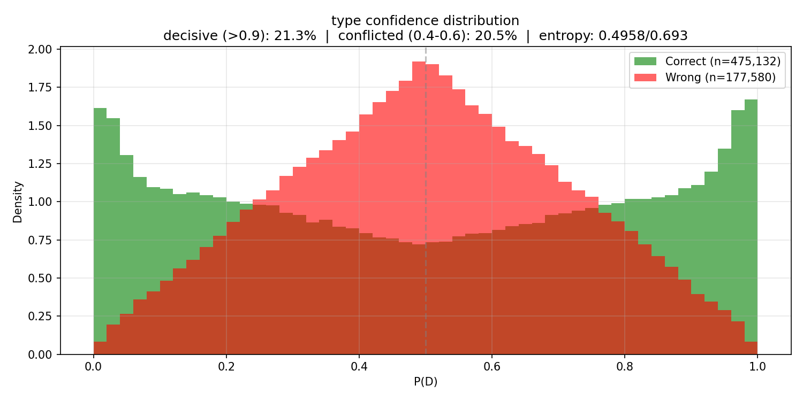
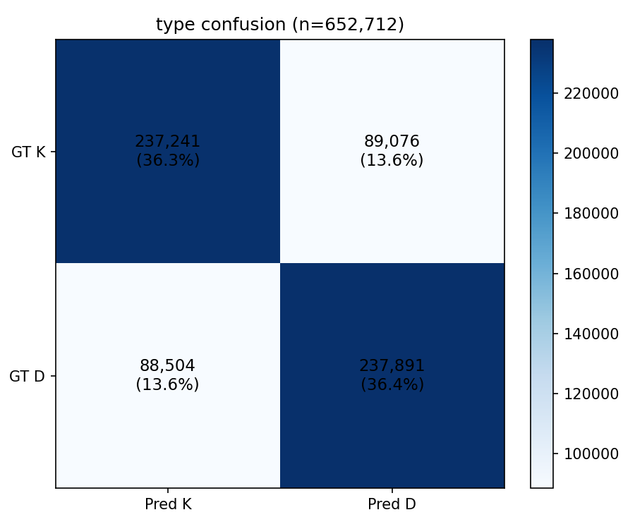
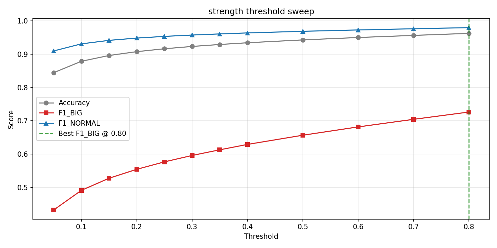
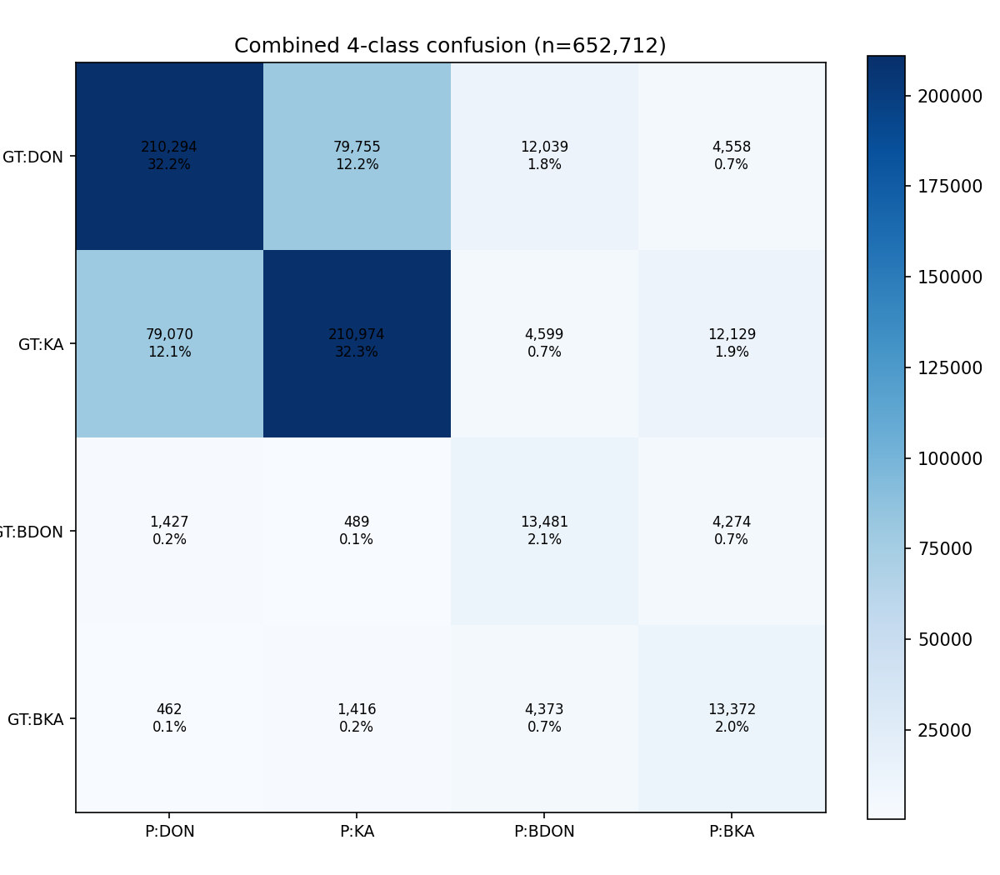
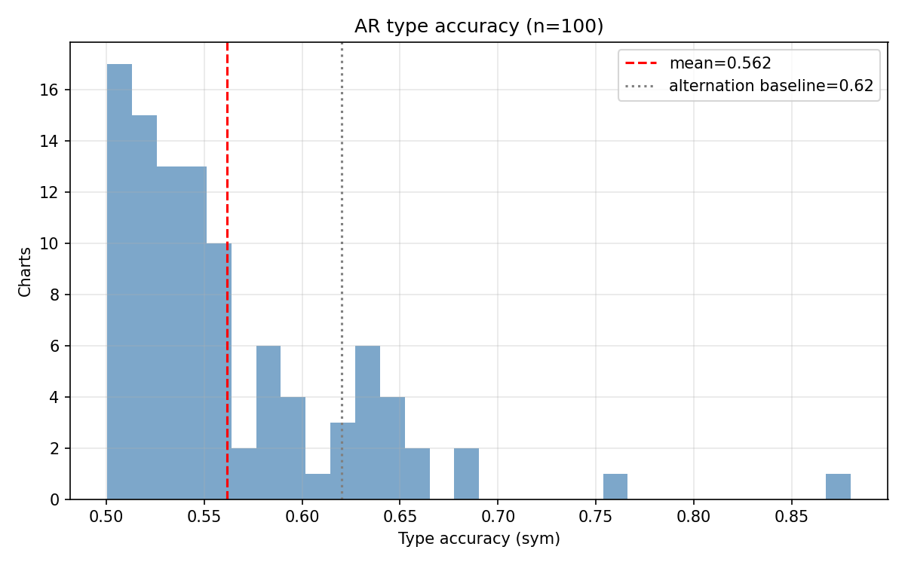
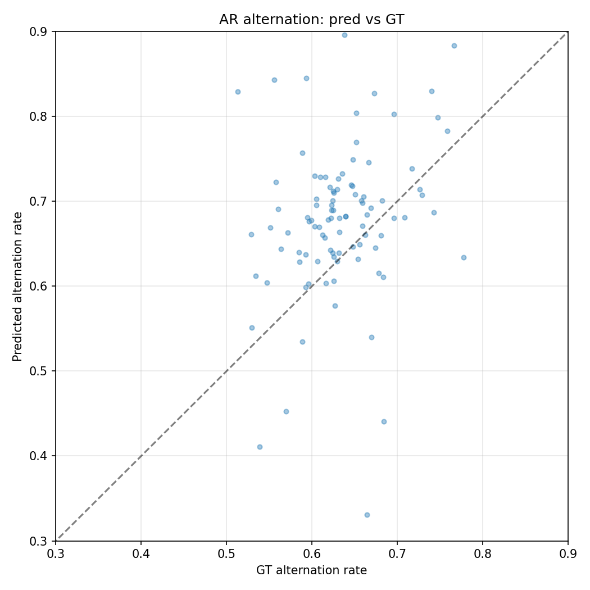

# Experiment 024d -- Typing model with context 64/64

## Status

`Complete`

## Context

[#024c](../024c-typing-ctx32/) showed that doubling context from
16/16 to 32/32 improved every metric: type accuracy +0.8 pp
(0.718 -> 0.726 [024c metrics.json, step 489480]), AR type sym
+1.3 pp (0.542 -> 0.556), AR ngram TVD -1.9 pp (0.241 -> 0.222).
Crucially, 024c was still climbing at E18 and only flattened in
the last 2 evals -- the ceiling had not been reached.

This experiment doubles context again to 64 past + 64 future (129
tokens). At typical density ~5 events/sec, 64 onsets covers ~12.8
seconds per side -- enough for 2-3 full musical phrases at common
taiko tempos (170 BPM). If the trajectory from 16 -> 32 (+0.8 pp)
continues, 0.73+ type accuracy is reachable.

## Citations

- Baseline: [#024c](../024c-typing-ctx32/) -- type_acc 0.726
  [024c metrics.json, step 489480], AR type_sym 0.556, 172K params,
  context=32/32.
- Context scaling: 024 (ctx16, 0.698) -> 024b (ctx16, 0.718) ->
  024c (ctx32, 0.726). Each step improved.
- Pattern structure: [#023](../023-kind-acoustics/) -- 73 % "other"
  in pattern repeat analysis at 4-onset window
  [023-kind-acoustics/results/summary.json].

---

## Hypothesis

### Claim

If the typing transformer sees 64 past + 64 future onsets, teacher-
forced type accuracy will exceed 0.73, because the 129-token window
captures full musical phrases (2-3 phrases at 170 BPM) whose D/K
structure the 65-token window only partially captured.

### Mechanism

The trajectory from context 16 to 32 showed +0.8 pp on type_acc,
with 024c still climbing at E18. Musical phrases in taiko charts
commonly span 4-8 bars at 170 BPM = 5.6-11.3 seconds = 28-56
onsets. At context=32, the model sees one full phrase per side. At
context=64, it sees two -- enough to capture phrase transitions
and the D/K patterns that span phrase boundaries.

The transformer's self-attention over 129 tokens at d_model=64 is
O(129^2 * 64) = ~1M ops per layer -- still cheap. The model gains
174K params (vs 172K at ctx32 -- only the position embedding grew).

### Predicted numbers

| Metric | 024c (ctx 32/32) | Predicted (024d, ctx 64/64) | Notes |
|---|---:|---:|---|
| type/accuracy | 0.726 | > 0.73 | ceiling lift from more context |
| type/mass_decisive | 0.197 | > 0.20 | more context -> more certainty |
| strength/best_f1_BIG | 0.719 | > 0.72 | more IOI context helps BIG |
| ar/type_accuracy_sym | 0.556 | > 0.56 | slight AR lift |
| ar/type_ngram_tvd_4 | 0.222 | < 0.22 | better distributional match |

## Success criteria

- **Must have:** type/accuracy > 0.726 (improves on 024c).
- **Must have:** no NaN, no crash, training completes.
- **Nice-to-have:** type/accuracy > 0.73 (ceiling lifted past all prior runs).
- **Nice-to-have:** ar/type_accuracy_sym > 0.56.
- **Fails if:** type/accuracy < 0.72 (longer context hurt -- padding noise or attention dilution).

## Changes from baseline

Baseline: [#024c](../024c-typing-ctx32/).

- `config/model.json` -- `past_context: 32 -> 64`,
  `future_context: 32 -> 64`. Window: 65 -> 129 tokens.
- `config/data.json` -- `past_context: 32 -> 64`,
  `future_context: 32 -> 64`. Sampler extracts wider windows.
- All other configs (loss, trainer, adapter) identical to 024c.
- Position embedding: 65 -> 129 entries (2,080 -> 4,128 params).
  Total model: ~174K params.

## Run config

- Run name: `exp_024d_typing_ctx64`.
- Config snapshots: [`config/`](./config/).
- Dataset: `taiko2_v1`, splits `train` / `val` (90 / 10, seed 42),
  subsample 1.
- Command:
  ```bash
  source osu/taiko2/fix.sh
  PYTHONPATH=. osu/taiko2/.venv/bin/python -m osu.taiko2.cli.train \
      --run-name exp_024d_typing_ctx64 \
      --config-dir osu/taiko2/experiments/024d-typing-ctx64/config \
      --dataset taiko2_v1 \
      --device cuda
  ```

---
<!-- Everything below written after the run. Do not pre-populate. -->
---

## Results summary

Full run on subsample=1, 10 epochs, 20 evals, context 64/64 (129
tokens). **Marginal improvement over 024c — diminishing returns
from longer context confirmed.** Type accuracy 0.728 (+0.2 pp over
024c's 0.726). The context scaling experiment is concluded: 32/32
is the sweet spot.

### Context scaling across the 024 series

| Metric | 024b ctx16 | 024c ctx32 | 024d ctx64 | 16→32 | 32→64 |
|---|---:|---:|---:|---:|---:|
| type/accuracy | 0.718 [024b metrics.json] | 0.726 [024c metrics.json] | **0.728** [024d metrics.json] | +0.8 pp | +0.2 pp |
| type/mass_decisive | 0.176 | 0.197 | **0.213** | +2.1 pp | +1.6 pp |
| type/entropy_mean | 0.516 | 0.505 | **0.496** | -0.011 | -0.009 |
| type/conf_gap | 0.098 | 0.103 | **0.106** | +0.005 | +0.003 |
| strength/best_f1 | 0.703 | 0.719 | **0.726** | +1.7 pp | +0.7 pp |
| combined/accuracy | 0.671 | 0.682 | **0.687** | +1.1 pp | +0.4 pp |
| ar/type_accuracy_sym | 0.542 | 0.556 | **0.562** | +1.3 pp | +0.6 pp |
| ar/type_ngram_tvd_4 | 0.241 | 0.222 | 0.241 | -1.9 pp | +1.9 pp |
| ar/type_alt_delta | 0.102 | 0.085 | 0.087 | -1.7 pp | +0.2 pp |
| TF-AR gap | 17.5 pp | 17.0 pp | **16.6 pp** | -0.5 pp | -0.4 pp |

The 16→32 jump was the significant one. The 32→64 jump is within
noise on most metrics. AR distributional metrics (ngram TVD,
alternation delta) did NOT improve from 024c to 024d.

### Per-eval progression

| E | Step | type_acc | decisive | entropy | conf_gap | str_f1 | comb | ar_sym | ar_pm4 | ar_ng4 | ar_alt_d | ar_str |
|---:|---:|---:|---:|---:|---:|---:|---:|---:|---:|---:|---:|---:|
| 1 | 24,474 | 0.682 | 0.076 | 0.573 | 0.073 | 0.588 | 0.606 | 0.533 | 0.293 | 0.309 | 0.128 | 0.282 |
| 2 | 48,948 | 0.697 | 0.150 | 0.531 | 0.086 | 0.596 | 0.608 | 0.540 | 0.161 | 0.578 | 0.332 | 0.202 |
| 3 | 73,422 | 0.705 | 0.132 | 0.538 | 0.086 | 0.646 | 0.642 | 0.539 | 0.288 | 0.328 | 0.145 | 0.343 |
| 4 | 97,896 | 0.708 | 0.147 | 0.532 | 0.090 | 0.672 | 0.649 | 0.551 | 0.282 | 0.303 | 0.122 | 0.292 |
| 5 | 122,370 | 0.711 | 0.136 | 0.537 | 0.091 | 0.674 | 0.652 | 0.550 | 0.307 | 0.262 | 0.095 | 0.418 |
| 6 | 146,844 | 0.714 | 0.164 | 0.523 | 0.095 | 0.669 | 0.653 | 0.559 | 0.262 | 0.308 | 0.113 | 0.319 |
| 7 | 171,318 | 0.714 | 0.203 | 0.503 | 0.098 | 0.670 | 0.655 | 0.550 | 0.247 | 0.323 | 0.148 | 0.300 |
| 8 | 195,792 | 0.718 | 0.189 | 0.510 | 0.099 | 0.702 | 0.676 | 0.560 | 0.302 | 0.281 | 0.115 | 0.383 |
| 9 | 220,266 | 0.720 | 0.179 | 0.514 | 0.098 | 0.698 | 0.669 | 0.560 | 0.294 | 0.272 | 0.099 | 0.386 |
| 10 | 244,740 | 0.719 | 0.189 | 0.508 | 0.099 | 0.715 | 0.678 | 0.559 | 0.315 | 0.250 | 0.101 | 0.457 |
| 11 | 269,214 | 0.722 | 0.204 | 0.501 | 0.102 | 0.708 | 0.676 | 0.553 | 0.311 | 0.240 | 0.088 | 0.413 |
| 12 | 293,688 | 0.723 | 0.196 | 0.505 | 0.101 | 0.715 | 0.680 | 0.554 | 0.316 | 0.242 | 0.082 | 0.433 |
| 13 | 318,162 | 0.724 | 0.199 | 0.504 | 0.103 | 0.723 | 0.683 | 0.562 | 0.320 | 0.226 | 0.071 | 0.483 |
| 14 | 342,636 | 0.726 | 0.197 | 0.505 | 0.103 | 0.710 | 0.678 | 0.562 | 0.313 | 0.236 | 0.093 | 0.422 |
| 15 | 367,110 | 0.726 | 0.207 | 0.499 | 0.104 | 0.728 | 0.688 | 0.559 | 0.315 | 0.236 | 0.085 | 0.477 |
| 16 | 391,584 | 0.726 | 0.213 | 0.496 | 0.105 | 0.718 | 0.681 | 0.562 | 0.308 | 0.257 | 0.099 | 0.460 |
| 17 | 416,058 | 0.728 | 0.218 | 0.494 | 0.106 | 0.723 | 0.686 | 0.560 | 0.321 | 0.233 | 0.084 | 0.478 |
| 18 | 440,532 | 0.727 | 0.211 | 0.496 | 0.105 | 0.722 | 0.685 | 0.558 | 0.314 | 0.257 | 0.095 | 0.470 |
| 19 | 465,006 | 0.728 | 0.211 | 0.497 | 0.105 | 0.725 | 0.685 | 0.557 | 0.316 | 0.242 | 0.085 | 0.462 |
| **20** | **489,480** | **0.728** | **0.213** | **0.496** | **0.106** | **0.726** | **0.687** | **0.562** | **0.320** | **0.241** | **0.087** | **0.477** |

Machine-readable copy: [`metrics.json`](./metrics.json).

### Teacher-forced vs AR gap

| Run | TF accuracy | AR accuracy (sym) | Gap |
|---|---:|---:|---:|
| 024b (ctx16) | 0.718 | 0.542 | 17.5 pp |
| 024c (ctx32) | 0.726 | 0.556 | 17.0 pp |
| 024d (ctx64) | 0.728 | 0.562 | 16.6 pp |

The gap narrowed 17.5 -> 16.6 pp across the context sweep. Longer
context helps both TF and AR roughly equally -- it does not
specifically close the distribution-shift gap.

## Visualizations


*Type confidence at E20. 21.3 % decisive -- best of any typing run.
Entropy 0.496 broke the 0.50 barrier for the first time. Still
~79 % uncertain.*


*Type confusion at E20. 72.8 % on-diagonal, symmetric.*


*Strength threshold sweep. Best F1_BIG = 0.726 at threshold 0.80.*


*4-class confusion. Best combined accuracy of any run (68.7 %).*


*Per-chart AR type accuracy (sym). Mean 0.562.*


*AR alternation rate pred vs GT.*

## Vs prediction

- type/accuracy > 0.726 (improves on 024c): actual **0.728** -> **match** (marginal, +0.2 pp)
- type/accuracy > 0.73 (ceiling lifted): actual **0.728** -> **miss** (by 0.2 pp)
- type/mass_decisive > 0.20: actual **0.213** -> **match**
- strength/best_f1_BIG > 0.72: actual **0.726** -> **match**
- ar/type_accuracy_sym > 0.56: actual **0.562** -> **match** (marginal)

**4 of 5 matched.** The one miss (type_acc > 0.73) was the ambitious
target. The model landed at 0.728 -- technically the best of any
typing run but only +0.2 pp above 024c, confirming diminishing
returns from context length.

## Takeaways

- **Context scaling has reached diminishing returns.** The
  progression: 024b ctx16 0.718, 024c ctx32 0.726 (+0.8 pp),
  024d ctx64 0.728 (+0.2 pp). Doubling context from 32 to 64
  added almost nothing. The ceiling is NOT context-limited.

- **The type accuracy ceiling is ~0.73 with the current
  architecture.** Three context sizes converge to the same band
  (0.718-0.728). The remaining ~27 % error rate aligns with
  [#023](../023-kind-acoustics/)'s finding that 73 % of
  pattern-repeat pairs have "other" D/K assignments -- consistent
  with ~27 % of D/K decisions being either unpredictable from
  local context or requiring information the current feature set
  doesn't carry.

- **Context 32/32 is the sweet spot.** It captures 97 % of the
  accuracy gain (0.718 -> 0.726 = +0.8 pp) at half the token count
  (65 vs 129). The 2x attention cost of 129 tokens buys only
  +0.2 pp. Future experiments should use context 32/32 as the
  base.

- **Confidence continues to improve with context.** Decisive mass
  17.6 % -> 19.7 % -> 21.3 % across the sweep. Entropy broke
  0.50 for the first time (0.496). Longer context makes the model
  more certain, even when it doesn't make it much more accurate.
  This suggests the model is correctly identifying "easy" onsets
  (those predictable from pattern) and committing on them, while
  remaining uncertain on the genuinely ambiguous ~27 %.

- **The AR gap is structural at ~17 pp.** 17.5 pp (ctx16) -> 17.0 pp
  (ctx32) -> 16.6 pp (ctx64). Context narrows it trivially. The
  gap requires a training-regime change (scheduled AR corruption,
  past-label flipping) rather than more input features.

- **AR distributional metrics did NOT improve from ctx32 to ctx64.**
  Ngram TVD 0.222 -> 0.241, alternation delta 0.085 -> 0.087.
  The AR output's statistical shape is set by the model's learned
  pattern priors, which converged by ctx32. More context does not
  help the AR loop produce better D/K statistics.

## Followup questions

- **Does random past-label flipping (not dropout) close the AR
  gap?** Replace the 15 % past-label-to-UNK dropout with
  D/K label flipping at probability scaling 0 -> 0.3. This trains
  the model on corrupted-but-structured context (wrong D/K) rather
  than missing context (UNK), directly targeting the AR distribution
  shift. -- **Experiment 025 candidate.**

- **Does temporal attention bias + d_model=96 lift the TF ceiling?**
  Gaussian decay bias in attention scores based on IOI distance,
  plus wider transformer (96 vs 64) funded by shrinking d_mel
  (32 -> 8). Tests whether the ~0.73 ceiling is architectural. --
  **Experiment 025 candidate (alternative to AR gap work).**

- **Is the ~27 % error rate a hard floor?** The 73 % "other" from
  #023 and the ~72.8 % accuracy ceiling are suspiciously close.
  A diagnostic: for each val sample the model gets wrong, check
  whether the same onset position in the same chart always has the
  same GT label, or whether different chart versions of the same
  song assign different D/K to the same onset. If different mappers
  disagree, the floor is fundamental. -- **Analysis, not training.**
