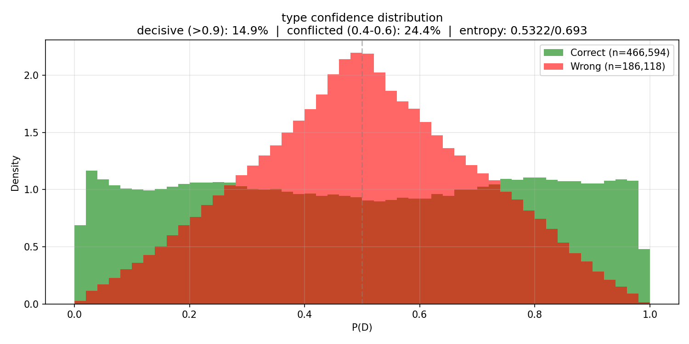
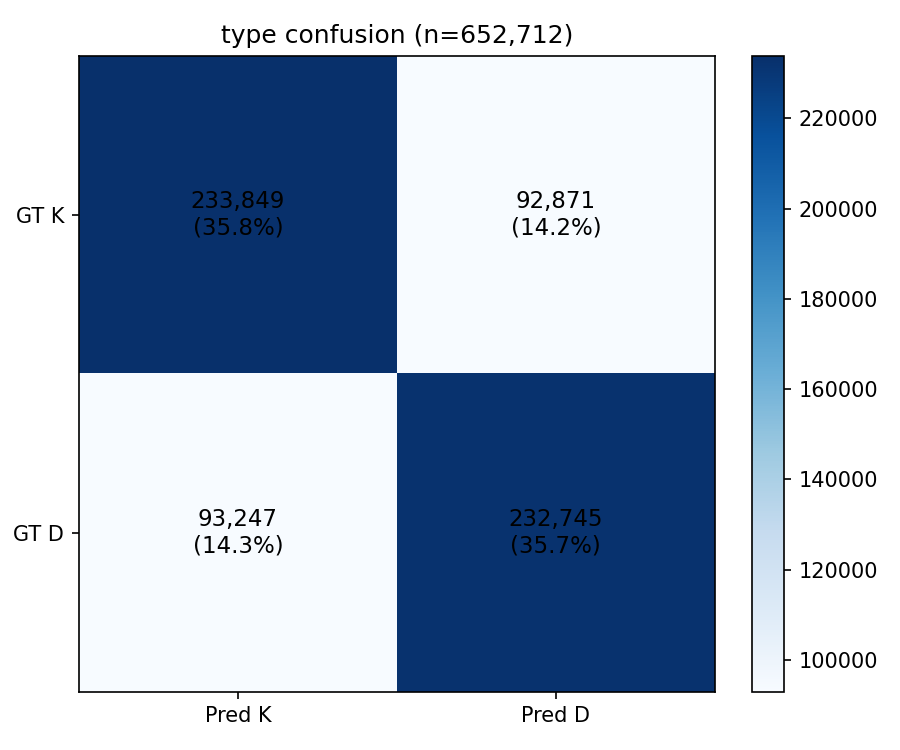
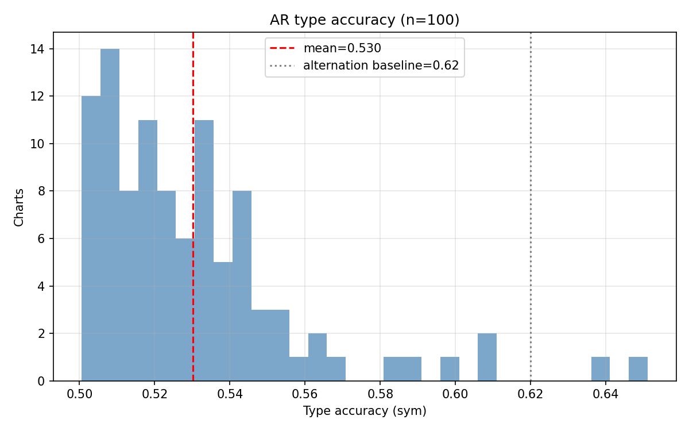

# Experiment 025 -- Typing model with temporal attention bias

## Status

`Complete` (stopped early at eval 12 -- hypothesis rejected)

## Context

The 024 context-scaling series (024b ctx16, 024c ctx32, 024d ctx64)
converged on a type accuracy ceiling of ~0.728 with diminishing
returns from longer context (+0.8 pp from 16->32, +0.2 pp from
32->64). The ceiling is not context-limited -- it is either
architectural or fundamental.

The current model uses ordinal position embeddings
(`Embedding(window, 32)`) which encode token index (0, 1, 2, ...)
but discard inter-onset interval magnitude. A 30-bin gap and a
300-bin gap between adjacent onsets look identical to the attention
mechanism. IOI information enters only through the 3-dim `ioi_proj`
features (local to each token), not through the attention computation
itself.

This experiment adds a **Gaussian temporal attention bias**: a
pairwise distance-dependent term added to every attention score,
so the transformer knows how far apart in time two onsets are when
deciding how much to attend between them. Based on ChronoFormer
(Chen et al. 2025) adapted for discrete onset sequences.

## Citations

- Baseline: [#024c](../024c-typing-ctx32/) -- type_acc 0.726
  [024c metrics.json, step 489480], AR type_sym 0.556, 172K params,
  context=32/32.
- Context scaling conclusion: [#024d](../024d-typing-ctx64/) --
  type_acc 0.728, +0.2 pp over 024c, confirming diminishing returns.
- ChronoFormer: Chen et al. 2025, arXiv 2504.07373. Temporal
  attention bias via Gaussian decay on pairwise time distances.

---

## Hypothesis

### Claim

If the typing transformer adds a Gaussian temporal attention bias
(`alpha_ij += -dist_ij^2 / (2*sigma^2)` where dist is pairwise
onset bin distance and sigma is learnable, initialized at 50 bins),
teacher-forced type accuracy will exceed 024c's 0.726, because the
attention mechanism gains direct access to temporal distance
information that ordinal position embeddings cannot represent.

### Mechanism

The D/K pattern in taiko charts is rhythm-dependent: alternation
runs (DKDK) occur at consistent tempos, tempo changes produce
pattern breaks, and BIG notes land on strong beats with wider gaps.
The model currently receives IOI as a per-token feature but cannot
use temporal distance in the attention computation — it cannot learn
"attend strongly to the onset 1 beat ago" vs "attend weakly to the
onset 4 beats ago" because both are adjacent tokens in ordinal
position space.

The Gaussian bias encodes `exp(-dist^2 / (2*sigma^2))` as an
additive attention score. At sigma=50 bins (250ms), onsets within
one beat (~170ms at 170 BPM) get strong bias; onsets multiple beats
away get near-zero. The sigma is learnable — the model can widen or
narrow the temporal receptive field per training.

Zero extra parameters beyond the single learnable log_sigma. Same
model size, same context, same training. The only change is how
attention is computed.

### Predicted numbers

| Metric | 024c (no bias) | Predicted (025, temporal bias) | Notes |
|---|---:|---:|---|
| type/accuracy | 0.726 | > 0.73 | temporal info lifts ceiling |
| type/entropy_mean | 0.505 | < 0.50 | more information -> more certainty |
| ar/type_accuracy_sym | 0.556 | > 0.56 | slight AR lift |
| strength/best_f1 | 0.719 | > 0.72 | BIG benefits from temporal distance |
| learned sigma | 50.0 init | 20-80 range | model discovers optimal temporal scale |

## Success criteria

- **Must have:** type/accuracy > 0.726 (improves on 024c).
- **Must have:** no NaN, no crash (the attention bias can produce
  numerical issues if sigma collapses to near-zero).
- **Nice-to-have:** type/accuracy > 0.73.
- **Nice-to-have:** learned sigma converges to a musically
  meaningful value (e.g. near beat duration at common BPMs).
- **Fails if:** type/accuracy < 0.72 (temporal bias hurt).
- **Fails if:** sigma collapses to < 1.0 or explodes to > 1000
  (numerical instability).

## Changes from baseline

Baseline: [#024c](../024c-typing-ctx32/).

- `config/model.json` -- `temporal_bias: true`,
  `temporal_sigma: 50.0` (new fields, default false/50).
- `models/typing_model.py` -- added custom `TemporalTransformerEncoder`
  with `TemporalMultiheadAttention` that injects the Gaussian decay
  bias directly into QK^T scores before softmax. Replaces PyTorch's
  `nn.TransformerEncoder` when `temporal_bias=True` (the non-temporal
  path is unchanged for backward compatibility). One learnable
  parameter: `temporal_log_sigma`, clamped to [1, 500] bins.
- `domain/typing.py` -- added `temporal_bias: bool` and
  `temporal_sigma: float` to `TypingModelConfig`. Added
  `onset_bins: Tensor` to `TypingInput`. Added `past_bins`,
  `target_bin`, `future_bins` to `TypingSample`.
- `data_samplers/typing.py` -- populates onset bins in samples.
- `training/typing_adapter.py` -- passes onset bins to TypingInput.
- `inference/typing_pass.py` -- passes onset bins during AR.
- All other configs identical to 024c.

## Run config

- Run name: `exp_025_temporal_bias`.
- Config snapshots: [`config/`](./config/).
- Dataset: `taiko2_v1`, splits `train` / `val` (90 / 10, seed 42),
  subsample 1.
- Command:
  ```bash
  source osu/taiko2/fix.sh
  PYTHONPATH=. osu/taiko2/.venv/bin/python -m osu.taiko2.cli.train \
      --run-name exp_025_temporal_bias \
      --config-dir osu/taiko2/experiments/025-typing-temporal-bias/config \
      --dataset taiko2_v1 \
      --device cuda
  ```

---
<!-- Everything below written after the run. Do not pre-populate. -->
---

## Results summary

Stopped early at **eval 12 / step 293,688** (6 of 10 epochs).
**Hypothesis rejected: temporal attention bias did not improve over
024c and the learned sigma exploded, indicating the model actively
neutralizes the bias.**

### 025 vs 024c at matched evals

| E | 025 type_acc | 024c type_acc | Delta | 025 ar_sym | 024c ar_sym | Delta |
|---:|---:|---:|---:|---:|---:|---:|
| 1 | 0.678 | 0.688 | -1.0 pp | 0.536 | 0.535 | +0.1 pp |
| 2 | 0.687 | 0.696 | -0.9 pp | 0.530 | 0.537 | -0.7 pp |
| 3 | 0.690 | 0.702 | -1.2 pp | 0.535 | 0.537 | -0.2 pp |
| 4 | 0.693 | 0.702 | -0.9 pp | 0.530 | 0.535 | -0.5 pp |
| 5 | 0.697 | 0.707 | -1.0 pp | 0.532 | 0.546 | -1.3 pp |
| 6 | 0.699 | 0.712 | -1.3 pp | 0.527 | 0.547 | -2.0 pp |
| 7 | 0.703 | 0.713 | -1.0 pp | 0.534 | 0.542 | -0.9 pp |
| 8 | 0.705 | 0.715 | -1.0 pp | 0.539 | 0.551 | -1.2 pp |
| 9 | 0.709 | 0.718 | -1.0 pp | 0.542 | 0.544 | -0.1 pp |
| 10 | 0.710 | 0.718 | -0.8 pp | 0.543 | 0.553 | -1.0 pp |
| 11 | 0.713 | 0.721 | -0.8 pp | 0.546 | 0.557 | -1.1 pp |
| **12** | **0.715** | **0.722** | **-0.7 pp** | **0.539** | **0.554** | **-1.5 pp** |

025 was consistently ~1 pp behind 024c on type accuracy across all
12 evals. The gap narrowed slightly (1.0 pp at E1 -> 0.7 pp at E12)
but was not on a trajectory to close. AR accuracy was 1-2 pp worse.

### Sigma trajectory

| Step | Sigma (bins) | Sigma (ms) |
|---:|---:|---:|
| init | 50.0 | 250 |
| E1 (24,474) | 59.5 | 298 |
| E3 (73,422) | 83.8 | 419 |
| E12 (293,688) | 206.7 | 1,033 |

Sigma grew from 50 -> 207 bins across 12 evals. At 207 bins (1.03
seconds), the Gaussian decay is nearly flat across the 65-token
window -- the temporal bias contributes negligible signal to
attention. The model neutralized the bias by widening sigma rather
than learning a useful temporal receptive field.

### Per-eval progression

| E | Step | type_acc | decisive | entropy | conf_gap | str_f1 | comb | ar_sym | ar_pm4 | ar_ng4 | ar_alt_d | ar_str |
|---:|---:|---:|---:|---:|---:|---:|---:|---:|---:|---:|---:|---:|
| 1 | 24,474 | 0.678 | 0.074 | 0.568 | 0.074 | 0.559 | 0.577 | 0.536 | 0.295 | 0.298 | 0.128 | 0.296 |
| 2 | 48,948 | 0.687 | 0.088 | 0.564 | 0.077 | 0.587 | 0.603 | 0.530 | 0.252 | 0.333 | 0.131 | 0.251 |
| 3 | 73,422 | 0.690 | 0.093 | 0.561 | 0.080 | 0.626 | 0.625 | 0.535 | 0.301 | 0.276 | 0.113 | 0.357 |
| 4 | 97,896 | 0.693 | 0.093 | 0.561 | 0.079 | 0.627 | 0.623 | 0.530 | 0.279 | 0.306 | 0.131 | 0.262 |
| 5 | 122,370 | 0.697 | 0.103 | 0.555 | 0.083 | 0.651 | 0.639 | 0.532 | 0.286 | 0.278 | 0.102 | 0.370 |
| 6 | 146,844 | 0.699 | 0.109 | 0.553 | 0.084 | 0.650 | 0.641 | 0.527 | 0.264 | 0.309 | 0.133 | 0.308 |
| 7 | 171,318 | 0.703 | 0.122 | 0.544 | 0.088 | 0.646 | 0.643 | 0.534 | 0.281 | 0.287 | 0.115 | 0.319 |
| 8 | 195,792 | 0.705 | 0.122 | 0.545 | 0.088 | 0.677 | 0.660 | 0.539 | 0.310 | 0.276 | 0.112 | 0.368 |
| 9 | 220,266 | 0.709 | 0.137 | 0.537 | 0.091 | 0.674 | 0.655 | 0.542 | 0.307 | 0.259 | 0.096 | 0.361 |
| 10 | 244,740 | 0.710 | 0.135 | 0.538 | 0.091 | 0.699 | 0.668 | 0.543 | 0.315 | 0.259 | 0.107 | 0.434 |
| 11 | 269,214 | 0.713 | 0.142 | 0.534 | 0.093 | 0.690 | 0.666 | 0.546 | 0.310 | 0.252 | 0.096 | 0.392 |
| **12** | **293,688** | **0.715** | **0.146** | **0.532** | **0.094** | **0.691** | **0.667** | **0.539** | **0.305** | **0.266** | **0.111** | **0.405** |

Machine-readable copy: [`metrics.json`](./metrics.json).

## Visualizations


*Type confidence at E12. 14.6 % decisive -- behind 024c's 17.4 %
at matched eval. The custom transformer with GELU activation
produces a different confidence profile.*


*Type confusion at E12. 71.5 % on-diagonal, symmetric. Behind
024c's 72.2 % at matched eval.*


*Per-chart AR type accuracy (sym). Mean 0.539 -- behind 024c's
0.554 at matched eval.*

## Vs prediction

- type/accuracy > 0.726 (improves on 024c): actual **0.715 at E12** -> **miss** (1.1 pp below target, 0.7 pp behind 024c)
- type/accuracy > 0.73: actual **0.715** -> **miss** (1.5 pp below)
- ar/type_accuracy_sym > 0.56: actual **0.546 peak at E11** -> **miss**
- strength/best_f1 > 0.72: actual **0.699 at E10** -> **miss** (would likely reach with more evals)
- learned sigma in 20-80 range: actual **207 bins** -> **miss** (exploded)

**0 of 5 matched.** The temporal attention bias hypothesis is
decisively rejected. The model did not benefit from Gaussian-decayed
temporal attention -- it actively widened sigma to neutralize the
bias.

## Takeaways

- **Temporal attention bias does not help.** Type accuracy was
  consistently ~1 pp behind 024c (no bias) across 12 evals. The
  model never caught up and was not on a trajectory to do so.

- **The model neutralizes the bias by widening sigma.** Sigma grew
  from 50 -> 207 bins (250 ms -> 1.03 s). At 207 bins the Gaussian
  decay is essentially flat across the 65-token window -- the bias
  adds no useful signal. The model treats the bias as a nuisance and
  removes it by widening sigma rather than learning a musically
  meaningful temporal scale.

- **Temporal distance is already encoded.** The ordinal position
  embedding + IOI features (log_ioi_before, log_ioi_after,
  log_ratio) already provide the model with timing information. The
  Gaussian attention bias is redundant -- it encodes the same signal
  in a different form (soft attention decay vs explicit features) and
  the model has no use for the duplicate.

- **The custom transformer layer is slightly worse.** The
  `TemporalTransformerEncoder` uses GELU activation and different
  parameter initialization vs PyTorch's built-in TransformerEncoder
  (ReLU, different init). The 1 pp gap may partly be from these
  differences rather than from the temporal bias itself. However,
  even if the custom layer were perfectly matched, the sigma
  explosion shows the bias is unhelpful.

- **Do not pursue temporal attention bias further.** The hypothesis
  was tested cleanly (one variable changed, everything else
  identical to 024c) and rejected. The ~0.73 type accuracy ceiling
  is not caused by missing temporal information in attention.

## Followup questions

- **Is the ceiling architectural (d_model=64 too narrow)?** The
  next test should increase d_model to 96 or 128, funded by
  reducing d_mel (which has Fisher LDA 0.0001). This tests whether
  the pattern recognition capacity is the bottleneck, not temporal
  encoding. -- **Experiment 026 candidate.**

- **Does past-label flipping close the AR gap?** The 17 pp TF-AR
  gap is unchanged across all experiments (024b, 024c, 024d, 025).
  Random D/K flipping during training (instead of dropout to UNK)
  directly targets the AR error distribution. -- **Experiment 026
  candidate (alternative).**

- **Was the GELU vs ReLU difference responsible for the gap?** A
  quick control: run 024c's exact config but with the custom
  `TemporalTransformerEncoder` with `temporal_bias=False`. If it
  matches 024c, the layer implementation is fine and the bias was
  the problem. If it's 1 pp behind, the layer itself is worse. --
  **Low priority diagnostic.**
